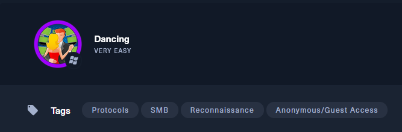
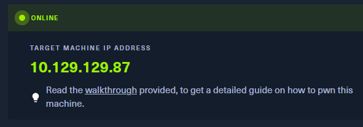
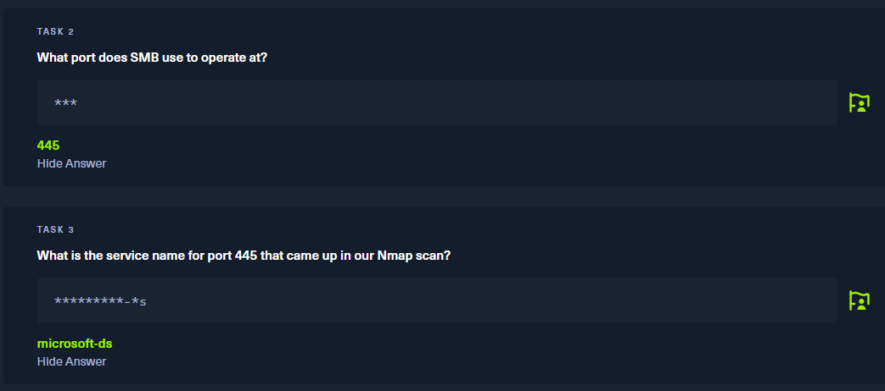
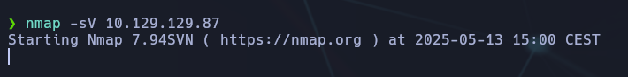
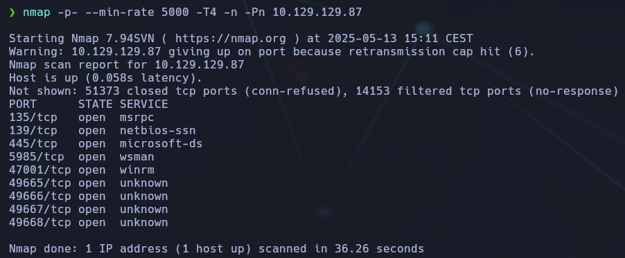
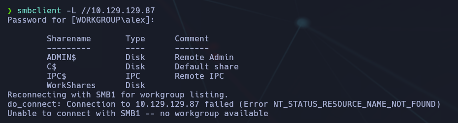
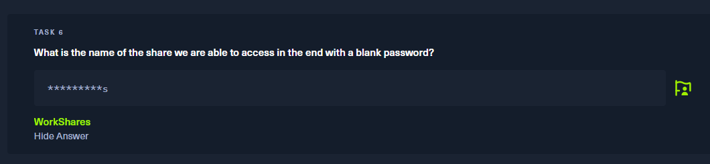
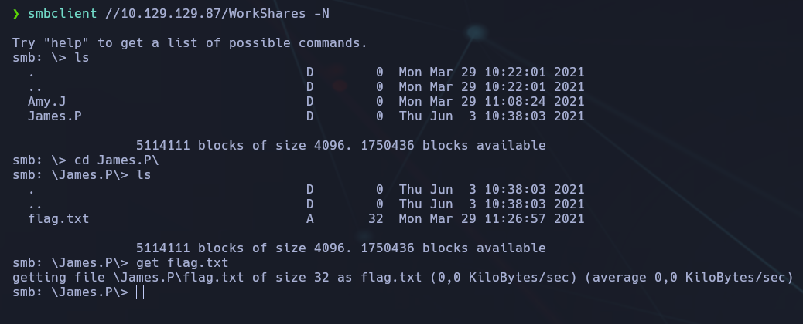
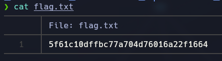

-----------------
- Tags: #protocols #SMB #Reconnaisance #anonymous 
------------------------





En esta maquina, usaremos el protocolo #smb

En las tareas que nos encontramos, nos piden:



Para encontrar estas soluciones, hemos hecho un #nmap #-sV #ip



Viendo que tarda mucho tiempo, haremos un scan más rápido como:

```bash
nmap -p- --min-rate 5000 -T4 -n -Pn "IP"
```




Aquí vemos, que ha tardado 36 segundos y que nos encontramos con unos cuantos puertos abiertos con sus servicios.

El puerto que opera con el protocolo SMB es el 445, y el servicio es el "microsoft-ds"

Sabiendo el protocolo que es, entraremos al servicio con:

```bash
smbclient -L //10.129.129.87
```



Podemos entrar como "smbclient -L //IP"  y/o añadir "-N" al final. Esto servirá para que no nos pida la contraseña, cuando ya sabemos que (por ejemplo) no tiene.

En las preguntas de la máquina ya nos está dando una pista que es:



Entonces, nos conectaremos al recurso de WorkShares:

```bash
smbclient //10.129.129.87/WorkShares -N
```



Como vemos en la captura, hacemos un ls para buscar archivos, y nos encontraremos 2 carpetas.

En una de las carpetas, encontramos el flag.txt, lo descargamos con "get" y desde nuestro directorio, lo abriremos para ver nuestra flag:



