---------
- Tags: #ftp #ssh #pcap #wireshark #linpeas
---------------

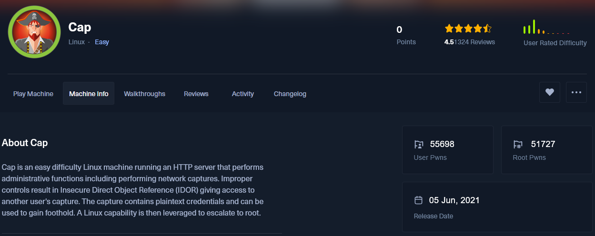

## 🔢 Datos de la máquina

- **Nombre**: Cap
    
- **IP**: `10.10.10.245`
    
- **Sistema Operativo**: Linux
    
- **Dificultad**: Easy
    
- **Modo**: Guided Mode


## 🔍 Enumeración inicial

Nos preguntan, cuantos puertos TCP están abiertos:

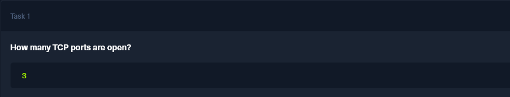

```bash
nmap -sS -sC --top-ports 1000 -Pn (IP)
```

📘 **Parámetros explicados**:

- `-sS`: TCP SYN Scan (modo sigiloso, rápido y eficaz)
    
- `-sC`: Usa los scripts por defecto de Nmap (equivale a `--script=default`)
    
- `--top-ports 1000`: Escanea los 1000 puertos más comunes
    
- `-Pn`: Omite detección de host (asume que el host está vivo)
    

🧠 Este escaneo es ideal para una enumeración inicial rápida en pruebas de penetración.


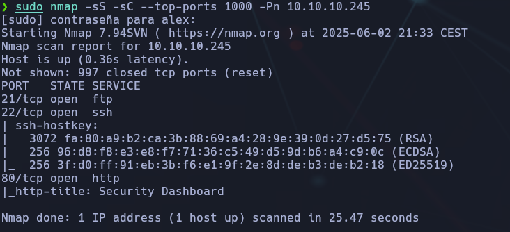

📥 **Resultado**:

```bash
- 21/tcp - FTP
    
- 22/tcp - SSH
    
- 80/tcp - HTTP
```

🎯 Además, el puerto 80 presenta el título `Security _Dashboard_`, indicando un servicio web.


## 🔗 Servicio web (HTTP)

Navegamos a `http://10.10.10.245` y encontramos un **panel llamado Security Dashboard**. En el menú lateral aparece:

- Security Snapshot
    
- IP Config
    
- Network Status

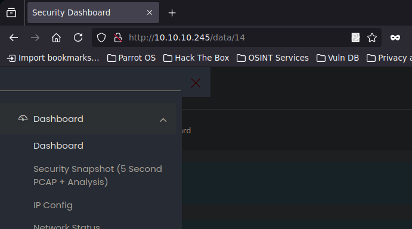


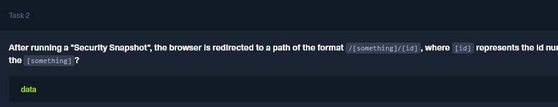

Tras clicar a: "*security snapshot"* , el navegador nos redirige a:

```bash
/data/<id>
```

✅ Respuesta: `data`


## 🤔 Acceso a escaneos de otros usuarios

Desde `/data/0`, pudimos acceder a datos de otros usuarios.

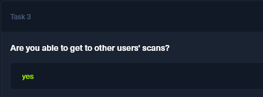

✅ **Task 3**: ¿Se puede acceder a otros escaneos? → Respuesta: `yes`


## 📃 Descarga y análisis del PCAP

Desde la URL `/data/0` descargamos unos cuantos `.pcap`. Los abrimos con **Wireshark**:


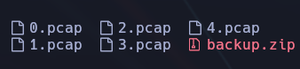

🔎 Filtros aplicados:

```bash
ftp
```

📂 Observamos tráfico FTP sin cifrar, donde se muestran:

- Usuario: `nathan`
    
- Contraseña: `Buck3tH4TF0RM!`

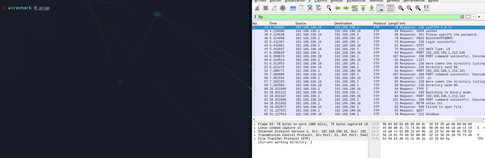

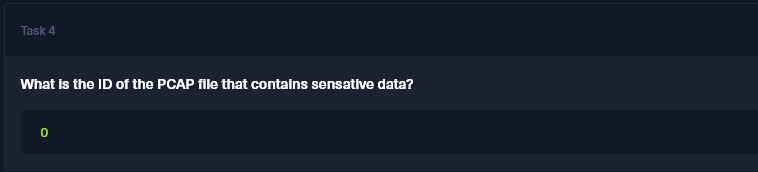

## 🛡️ Acceso por servicios

🔌 Probamos FTP:

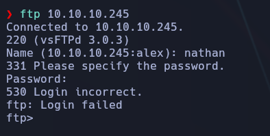

Login: `nathan` / `Buck3tH4TF0RM!` ❌ Acceso fallido (servidor FTP deniega sesión)

🔐 Probamos SSH:

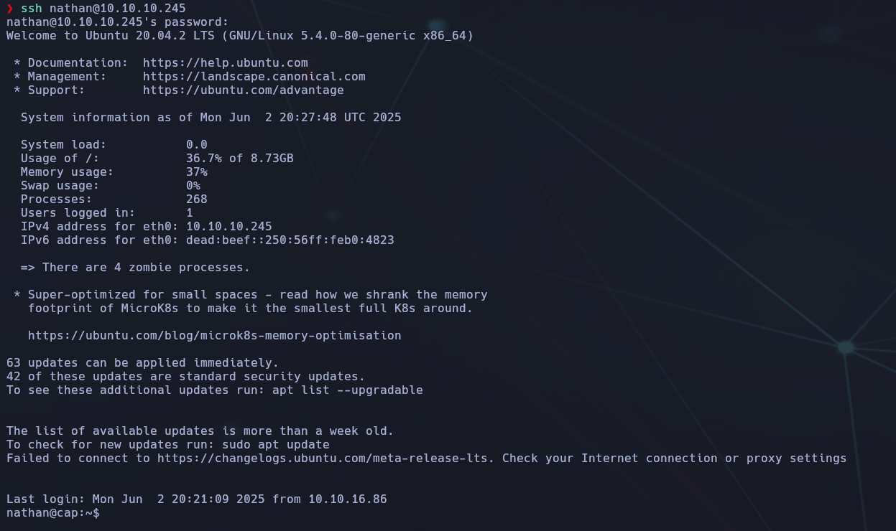

🚀 **¡Conexión exitosa!**

✅ **Task 6**: ¿Dónde funciona también la pass? → Respuesta: `ssh`

## 📂 Flag de usuario

Una vez dentro como `nathan`:

📦 Contenido:

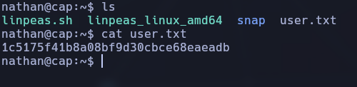

🏆 Flag enviada con éxito.

## 🛡️ Escalada de privilegios

### 🪤 Usamos `linpeas`

Leyendo el tutorial:

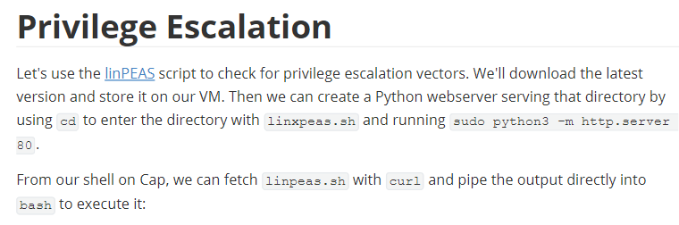

Descargaremos el *linpeas.sh* y lo dejaremos en la carpeta "home"

```bash
https://github.com/peass-ng/PEASS-ng/tree/master/linPEAS
```


Subimos `linpeas.sh` y lo ejecutamos:

```bash
./linpeas.sh
```


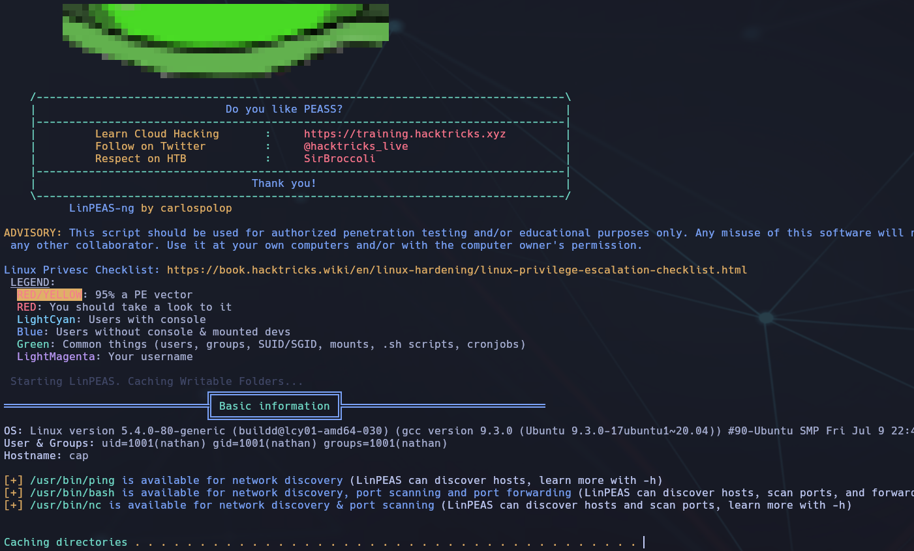

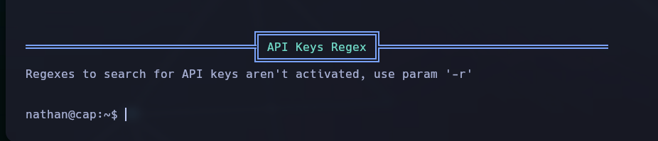

Leyendo el tutorial:

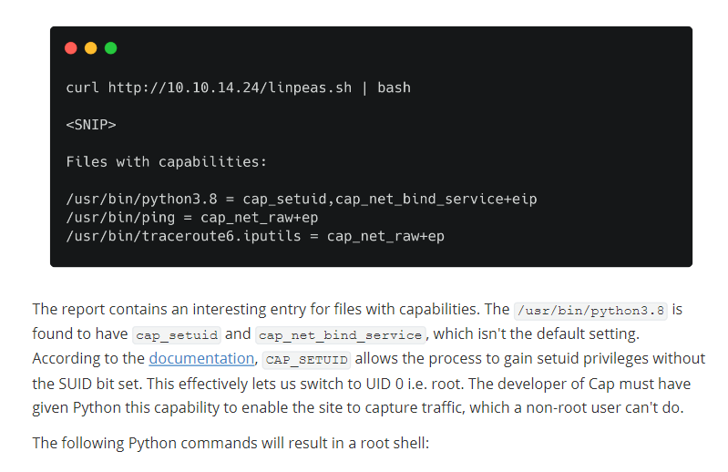


Buscamos binarios con **capabilities** especiales:

```bash
getcap -r / 2>/dev/null
```

Resultado:

```bash
/usr/bin/python3.8 = cap_setuid,cap_net_bind_service+eip
```

Esto es clave: `cap_setuid` permite ejecutar como UID 0 (root) sin necesidad del bit SUID.

📚 Referencia:

```bash
import os
os.setuid(0)
os.system("/bin/bash")
```

Y al ejecutarlo en `/usr/bin/python3.8`, conseguimos shell como root:

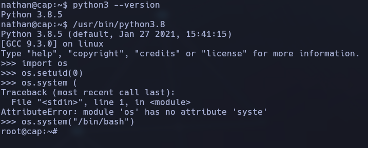

📡 Prompt cambia a `root@cap:~#`

✅ **Task 8**: Full path al binario vulnerable: `/usr/bin/python3.8`

## 🌟 Flag de root

Una vez como root , buscaremos la carpeta de root para encontrar la flag.

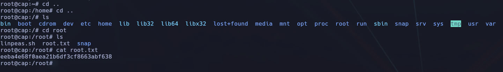

🏆 Flag root conseguida con éxito.

## 🌟 Conclusión

- Enumeración web ✅
    
- Análisis de PCAP con Wireshark ✅
    
- Credenciales encontradas ✅
    
- Acceso por SSH como `nathan` ✅
    
- Obtenida flag de usuario ✅
    
- Escalada a root via capabilities con Python ✅
    
- Obtenida flag de root ✅
    

🔹 Excelente ejercicio para entender:

- Lectura de PCAPs
    
- Credenciales en texto claro
    
- Enumeración de capabilities
    
- Uso de Python para obtener root