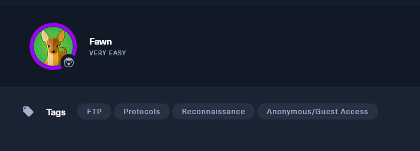
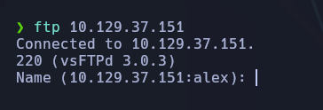
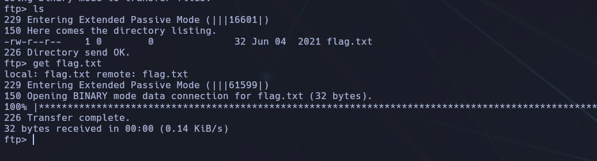

-----------
- Tags: #FTP #protocols #Reconnaisance #anonymous 
- --------------------




Ya que es una máquina con #ftp nos conectaremos al servidor FTP:

```bash
ftp 10.129.37.151
```



Al no tener una cuenta, nos conectaremos como #anonymous


Haremos un ls para buscar archivos en el servidor, y encontraremos un .txt :



Seguidamente, lo descargaremos con "get flag.txt"  y lo tendremos descargado en nuestro directorio (en este caso, en la VM)


Lo abriremos con cat y ahi tendremos la flag:


