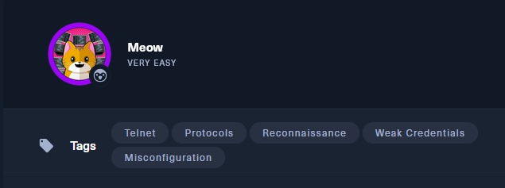
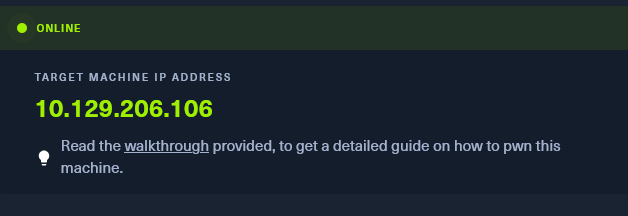
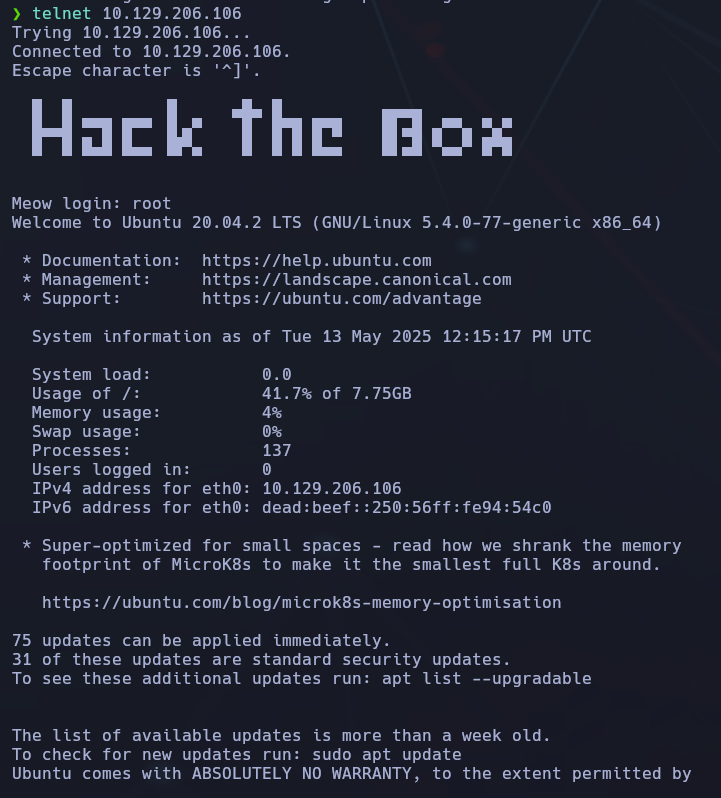
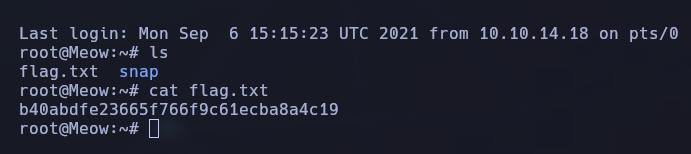

---------------
- Tags: #telnet #protocols #Reconnaisance #weakcredentials #misconfiguration
-----------------------





Usaremos Telnet "IP" y nos conectaremos con el login "root"  #telnet #flag


```bash
telnet 10.129.206.106
```



Al loguearnos ya, buscaremos con "ls" la flag



Y como vemos, hacemos un "cat flag.txt" para ver la flag.

🎯 Flag encontrada:
`b40abfde23665f766f9c61ecba8a4c19`
