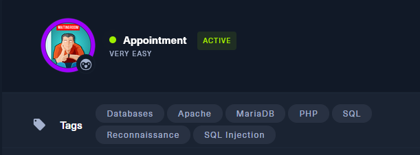
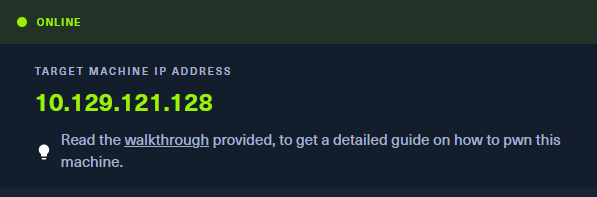
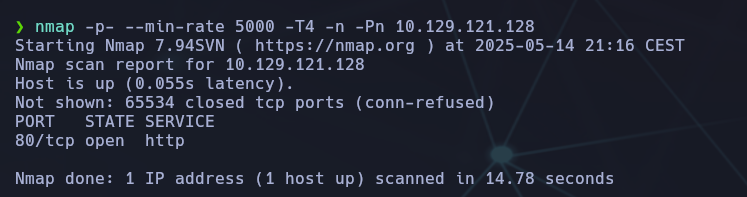
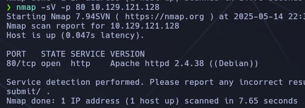
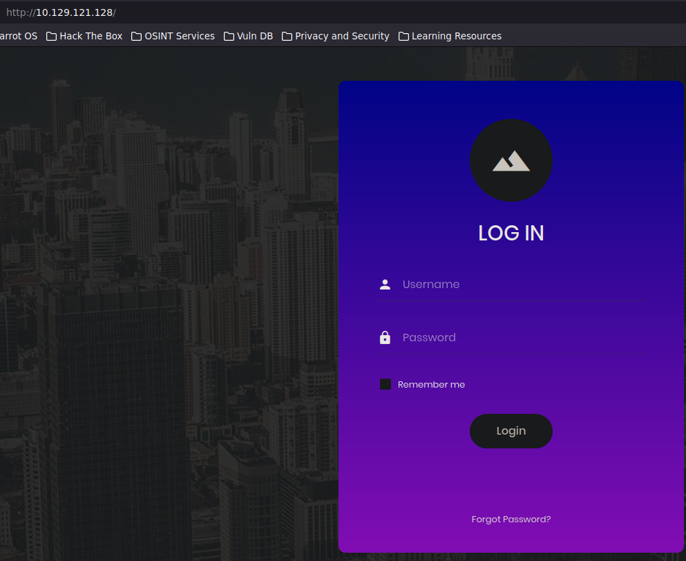
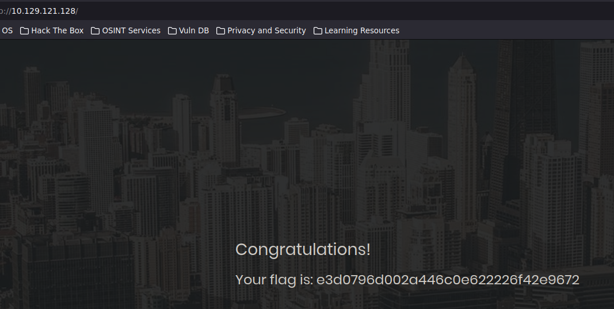

------
- Tags:  #database #apache #mariadb #php #sql #reconocimiento #sqlinjection
----------




## 🧠 Enumeración inicial y acceso a la máquina

## 🔍 Escaneo de puertos y servicios

Lanzamos un escaneo de puertos completo con Nmap:

```bash
nmap -p- --min-rate 5000 -T4 -n -Pn 10.129.121.128
```



Vemos que el puerto `80` está abierto con servicio HTTP.

Luego lanzamos un escaneo de detección de servicios:

```bash
nmap -sV -p 80 10.129.121.128`
```



Detectamos que corre **Apache httpd 2.4.38** sobre Debian.


## 🌐 Acceso a la aplicación web

Accedemos a la IP por navegador:  
http://10.129.121.128

Se nos presenta un **formulario de login** con campos de usuario y contraseña.



## 🛠️ Prueba de credenciales e inyección SQL

Probamos la típica combinación por defecto:

- Usuario: `admin`
    
- Contraseña: `1234`
    

⛔ No funciona.

Probamos ahora con una **inyección SQL básica**:

- Usuario: `admin'#`
    
- Contraseña: `1234` (o cualquier cosa)


El carácter `#` se usa para comentar el resto de la consulta SQL, lo cual nos permite **bypassear la autenticación**.

✅ **Accedemos como admin sin conocer la contraseña.**

## 🏁 Captura de la flag

Una vez autenticados, la web nos redirige a una página con un mensaje de éxito:

📌 **Flag encontrada:**



## ✅ Conclusión final

- La web corre sobre un Apache vulnerable a inyecciones SQL en el login.
    
- Logramos el acceso como administrador sin conocer la contraseña.
    
- La flag se muestra directamente tras el login exitoso.
    
- Aprendimos a detectar servicios web, aplicar inyecciones simples y comprender el impacto de validar mal las entradas del usuario.
    

🔐 **Lección aprendida:** Siempre validar y sanear las entradas del usuario en formularios. Evitar mostrar información sensible sin control de acceso.
