------------
- Tags: #CustomApplications #protocols #apache #FTP #Reconnaisance #WebSiteStructureDiscovery #cleartextcredentials #anonymous 
------------

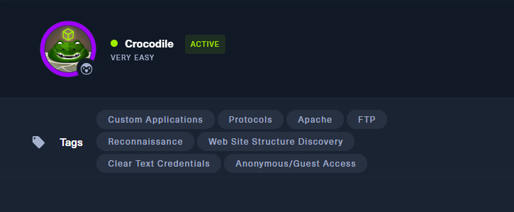

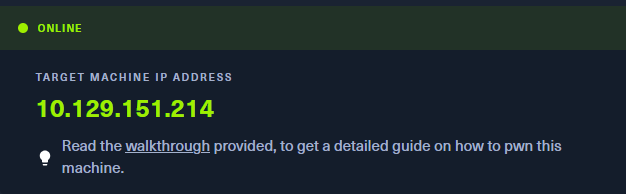

🧠 Enumeración inicial y análisis de servicios

Comenzamos con un escaneo de puertos para identificar servicios:

```bash
nmap -sC -sV 10.129.151.214
```

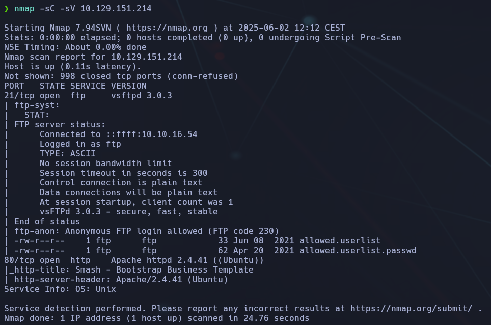

- Puerto 21: `vsftpd 3.0.3` (permite acceso anónimo)
    
- Puerto 80: `Apache httpd 2.4.41`


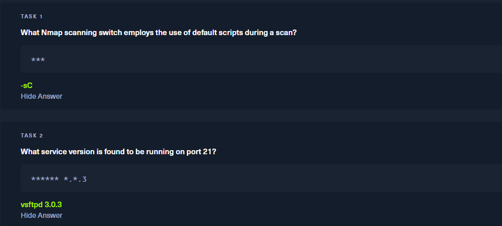

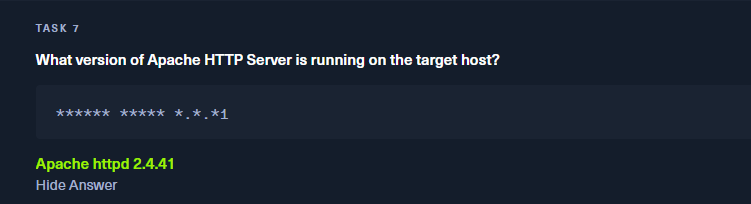


**`-sC`** activa los scripts por defecto de Nmap. Sirve para hacer una exploración más profunda con scripts NSE.

**`vsftpd 3.0.3`** es la versión que responde en el puerto 21. Detectada por Nmap con `-sV`.

**`Apache httpd 2.4.41`**  Es la versión del servidor web detectada al escanear con `nmap -sV`.

## 📁 Acceso por FTP anónimo

Nos conectamos al FTP usando:

```bash
ftp 10.129.151.214
```

Ingresamos con el usuario:

```bash
anonymous
```


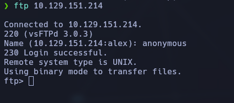

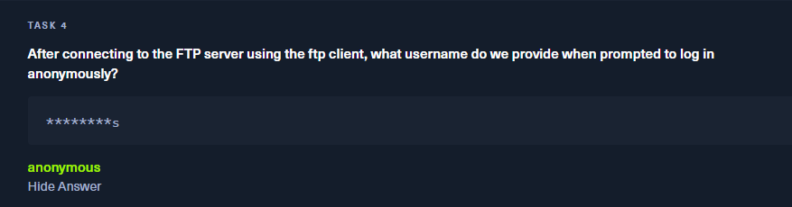

El nombre de usuario para login anónimo en FTP es literalmente `anonymous`.

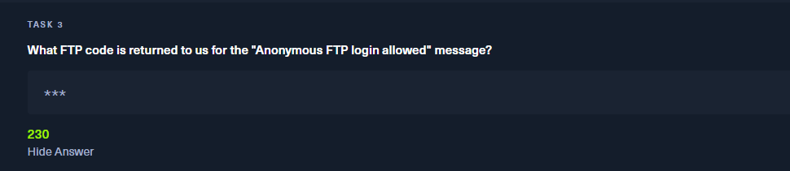

**Código `230`** del FTP significa que el acceso anónimo fue exitoso.

Una vez dentro, usamos el comando `ls` para listar los archivos, y luego `get` para descargar los archivos: `allowed.userlist` y `allowed.userlist.passwd

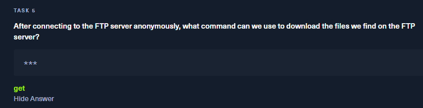

```bash
get allowed.userlist
get allowed.userlist.passwd
```

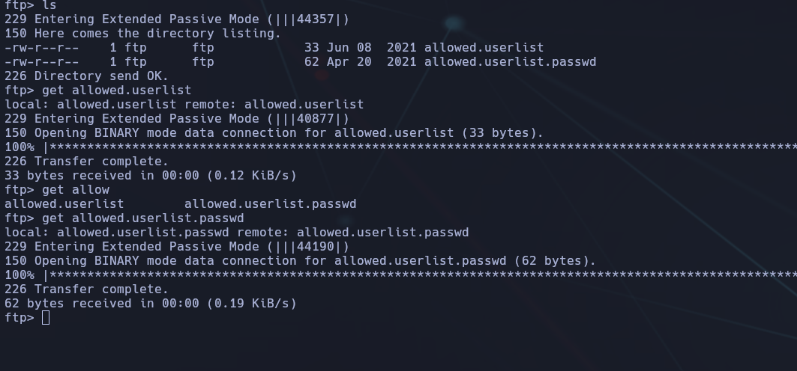

## 🔐 Revisión de credenciales

Analizamos el contenido de los archivos descargados:

```bash
cat allowed.userlist
cat allowed.userlist.passwd
```

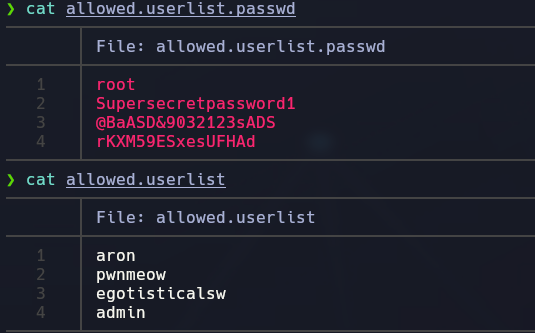

Vemos lo siguiente:

- Usuario: `admin`
    
- Posibles contraseñas:
	- `root
    
    - `Supersecretpassword1`
        
    - `@BaASD&9032123sADS`
        
    - `rKXM59ESxesUFHAd`

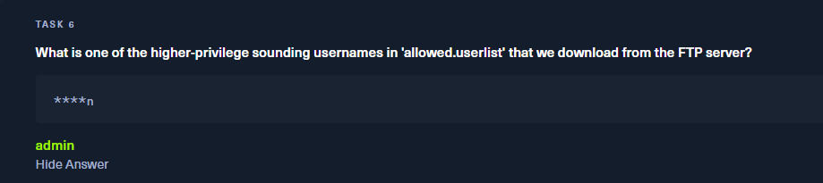

En el archivo `allowed.userlist`, descargado vía FTP, uno de los nombres con privilegios es `admin`.

## 🌐 Enumeración Web y descubrimiento de archivos

Con `gobuster` podemos buscar archivos interesantes en la web:

```bash
gobuster dir -u http://10.129.151.214 -w /usr/share/wordlists/dirbuster/directory-list-2.3-medium.txt -x php
```

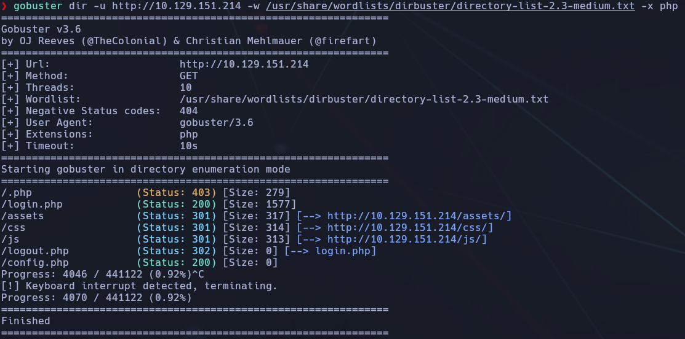

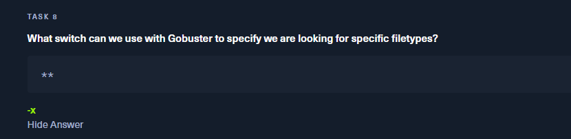

**`-x`**  *Flag de Gobuster que especifica extensiones de archivo a buscar (ej: `.php`).*


Esto nos revela la existencia de un archivo PHP:

```bash
login.php
```

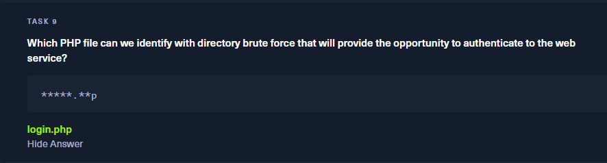


## 🔓 Ataque de login por HTTP

Accedemos al sitio web desde el navegador:

```bash
http://10.129.151.214
```

Utilizamos el archivo `login.php` descubierto con **Gobuster** y probamos credenciales del listado.

Después de varios intentos, conseguimos acceso con:

- **Usuario:** `admin`
    
- **Contraseña:** `rKXM59ESxesUFHAd`

## 🏁 Captura de la flag

Una vez logueados correctamente, se nos muestra la flag:

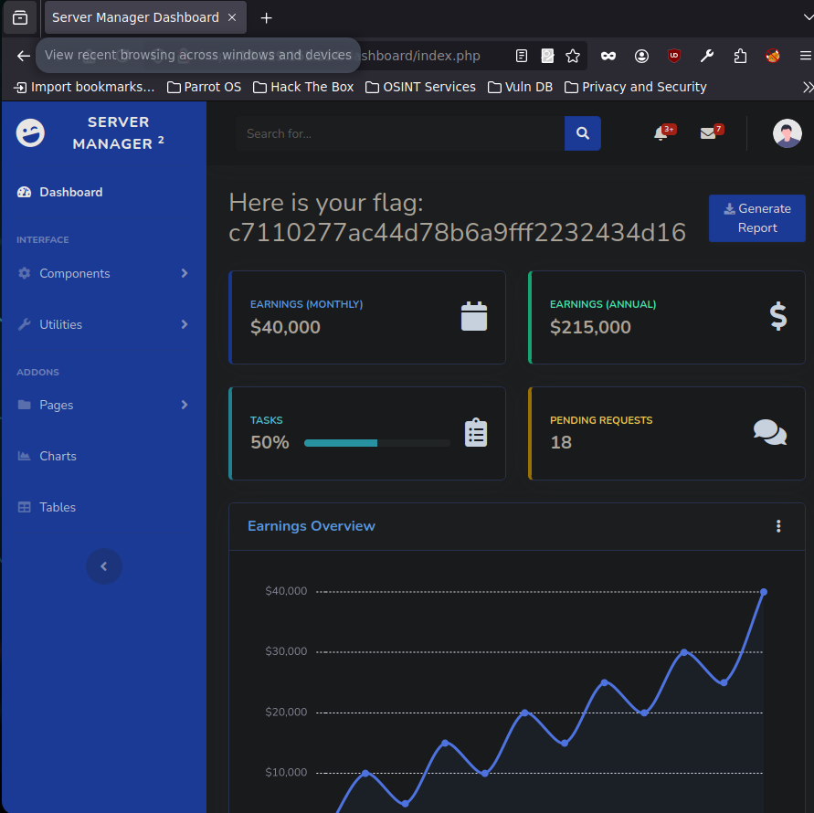

📌 **Flag encontrada:**

```bash
c7110277ac44d78b6a9fff2232434d16
```

## ✅ Conclusión final

- Se permite acceso anónimo a un FTP con archivos sensibles.
    
- A través de la lista de usuarios y contraseñas, accedimos a un panel web.
    
- Se expuso información crítica mediante malas prácticas: contraseñas sin cifrar y visibles.
    

🔐 **Lección aprendida:** Jamás dejar archivos con credenciales accesibles por FTP ni permitir acceso anónimo en servicios expuestos a internet. Además, las contraseñas deben estar cifradas y bien gestionadas.