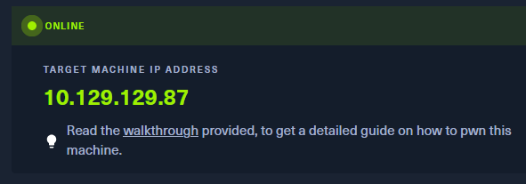
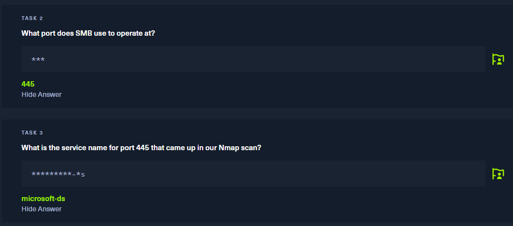
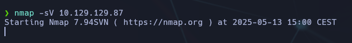
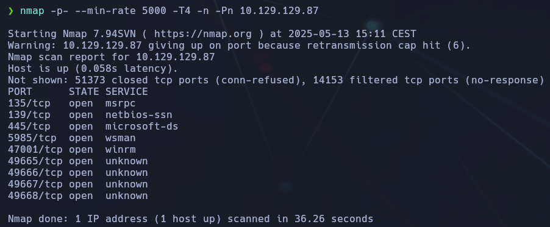
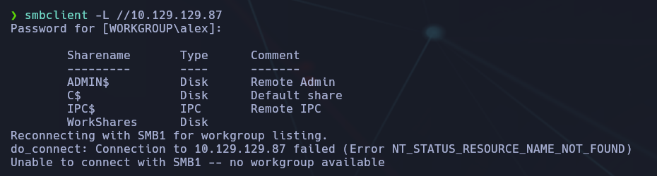
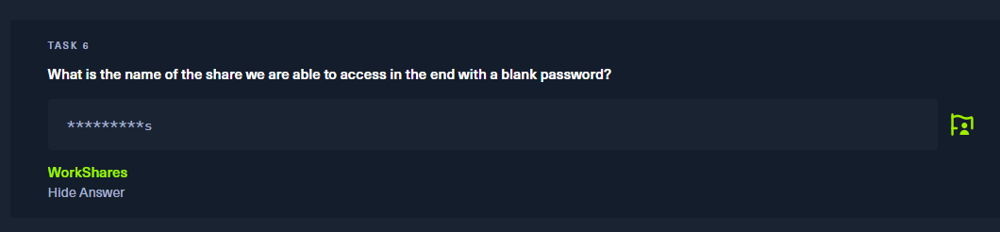
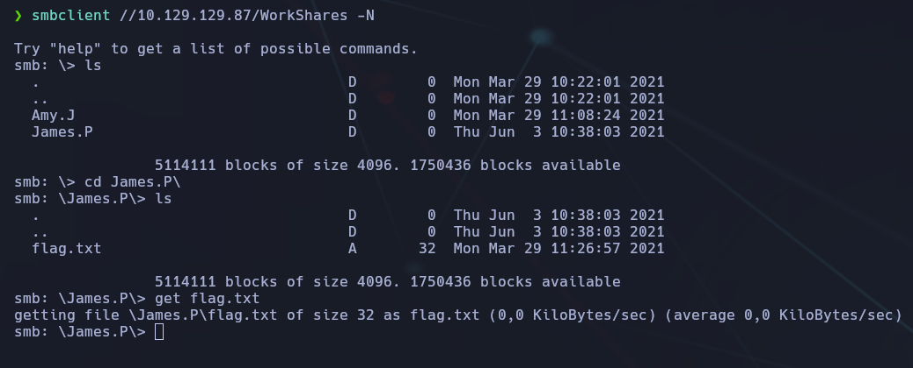
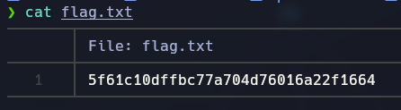

-----------------
- Tags: #protocols #SMB #Reconnaisance #anonymous 
------------------------




En esta maquina, usaremos el protocolo #smb

En las tareas que nos encontramos, nos piden:



Iniciamos un escaneo básico para identificar puertos abiertos:



Esto nos revela que el puerto `445` está abierto y que el servicio asociado es `microsoft-ds`, típico de SMB.

En caso de que este escaneo sea muy lento, usamos una versión rápida:

```bash
nmap -p- --min-rate 5000 -T4 -n -Pn "IP"
```




Esto nos revela múltiples puertos abiertos. Sin embargo, el foco es el puerto `445`, donde corre SMB.

## 🔍 Enumeración de recursos SMB

Listamos los recursos compartidos con `smbclient`:

```bash
smbclient -L //10.129.129.87
```



Si queremos evitar que nos pida contraseña (cuando ya sabemos que no la hay), usamos `-N`:

```bash
smbclient -L //10.129.129.87 -N
```

En las preguntas de la máquina ya nos está dando una pista que es:



Uno de los recursos es `WorkShares`, que aceptará conexión sin contraseña:

```bash
smbclient //10.129.129.87/WorkShares -N
```



## 📂 Búsqueda de la flag en el recurso compartido

Una vez dentro de `WorkShares`, listamos el contenido:

Accedemos a la carpeta `James.P`:

Encontramos un archivo `flag.txt`, lo descargamos con:

Finalmente, en nuestro sistema local, lo abrimos:



📌 **Flag encontrada:**

## ✅ Conclusión final

- La máquina expone un recurso compartido SMB accesible sin autenticación.
    
- Desde ese recurso, navegamos hasta un archivo sensible (`flag.txt`) y lo descargamos.
    

🔐 **Lección aprendida:** Nunca se deben compartir recursos en red sin autenticar. Es un error habitual en entornos mal configurados.