-------
- Tags: #progamming #rdp #Reconnaisance #weakcredentials 
-------

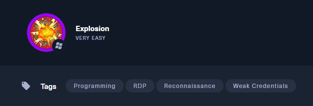

🧩 **Dificultad**: Very Easy (Windows)  
🕸️ **Dirección IP**: `10.129.188.65`  
🧠 **Temas**: RDP, credenciales débiles, reconocimiento

## ✅ **Task ***1: ¿Qué significa** ****_**RDP?**

*🔠 ****Resp****************ue****************sta****: *`Remote Desktop Protocol`

💬 RDP es un protocolo de Microsoft que permite a los usuarios conectarse de forma remota a otro sistema a través de una interfaz gráfica. Se usa comúnmente para administración r_em_ota.

📌 Común en servicios Windows escuchando en el puerto* `****3389****`.*

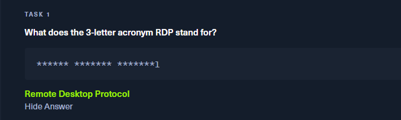

## ✅ **Task 2: ¿Qué acrónimo de 3 letras se refiere a la interacción con el host mediante línea de comandos?**

🔠 **Respuesta**: `CLI`

💬 CLI significa **Command Line Interface**. Es una forma de interactuar con un sistema a través de comandos escritos, sin entorno gráfico. Se usa ampliamente en administración y explotación de sistemas.

📌 Ejemplos de CLI: `cmd.exe`, `PowerShell`, `bash`, `sh`.

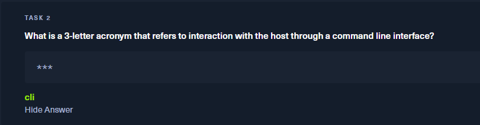

## ✅ **Task 3: ¿Y para interacciones con interfaz gráfica?**

🔠 **Respuesta**: `GUI`

💬 GUI significa **Graphical User Interface**. Es una interfaz visual que permite interactuar con el sistema a través de ventanas, botones, iconos, etc., sin necesidad de escribir comandos.

📌 Muy común en entornos Windows y Linux con escritorios como GNOME, KDE o XFCE.

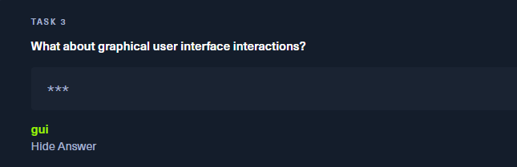

## ✅ **Task 4: ¿Cuál es el nombre de una herramienta de acceso remoto antigua que no usaba cifrado y escuchaba por el puerto TCP 23?**

🔠 **Respuesta**: `telnet`

💬 Telnet es un protocolo antiguo de acceso remoto que permite conectarse a otros sistemas a través de una línea de comandos. No cifra el tráfico, por lo que las credenciales pueden ser interceptadas fácilmente.

⚠️ Debido a su falta de seguridad, ha sido reemplazado por SSH en la mayoría de los sistemas modernos.

📌 Escucha en el puerto `23` por defecto.

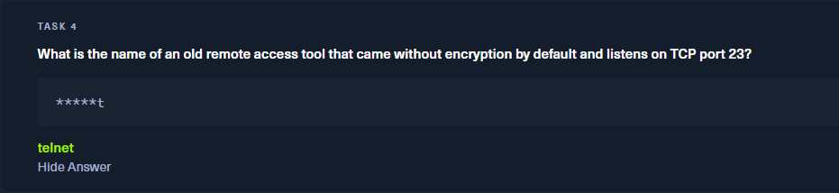

## ✅ **Task 5: ¿Qué servicio se encuentra en el puerto TCP 3389?**

🔠 **Respuesta**: `ms-wbt-server`

💬 Este nombre identifica el servicio que ofrece Microsoft para conexiones de escritorio remoto, concretamente **Microsoft Remote Desktop Services**. Es el backend del protocolo RDP.

🔍 Se puede confirmar usando Nmap:

```bash
nmap -sS --top-ports 1000 10.129.188.65
```

📌 Resultado:

```bash
3389/tcp open  ms-wbt-server
```

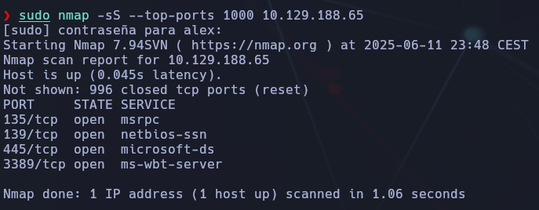

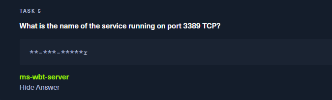

## ✅ **Task 6: ¿Qué opción se usa en** `**xfreerdp**` **para especificar la IP del host objetivo?**

🔠 **Respuesta**: `/v:`

💬 El parámetro `/v:` se utiliza en `xfreerdp` para indicar el host remoto (por IP o nombre de dominio) al que conectarse mediante RDP.

📌 Ejemplo:

```bash
xfreerdp /v:10.129.188.65
```

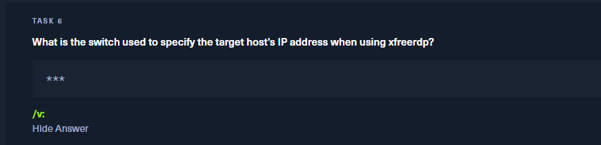


💡 También se pueden añadir otras opciones como `/u:usuario` para indicar usuario, o `/p:contraseña` para facilitar autenticación.

### 🧩 Notas técnicas adicionales sobre `xfreerdp`

❌ Si al intentar ejecutar `xfreerdp` aparece:

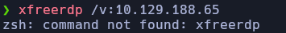

🔧 Es necesario instalarlo, pero **el nombre correcto del paquete** no es `xfreerdp`, sino:

```bash
sudo apt install freerdp2-x11
```

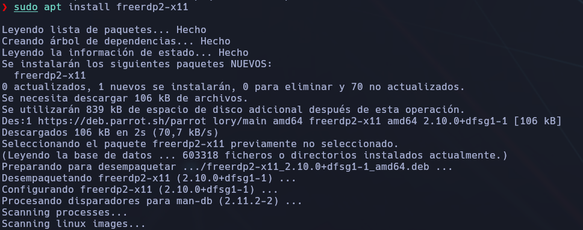

Esto instalará correctamente la herramienta en sistemas Debian/Ubuntu (como Kali, Parrot, etc.).

🛠️ `xfreerdp` forma parte del proyecto FreeRDP, un cliente RDP moderno y compatible con muchas opciones avanzadas.

💡 A veces es útil para pentesting porque permite iniciar sesión en escritorios remotos Windows directamente desde Linux.

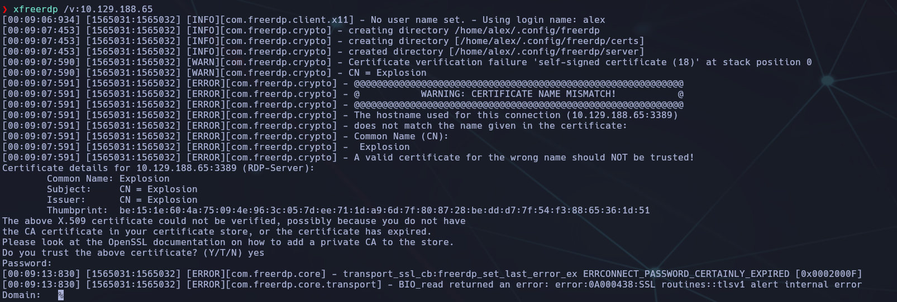

## ✅ **Task 7: ¿Qué nombre de usuario devuelve proyección de escritorio sin contraseña?**

🔠 **Respuesta**: `Administrator`

💬 Al usar el comando `xfreerdp /v:10.129.188.65 /u:Administrator` con contraseña en blanco, se logra conectarse correctamente al escritorio remoto. Este usuario representa el nivel más alto de privilegios en un sistema Windows.

```bash
xfreerdp /v:10.129.188.65:3389 /u:Administrator
```

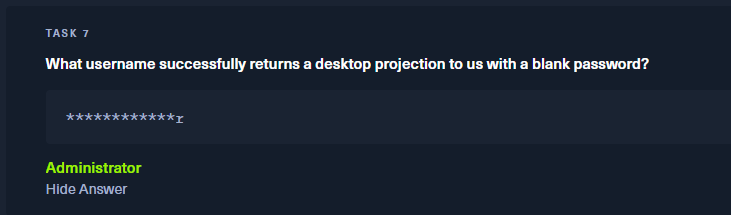

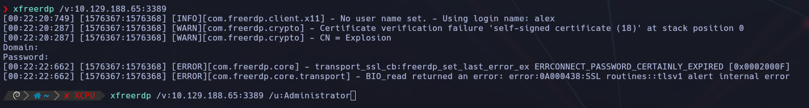

📌 Verifica el certificado autofirmado, acepta con `yes` si aparece el mensaje de advertencia. Si no se indica el usuario con `/u:`, el nombre por defecto será el del sistema local (en este caso `alex`).

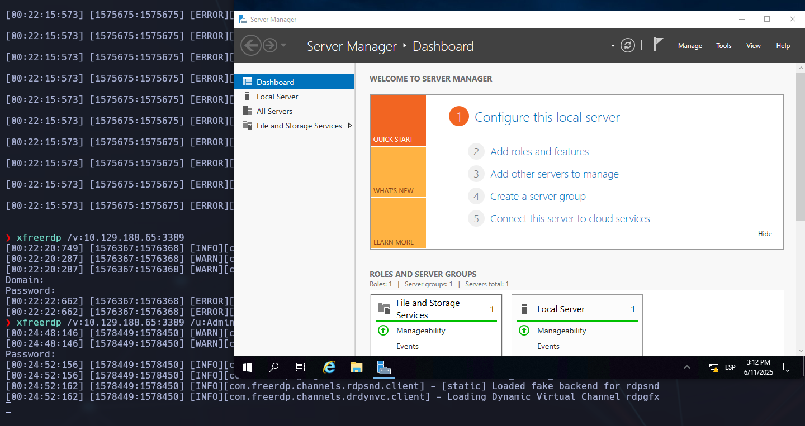

Encontraremos la flag en la primera y unica carpeta del sistema.

## 🧩 Conclusión final y análisis

✅ El sistema Windows objetivo permitía conexión remota RDP en el puerto `3389`, expuesto a Internet y **sin medidas de seguridad básicas**:

- Se detectó el servicio con Nmap (`ms-wbt-server`).
    
- Se accedió con la cuenta `Administrator` **sin contraseña**, lo cual supone una vulnerabilidad crítica.
    
- La interfaz gráfica se abrió correctamente usando `xfreerdp`, lo que otorga control total del sistema.
    

🛑 **Riesgos detectados:**

- Falta de autenticación en cuenta de administrador
    
- Certificado autofirmado sin confianza
    
- RDP expuesto al exterior sin firewall restrictivo
    

📌 Esta máquina es un excelente ejemplo de por qué las configuraciones por defecto en servicios RDP deben revisarse a fondo y protegerse con políticas seguras.

