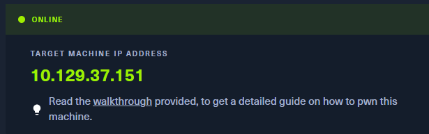
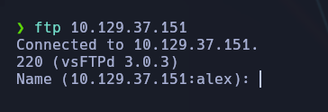
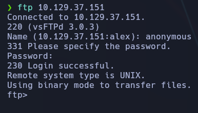
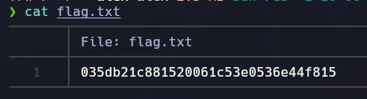

-----------
- Tags: #FTP #protocols #reconocimiento  #anonymous 
- --------------------




Como se trata de una máquina #FTP, probamos acceso anónimo:

```bash
ftp 10.129.37.151
```



Nos conectamos como `anonymous` (sin contraseña real). El sistema permite el acceso con permisos limitados.



## 📁 Descarga de archivos y búsqueda de la flag

Una vez dentro del entorno FTP, listamos el contenido:

```bash
ls
```

Vemos que hay un archivo `flag.txt`, lo que sugiere que contiene la flag.

Descargamos el archivo:

```bash
get flag.txt
```


Ya descargado en nuestro directorio (en este caso, en la VM)


Después, ya en nuestro sistema local, lo leemos con:

```bash
cat flag.txt
```

📌 **Flag encontrada:**



## ✅ Conclusión final

- La máquina expone un servicio FTP sin autenticación, lo cual es una grave falla de seguridad.
    
- Mediante acceso anónimo, pudimos listar y descargar archivos desde el servidor.
    
- Encontramos la flag dentro de `flag.txt`, disponible en texto plano sin protección.