-------------
- Tags: #FTP #postgreSQL #reconocimiento #Tunneling #Passwordspraying #portforwarding #anonymous #guest #cleartextcredentials 
-------------------

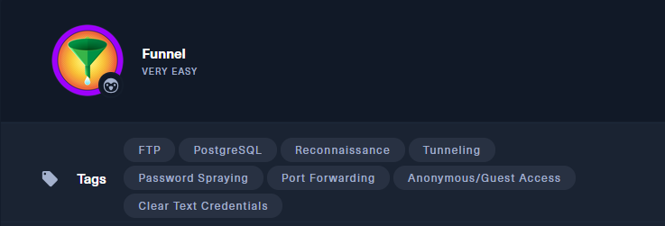

## 🌐 Información general

- **IP objetivo**: `10.129.184.72`
    
- **Servicio vulnerable**: FTP + PostgreSQL
    
- **Nivel**: Muy Fácil
    
- **Etiquetas**: FTP, PostgreSQL, Reconocimiento, Password Spraying, Credenciales en texto claro, Tunneling, Port Forwarding

## ✅ Tarea 1: ¿Cuántos puertos TCP están abiertos?

🌠 **Respuesta**: `2`

### 🔎 Escaneo con Nmap:

```bash
sudo nmap -sS -p- -sV 10.129.184.72
```

- `-sS`: escaneo TCP SYN.
    
- `-p-`: escaneo completo de puertos (1-65535).
    
- `-sV`: detección de versiones.


### 📋 Resultado:

```bash
21/tcp open  ftp     vsftpd 3.0.3
22/tcp open  ssh     OpenSSH 8.2p1 Ubuntu
```


## ✅ Tarea 2: ¿Cuál es el nombre del directorio disponible en el servidor FTP?

🌠 **Respuesta**: `mail_backup`

### 🔐 Acceso FTP anónimo:

```bash
ftp 10.129.184.72
Name: anonymous
Password: [ENTER]
```

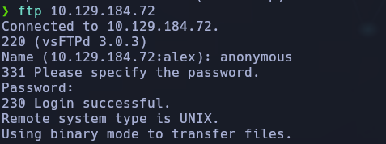

### 📁 Directorio disponible:

```bash
ls
> mail_backup
```

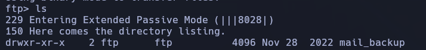

## ✅ Tarea 3: ¿Cuál es la contraseña por defecto de las cuentas del equipo "Funnel"?

### 📁 Inspección del contenido en `mail_backup`

🧹 Según la pista de la tarea:

> Una vez que accedas al directorio `mail_backup` mediante FTP, deberías examinar **los dos archivos** que hay presentes. Este tipo de cosas suelen cubrirse en documentos de políticas de contraseñas.

### 🔧 Extracción de archivos:

Desde el FTP:

```bash
cd mail_backup
ls
get password_policy.pdf
```

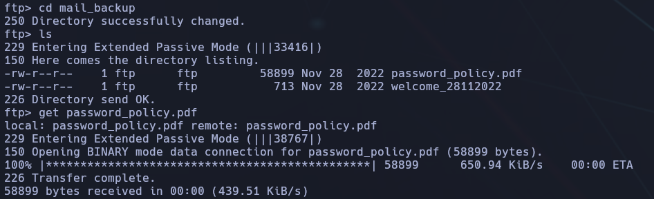

### 📑 Análisis del contenido del archivo:

#### 📄 Archivo `password_policy.pdf`:

📌 Contenido clave del documento:

- Se destaca la importancia de establecer contraseñas seguras y cambiarlas periódicamente.
    
- Se recomienda evitar contraseñas débiles como `password`, `1234`, etc.
    
- **Se especifica claramente que la contraseña por defecto es**:

```bash
funnel123#!#
```

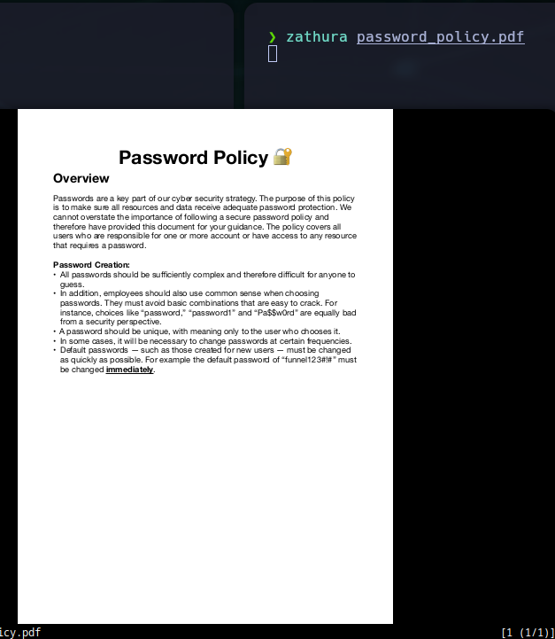

Esta contraseña debe ser cambiada inmediatamente al acceder por primera vez.


## ✅ Tarea 4: ¿Qué usuario todavía no ha cambiado su contraseña por defecto?

### 🔍 Análisis y relación:

A partir del mensaje en `welcome_28112022`, observamos los usuarios:

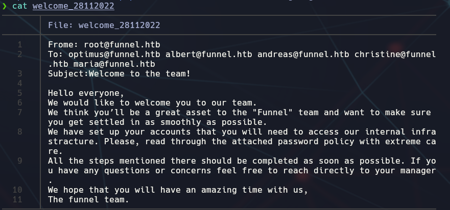

```bash
optimus@funnel.htb
albert@funnel.htb
andreas@funnel.htb
christine@funnel.htb
maria@funnel.htb
```

Sabemos que la contraseña por defecto es `funnel123#!#`, por lo que podemos intentar un acceso por SSH con varios de los usuarios:

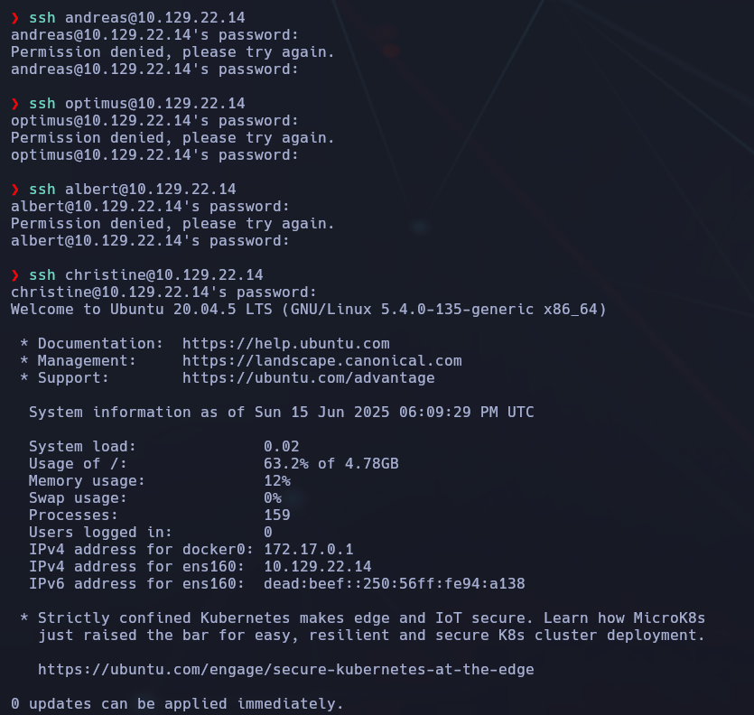

🎉 El acceso fue exitoso. Esto confirma que **Christine** aún no ha cambiado la contraseña predeterminada, a diferencia del resto de usuarios, cuyos accesos fallan con esa misma clave.

### ✍️ Confirmación en terminal:

Christine inicia sesión correctamente y accede a un entorno Ubuntu 20.04.5 LTS con IP interna `10.129.22.14`, lo que valida la explotación correcta.


## ✅ Tarea 5: ¿Qué servicio se está ejecutando en el puerto TCP 5432 y escucha solo en localhost?

### 🔍 Pista:

Una vez autenticado por SSH como el usuario `christine`, puedes usar el comando:

```bash
ss -tl
```

Este comando muestra los puertos que están en estado LISTEN (escuchando).

### 📋 Resultado:

Esto indica que el puerto `5432` está siendo utilizado por el servicio `postgresql` y está limitado a localhost (`127.0.0.1`).

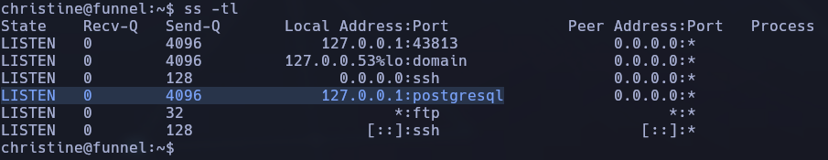

🧠 ¿Por qué el puerto **5432** no aparece explícitamente, pero sí lo identificamos?

El sistema está utilizando un **servicio conocido** que tiene su propio alias de puerto.

🔍 En este caso, `postgresql` **es un nombre simbólico que el sistema asigna al puerto 5432**, ya que este puerto está registrado oficialmente en el archivo `/etc/services` como:

🔒 Por tanto:

- Aunque **no se muestre el número `5432`**, la referencia a `postgresql` en la IP `127.0.0.1` **confirma que el puerto 5432 está en uso**.
    
- Además, como está asociado a `127.0.0.1`, **escucha únicamente en localhost**, lo cual es exactamente lo que se pregunta en la tarea 5.


## ✅ Tarea 6: ¿Qué tipo de tunelización es necesaria para acceder al servicio desde tu máquina?

### 🧠 Explicación:

Como el servicio PostgreSQL escucha solo en `localhost` dentro de la máquina remota, y **no es accesible directamente desde fuera**, necesitamos reenviar ese puerto hacia nuestra máquina local para poder conectarnos desde allí.

### 📦 Local port forwarding:

Es una técnica de SSH en la que se crea un túnel desde un puerto de tu **máquina local** a un puerto específico de la máquina **remota**.

### 💻 Comando:

```bash
ssh -L 5432:localhost:5432 christine@10.129.22.14  (contraseña "funnel123#!#")
```

- `-L`: indica un túnel de reenvío local.
    
- `5432:localhost:5432`: redirige el puerto local 5432 al puerto 5432 en la máquina remota.
    

A partir de aquí, puedes conectarte al servicio PostgreSQL con un cliente como `psql`, indicando `localhost` como destino.

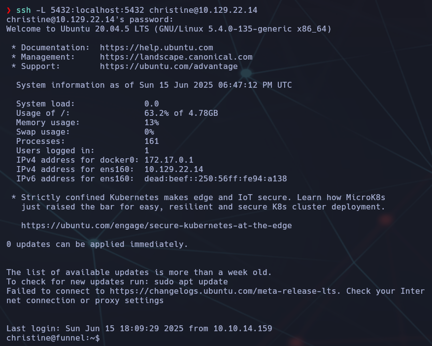

## ✅ Tarea 7: ¿Cuál es el nombre de la base de datos que contiene la flag?

🌠 **Respuesta**: `secrets`

### 🎯 Objetivo

Encontrar el nombre de la base de datos PostgreSQL que contiene la flag. Sabemos que el servicio PostgreSQL se ejecuta en `localhost`, por lo que necesitamos usar el túnel SSH establecido previamente

### 🧩 Paso a paso detallado

#### 🔐 1. Crear túnel con Local Port Forwarding

Como se configuró en la Tarea 6, el túnel redirige el puerto local `5432` al servicio PostgreSQL corriendo en la máquina remota (`127.0.0.1:5432`):

```bash
ssh -L 5432:localhost:5432 christine@10.129.22.14
```

📌 Esto permite que **desde tu máquina local**, accedas al PostgreSQL remoto como si estuviera en tu propia máquina, en el puerto 5432.

#### 🧠 2. Conectarse a PostgreSQL desde local

Ejecuta en tu **máquina local** (no en la remota):

```bash
psql -h localhost -U christine -d postgres
```

- `-h localhost`: conectarse al PostgreSQL redirigido vía túnel.
    
- `-U christine`: usuario de PostgreSQL (mismo que SSH).
    
- `-d postgres`: base de datos por defecto para iniciar sesión.

💬 Nos pedirá la contraseña → introducimos: `funnel123#!#`

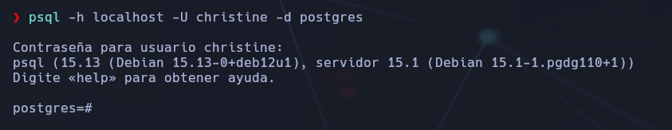

#### 📂 3. Listar todas las bases de datos

Una vez conectado a `psql`, ejecuta:

```bash
\l
```

Este comando muestra las bases de datos:

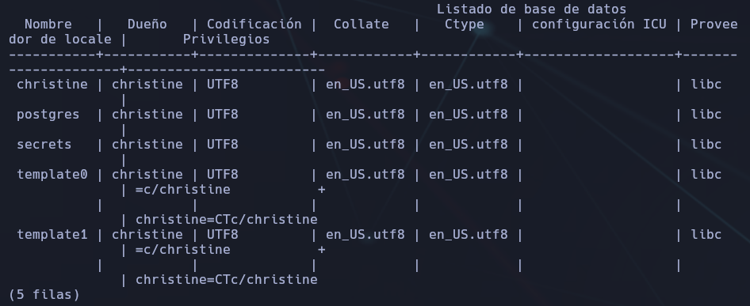

Escribiremos "Q" para salir.

Dentro de `psql`, escribiremos:

```bash
\c secrets
```

Esto cambia tu conexión a la base de datos `secrets`.

#### 📄 2. Ver las tablas disponibles

Una vez conectado a `secrets`, usa el siguiente comando:

```bash
\dt
```

Esto te mostrará todas las **tablas** existentes dentro de esa base de datos.

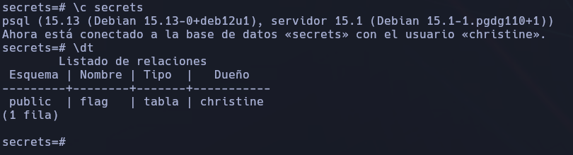

#### 🔎 3. Ver los registros de una tabla

Vemos que aparece una tabla llamada `flag`, puedes ver su contenido con:

```bash
SELECT * FROM flag;
```

### 📋 Resultado:

Se encuentra una tabla llamada `flag`.

📦 Consultamos su contenido:

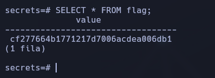

## ✅ Tarea 8: ¿Podrías usar un túnel dinámico en lugar de reenvío de puerto local? (Sí o No)

🌠 **Respuesta**: `yes`

### 🧠 Explicación:

Existen varios tipos de túneles SSH, y aunque el reenvío de puerto local (Local Port Forwarding) fue el más directo para nuestro objetivo en esta máquina (`-L 5432:localhost:5432`), también es posible usar un **túnel dinámico** en su lugar.

### 🔄 ¿Qué es un túnel dinámico?

- Un **Dynamic Port Forwarding (Dynamically Allocated Tunnel)** crea un **proxy SOCKS** en tu máquina local.
    
- SSH redirige el tráfico a través del túnel según las peticiones que tu navegador o herramienta hagan.
    
- Es más flexible que el `-L`, pero requiere que las herramientas estén configuradas para usar el proxy SOCKS.

🧪 Ejemplo de uso:

```bash
ssh -D 9050 christine@10.129.22.14
```

Esto crearía un proxy SOCKS en tu máquina local (`localhost:9050`) y **permitiría enrutar tráfico arbitrario** (como conexiones web o incluso PostgreSQL, si se configura correctamente un cliente o proxy).

### 🔍 Conclusión:

Aunque en este laboratorio no era lo más directo, **sí** se puede usar un túnel dinámico para este tipo de tareas de redirección, especialmente útil cuando se necesitan múltiples puertos o cuando no se conoce el puerto exacto de destino.