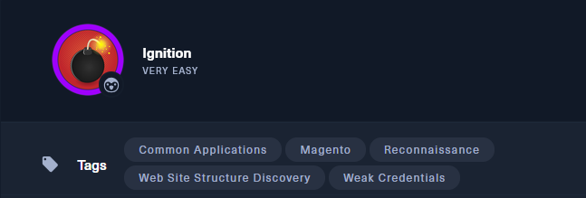
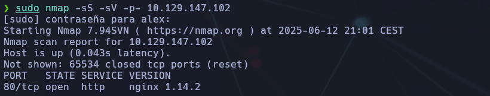
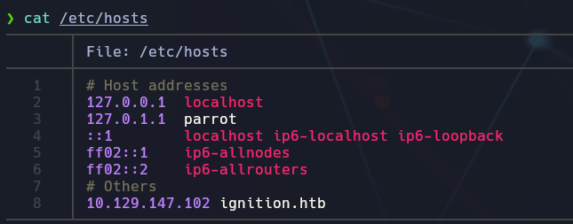
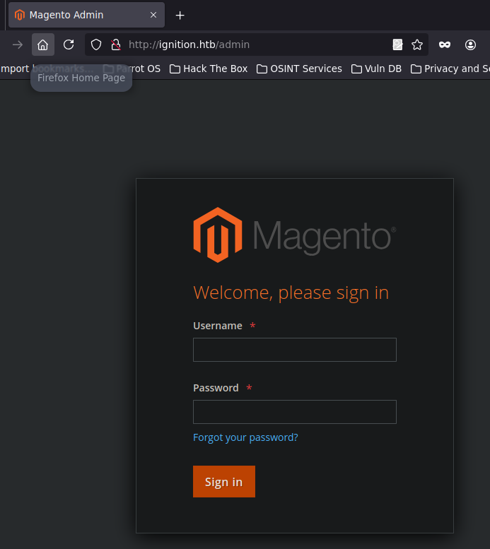
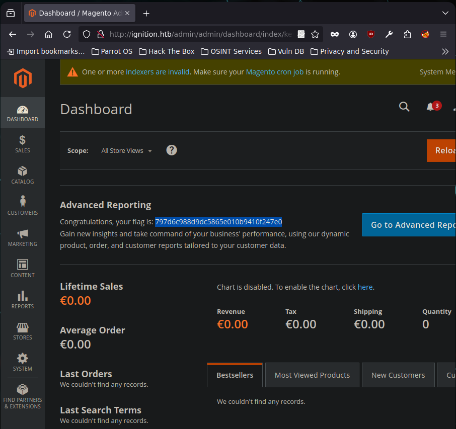

-------
- Tags: #commonapplications #magento #Reconnaisance #WebSiteStructureDiscovery #weakcredentials 
----



## 🌐 Información general

- **Servicio vulnerable**: Magento (aplicación web sobre Nginx)
    
- **Nivel**: Very Easy
    


## ✅ Task 1: ¿Qué versión de servicio se encuentra en el puerto 80?

🔠 **Respuesta**: `nginx 1.14.2`

Mediante escaneo con `nmap` se identificó que el puerto 80 está abierto y corre un servicio `nginx` versión `1.14.2`.



## ✅ Task 2: ¿Cuál es el código de estado HTTP de 3 dígitos devuelto al visitar `http://{IP}`?

🔠 **Respuesta**: `302`

La respuesta 302 indica una redirección temporal del navegador al visitar la IP directamente.


## ✅ Task 3: ¿Cuál es el nombre del host virtual que espera el sitio web?

🔠 **Respuesta**: `ignition.htb`

El servidor responde correctamente solo si se accede usando el encabezado `Host: ignition.htb`. Esto puede determinarse al inspeccionar respuestas HTTP o encabezados con `curl -I` o navegando directamente.

### Recomendación:

Editar `/etc/hosts` y añadir:

```bash
10.129.XXX.XXX  ignition.htb
```



## ✅ Task 4: ¿Cuál es la ruta completa al archivo en Linux que almacena la lista local de dominios a IPs?

🔠 **Respuesta**: `/etc/hosts`

Este archivo se usa para definir nombres de dominio locales sin necesidad de DNS.


## ✅ Task 5: Fuerza bruta de directorios web

🔠 **Respuesta**: `http://ignition.htb/admin`

Utilizando herramientas como `gobuster` o `ffuf`, se descubrió el directorio `/admin`, que corresponde al panel de acceso de Magento.



### Ejemplo con gobuster:

```bash
gobuster dir -u http://ignition.htb -w /usr/share/wordlists/dirbuster/directory-list-2.3-medium.txt
```


## ✅ Task 6: ¿Qué contraseña da acceso al panel de admin?

🔠 **Respuesta**: `qwerty123`

Se probó el usuario por defecto `admin` junto a las contraseñas más comunes de 2023. Magento no tiene límites de intentos ni captcha por defecto, lo que permitió hacer fuerza bruta.


## 🔎 Notas adicionales

- Acceso: `http://ignition.htb/admin`
    
- Usuario: `admin`
    
- Contraseña: `qwerty123`
    
- Aplicación vulnerable: Magento (posiblemente Magento CE v2)
    

Tras autenticarse, se podría explorar opciones para escalar privilegios o buscar vulnerabilidades conocidas del CMS (como RCEs por plugins).


## 🔍 Conclusión Final

La máquina **Ignition** es un ejemplo clásico de exposición de aplicaciones web vulnerables y mal configuradas. Aprendimos a identificar:

- Servicios en puertos abiertos (nginx en 80).
    
- Virtual Host esperado (`ignition.htb`) y redirecciones 302.
    
- Descubrimiento de rutas ocultas con fuerza bruta.
    
- Ataques por credenciales débiles (acceso como admin a Magento).
    

Esta máquina refuerza la importancia de proteger paneles de administración, restringir acceso por IPs, y usar contraseñas robustas.