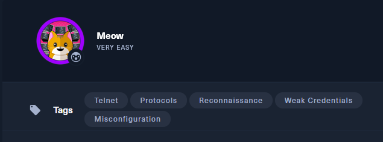
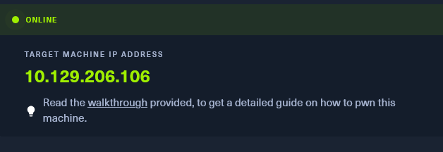
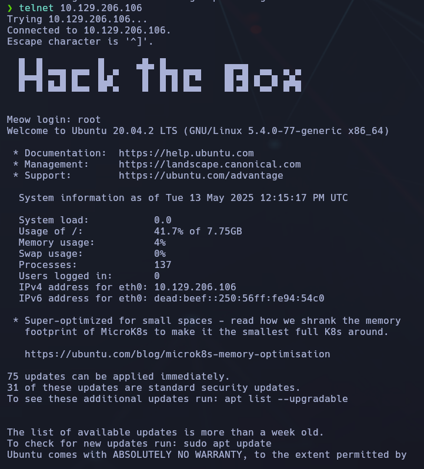
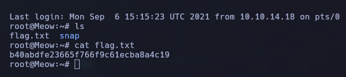

---------------
- Tags: #telnet #protocols #reconocimiento  #weakcredentials #misconfiguration
-----------------------





## 🧠 Enumeración inicial y acceso a la máquina

Usaremos Telnet para conectarnos directamente como `root`.


```bash
telnet 10.129.206.106
```



Nos encontramos con una consola abierta sin necesidad de credenciales adicionales.

## 🏁 Captura de la flag de root

Una vez dentro, simplemente listamos el contenido del directorio home del usuario `root`:



Y como vemos, hacemos un "cat flag.txt" para ver la flag.

🎯 Flag encontrada:
`b40abfde23665f766f9c61ecba8a4c19`

## ✅ Conclusión final

- La máquina tenía el servicio Telnet expuesto.
    
- Accedimos sin necesidad de credenciales interactivas.
    
- Obtuvimos la flag directamente desde el archivo `flag.txt`.


