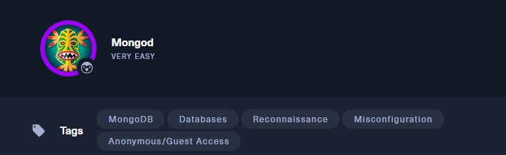
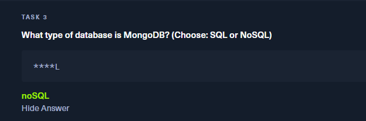
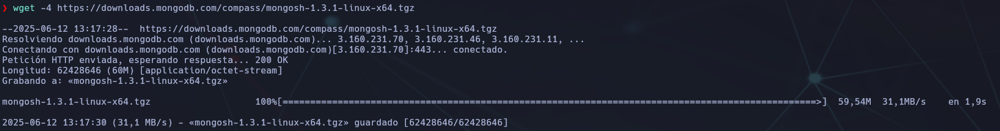
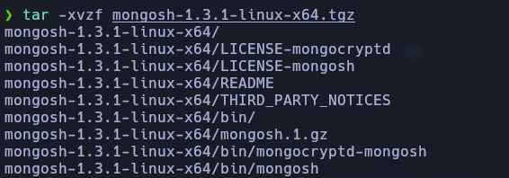
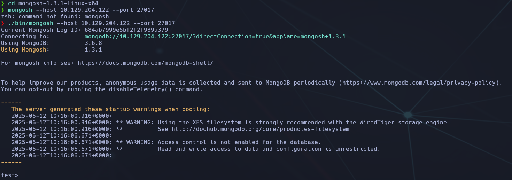
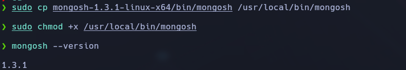
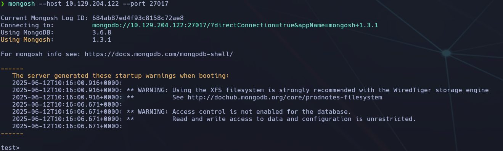
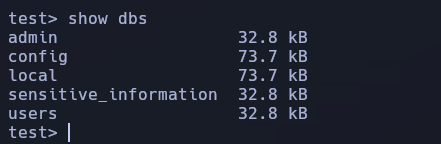
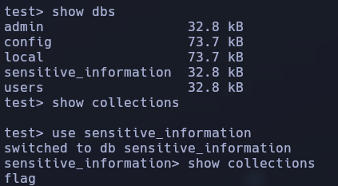
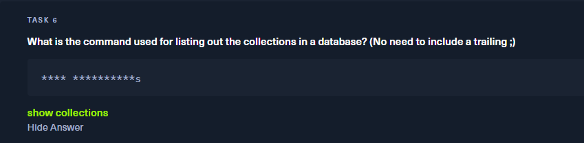

-------
- Tags: #MongoDB #database #Reconnaisance #misconfiguration #anonymous 
----------



🧩 **Dificultad**: Very Easy (Linux) 
🧠 **Temas**: MongoDB, bases de datos, reconocimiento, acceso anónimo 
🕸️ **Dirección IP**: `10.129.204.122`


## ✅ **Task 1/2: ¿Cuántos puertos TCP están abiertos en la máquina y cuál es el servicio TCP que corre en el puerto 27017?

🔠 **Respuesta**: `2` y `MongoDB 3.6.8`

💬 Con un escaneo de puertos completo se detectan 2 puertos TCP abiertos, y que el servicio en el puerto 27017 es **MongoDB v3.6.8**. Para ello se utiliza el siguiente comando de Nmap:

```bash
sudo nmap -sS -sV -p- 10.129.204.122 -T4
```


🔍 **Explicación de los parámetros usados:**

- `-sS`: realiza un escaneo TCP SYN (rápido y sigiloso).
    
- `-sV`: detecta la versión del servicio que corre en cada puerto abierto.
    
- `-p-`: escanea todos los puertos (del 1 al 65535).
    
- `-T4`: ajusta la velocidad del escaneo para hacerlo más rápido (útil en entornos con buena conectividad).

📌 Este enfoque permite descubrir servicios que no estén en los 1000 puertos más comunes y obtener más detalles del software expuesto. que el servicio en el puerto 27017 es **MongoDB v3.6.8**:


## ✅ **Task 3: ¿Qué tipo de base de datos es MongoDB?**

🔠 **Respuesta**: `noSQL`

💬 MongoDB es una base de datos **no relacional (NoSQL)**, orientada a documentos y que almacena la información en formato JSON/bson. Es ampliamente usada por su flexibilidad y escalabilidad.

📌 Al no requerir esquemas estrictos, suele usarse en aplicaciones modernas y entornos de desarrollo ágil.

💡 Si se desea ampliar la práctica, se puede acceder a la base de datos desde la terminal con el comando:

```bash
mongo
```



## ✅ **Task 4: ¿Cuál es el nombre del comando del Mongo Shell que se instala con el paquete** `**mongodb-clients**`**?**

🔠 **Respuesta**: `mongosh`

💬 El comando `mongosh` lanza una consola interactiva para conectarse a una instancia de MongoDB y consultar sus bases de datos. Es la versión moderna del cliente `mongo`, con más características y mejor compatibilidad.

📌 Útil para explorar la base de datos y ejecutar comandos directamente:

```bash
mongosh --host 10.129.204.122 --port 27017
```

🛠️ En este caso, el sistema no tenía disponible el paquete `mongodb-clients`, por lo que se optó por instalar manualmente una versión compatible:

### 🧰 Pasos seguidos:

1. Descargar la versión 1.3.1 compatible con MongoDB 3.6 desde el sitio oficial:

```bash
wget -4 https://downloads.mongodb.com/compass/mongosh-1.3.1-linux-x64.tgz
```



2. Descomprimir el archivo:

```bash
tar -xvzf mongosh-1.3.1-linux-x64.tgz
```



3. Acceder a la carpeta extraída y lanzar el binario directamente:

```bash
cd mongosh-1.3.1-linux-x64
./bin/mongosh --host 10.129.204.122 --port 27017
```



4. (Opcional) Copiar el binario a una ruta del sistema para usarlo globalmente:

```bash
sudo cp mongosh-1.3.1-linux-x64/bin/mongosh /usr/local/bin/mongosh
sudo chmod +x /usr/local/bin/mongosh
```



🔄 Así, se puede ejecutar directamente:

```bash
mongosh --version
mongosh --host 10.129.204.122 --port 27017
```



💡 El error inicial indicaba que la versión moderna de `mongosh` instalada era incompatible con MongoDB 3.6.8. Al usar una versión más antigua (1.3.1), la conexión fue exitosa.

## ✅ **Task 5: ¿Qué comando se usa para listar todas las bases de datos en el servidor MongoDB?**

🔠 **Respuesta**: `show dbs`

💬 Este comando permite visualizar todas las bases de datos accesibles en el servidor MongoDB al que estamos conectados.

---




## ✅ **Task 6: ¿Qué comando se usa para listar las colecciones dentro de una base de datos?**

🔠 **Respuesta**: `show collections`

💬 Una vez dentro de una base de datos en `mongosh`, este comando muestra todas las colecciones (equivalente a tablas en SQL) disponibles en dicha base de datos.

💡 Ejemplo de uso:

```bash
use sensitive_information
show collections
```



🧠 Durante la prueba, al ejecutar `show collections` sin cambiar de base de datos correctamente, no se mostraba contenido. Solo tras usar `use sensitive_information` se visualizó `flag` como colección.

💬 Se intentó acceder al contenido de la colección `flag` con comandos incorrectos como `ls`, `dir`, `show flag` o `cat flag`, lo cual generó errores. Finalmente se accedió correctamente con:



📝 Si `show collections` no muestra resultados:

- Asegúrate de haber usado correctamente `use nombre_basededatos`.
    
- Verifica que la base de datos contiene datos o que existen colecciones creadas.
    
- Si la base está vacía, el comando no mostrará salida.


## ✅ **Task 7: ¿Qué comando se usa para volcar el contenido de todos los documentos dentro de la colección llamada** `**flag**` **en un formato legible?**

🔠 **Respuesta**: `db.flag.find().pretty()`

💬 Una vez identificada la colección llamada `flag` en la base de datos `sensitive_information`, procedimos a usar el comando correcto de MongoDB para extraer todos los documentos de esta colección de forma legible:

```
use sensitive_information
db.flag.find().pretty()
```


Esto nos permitió visualizar la flag contenida en el documento almacenado en la colección `flag`.

⚠️ Anteriormente se probaron comandos erróneos como:

- `cat flag`
    
- `show flag`
    
- `ls`
    

Los cuales devolvieron errores por no estar definidos dentro del entorno `mongosh`.

✅ Al final, con `db.flag.find()` o `db.flag.find().pretty()` se logró listar correctamente el contenido del documento JSON que contenía la flag.

💡 Recuerda: `.pretty()` es opcional, pero mejora el formato para una lectura más limpia y estructurada.

---

## 📌 Análisis y Conclusiones Finales

🧠 **Aprendizajes clave:**

- MongoDB puede estar expuesto sin autenticación, lo que representa un riesgo alto si no se configura adecuadamente.
    
- El uso de herramientas como `nmap` es esencial para descubrir servicios ocultos y versiones específicas (`-sV`, `-p-`, `-T4`).
    
- Para conectarse a una versión antigua de MongoDB, puede que se requiera usar una shell antigua como `mongosh 1.3.1` si hay incompatibilidades de versiones.
    
- Comandos básicos como `show dbs`, `use`, `show collections`, y `db.<collection>.find()` son fundamentales para navegar y extraer información.
    

🎯 **Conclusión:** Esta máquina pone en práctica la exploración de bases de datos MongoDB mal configuradas. Es ideal para afianzar comandos básicos y reforzar el análisis manual de servicios abiertos y mal protegidos.

Además, se trabaja la identificación de colecciones sensibles como `flag`, se repasan errores frecuentes al interactuar con shells modernos, y se refuerza la necesidad de adaptar herramientas según la versión de los servicios remotos. Perfecta para entender la interacción básica con bases de datos en entornos reales de pentesting.
