---

---

-------
- Tags: #CustomApplications #apache #Reconnaisance #WebSiteStructureDiscovery #DefaultCredentials 
---------

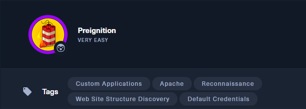

> 🧩 **Dificultad**: Very Easy (Linux)
> 🕸️ **Dirección IP**: `10.129.223.133` 
> 🧠 **Temas**: Apache, reconocimiento, credenciales por defecto, descubrimiento de estructura web

---

## ✅ **Task 1: ¿Cómo se llama también al "directory brute-forcing"?**

🔠 **Respuesta**: `dir busting`

💬 Esta técnica consiste en probar rutas de directorios y archivos comunes en un servidor web para descubrir páginas ocultas. Se suele usar con herramientas como Gobuster, dirb o ffuf.

📌 También conocida como **fuerza bruta de directorios** o **descubrimiento de rutas**.

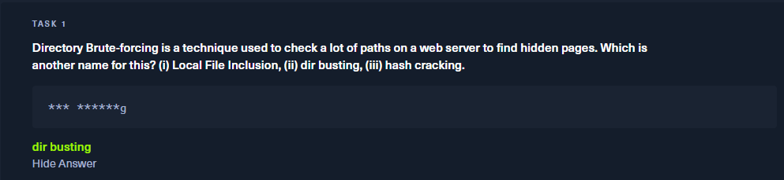


## ✅ **Task 2: ¿Qué parámetro usamos en Nmap para detectar versiones?**

🔠 **Respuesta**: `-sV`

💬 Este flag de Nmap activa la detección de versiones de servicios. Permite obtener información como el nombre del software, su versión y protocolo asociado.

📌 Ejemplo:

```bash
nmap -sV 10.129.223.133
```

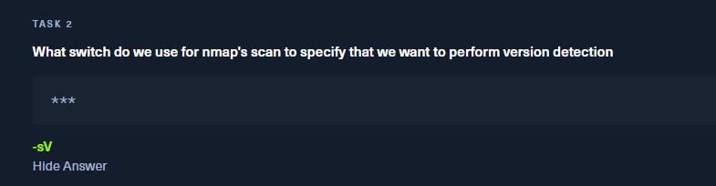

## ✅ **Task 3: ¿Qué servicio indica Nmap en el puerto 80/tcp?**

🔠 **Respuesta**: `http`

💬 Nmap detecta un servicio HTTP corriendo en el puerto `80/tcp`, lo cual indica que hay un servidor web activo.

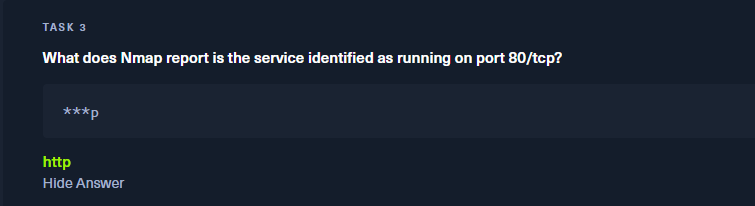


## ✅ **Task 4: ¿Qué nombre y versión del servidor detecta Nmap en el puerto 80/tcp?**

🔠 **Respuesta**: `nginx 1.14.2`

💬 El servidor web está utilizando **nginx versión 1.14.2**, una versión que puede tener vulnerabilidades si no está bien configurada.

📌 Esto se confirmó gracias al escaneo de Nmap con detección de versiones:

```bash
sudo nmap -sS -sV --top-ports 1000 10.129.223.133
```

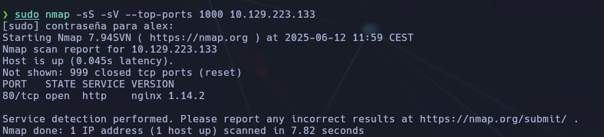

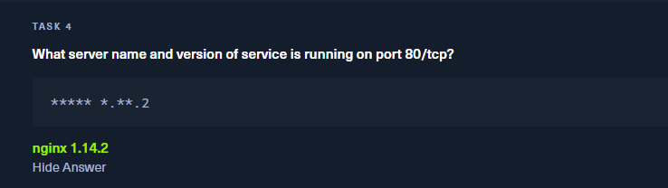

## ✅ **Task 5: ¿Qué flag usamos en Gobuster para especificar un escaneo de directorios?**

🔠 **Respuesta**: `dir`

💬 Gobuster permite distintos tipos de escaneo. Para buscar directorios (dir busting), se debe usar el modo `dir`:

```bash
gobuster dir -u http://10.129.223.133 -w /ruta/wordlist.txt
```

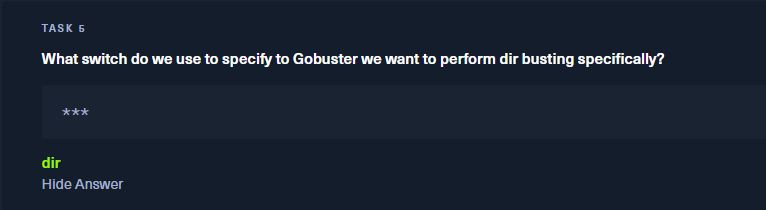

## ✅ **Task 6: ¿Qué parámetro añadimos a Gobuster para buscar extensiones PHP?**

🔠 **Respuesta**: `-x php`

💬 Para buscar archivos con una extensión específica como `.php`, se utiliza el flag `-x` seguido de la extensión:

```bash
gobuster dir -u http://10.129.223.133 -w /usr/share/wordlists/dirb/common.txt -x php
```

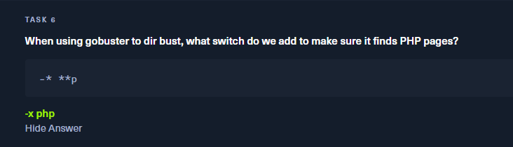

📌 Esto ayuda a detectar archivos que no aparecerían en una búsqueda sin extensión.

## ✅ **Task 7: ¿Qué página encontramos durante el dir busting?**

🔠 **Respuesta**: `admin.php`

💬 Usando Gobuster con `-x php`, encontramos el archivo oculto `admin.php`, lo que indica una posible zona de administración accesible desde el navegador.

```bash
gobuster dir -u 10.129.223.133 -w /usr/share/wordlists/dirbuster/directory-list-2.3-medium.txt -x php
```

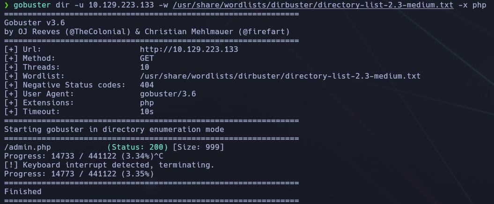


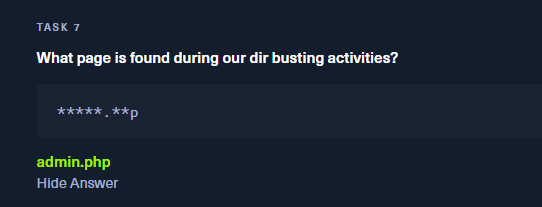

## ✅ **Task 8: ¿Qué código de estado HTTP devuelve la página descubierta?**

🔠 **Respuesta**: `200`

💬 El código `200 OK` indica que la página `admin.php` fue encontrada y está disponible públicamente, sin restricciones de acceso inmediatas.

📌 Esto puede revelar una entrada administrativa sin autenticación o con credenciales débiles por defecto.

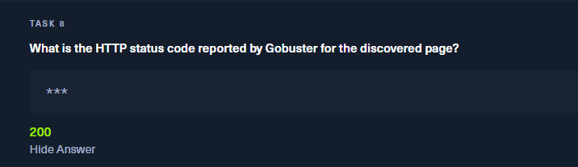

## ✅ **Task 9: ¿Qué credenciales por defecto nos permiten entrar al panel?**

🔠 **Respuesta**: `admin:admin`

💬 Probamos credenciales por defecto y el acceso con `admin:admin` fue exitoso. Esto nos permite visualizar la flag en la consola de administración (`admin.php`).

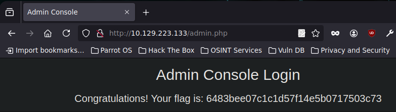

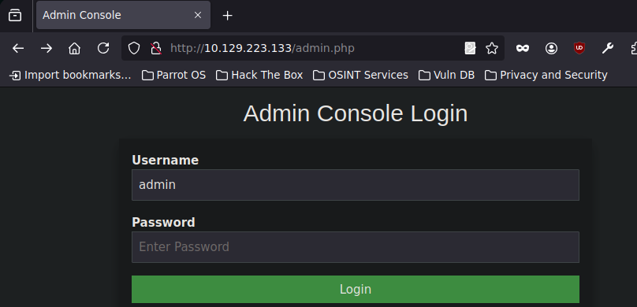

## ✅ **Conclusión**

- 🧭 El escaneo inicial con Nmap reveló un servidor nginx en el puerto 80.
    
- 🔍 Realizamos fuerza bruta de directorios con Gobuster, lo que nos permitió descubrir `admin.php`.
    
- 📄 La página `admin.php` devolvía código 200, por lo que estaba accesible sin protección alguna inicial.
    
- 🔑 Utilizamos credenciales por defecto (`admin:admin`), lo que nos otorgó acceso al panel de administración.
    
- 🏁 Dentro de dicho panel se encontraba la flag, indicando éxito en la explotación.
    

✅ **Lecciones clave**:

- Importancia del hardening de servicios públicos.
    
- Peligro de dejar credenciales por defecto en producción.
    
- Cómo combinar Nmap + Gobuster para reconocimiento y acceso inicial.

