------------
- Tags:  #redis #vulnerabilidad #database #reconocimiento #anonymous 
- -------------

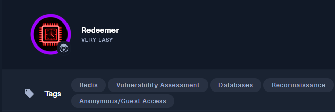

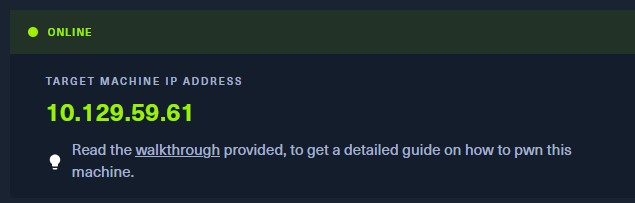

## 🔎 Escaneo de puertos con Nmap

Comenzamos con un escaneo rápido de todos los puertos usando `nmap`:

```bash
nmap -p- --min-rate 5000 -T4 -n -Pn 10.129.222.25
```

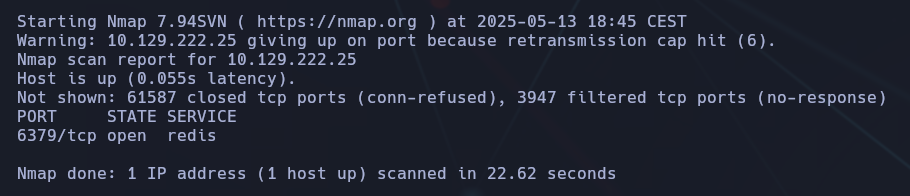

🟢 **Puerto abierto encontrado:**

- `6379/tcp` → Servicio Redis

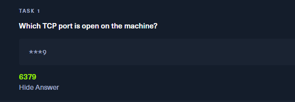

Viendo que es un servicio redis, nos conectaremos directamente:

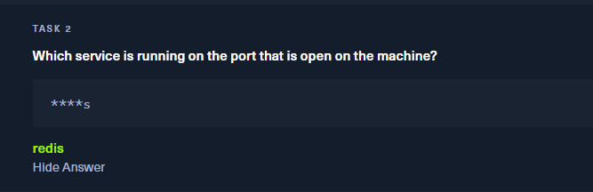

```bash
redis-cli -h 10.129.222.25
```

## 🔗 Conexión al servicio Redis

Redis es una base de datos en memoria, y si no está configurado correctamente, permite conexión sin autenticación. Usamos `redis-cli`:

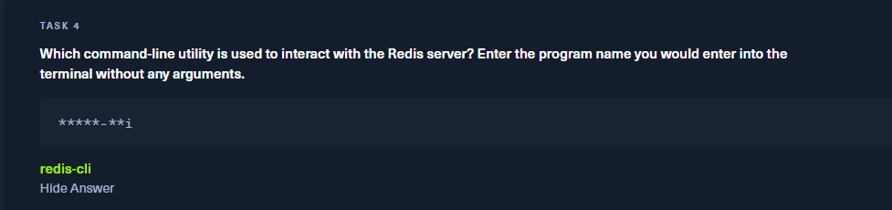


```bash
redis-cli -h 10.129.59.61
```

Una vez dentro, ejecutamos `info` para ver detalles del sistema y versión del servicio:

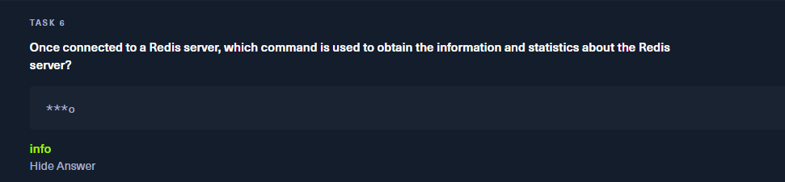

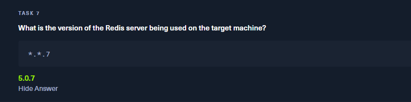

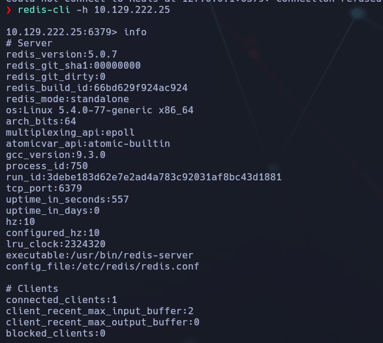

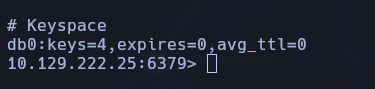

📌 Observaciones clave:

- `redis_version: 5.0.7`
    
- Sistema operativo: `Linux x86_64`
    
- Modo: `standalone`
    
- Claves disponibles: 4 (`db0:keys=4`)

*Como vemos, hay 4 claves en la base de datos "0"

## 🗝️ Búsqueda de claves en la base de datos

Seleccionamos la base de datos 0 (por defecto):


```bash
select 0
```

Verificamos cuántas claves hay (4)

```bash
dbsize
```


Listamos todas las claves:

```bash
keys *
```

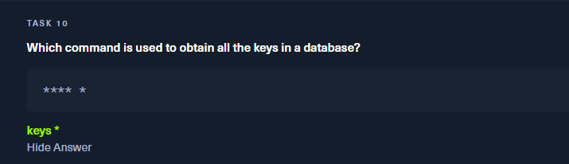

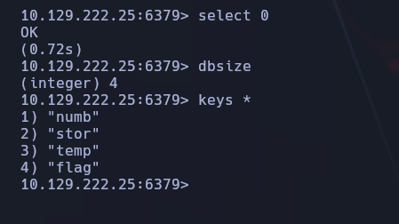

📂 Claves encontradas:

1. numb
    
2. stor
    
3. temp
    
4. flag ✅

## 🏁 Extracción de la flag

Como buscamos la clave `flag`, la extraemos así:

```bash
get flag
```

📌 **Flag obtenida:**

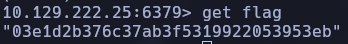

## ✅ Conclusión final

- El servicio Redis expuesto sin autenticación es una vulnerabilidad grave.
    
- Gracias a esto, accedimos directamente y obtuvimos la flag almacenada como clave de Redis.
    
- Redis no debe exponerse sin credenciales, y mucho menos con datos sensibles en entornos accesibles.
    

🔐 **Lección aprendida:** Siempre restringir el acceso a servicios como Redis con autenticación y firewalls.


