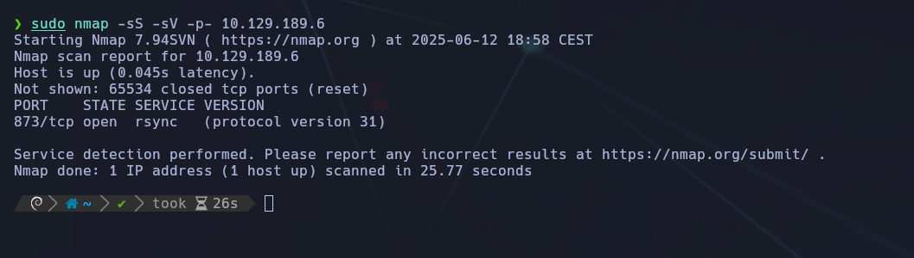
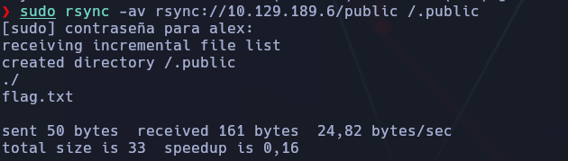
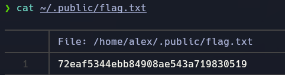

---
- Tags: #rsync #protocols #Reconnaisance #anonymous #guest
---


## 🕵️ Reconocimiento inicial

### 🔎 Escaneo con Nmap

Usamos `nmap` para descubrir puertos abiertos, servicios y versiones:

```bash
sudo nmap -sS -sV -p- 10.129.189.6
```



📌 **Explicación de parámetros**:

- `-sS`: SYN scan (modo sigiloso).
    
- `-sV`: Detección de versión de servicios.
    
- `-p-`: Escaneo de los 65535 puertos TCP.
    

📤 **Resultado**:

```bash
PORT    STATE SERVICE VERSION
873/tcp open  rsync   (protocol version 31)
```

El escaneo con `nmap` reveló que el puerto 873 TCP estaba abierto, lo que corresponde al servicio `rsync`.

Se realizó un escaneo completo de puertos con `-p-` y se encontró únicamente el 873/tcp abierto.

El parámetro `-sV` de `nmap` detectó que el `rsync` en ejecución responde con la versión de protocolo 31.


## ✅ Task 4: ¿Cuál es el nombre de comando más común en Linux para interactuar con rsync?

🔠 **Respuesta**: `rsync`

Este es el binario estándar para interactuar con servidores remotos y sincronizar archivos utilizando el protocolo rsync.


## 🔄 Enumeración del servicio `rsync`

El servicio `rsync` puede estar mal configurado y permitir acceso sin autenticación. Verificamos si hay módulos disponibles:

## ✅ Task 5: ¿Qué credenciales se necesitan para la autenticación anónima en rsync?

🔠 **Respuesta**: `none`

El servidor rsync permite conexiones sin necesidad de usuario o contraseña.


## ✅ Task 6: ¿Cuál es la opción para listar solo los recursos compartidos?

🔠 **Respuesta**: `list`


## 🗂 Enumeración de recursos disponibles

### Comando utilizado:

```bash
rsync rsync://10.129.189.6
```

📎 **Salida:**

```bash
public      Anonymous Share
```


Se identifica que el recurso `public` está expuesto vía rsync y accesible sin autenticación.

## 📥 Descarga del recurso compartido

```bash
rsync -av rsync://10.129.189.6/public ./public
```

📌 **Parámetros utilizados**:

- `-a`: Modo archivo, conserva estructura y permisos.
    
- `-v`: Verbose, para salida detallada.

✅ Crea la carpeta `.public` en el directorio home con los archivos del recurso remoto.

### Resultado:



Se crea el directorio `./public` y se descarga dentro `flag.txt`.



## ✅ Task 7: ¿Qué comando se usa para volcar el contenido de todos los documentos dentro de la colección `flag`?

🔠 **Respuesta esperada**:


## 📌 Análisis y Conclusión Final

### 🧪 Aprendizajes clave:

- `rsync` es un servicio muy potente que puede ser riesgoso si se deja expuesto y sin autenticación.
    
- Comandos como `rsync rsync://IP` permiten ver recursos compartidos directamente.
    
- `nmap -p-` fue fundamental para encontrar puertos que no están en el top 1000.
    
- Se confirma que el recurso `public` estaba accesible anónimamente.
    

### 🔦 Buenas prácticas:

- Nunca exponer `rsync` en entornos reales sin control de acceso.
    
- Configurar adecuadamente las opciones de `rsyncd.conf`.
    
- Verificar regularmente qué módulos están compartidos y su nivel de acceso.
    

### 🌟 Conclusión Final:

La máquina **Synced** enseña a identificar y explotar un servicio `rsync` mal configurado. Es un excelente ejemplo de cómo servicios antiguos y poco monitorizados pueden filtrar información crítica si se configuran incorrectamente. Reforzamos técnicas de reconocimiento, enumeración y explotación de recursos anónimos.