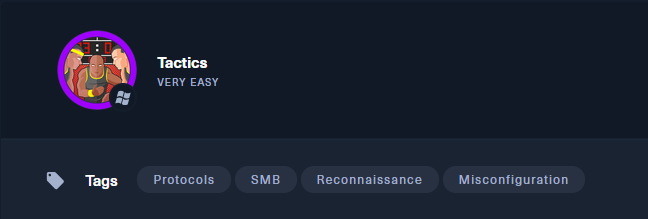
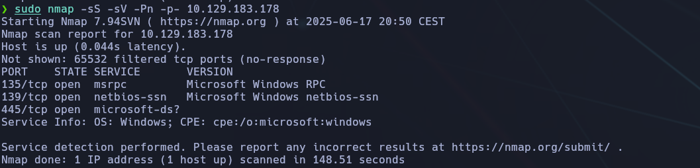
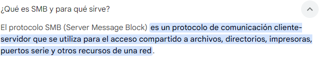
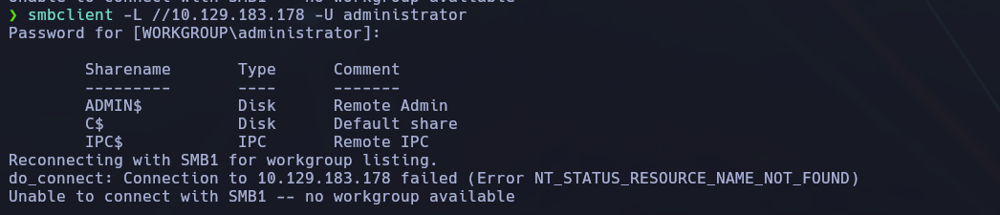
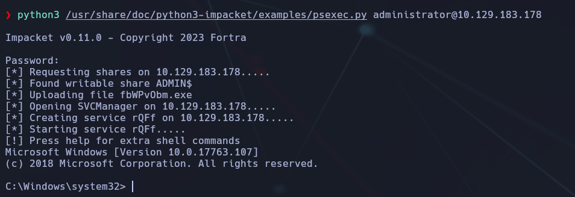
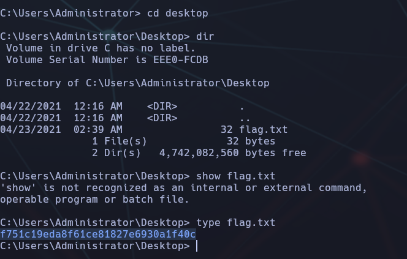

--------
- Tags: #Reconnaisance #protocols #SMB #misconfiguration 
-------



## 🧠 Información general

- **IP objetivo**: `10.129.183.178`
    
- **Sistema operativo**: Windows
    
- **Servicios relevantes**: RPC, NetBIOS, SMB
    
- **Etiquetas**: `Reconnaissance`, `Protocols`, `SMB`, `Misconfiguration`


## ✅ Tarea 1: ¿Qué opción de Nmap se puede usar para enumerar máquinas cuando los paquetes ICMP (ping) están bloqueados por el firewall de Windows?

📌 **Respuesta**: `-Pn`
### 💡 Explicación:

🔍 **Explicación**:  
Cuando los paquetes ICMP están bloqueados, Nmap no puede saber si un host está "vivo" a menos que fuerce el escaneo sin comprobación previa. La opción `-Pn` le indica que omita el ping y escanee directamente.

```bash
sudo nmap -sS -sV -Pn -p- 10.129.183.178
```

- `-sS`: Escaneo TCP SYN (rápido y sigiloso).
    
- `-sV`: Detección de versiones.
    
- `-Pn`: Desactiva el ping (útil si hay firewall).
    
- `-p-`: Escaneo completo de puertos (1-65535).



## ✅ Tarea 2: ¿Qué significa el acrónimo SMB?

🎯 **Respuesta**: `Server Message Block`

🔍 **Explicación**:  
SMB (Server Message Block) es un protocolo de red utilizado para compartir archivos, impresoras y otros recursos entre equipos Windows. Es la base de los servicios de compartición en redes Windows.



## ✅ Tarea 3: ¿En qué puerto opera SMB?

🎯 **Respuesta**: `445`

🔍 **Explicación**:  
Aunque SMB también ha utilizado el puerto `139` (NetBIOS), las versiones modernas usan el puerto `445/TCP`. Este es el canal principal para compartir archivos, impresoras y realizar autenticaciones en redes Windows.


## ✅ Tarea 4: ¿Qué argumento usa `smbclient` para listar recursos compartidos?

🎯 **Respuesta**: `-L`

🔍 **Explicación**:  
El argumento `-L` de `smbclient` permite listar los recursos compartidos de un servidor SMB.

📌 Ejemplo de uso:

```bash
smbclient -L //10.129.183.178
```

Con esto, podremos ver si existen shares públicos como `Users`, `backups`, `IPC$`, `ADMIN$`, etc.

## ✅ Tarea 5: ¿Qué carácter indica un recurso compartido administrativo?

🌠 **Respuesta**: `$`

### 📌 Explicación:

En Windows, los recursos compartidos administrativos terminan con el símbolo `$`. Ejemplos:

- `C$` → disco duro C
    
- `ADMIN$` → carpeta de administración remota
    
- `IPC$` → canal para comunicaciones interprocesos


## ✅ Tarea 6: ¿Qué recurso administrativo permite ver todo el sistema de archivos?

🌠 **Respuesta**: `C$`

### 📌 Explicación:

`C$` es una **administrative share** que da acceso completo al volumen `C:\` del sistema. Usualmente, solo los usuarios con privilegios administrativos pueden acceder a esta carpeta mediante `smbclient` u otras herramientas de red.

Usaremos el comando:

```bash
smbclient -L //(IP) -U administrator
```



## ✅ Tarea 7: ¿Qué comando usamos para descargar archivos desde un recurso SMB?

🌠 **Respuesta**: `get`

### 📌 Explicación:

Cuando accedemos a un recurso SMB mediante `smbclient`, podemos utilizar comandos similares a un cliente FTP. Para **descargar un archivo**, simplemente usamos:

Ejemplo:

```bash
smb: \> get flag.txt
```


## ✅ Tarea 8: ¿Qué herramienta de Impacket permite obtener una shell interactiva?

🌠 **Respuesta**: `psexec.py`

### 📌 Explicación:

Dentro de la suite de herramientas **Impacket**, `psexec.py` es una utilidad poderosa que permite ejecutar comandos de forma remota en un sistema Windows y obtener una shell interactiva, utilizando SMB y credenciales válidas.

🧪 Sintaxis:

```bash
python3 /usr/share/doc/python3-impacket/examples/psexec.py administrator:password@10.129.183.178
```

Esto iniciará una shell tipo `cmd.exe` remota si las credenciales son correctas.



## 📦 ¿Cómo conseguir `psexec.py`?

### 🔹 Ya viene con Kali Linux o Parrot

Busca si lo tienes ya instalado con:

```bash
locate psexec.py
```

Si tienes Kali o Parrot, normalmente lo tendrás en:

```bash
/usr/share/doc/python3-impacket/examples/psexec.py
```

Entonces ejecútalo así:

```bash
python3 /usr/share/doc/python3-impacket/examples/psexec.py administrator@10.129.183.178
```

Si te pide contraseña, introdúcela cuando la solicite.

## 🏁 Lectura de la `flag.txt`

Una vez conseguida la **shell interactiva como `NT AUTHORITY\SYSTEM`** mediante el script `psexec.py` (parte de Impacket), nos encontramos en el sistema de archivos de Windows.

🔎 Navegamos hasta el directorio `C:\Users\Administrator\Desktop`, donde encontramos el archivo **`flag.txt`**, habitual en las máquinas de Hack The Box.

### 📂 Ruta final del archivo:

```bash
C:\Users\Administrator\Desktop\flag.txt
```



### 📌 Nota:

- El comando `type` es equivalente a `cat` en Linux.
    
- Si estás usando una shell más limitada y `type` no funcionase por algún motivo raro, también puedes usar:

```bash
more flag.txt
```

## ✅ Conclusión final

- Se realiza un escaneo Nmap que revela **puertos TCP 135, 139 y 445** abiertos, lo que indica servicios relacionados con **SMB** (Server Message Block).
    
- A través de `smbclient -L`, se identifican **shares administrativas** como `C$` y `ADMIN$`, lo que sugiere que podríamos acceder al sistema si conseguimos credenciales válidas.
    
- Usando las **credenciales por defecto** (`administrator` y una contraseña conocida o entregada por el entorno de laboratorio), se accede correctamente al servicio SMB, confirmando la posibilidad de enumerar recursos compartidos.
    
- Se identifica que el share **`C$`** permite el acceso completo al disco, incluyendo al directorio de `C:\Users\Administrator\Desktop`.
    
- Se emplea la herramienta `psexec.py` de **Impacket**, la cual permite ejecutar comandos con privilegios de `NT AUTHORITY\SYSTEM` si las credenciales son válidas.
    
- Tras la ejecución de `psexec.py`, se obtiene una **shell remota privilegiada** directamente sobre el sistema Windows.
    
- Finalmente, se navega mediante comandos CMD (`cd`, `dir`, `type`) hasta el escritorio del usuario **Administrator** y se **lee la flag** desde el archivo `flag.txt`.


## 🧠 Lección aprendida

Esta máquina ilustra cómo un **servicio SMB mal configurado o accesible públicamente** puede comprometer completamente un sistema Windows si se utilizan credenciales conocidas o predecibles. Además:

- Herramientas como `psexec.py` permiten una **escalada directa de privilegios**, sin exploits, solo con acceso válido.
    
- La enumeración correcta y el uso de comandos simples como `smbclient`, `nmap -Pn`, y técnicas de navegación CMD son más que suficientes para lograr una intrusión exitosa.


